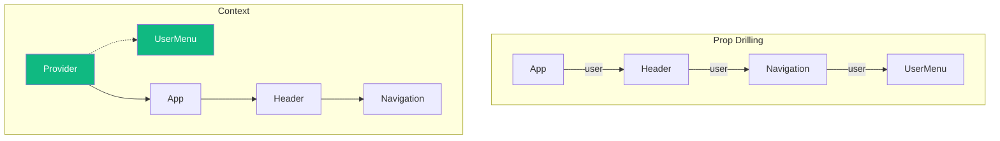
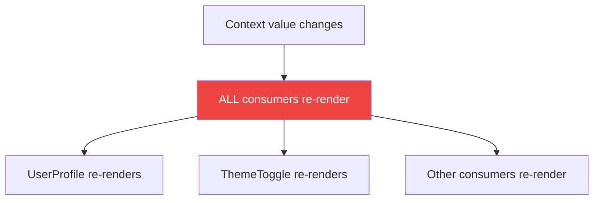

React Context provides a way to share values between components without passing props through every level. While it's powerful, misusing Context can lead to performance problems and convoluted code.

Let's explore how to use Context effectively.

## What is Context?

Context provides a way to pass data through the component tree without manually passing props at every level (prop drilling).

```jsx
// Without Context: Prop drilling
<App>
  <Header user={user} />        // Passes user down
    <Navigation user={user} />  // Passes user down
      <UserMenu user={user} />  // Finally uses user
</App>

// With Context: Direct access
<UserContext.Provider value={user}>
  <App>
    <Header />
      <Navigation />
        <UserMenu />  // Gets user from Context
  </App>
</UserContext.Provider>
```



## Basic Usage

### Creating Context

```jsx
import { createContext, useContext, useState } from 'react';

// 1. Create the context
const ThemeContext = createContext(null);

// 2. Create a provider component
function ThemeProvider({ children }) {
  const [theme, setTheme] = useState('light');

  const value = {
    theme,
    toggleTheme: () => setTheme(t => t === 'light' ? 'dark' : 'light'),
  };

  return (
    <ThemeContext.Provider value={value}>
      {children}
    </ThemeContext.Provider>
  );
}

// 3. Create a custom hook for consuming
function useTheme() {
  const context = useContext(ThemeContext);
  if (!context) {
    throw new Error('useTheme must be used within a ThemeProvider');
  }
  return context;
}

// 4. Use in components
function ThemedButton() {
  const { theme, toggleTheme } = useTheme();
  return (
    <button
      onClick={toggleTheme}
      style={{ background: theme === 'light' ? '#fff' : '#333' }}
    >
      Toggle Theme
    </button>
  );
}
```

## The Performance Problem

Here's the critical issue: **When a Context value changes, ALL components that consume that Context re-render**, regardless of whether they use the changed part.

```jsx
const AppContext = createContext();

function AppProvider({ children }) {
  const [user, setUser] = useState(null);
  const [theme, setTheme] = useState('light');

  // This object is recreated every render!
  const value = { user, setUser, theme, setTheme };

  return (
    <AppContext.Provider value={value}>
      {children}
    </AppContext.Provider>
  );
}

function UserProfile() {
  // Re-renders when theme changes, even though it only uses user!
  const { user } = useContext(AppContext);
  console.log('UserProfile rendered');
  return <div>{user?.name}</div>;
}

function ThemeToggle() {
  // Re-renders when user changes, even though it only uses theme!
  const { theme, setTheme } = useContext(AppContext);
  console.log('ThemeToggle rendered');
  return <button onClick={() => setTheme(t => t === 'light' ? 'dark' : 'light')} />;
}
```



## Solutions for Performance

### 1. Split Contexts by Update Frequency

Separate frequently changing values from stable ones:

```jsx
// Bad: Everything in one context
const AppContext = createContext();

// Good: Separate contexts
const UserContext = createContext();
const ThemeContext = createContext();
const SettingsContext = createContext();

function AppProviders({ children }) {
  return (
    <UserProvider>
      <ThemeProvider>
        <SettingsProvider>
          {children}
        </SettingsProvider>
      </ThemeProvider>
    </UserProvider>
  );
}
```

### 2. Split State and Dispatch

Separate the state from the update functions:

```jsx
const CountStateContext = createContext();
const CountDispatchContext = createContext();

function CountProvider({ children }) {
  const [count, setCount] = useState(0);

  return (
    <CountStateContext.Provider value={count}>
      <CountDispatchContext.Provider value={setCount}>
        {children}
      </CountDispatchContext.Provider>
    </CountStateContext.Provider>
  );
}

// Components that only update don't re-render on state changes
function IncrementButton() {
  const setCount = useContext(CountDispatchContext);
  console.log('IncrementButton rendered'); // Only once!
  return <button onClick={() => setCount(c => c + 1)}>+</button>;
}

// Components that only read don't re-render on updates
function CountDisplay() {
  const count = useContext(CountStateContext);
  return <span>{count}</span>;
}
```

### 3. Memoize the Context Value

Prevent unnecessary re-renders by memoizing the value:

```jsx
function ThemeProvider({ children }) {
  const [theme, setTheme] = useState('light');

  // Memoize the value object
  const value = useMemo(() => ({
    theme,
    toggleTheme: () => setTheme(t => t === 'light' ? 'dark' : 'light'),
  }), [theme]);

  return (
    <ThemeContext.Provider value={value}>
      {children}
    </ThemeContext.Provider>
  );
}
```

### 4. Use React.memo for Consumers

If you can't restructure, memoize the consuming components:

```jsx
const ExpensiveComponent = React.memo(function ExpensiveComponent({ data }) {
  // Only re-renders when data changes
  return <div>{/* expensive rendering */}</div>;
});

function Parent() {
  const { theme } = useContext(ThemeContext);

  return (
    <div className={theme}>
      <ExpensiveComponent data={staticData} />
    </div>
  );
}
```

### 5. Extract Non-Context Parts

Move Context consumption to a parent and pass data as props:

```jsx
// Before: Child re-renders on every context change
function Parent() {
  return (
    <div>
      <ExpensiveChild />
    </div>
  );
}

function ExpensiveChild() {
  const { value } = useContext(SomeContext);
  // Heavy rendering that doesn't use value
  return <div>{/* ... */}</div>;
}

// After: Only ContextReader re-renders
function Parent() {
  return (
    <div>
      <ContextReader />
      <ExpensiveChild />
    </div>
  );
}

function ContextReader() {
  const { value } = useContext(SomeContext);
  return <SmallComponent value={value} />;
}
```

## When to Use Context

### Good Use Cases

1. **Theming** — Light/dark mode, colors
2. **User authentication** — Current user, login state
3. **Locale/i18n** — Current language, translations
4. **Feature flags** — Enabled features
5. **UI state** — Sidebar open/closed, modal state

### When NOT to Use Context

1. **Frequently updating values** — Use state management libraries instead
2. **Every piece of state** — Not a replacement for all state
3. **When props work fine** — Don't over-engineer

```jsx
// Don't do this - Context for simple props
const ButtonColorContext = createContext('blue');

// Just pass the prop!
<Button color="blue" />
```

## Pattern: Context Module

A clean pattern for organizing Context:

```jsx
// contexts/auth.js
import { createContext, useContext, useReducer } from 'react';

const AuthContext = createContext();

const initialState = {
  user: null,
  loading: true,
  error: null,
};

function authReducer(state, action) {
  switch (action.type) {
    case 'LOGIN_START':
      return { ...state, loading: true, error: null };
    case 'LOGIN_SUCCESS':
      return { ...state, loading: false, user: action.user };
    case 'LOGIN_ERROR':
      return { ...state, loading: false, error: action.error };
    case 'LOGOUT':
      return { ...state, user: null };
    default:
      return state;
  }
}

export function AuthProvider({ children }) {
  const [state, dispatch] = useReducer(authReducer, initialState);

  const login = async (credentials) => {
    dispatch({ type: 'LOGIN_START' });
    try {
      const user = await authApi.login(credentials);
      dispatch({ type: 'LOGIN_SUCCESS', user });
    } catch (error) {
      dispatch({ type: 'LOGIN_ERROR', error: error.message });
    }
  };

  const logout = () => {
    authApi.logout();
    dispatch({ type: 'LOGOUT' });
  };

  const value = useMemo(() => ({
    ...state,
    login,
    logout,
  }), [state]);

  return (
    <AuthContext.Provider value={value}>
      {children}
    </AuthContext.Provider>
  );
}

export function useAuth() {
  const context = useContext(AuthContext);
  if (!context) {
    throw new Error('useAuth must be used within an AuthProvider');
  }
  return context;
}
```

## Summary

| Tip | Description |
|-----|-------------|
| Split contexts | Separate by update frequency |
| Split state/dispatch | Avoid re-renders for update-only components |
| Memoize values | Use `useMemo` for context value objects |
| Use selectively | Context isn't for everything |
| Custom hooks | Always wrap `useContext` in a custom hook |

Key takeaways:

- Context is for avoiding prop drilling, not global state management
- All consumers re-render when Context value changes
- Split contexts by how often values change
- Memoize context values to prevent unnecessary re-renders
- Consider state management libraries for complex state

Context is a powerful tool when used correctly. Keep contexts small and focused, and be mindful of what triggers re-renders.

## References

- [React Documentation: useContext](https://react.dev/reference/react/useContext)
- [React Documentation: Passing Data Deeply with Context](https://react.dev/learn/passing-data-deeply-with-context)
- Barklund, Morten. *React in Depth*. Manning Publications, 2024.
