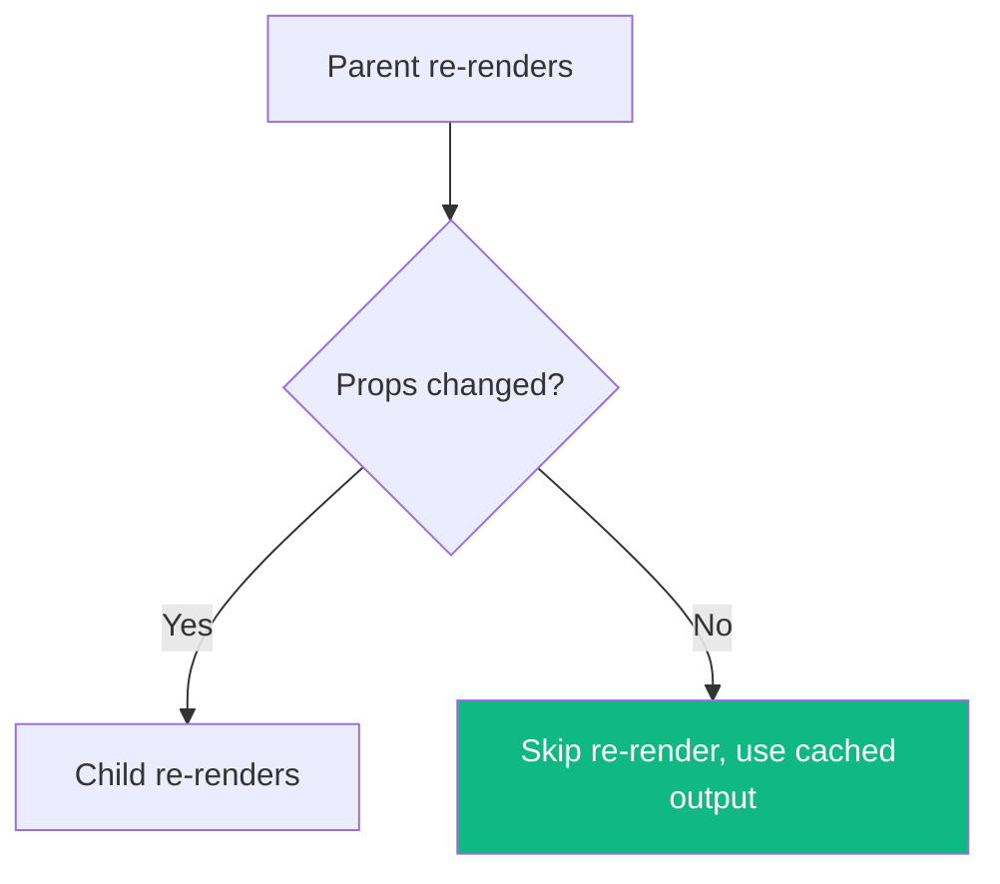
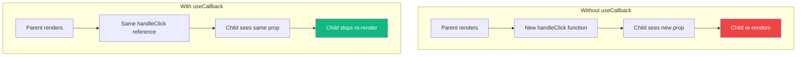

React provides three main tools for memoization: `useMemo`, `useCallback`, and `React.memo`. While they're often grouped together as "performance optimization tools," they serve different purposes and are frequently misused.

Let's demystify when and how to use each one.

## What is Memoization?

Memoization is a technique that caches the result of a function based on its inputs. If the function is called again with the same inputs, it returns the cached result instead of recomputing.

```javascript
// Simple memoization concept
const cache = {};
function memoizedAdd(a, b) {
  const key = `${a},${b}`;
  if (cache[key]) return cache[key];
  cache[key] = a + b;
  return cache[key];
}
```

In React, memoization helps avoid unnecessary recalculations and re-renders.

## React.memo: Memoizing Components

`React.memo` is a higher-order component that memoizes the **rendered output** of a component. It prevents re-rendering when props haven't changed.

```jsx
const ExpensiveList = React.memo(function ExpensiveList({ items }) {
  console.log('ExpensiveList rendered');
  return (
    <ul>
      {items.map(item => (
        <li key={item.id}>{item.name}</li>
      ))}
    </ul>
  );
});
```

### How React.memo Works



By default, `React.memo` does a **shallow comparison** of props:

```jsx
// These are considered "equal" (same reference)
const items = [1, 2, 3];
<ExpensiveList items={items} />

// These are considered "different" (new array reference)
<ExpensiveList items={[1, 2, 3]} />
```

### Custom Comparison Function

You can provide a custom comparison:

```jsx
const MemoizedComponent = React.memo(
  function MyComponent({ user, onClick }) {
    return <div onClick={onClick}>{user.name}</div>;
  },
  (prevProps, nextProps) => {
    // Return true if props are equal (skip re-render)
    return prevProps.user.id === nextProps.user.id;
  }
);
```

## useMemo: Memoizing Values

`useMemo` memoizes the **result of a computation**. It recalculates only when dependencies change.

```jsx
function ProductList({ products, filterTerm }) {
  // Only recalculates when products or filterTerm changes
  const filteredProducts = useMemo(() => {
    console.log('Filtering products...');
    return products.filter(p =>
      p.name.toLowerCase().includes(filterTerm.toLowerCase())
    );
  }, [products, filterTerm]);

  return (
    <ul>
      {filteredProducts.map(p => <li key={p.id}>{p.name}</li>)}
    </ul>
  );
}
```

### When to Use useMemo

**Good use cases:**

```jsx
// 1. Expensive calculations
const sortedItems = useMemo(() => {
  return [...items].sort((a, b) => a.value - b.value);
}, [items]);

// 2. Referential equality for objects/arrays passed to memoized children
const chartData = useMemo(() => ({
  labels: data.map(d => d.label),
  values: data.map(d => d.value),
}), [data]);

return <MemoizedChart data={chartData} />;
```

**Bad use cases:**

```jsx
// DON'T: Simple calculations
const doubled = useMemo(() => value * 2, [value]);

// DON'T: Creating primitives
const greeting = useMemo(() => `Hello, ${name}`, [name]);
```

## useCallback: Memoizing Functions

`useCallback` memoizes a **function definition**. It returns the same function reference when dependencies haven't changed.

```jsx
function Parent() {
  const [count, setCount] = useState(0);

  // Without useCallback: new function on every render
  const handleClick = () => {
    console.log('clicked');
  };

  // With useCallback: same function reference
  const memoizedHandleClick = useCallback(() => {
    console.log('clicked');
  }, []);

  return <MemoizedChild onClick={memoizedHandleClick} />;
}
```

### Why Function References Matter



### Common Pattern: useCallback with Dependencies

```jsx
function SearchComponent({ onSearch }) {
  const [query, setQuery] = useState('');

  const handleSearch = useCallback(() => {
    onSearch(query);
  }, [query, onSearch]);

  return (
    <>
      <input value={query} onChange={e => setQuery(e.target.value)} />
      <MemoizedButton onClick={handleSearch}>Search</MemoizedButton>
    </>
  );
}
```

## The Relationship Between the Three

These tools work together:

```jsx
const Parent = () => {
  const [items, setItems] = useState([]);
  const [filter, setFilter] = useState('');

  // useMemo: memoize the filtered result
  const filteredItems = useMemo(
    () => items.filter(item => item.includes(filter)),
    [items, filter]
  );

  // useCallback: memoize the handler
  const handleItemClick = useCallback((id) => {
    console.log('Clicked:', id);
  }, []);

  // React.memo child receives stable props
  return <MemoizedList items={filteredItems} onItemClick={handleItemClick} />;
};

// React.memo: skip re-render if props are the same
const MemoizedList = React.memo(function List({ items, onItemClick }) {
  return (
    <ul>
      {items.map(item => (
        <li key={item} onClick={() => onItemClick(item)}>{item}</li>
      ))}
    </ul>
  );
});
```

## When NOT to Memoize

Memoization has overhead. Don't use it when:

### 1. The Component is Already Fast

```jsx
// DON'T: Simple component, memoization overhead not worth it
const Badge = React.memo(({ label }) => (
  <span className="badge">{label}</span>
));
```

### 2. Props Change on Every Render Anyway

```jsx
// USELESS: items array is recreated every render
function Parent() {
  return <MemoizedList items={[1, 2, 3]} />;
}
```

### 3. The Calculation is Trivial

```jsx
// DON'T: Simple math doesn't need memoization
const total = useMemo(() => price * quantity, [price, quantity]);

// JUST DO THIS:
const total = price * quantity;
```

### 4. You're Not Passing to Memoized Children

```jsx
// USELESS: useCallback without a memoized consumer
function Component() {
  const handleClick = useCallback(() => {
    console.log('clicked');
  }, []);

  // Regular button doesn't benefit from stable reference
  return <button onClick={handleClick}>Click</button>;
}
```

## Performance Measurement First

Before adding memoization, **measure** the actual performance:

```jsx
function SlowComponent({ data }) {
  // Use React DevTools Profiler to measure render time
  console.time('render');

  const result = expensiveOperation(data);

  console.timeEnd('render');

  return <div>{result}</div>;
}
```

Use the React DevTools Profiler to identify components that:
1. Render frequently
2. Take a long time to render
3. Re-render unnecessarily

## Summary Table

| Tool | Memoizes | Use When |
|------|----------|----------|
| `React.memo` | Component render output | Child receives same props frequently |
| `useMemo` | Computed value | Expensive calculation or referential equality needed |
| `useCallback` | Function reference | Passing callbacks to memoized children |

## Best Practices

1. **Measure first** — Don't optimize prematurely
2. **Memoize expensive operations** — Not simple calculations
3. **Use together** — `useCallback`/`useMemo` work best with `React.memo`
4. **Keep dependencies accurate** — Missing dependencies cause bugs
5. **Consider alternatives** — Sometimes restructuring is better than memoizing

## Summary

- `React.memo` prevents re-renders when props haven't changed
- `useMemo` caches computed values between renders
- `useCallback` maintains stable function references
- All three work together to optimize performance
- Don't memoize everything — measure first and optimize where needed
- Memoization has overhead; use it judiciously

The key insight is that memoization is about **referential equality**. In JavaScript, `{} !== {}` and `[] !== []`, even if they contain the same values. React's memoization tools help you control when references change, which in turn controls when components re-render.

## References

- [React Documentation: useMemo](https://react.dev/reference/react/useMemo)
- [React Documentation: useCallback](https://react.dev/reference/react/useCallback)
- [React Documentation: memo](https://react.dev/reference/react/memo)
- Barklund, Morten. *React in Depth*. Manning Publications, 2024.
- Kumar, Tejas. *Fluent React*. O'Reilly Media, 2024.
