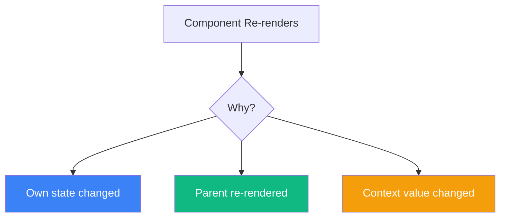
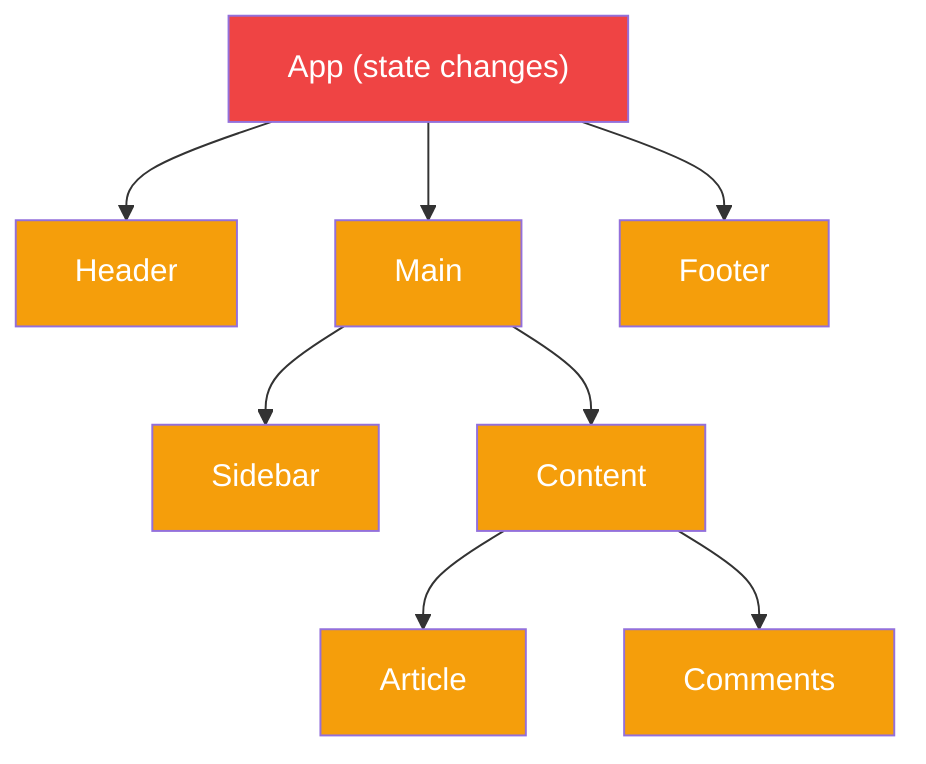

One of the most common sources of confusion in React is understanding when and why components re-render. Many developers believe that components only re-render when their props change. This is a misconception that leads to performance issues and buggy code.

Let's clear up the confusion once and for all.

## The Three Reasons Components Re-render

A React component re-renders for exactly three reasons:

1. **State change** — The component's own state changes via `useState` or `useReducer`
2. **Parent re-render** — The parent component re-renders
3. **Context change** — A consumed context value changes

That's it. Nothing else triggers a re-render.



## The Big Misconception: Props Don't Trigger Re-renders

Here's the truth that surprises many developers: **changing props does NOT cause a re-render**.

```jsx
function Parent() {
  const [count, setCount] = useState(0);

  return (
    <>
      <button onClick={() => setCount(c => c + 1)}>
        Increment
      </button>
      <Child value={count} />
    </>
  );
}

function Child({ value }) {
  console.log('Child rendered');
  return <div>{value}</div>;
}
```

When you click the button:
1. `Parent` re-renders because **its state changed**
2. `Child` re-renders because **its parent re-rendered**
3. The new `value` prop is passed during this re-render

The child didn't re-render *because* the prop changed. It re-rendered because the parent did. The new prop value is just a side effect of that re-render.

### Proof: Static Props Still Cause Re-renders

```jsx
function Parent() {
  const [count, setCount] = useState(0);

  return (
    <>
      <button onClick={() => setCount(c => c + 1)}>
        Increment: {count}
      </button>
      {/* Child receives the SAME props every time */}
      <Child value="static" />
    </>
  );
}

function Child({ value }) {
  console.log('Child rendered'); // Logs on EVERY parent render!
  return <div>{value}</div>;
}
```

Even though `Child` receives identical props, it still re-renders every time `Parent` does.

## Parent Re-renders Cascade Down

When a component re-renders, **all of its children re-render** by default:



If `App`'s state changes, every component in the tree re-renders, even if their props haven't changed.

## How to Prevent Unnecessary Re-renders

### 1. React.memo

Wrap a component in `React.memo` to skip re-rendering when props haven't changed:

```jsx
const Child = React.memo(function Child({ value }) {
  console.log('Child rendered');
  return <div>{value}</div>;
});

function Parent() {
  const [count, setCount] = useState(0);

  return (
    <>
      <button onClick={() => setCount(c => c + 1)}>
        Increment: {count}
      </button>
      <Child value="static" /> {/* Now only renders once! */}
    </>
  );
}
```

### 2. Move State Down

Keep state as close as possible to where it's used:

```jsx
// BAD: State too high, causes unnecessary re-renders
function App() {
  const [searchTerm, setSearchTerm] = useState('');

  return (
    <div>
      <Header /> {/* Re-renders when searchTerm changes */}
      <SearchInput value={searchTerm} onChange={setSearchTerm} />
      <ExpensiveComponent /> {/* Re-renders when searchTerm changes */}
    </div>
  );
}

// GOOD: State moved down to where it's needed
function App() {
  return (
    <div>
      <Header />
      <Search /> {/* Contains its own state */}
      <ExpensiveComponent />
    </div>
  );
}

function Search() {
  const [searchTerm, setSearchTerm] = useState('');
  return <SearchInput value={searchTerm} onChange={setSearchTerm} />;
}
```

### 3. Lift Content Up (Children Pattern)

Pass components as children to avoid re-rendering them:

```jsx
// BAD: ExpensiveComponent re-renders when count changes
function Parent() {
  const [count, setCount] = useState(0);

  return (
    <div>
      <button onClick={() => setCount(c => c + 1)}>
        Count: {count}
      </button>
      <ExpensiveComponent />
    </div>
  );
}

// GOOD: ExpensiveComponent doesn't re-render
function App() {
  return (
    <Counter>
      <ExpensiveComponent />
    </Counter>
  );
}

function Counter({ children }) {
  const [count, setCount] = useState(0);

  return (
    <div>
      <button onClick={() => setCount(c => c + 1)}>
        Count: {count}
      </button>
      {children} {/* children is created by App, not Counter */}
    </div>
  );
}
```

Why does this work? Because `children` is created by `App`, not by `Counter`. When `Counter` re-renders, `children` is already a React element created during the previous `App` render.

## Strict Mode and Double Rendering

In development with Strict Mode, React intentionally renders components twice:

```jsx
function App() {
  console.log('App rendered'); // Logs TWICE in development!

  return <div>Hello</div>;
}
```

This helps catch side effects in render functions. It only happens in development, not production.

## State Updates That Don't Cause Re-renders

React is smart about skipping re-renders when state doesn't actually change:

```jsx
function Counter() {
  const [count, setCount] = useState(0);

  const handleClick = () => {
    setCount(0); // Setting to the SAME value
  };

  console.log('Rendered');

  return <button onClick={handleClick}>{count}</button>;
}
```

If you click the button when count is already 0, React will **bail out** of the re-render because the state value is the same (using `Object.is` comparison).

However, this bailout happens *after* React has started the render, so the function still gets called once before bailing out.

## Context and Re-renders

Context changes trigger re-renders in all consuming components:

```jsx
const ThemeContext = createContext('light');

function App() {
  const [theme, setTheme] = useState('light');

  return (
    <ThemeContext.Provider value={theme}>
      <Header />
      <Main />
      <Footer />
    </ThemeContext.Provider>
  );
}

function Header() {
  const theme = useContext(ThemeContext);
  console.log('Header rendered'); // Re-renders when theme changes
  return <header className={theme}>Header</header>;
}
```

When `theme` changes, every component that uses `useContext(ThemeContext)` re-renders, even if they're deeply nested.

### Optimizing Context

Split frequently changing values from stable ones:

```jsx
// BAD: Everything re-renders when any value changes
const AppContext = createContext({ user: null, theme: 'light', locale: 'en' });

// GOOD: Separate contexts for different update frequencies
const UserContext = createContext(null);
const ThemeContext = createContext('light');
const LocaleContext = createContext('en');
```

## Debugging Re-renders

### React DevTools Profiler

1. Open React DevTools
2. Go to the "Profiler" tab
3. Click "Record"
4. Interact with your app
5. Stop recording
6. Analyze which components rendered and why

### Why Did You Render

Use the `@welldone-software/why-did-you-render` library:

```jsx
import React from 'react';

if (process.env.NODE_ENV === 'development') {
  const whyDidYouRender = require('@welldone-software/why-did-you-render');
  whyDidYouRender(React);
}

const MyComponent = React.memo(function MyComponent({ data }) {
  return <div>{data}</div>;
});

MyComponent.whyDidYouRender = true;
```

## Summary

| Trigger | Causes Re-render? |
|---------|------------------|
| State changes | Yes |
| Parent re-renders | Yes |
| Context changes | Yes (for consumers) |
| Props change | No (but parent re-render does) |
| Force update | Yes |

Key takeaways:

- Components re-render when state, parent, or context changes
- Props changes alone do NOT trigger re-renders
- Parent re-renders cascade to all children by default
- Use `React.memo` to skip re-renders when props are unchanged
- Move state down or lift content up to minimize re-renders
- Measure with React DevTools before optimizing

Understanding React's rendering behavior is fundamental to writing performant applications. Once you grasp that re-renders cascade from parents to children, optimization strategies become much clearer.

## References

- [React Documentation: Render and Commit](https://react.dev/learn/render-and-commit)
- [React Documentation: Preserving and Resetting State](https://react.dev/learn/preserving-and-resetting-state)
- Barklund, Morten. *React in Depth*. Manning Publications, 2024.
- Kumar, Tejas. *Fluent React*. O'Reilly Media, 2024.
