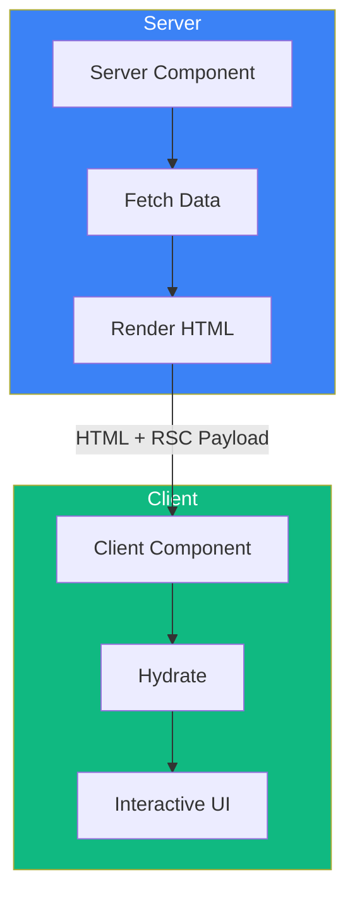
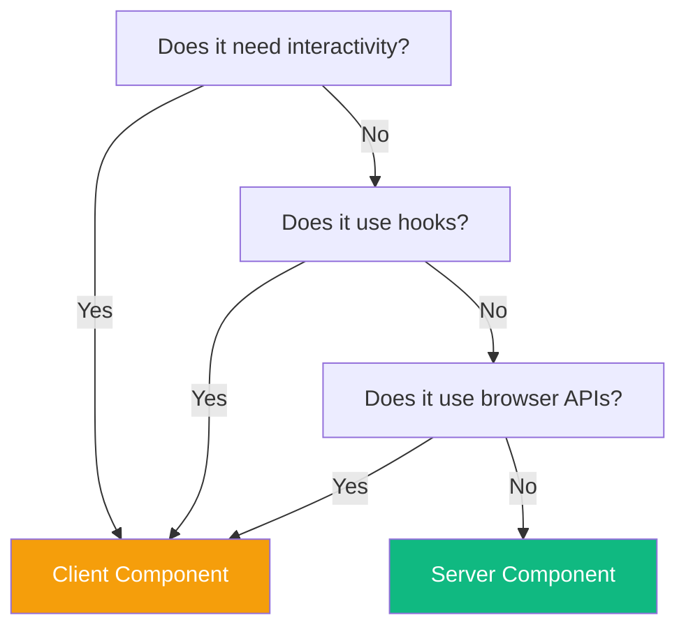
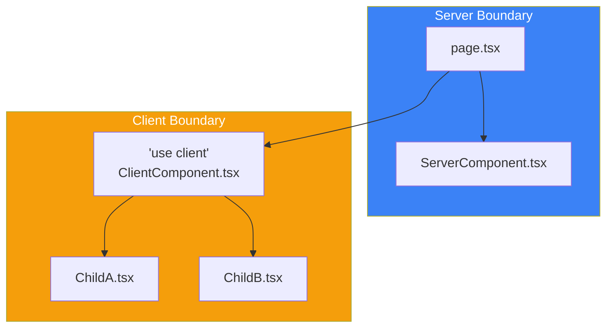

React Server Components (RSC) represent a fundamental shift in how we build React applications. They allow components to run exclusively on the server, reducing bundle size and enabling direct access to backend resources.

## What Are React Server Components?



| Aspect | Server Components | Client Components |
|--------|-------------------|-------------------|
| Execution | Server only | Server + Client |
| Bundle size | Not included | Included |
| Data access | Direct DB/API access | Via API calls |
| Interactivity | None | Full (events, state) |
| Default in App Router | Yes | No (needs 'use client') |

## Server Components by Default

In Next.js App Router, all components are Server Components by default:

```tsx
// app/page.tsx - This is a Server Component
async function getData() {
  const res = await fetch('https://api.example.com/data');
  return res.json();
}

export default async function HomePage() {
  const data = await getData();

  return (
    <main>
      <h1>Welcome</h1>
      <p>Data: {data.message}</p>
    </main>
  );
}
```

### Benefits of Server Components

```tsx
// Server Component can directly access backend resources
import { db } from '@/lib/database';

export default async function UsersPage() {
  // Direct database access - no API needed
  const users = await db.query('SELECT * FROM users');

  return (
    <ul>
      {users.map((user) => (
        <li key={user.id}>{user.name}</li>
      ))}
    </ul>
  );
}
```

### What Server Components Can Do

- Fetch data directly from databases
- Access server-only resources (file system, environment variables)
- Keep sensitive logic on the server
- Reduce client-side JavaScript bundle

### What Server Components Cannot Do

- Use React hooks (useState, useEffect, etc.)
- Add event handlers (onClick, onChange, etc.)
- Access browser APIs (window, document, localStorage)
- Use Context providers

## Client Components

When you need interactivity, use the `'use client'` directive:

```tsx
// components/Counter.tsx
'use client';

import { useState } from 'react';

export default function Counter() {
  const [count, setCount] = useState(0);

  return (
    <div>
      <p>Count: {count}</p>
      <button onClick={() => setCount(count + 1)}>Increment</button>
    </div>
  );
}
```

### When to Use Client Components

```tsx
'use client';

import { useState, useEffect } from 'react';

export default function InteractiveForm() {
  // State management
  const [value, setValue] = useState('');

  // Browser APIs
  useEffect(() => {
    const saved = localStorage.getItem('value');
    if (saved) setValue(saved);
  }, []);

  // Event handlers
  const handleChange = (e: React.ChangeEvent<HTMLInputElement>) => {
    setValue(e.target.value);
    localStorage.setItem('value', e.target.value);
  };

  return (
    <input
      value={value}
      onChange={handleChange}
      placeholder="Type something..."
    />
  );
}
```

## Choosing Between Server and Client



| Use Case | Component Type |
|----------|---------------|
| Fetch and display data | Server |
| Static content | Server |
| Forms with client validation | Client |
| Interactive widgets | Client |
| Buttons with onClick | Client |
| Hooks (useState, useEffect) | Client |
| Animations | Client |
| Third-party UI libraries | Often Client |

## Composing Server and Client Components

### Pattern 1: Server Parent, Client Child

```tsx
// app/page.tsx (Server Component)
import { Counter } from '@/components/Counter';

async function getData() {
  const res = await fetch('https://api.example.com/initial-count');
  return res.json();
}

export default async function Page() {
  const data = await getData();

  return (
    <div>
      <h1>Dashboard</h1>
      {/* Pass server data to client component */}
      <Counter initialCount={data.count} />
    </div>
  );
}
```

```tsx
// components/Counter.tsx (Client Component)
'use client';

import { useState } from 'react';

export function Counter({ initialCount }: { initialCount: number }) {
  const [count, setCount] = useState(initialCount);

  return (
    <button onClick={() => setCount(count + 1)}>
      Count: {count}
    </button>
  );
}
```

### Pattern 2: Passing Server Components as Children

```tsx
// components/ClientWrapper.tsx (Client Component)
'use client';

import { useState } from 'react';

export function Accordion({ children }: { children: React.ReactNode }) {
  const [isOpen, setIsOpen] = useState(false);

  return (
    <div>
      <button onClick={() => setIsOpen(!isOpen)}>
        {isOpen ? 'Close' : 'Open'}
      </button>
      {isOpen && children}
    </div>
  );
}
```

```tsx
// app/page.tsx (Server Component)
import { Accordion } from '@/components/ClientWrapper';
import { ExpensiveServerContent } from '@/components/ExpensiveServerContent';

export default function Page() {
  return (
    <Accordion>
      {/* Server Component passed as children */}
      <ExpensiveServerContent />
    </Accordion>
  );
}
```

### Pattern 3: Extracting Client Logic

```tsx
// Instead of making entire component client-side
// app/products/page.tsx (Server Component)
import { AddToCartButton } from '@/components/AddToCartButton';
import { db } from '@/lib/database';

export default async function ProductsPage() {
  const products = await db.query('SELECT * FROM products');

  return (
    <div>
      {products.map((product) => (
        <div key={product.id}>
          <h2>{product.name}</h2>
          <p>{product.description}</p>
          <p>${product.price}</p>
          {/* Only the button needs to be a Client Component */}
          <AddToCartButton productId={product.id} />
        </div>
      ))}
    </div>
  );
}
```

```tsx
// components/AddToCartButton.tsx (Client Component)
'use client';

export function AddToCartButton({ productId }: { productId: string }) {
  const handleClick = () => {
    // Add to cart logic
    console.log(`Added ${productId} to cart`);
  };

  return <button onClick={handleClick}>Add to Cart</button>;
}
```

## The 'use client' Boundary

The `'use client'` directive creates a boundary:



**Important**: Once you use `'use client'`, all imported components become client components:

```tsx
// components/ClientParent.tsx
'use client';

// These are now Client Components too (even without 'use client')
import { ChildA } from './ChildA';
import { ChildB } from './ChildB';

export function ClientParent() {
  return (
    <div>
      <ChildA />
      <ChildB />
    </div>
  );
}
```

## Data Serialization

Data passed from Server to Client Components must be serializable:

```tsx
// ✅ Serializable - works
<ClientComponent
  name="John"
  age={30}
  items={['a', 'b', 'c']}
  config={{ theme: 'dark' }}
  date={new Date().toISOString()}  // Convert to string
/>

// ❌ Not serializable - fails
<ClientComponent
  onClick={() => console.log('clicked')}  // Functions
  element={<div>Hello</div>}               // JSX elements
  date={new Date()}                        // Date objects
  map={new Map()}                          // Map/Set
/>
```

## Third-Party Libraries

Many third-party libraries need `'use client'`:

```tsx
// components/ChartWrapper.tsx
'use client';

import { Chart } from 'some-chart-library';

export function ChartWrapper({ data }: { data: number[] }) {
  return <Chart data={data} />;
}
```

```tsx
// app/analytics/page.tsx (Server Component)
import { ChartWrapper } from '@/components/ChartWrapper';
import { db } from '@/lib/database';

export default async function AnalyticsPage() {
  const data = await db.query('SELECT * FROM analytics');

  return (
    <div>
      <h1>Analytics</h1>
      <ChartWrapper data={data.values} />
    </div>
  );
}
```

## Best Practices

### 1. Keep Client Components Small

```tsx
// ❌ Bad: Entire page as Client Component
'use client';

export default function ProductPage() {
  // Now everything is client-side
}

// ✅ Good: Only interactive parts as Client Components
// app/products/[id]/page.tsx (Server Component)
import { AddToCart } from '@/components/AddToCart';

export default async function ProductPage({ params }) {
  const product = await getProduct(params.id);

  return (
    <div>
      <h1>{product.name}</h1>
      <p>{product.description}</p>
      <AddToCart productId={product.id} /> {/* Only this is client */}
    </div>
  );
}
```

### 2. Push Client Boundary Down

Move `'use client'` as deep as possible in the component tree:

```
✅ Good structure:
app/
├── page.tsx           (Server)
├── components/
│   ├── Header.tsx     (Server)
│   ├── ProductList.tsx (Server)
│   └── AddToCart.tsx  (Client - 'use client')

❌ Avoid:
app/
├── page.tsx           (Client - 'use client' at top level)
```

### 3. Use Composition for Complex UIs

```tsx
// Server Component fetches data
async function ProductInfo({ id }: { id: string }) {
  const product = await getProduct(id);
  return (
    <div>
      <h2>{product.name}</h2>
      <p>{product.description}</p>
    </div>
  );
}

// Client Component handles interaction
function ProductActions({ id }: { id: string }) {
  'use client';
  return <button onClick={() => addToCart(id)}>Add to Cart</button>;
}

// Compose them together
export default function ProductCard({ id }: { id: string }) {
  return (
    <div>
      <ProductInfo id={id} />
      <ProductActions id={id} />
    </div>
  );
}
```

## Summary

| Concept | Description |
|---------|-------------|
| Server Components | Default in App Router, run on server only |
| Client Components | Need `'use client'`, include interactivity |
| `'use client'` | Directive that creates client boundary |
| Serialization | Data to client must be serializable |
| Composition | Pass Server Components as children to Client |

Key takeaways:

- Server Components are the default in Next.js App Router
- Use `'use client'` only when you need interactivity or browser APIs
- Keep client boundaries as small and deep in the tree as possible
- Pass data from Server to Client via props (must be serializable)
- Server Components can have Client Components as children
- Client Components cannot import Server Components (but can receive them as children)
- Many third-party libraries require the `'use client'` directive

Understanding when to use Server vs Client Components is key to building efficient Next.js applications.

## References

- [Next.js Server Components](https://nextjs.org/docs/app/building-your-application/rendering/server-components)
- [React Server Components RFC](https://github.com/reactjs/rfcs/blob/main/text/0188-server-components.md)
- Kumar, Tejas. *Fluent React*. O'Reilly, 2024.
- Schwarzmüller, Maximilian. *React Key Concepts - Second Edition*. Packt, 2025.
