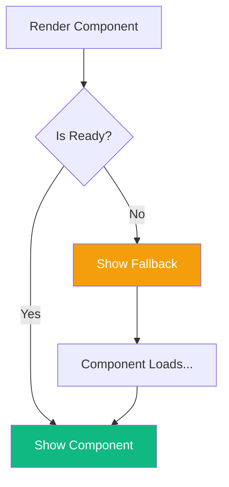
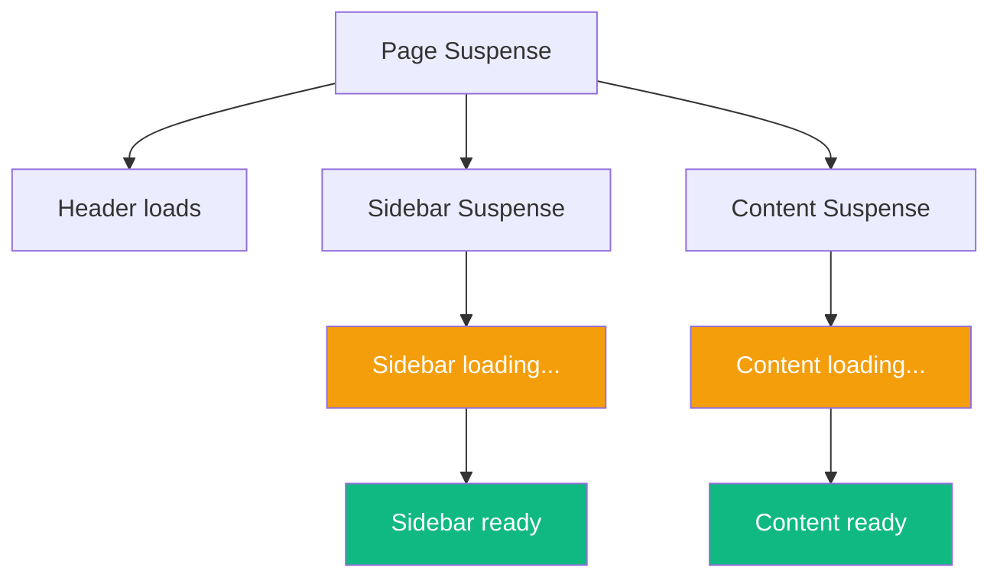

React Suspense is a mechanism for handling asynchronous operations declaratively. Combined with `React.lazy()`, it enables code splitting that can significantly improve your app's initial load time.

## What is Suspense?

Suspense lets you declaratively specify loading states while waiting for something to load:

```jsx
<Suspense fallback={<Spinner />}>
  <SomeComponent />
</Suspense>
```

If `SomeComponent` isn't ready yet (because it's lazy loaded or fetching data), React shows the fallback until it's ready.



## Lazy Loading Components

### Basic Usage

`React.lazy()` lets you load components only when they're needed:

```jsx
import { lazy, Suspense } from 'react';

// Component is not loaded until it's rendered
const HeavyChart = lazy(() => import('./HeavyChart'));

function Dashboard() {
  return (
    <div>
      <h1>Dashboard</h1>
      <Suspense fallback={<div>Loading chart...</div>}>
        <HeavyChart />
      </Suspense>
    </div>
  );
}
```

The `HeavyChart` component's code isn't downloaded until the `Dashboard` component renders it for the first time.

### Route-Based Code Splitting

The most impactful use of lazy loading is at the route level:

```jsx
import { lazy, Suspense } from 'react';
import { BrowserRouter, Routes, Route } from 'react-router-dom';

// Each route loads its own bundle
const Home = lazy(() => import('./pages/Home'));
const About = lazy(() => import('./pages/About'));
const Dashboard = lazy(() => import('./pages/Dashboard'));
const Settings = lazy(() => import('./pages/Settings'));

function App() {
  return (
    <BrowserRouter>
      <Suspense fallback={<PageLoader />}>
        <Routes>
          <Route path="/" element={<Home />} />
          <Route path="/about" element={<About />} />
          <Route path="/dashboard" element={<Dashboard />} />
          <Route path="/settings" element={<Settings />} />
        </Routes>
      </Suspense>
    </BrowserRouter>
  );
}
```

Users only download the code for pages they visit.

### Named Exports

`React.lazy()` only works with default exports. For named exports, create an intermediate module:

```jsx
// ManyComponents.js exports multiple components
export const ComponentA = () => <div>A</div>;
export const ComponentB = () => <div>B</div>;

// Use an intermediate import
const ComponentA = lazy(() =>
  import('./ManyComponents').then(module => ({ default: module.ComponentA }))
);
```

## Suspense Boundaries

### Multiple Suspense Boundaries

You can nest Suspense boundaries for granular loading states:

```jsx
function App() {
  return (
    <Suspense fallback={<PageSkeleton />}>
      <Header />
      <main>
        <Suspense fallback={<SidebarSkeleton />}>
          <Sidebar />
        </Suspense>
        <Suspense fallback={<ContentSkeleton />}>
          <MainContent />
        </Suspense>
      </main>
    </Suspense>
  );
}
```



### Where to Place Suspense Boundaries

- **Too high**: Users see a blank page for too long
- **Too low**: Too many loading spinners, jarring experience
- **Just right**: Loading states that match user expectations

```jsx
// Too high - entire page shows loader
<Suspense fallback={<FullPageLoader />}>
  <EntireApp />
</Suspense>

// Too low - every component has its own loader
<div>
  <Suspense fallback={<Spinner />}><Header /></Suspense>
  <Suspense fallback={<Spinner />}><Nav /></Suspense>
  <Suspense fallback={<Spinner />}><Content /></Suspense>
  <Suspense fallback={<Spinner />}><Footer /></Suspense>
</div>

// Better - logical groupings
<div>
  <Header /> {/* Always loads immediately */}
  <Suspense fallback={<ContentSkeleton />}>
    <MainContent /> {/* Main area loads together */}
  </Suspense>
</div>
```

## Error Handling

Use Error Boundaries alongside Suspense to handle loading failures:

```jsx
import { Component } from 'react';

class ErrorBoundary extends Component {
  state = { hasError: false, error: null };

  static getDerivedStateFromError(error) {
    return { hasError: true, error };
  }

  render() {
    if (this.state.hasError) {
      return (
        <div>
          <h2>Something went wrong.</h2>
          <button onClick={() => this.setState({ hasError: false })}>
            Try again
          </button>
        </div>
      );
    }
    return this.props.children;
  }
}

// Usage
function App() {
  return (
    <ErrorBoundary>
      <Suspense fallback={<Spinner />}>
        <LazyComponent />
      </Suspense>
    </ErrorBoundary>
  );
}
```

## Preloading Components

You can preload lazy components before they're needed:

```jsx
const HeavyComponent = lazy(() => import('./HeavyComponent'));

// Preload on hover
function Navigation() {
  const handleMouseEnter = () => {
    // Starts loading the component
    import('./HeavyComponent');
  };

  return (
    <Link
      to="/heavy"
      onMouseEnter={handleMouseEnter}
    >
      Go to Heavy Page
    </Link>
  );
}
```

Or use a dedicated preload function:

```jsx
// Create a preloadable lazy component
function lazyWithPreload(factory) {
  const Component = lazy(factory);
  Component.preload = factory;
  return Component;
}

const Dashboard = lazyWithPreload(() => import('./Dashboard'));

// Preload when you think the user might navigate there
function Nav() {
  return (
    <nav onMouseEnter={() => Dashboard.preload()}>
      <Link to="/dashboard">Dashboard</Link>
    </nav>
  );
}
```

## Suspense for Data Fetching

While primarily used for code splitting, Suspense can also handle data fetching with the right integration:

### With React Query / TanStack Query

```jsx
import { useSuspenseQuery } from '@tanstack/react-query';

function UserProfile({ userId }) {
  // This component suspends while fetching
  const { data: user } = useSuspenseQuery({
    queryKey: ['user', userId],
    queryFn: () => fetchUser(userId),
  });

  return <div>{user.name}</div>;
}

function App() {
  return (
    <Suspense fallback={<ProfileSkeleton />}>
      <UserProfile userId={123} />
    </Suspense>
  );
}
```

### With React's `use` Hook (React 19+)

```jsx
import { use, Suspense } from 'react';

function UserProfile({ userPromise }) {
  const user = use(userPromise);
  return <div>{user.name}</div>;
}

function App() {
  const userPromise = fetchUser(123); // Returns a promise

  return (
    <Suspense fallback={<ProfileSkeleton />}>
      <UserProfile userPromise={userPromise} />
    </Suspense>
  );
}
```

## Best Practices

### 1. Show Meaningful Loading States

```jsx
// Bad: Generic spinner
<Suspense fallback={<Spinner />}>
  <DataTable />
</Suspense>

// Good: Skeleton that matches the content
<Suspense fallback={<DataTableSkeleton rows={10} />}>
  <DataTable />
</Suspense>
```

### 2. Avoid Layout Shift

Make fallbacks the same size as the content:

```jsx
function CardSkeleton() {
  return (
    <div className="card" style={{ height: 200 }}>
      <div className="skeleton-title" />
      <div className="skeleton-content" />
    </div>
  );
}
```

### 3. Use startTransition for Non-Urgent Updates

Prevent loading states for quick navigation:

```jsx
import { startTransition } from 'react';

function Tabs({ tabs }) {
  const [tab, setTab] = useState(tabs[0]);

  function selectTab(nextTab) {
    // Don't show Suspense fallback for fast transitions
    startTransition(() => {
      setTab(nextTab);
    });
  }

  return (
    <div>
      <TabButtons tabs={tabs} onSelect={selectTab} />
      <Suspense fallback={<TabSkeleton />}>
        <TabContent tab={tab} />
      </Suspense>
    </div>
  );
}
```

### 4. Keep Initial Bundle Small

Split aggressively for routes and large features:

```jsx
// Split by route
const routes = {
  home: lazy(() => import('./pages/Home')),
  dashboard: lazy(() => import('./pages/Dashboard')),
  settings: lazy(() => import('./pages/Settings')),
};

// Split large features
const RichTextEditor = lazy(() => import('./components/RichTextEditor'));
const DataVisualization = lazy(() => import('./components/DataVisualization'));
```

## Summary

| Concept | Description |
|---------|-------------|
| `React.lazy()` | Dynamically import components |
| `<Suspense>` | Show fallback while loading |
| Code splitting | Load code only when needed |
| Error Boundary | Handle loading failures |
| Preloading | Start loading before needed |

Key takeaways:

- Use `React.lazy()` for route-level code splitting
- Place Suspense boundaries at logical UI breakpoints
- Show skeletons that match the loading content's shape
- Use Error Boundaries to handle loading failures
- Preload components the user is likely to need next
- Use `startTransition` to avoid flickering for fast loads

Suspense and lazy loading are essential tools for building performant React applications. They let you ship smaller initial bundles while maintaining a good user experience during loading.

## References

- [React Documentation: Suspense](https://react.dev/reference/react/Suspense)
- [React Documentation: lazy](https://react.dev/reference/react/lazy)
- Kumar, Tejas. *Fluent React*. O'Reilly Media, 2024.
