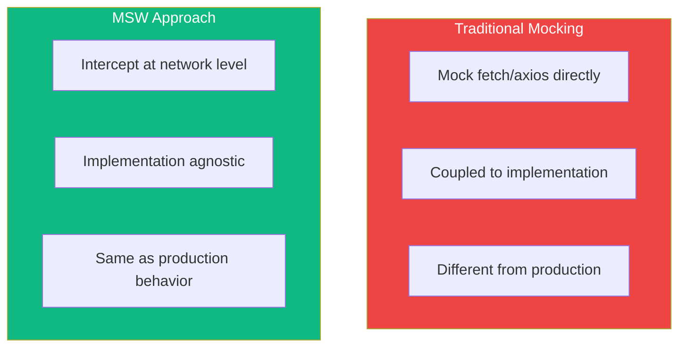

Testing components that make API calls can be challenging. Mock Service Worker (MSW) intercepts requests at the network level, allowing you to test components exactly as they run in production.

## Why MSW?

Traditional mocking approaches have limitations:



| Approach | Pros | Cons |
|----------|------|------|
| Mock fetch | Simple setup | Tightly coupled to implementation |
| Mock axios | Easy if using axios | Breaks if you switch libraries |
| MSW | Works with any library | Slightly more setup |

MSW intercepts requests before they leave your app, so your component's fetch code runs exactly as it would in production.

## Setting Up MSW

### Installation

```bash
npm install -D msw
```

### Creating Handlers

Define how your mock server responds to requests:

```typescript
// src/mocks/handlers.ts
import { http, HttpResponse } from 'msw';

export const handlers = [
  // GET request
  http.get('/api/users', () => {
    return HttpResponse.json([
      { id: 1, name: 'Alice' },
      { id: 2, name: 'Bob' },
    ]);
  }),

  // GET with path parameter
  http.get('/api/users/:id', ({ params }) => {
    const { id } = params;
    return HttpResponse.json({ id: Number(id), name: 'John Doe' });
  }),

  // POST request
  http.post('/api/users', async ({ request }) => {
    const body = await request.json();
    return HttpResponse.json(
      { id: 3, ...body },
      { status: 201 }
    );
  }),
];
```

### Setting Up the Server

```typescript
// src/mocks/server.ts
import { setupServer } from 'msw/node';
import { handlers } from './handlers';

export const server = setupServer(...handlers);
```

### Test Setup

Configure MSW to run during tests:

```typescript
// src/test/setup.ts
import '@testing-library/jest-dom';
import { server } from '../mocks/server';

// Start server before all tests
beforeAll(() => server.listen());

// Reset handlers after each test
afterEach(() => server.resetHandlers());

// Close server after all tests
afterAll(() => server.close());
```

Update your Vite/Jest config:

```typescript
// vite.config.ts
export default defineConfig({
  test: {
    setupFiles: './src/test/setup.ts',
  },
});
```

## Testing Components That Fetch Data

### Basic Async Component

```tsx
// UserList.tsx
function UserList() {
  const [users, setUsers] = useState([]);
  const [loading, setLoading] = useState(true);
  const [error, setError] = useState(null);

  useEffect(() => {
    fetch('/api/users')
      .then((res) => res.json())
      .then((data) => {
        setUsers(data);
        setLoading(false);
      })
      .catch((err) => {
        setError(err.message);
        setLoading(false);
      });
  }, []);

  if (loading) return <div>Loading...</div>;
  if (error) return <div role="alert">{error}</div>;

  return (
    <ul>
      {users.map((user) => (
        <li key={user.id}>{user.name}</li>
      ))}
    </ul>
  );
}
```

### Testing the Happy Path

```tsx
import { render, screen } from '@testing-library/react';
import { UserList } from './UserList';

test('displays users after loading', async () => {
  render(<UserList />);

  // Shows loading state
  expect(screen.getByText('Loading...')).toBeInTheDocument();

  // Wait for users to appear
  expect(await screen.findByText('Alice')).toBeInTheDocument();
  expect(screen.getByText('Bob')).toBeInTheDocument();

  // Loading is gone
  expect(screen.queryByText('Loading...')).not.toBeInTheDocument();
});
```

### Testing Error States

Override handlers for specific tests:

```tsx
import { http, HttpResponse } from 'msw';
import { server } from '../mocks/server';

test('displays error message on failure', async () => {
  // Override handler for this test
  server.use(
    http.get('/api/users', () => {
      return HttpResponse.json(
        { message: 'Server error' },
        { status: 500 }
      );
    })
  );

  render(<UserList />);

  // Wait for error to appear
  expect(await screen.findByRole('alert')).toBeInTheDocument();
});
```

### Testing Loading States

```tsx
import { delay, http, HttpResponse } from 'msw';
import { server } from '../mocks/server';

test('shows loading state while fetching', async () => {
  // Add delay to response
  server.use(
    http.get('/api/users', async () => {
      await delay(100);
      return HttpResponse.json([]);
    })
  );

  render(<UserList />);

  expect(screen.getByText('Loading...')).toBeInTheDocument();

  // Wait for loading to finish
  await waitForElementToBeRemoved(() => screen.queryByText('Loading...'));
});
```

## Testing Forms That Submit Data

### Form Component

```tsx
// CreateUserForm.tsx
function CreateUserForm({ onSuccess }) {
  const [name, setName] = useState('');
  const [submitting, setSubmitting] = useState(false);
  const [error, setError] = useState(null);

  const handleSubmit = async (e) => {
    e.preventDefault();
    setSubmitting(true);
    setError(null);

    try {
      const res = await fetch('/api/users', {
        method: 'POST',
        headers: { 'Content-Type': 'application/json' },
        body: JSON.stringify({ name }),
      });

      if (!res.ok) throw new Error('Failed to create user');

      const user = await res.json();
      onSuccess(user);
    } catch (err) {
      setError(err.message);
    } finally {
      setSubmitting(false);
    }
  };

  return (
    <form onSubmit={handleSubmit}>
      <label htmlFor="name">Name</label>
      <input
        id="name"
        value={name}
        onChange={(e) => setName(e.target.value)}
      />
      <button type="submit" disabled={submitting}>
        {submitting ? 'Creating...' : 'Create User'}
      </button>
      {error && <div role="alert">{error}</div>}
    </form>
  );
}
```

### Testing Form Submission

```tsx
import userEvent from '@testing-library/user-event';
import { CreateUserForm } from './CreateUserForm';

test('submits form and calls onSuccess', async () => {
  const user = userEvent.setup();
  const handleSuccess = jest.fn();

  render(<CreateUserForm onSuccess={handleSuccess} />);

  await user.type(screen.getByLabelText('Name'), 'Jane Doe');
  await user.click(screen.getByRole('button', { name: 'Create User' }));

  // Wait for submission to complete
  await waitFor(() => {
    expect(handleSuccess).toHaveBeenCalledWith(
      expect.objectContaining({ name: 'Jane Doe' })
    );
  });
});

test('shows error on submission failure', async () => {
  server.use(
    http.post('/api/users', () => {
      return HttpResponse.json(
        { message: 'Validation failed' },
        { status: 400 }
      );
    })
  );

  const user = userEvent.setup();
  render(<CreateUserForm onSuccess={jest.fn()} />);

  await user.type(screen.getByLabelText('Name'), 'Jane');
  await user.click(screen.getByRole('button'));

  expect(await screen.findByRole('alert')).toHaveTextContent(
    'Failed to create user'
  );
});

test('disables button while submitting', async () => {
  server.use(
    http.post('/api/users', async () => {
      await delay(100);
      return HttpResponse.json({ id: 1, name: 'Jane' });
    })
  );

  const user = userEvent.setup();
  render(<CreateUserForm onSuccess={jest.fn()} />);

  await user.type(screen.getByLabelText('Name'), 'Jane');
  await user.click(screen.getByRole('button'));

  // Button shows loading state
  expect(screen.getByRole('button')).toHaveTextContent('Creating...');
  expect(screen.getByRole('button')).toBeDisabled();

  // Wait for completion
  await waitFor(() => {
    expect(screen.getByRole('button')).toHaveTextContent('Create User');
  });
});
```

## Advanced MSW Patterns

### Inspecting Request Data

```tsx
test('sends correct data to API', async () => {
  let capturedRequest;

  server.use(
    http.post('/api/users', async ({ request }) => {
      capturedRequest = await request.json();
      return HttpResponse.json({ id: 1, ...capturedRequest });
    })
  );

  const user = userEvent.setup();
  render(<CreateUserForm onSuccess={jest.fn()} />);

  await user.type(screen.getByLabelText('Name'), 'Jane Doe');
  await user.click(screen.getByRole('button'));

  await waitFor(() => {
    expect(capturedRequest).toEqual({ name: 'Jane Doe' });
  });
});
```

### Sequential Responses

```tsx
test('handles retry after failure', async () => {
  let callCount = 0;

  server.use(
    http.get('/api/users', () => {
      callCount++;
      if (callCount === 1) {
        return HttpResponse.json({ message: 'Error' }, { status: 500 });
      }
      return HttpResponse.json([{ id: 1, name: 'Alice' }]);
    })
  );

  const user = userEvent.setup();
  render(<UserListWithRetry />);

  // First request fails
  expect(await screen.findByRole('alert')).toBeInTheDocument();

  // Click retry
  await user.click(screen.getByRole('button', { name: 'Retry' }));

  // Second request succeeds
  expect(await screen.findByText('Alice')).toBeInTheDocument();
});
```

### Network Errors

```tsx
test('handles network failure', async () => {
  server.use(
    http.get('/api/users', () => {
      return HttpResponse.error();
    })
  );

  render(<UserList />);

  expect(await screen.findByRole('alert')).toBeInTheDocument();
});
```

### Request Headers

```tsx
test('sends authentication header', async () => {
  let authHeader;

  server.use(
    http.get('/api/users', ({ request }) => {
      authHeader = request.headers.get('Authorization');
      return HttpResponse.json([]);
    })
  );

  render(<AuthenticatedUserList token="bearer-token-123" />);

  await waitFor(() => {
    expect(authHeader).toBe('Bearer bearer-token-123');
  });
});
```

## Testing with React Query

MSW works great with React Query:

```tsx
// UserProfile.tsx
function UserProfile({ userId }) {
  const { data: user, isLoading, error } = useQuery({
    queryKey: ['user', userId],
    queryFn: () => fetch(`/api/users/${userId}`).then((r) => r.json()),
  });

  if (isLoading) return <div>Loading...</div>;
  if (error) return <div role="alert">Error loading user</div>;

  return <div>{user.name}</div>;
}
```

```tsx
// UserProfile.test.tsx
import { QueryClient, QueryClientProvider } from '@tanstack/react-query';

function renderWithQueryClient(ui) {
  const queryClient = new QueryClient({
    defaultOptions: {
      queries: {
        retry: false, // Don't retry failed requests in tests
      },
    },
  });

  return render(
    <QueryClientProvider client={queryClient}>{ui}</QueryClientProvider>
  );
}

test('displays user profile', async () => {
  server.use(
    http.get('/api/users/1', () => {
      return HttpResponse.json({ id: 1, name: 'John Doe' });
    })
  );

  renderWithQueryClient(<UserProfile userId={1} />);

  expect(await screen.findByText('John Doe')).toBeInTheDocument();
});
```

## Testing Patterns

### waitFor vs findBy

```tsx
// findBy - for elements that will appear
const element = await screen.findByText('Data');

// waitFor - for assertions that need to become true
await waitFor(() => {
  expect(mockFn).toHaveBeenCalled();
});

// waitForElementToBeRemoved - for elements that will disappear
await waitForElementToBeRemoved(() => screen.queryByText('Loading...'));
```

### Test Organization

```tsx
describe('UserList', () => {
  describe('when loading', () => {
    test('shows loading indicator', () => {
      render(<UserList />);
      expect(screen.getByText('Loading...')).toBeInTheDocument();
    });
  });

  describe('when loaded successfully', () => {
    test('displays users', async () => {
      render(<UserList />);
      expect(await screen.findByText('Alice')).toBeInTheDocument();
    });
  });

  describe('when request fails', () => {
    beforeEach(() => {
      server.use(
        http.get('/api/users', () => HttpResponse.error())
      );
    });

    test('shows error message', async () => {
      render(<UserList />);
      expect(await screen.findByRole('alert')).toBeInTheDocument();
    });
  });
});
```

## Summary

| Concept | Description |
|---------|-------------|
| `http.get/post/put/delete` | Define mock handlers |
| `HttpResponse.json()` | Return JSON response |
| `server.use()` | Override handlers for specific tests |
| `delay()` | Simulate network latency |
| `findBy*` | Wait for elements to appear |
| `waitFor()` | Wait for assertions to pass |

Key takeaways:

- MSW intercepts requests at the network level, making tests more realistic
- Define default handlers in a handlers file, override in specific tests
- Use `server.use()` to test error states and edge cases
- Use `findBy` queries to wait for async data to appear
- Reset handlers after each test to avoid test pollution
- Test loading, success, and error states for complete coverage

MSW provides a powerful, realistic way to test components that interact with APIs. Your tests run the same code as production, giving you confidence that your components work correctly.

## References

- [MSW Documentation](https://mswjs.io/)
- [Testing Library Async Utilities](https://testing-library.com/docs/dom-testing-library/api-async)
- Ruscio, Daniel. *Testing JavaScript Applications*. Manning Publications, 2021.
- Barklund, Morten. *React in Depth*. Manning Publications, 2024.
