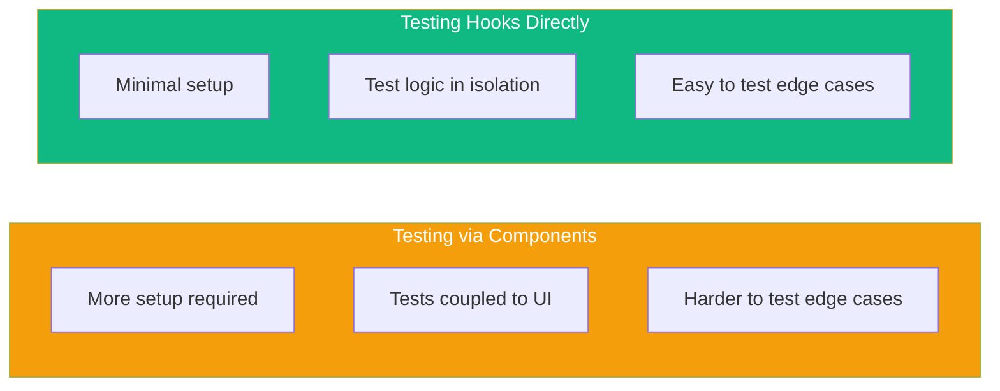

Custom hooks encapsulate reusable logic in React applications. Testing them properly ensures your hooks work correctly in isolation before using them in components.

## Why Test Hooks Separately?



Testing hooks directly:
- Allows testing logic without UI dependencies
- Makes edge cases easier to test
- Results in faster, more focused tests

## Setting Up

Install the testing library:

```bash
npm install -D @testing-library/react
```

The `renderHook` function is included in `@testing-library/react`:

```tsx
import { renderHook } from '@testing-library/react';
```

## Basic Hook Testing

### A Simple Counter Hook

```tsx
// useCounter.ts
import { useState, useCallback } from 'react';

export function useCounter(initialValue = 0) {
  const [count, setCount] = useState(initialValue);

  const increment = useCallback(() => setCount((c) => c + 1), []);
  const decrement = useCallback(() => setCount((c) => c - 1), []);
  const reset = useCallback(() => setCount(initialValue), [initialValue]);

  return { count, increment, decrement, reset };
}
```

### Testing the Hook

```tsx
// useCounter.test.ts
import { renderHook, act } from '@testing-library/react';
import { useCounter } from './useCounter';

test('initializes with default value', () => {
  const { result } = renderHook(() => useCounter());

  expect(result.current.count).toBe(0);
});

test('initializes with provided value', () => {
  const { result } = renderHook(() => useCounter(10));

  expect(result.current.count).toBe(10);
});

test('increments count', () => {
  const { result } = renderHook(() => useCounter());

  act(() => {
    result.current.increment();
  });

  expect(result.current.count).toBe(1);
});

test('decrements count', () => {
  const { result } = renderHook(() => useCounter(5));

  act(() => {
    result.current.decrement();
  });

  expect(result.current.count).toBe(4);
});

test('resets to initial value', () => {
  const { result } = renderHook(() => useCounter(10));

  act(() => {
    result.current.increment();
    result.current.increment();
  });

  expect(result.current.count).toBe(12);

  act(() => {
    result.current.reset();
  });

  expect(result.current.count).toBe(10);
});
```

## Understanding renderHook

### The result Object

`renderHook` returns an object with a `result` property:

```tsx
const { result } = renderHook(() => useMyHook());

// Access current return value
result.current; // { value, setValue, ... }
```

`result.current` always contains the latest return value from the hook.

### The act Function

Wrap state updates in `act` to ensure React processes them:

```tsx
import { act } from '@testing-library/react';

test('updates state', () => {
  const { result } = renderHook(() => useCounter());

  // Without act, this might not update properly
  act(() => {
    result.current.increment();
  });

  expect(result.current.count).toBe(1);
});
```

## Testing Hooks with Props

### Changing Props

Use `rerender` to test hooks with different props:

```tsx
// useTitle.ts
import { useEffect } from 'react';

export function useTitle(title: string) {
  useEffect(() => {
    document.title = title;
  }, [title]);
}
```

```tsx
// useTitle.test.ts
test('updates document title', () => {
  const { rerender } = renderHook(({ title }) => useTitle(title), {
    initialProps: { title: 'Initial Title' },
  });

  expect(document.title).toBe('Initial Title');

  rerender({ title: 'New Title' });

  expect(document.title).toBe('New Title');
});
```

### Testing with Dependencies

```tsx
// useLocalStorage.ts
import { useState, useEffect } from 'react';

export function useLocalStorage<T>(key: string, initialValue: T) {
  const [value, setValue] = useState<T>(() => {
    const stored = localStorage.getItem(key);
    return stored ? JSON.parse(stored) : initialValue;
  });

  useEffect(() => {
    localStorage.setItem(key, JSON.stringify(value));
  }, [key, value]);

  return [value, setValue] as const;
}
```

```tsx
// useLocalStorage.test.ts
beforeEach(() => {
  localStorage.clear();
});

test('initializes with value from localStorage', () => {
  localStorage.setItem('test-key', JSON.stringify('stored value'));

  const { result } = renderHook(() => useLocalStorage('test-key', 'default'));

  expect(result.current[0]).toBe('stored value');
});

test('initializes with default when localStorage is empty', () => {
  const { result } = renderHook(() => useLocalStorage('test-key', 'default'));

  expect(result.current[0]).toBe('default');
});

test('updates localStorage when value changes', () => {
  const { result } = renderHook(() => useLocalStorage('test-key', 'initial'));

  act(() => {
    result.current[1]('new value');
  });

  expect(localStorage.getItem('test-key')).toBe('"new value"');
});

test('updates value when key changes', () => {
  localStorage.setItem('key-a', JSON.stringify('value-a'));
  localStorage.setItem('key-b', JSON.stringify('value-b'));

  const { result, rerender } = renderHook(
    ({ key }) => useLocalStorage(key, 'default'),
    { initialProps: { key: 'key-a' } }
  );

  expect(result.current[0]).toBe('value-a');

  rerender({ key: 'key-b' });

  expect(result.current[0]).toBe('value-b');
});
```

## Testing Async Hooks

### Async Data Fetching Hook

```tsx
// useFetch.ts
import { useState, useEffect } from 'react';

interface UseFetchResult<T> {
  data: T | null;
  loading: boolean;
  error: Error | null;
}

export function useFetch<T>(url: string): UseFetchResult<T> {
  const [data, setData] = useState<T | null>(null);
  const [loading, setLoading] = useState(true);
  const [error, setError] = useState<Error | null>(null);

  useEffect(() => {
    let cancelled = false;

    setLoading(true);
    setError(null);

    fetch(url)
      .then((res) => res.json())
      .then((data) => {
        if (!cancelled) {
          setData(data);
          setLoading(false);
        }
      })
      .catch((err) => {
        if (!cancelled) {
          setError(err);
          setLoading(false);
        }
      });

    return () => {
      cancelled = true;
    };
  }, [url]);

  return { data, loading, error };
}
```

### Testing with MSW

```tsx
// useFetch.test.ts
import { renderHook, waitFor } from '@testing-library/react';
import { http, HttpResponse } from 'msw';
import { server } from '../mocks/server';
import { useFetch } from './useFetch';

test('fetches data successfully', async () => {
  server.use(
    http.get('/api/data', () => {
      return HttpResponse.json({ message: 'Hello' });
    })
  );

  const { result } = renderHook(() => useFetch('/api/data'));

  // Initially loading
  expect(result.current.loading).toBe(true);
  expect(result.current.data).toBe(null);

  // Wait for data
  await waitFor(() => {
    expect(result.current.loading).toBe(false);
  });

  expect(result.current.data).toEqual({ message: 'Hello' });
  expect(result.current.error).toBe(null);
});

test('handles fetch error', async () => {
  server.use(
    http.get('/api/data', () => {
      return HttpResponse.error();
    })
  );

  const { result } = renderHook(() => useFetch('/api/data'));

  await waitFor(() => {
    expect(result.current.loading).toBe(false);
  });

  expect(result.current.data).toBe(null);
  expect(result.current.error).toBeTruthy();
});

test('refetches when URL changes', async () => {
  server.use(
    http.get('/api/users/1', () => {
      return HttpResponse.json({ id: 1, name: 'Alice' });
    }),
    http.get('/api/users/2', () => {
      return HttpResponse.json({ id: 2, name: 'Bob' });
    })
  );

  const { result, rerender } = renderHook(
    ({ url }) => useFetch(url),
    { initialProps: { url: '/api/users/1' } }
  );

  await waitFor(() => {
    expect(result.current.data).toEqual({ id: 1, name: 'Alice' });
  });

  rerender({ url: '/api/users/2' });

  await waitFor(() => {
    expect(result.current.data).toEqual({ id: 2, name: 'Bob' });
  });
});
```

## Testing Hooks with Context

### Hook That Uses Context

```tsx
// useAuth.ts
import { useContext } from 'react';
import { AuthContext } from './AuthContext';

export function useAuth() {
  const context = useContext(AuthContext);

  if (!context) {
    throw new Error('useAuth must be used within an AuthProvider');
  }

  return context;
}
```

### Creating a Wrapper

```tsx
// useAuth.test.ts
import { renderHook } from '@testing-library/react';
import { AuthProvider } from './AuthContext';
import { useAuth } from './useAuth';

test('returns auth context', () => {
  const wrapper = ({ children }) => (
    <AuthProvider value={{ user: { name: 'John' }, isAuthenticated: true }}>
      {children}
    </AuthProvider>
  );

  const { result } = renderHook(() => useAuth(), { wrapper });

  expect(result.current.user).toEqual({ name: 'John' });
  expect(result.current.isAuthenticated).toBe(true);
});

test('throws error when used outside provider', () => {
  // Suppress console.error for this test
  const consoleSpy = jest.spyOn(console, 'error').mockImplementation();

  expect(() => {
    renderHook(() => useAuth());
  }).toThrow('useAuth must be used within an AuthProvider');

  consoleSpy.mockRestore();
});
```

### Reusable Wrapper Factory

```tsx
// test-utils.tsx
import { AuthProvider } from './AuthContext';
import { ThemeProvider } from './ThemeContext';

export function createWrapper(authValue, themeValue) {
  return function Wrapper({ children }) {
    return (
      <AuthProvider value={authValue}>
        <ThemeProvider value={themeValue}>
          {children}
        </ThemeProvider>
      </AuthProvider>
    );
  };
}

// Usage in tests
test('hook with multiple contexts', () => {
  const wrapper = createWrapper(
    { user: null, isAuthenticated: false },
    { theme: 'dark' }
  );

  const { result } = renderHook(() => useMyHook(), { wrapper });
  // ...
});
```

## Testing Hooks with Timers

### Debounce Hook

```tsx
// useDebounce.ts
import { useState, useEffect } from 'react';

export function useDebounce<T>(value: T, delay: number): T {
  const [debouncedValue, setDebouncedValue] = useState(value);

  useEffect(() => {
    const timer = setTimeout(() => {
      setDebouncedValue(value);
    }, delay);

    return () => clearTimeout(timer);
  }, [value, delay]);

  return debouncedValue;
}
```

### Testing with Fake Timers

```tsx
// useDebounce.test.ts
import { renderHook, act } from '@testing-library/react';
import { useDebounce } from './useDebounce';

beforeEach(() => {
  jest.useFakeTimers();
});

afterEach(() => {
  jest.useRealTimers();
});

test('returns initial value immediately', () => {
  const { result } = renderHook(() => useDebounce('hello', 500));

  expect(result.current).toBe('hello');
});

test('debounces value changes', () => {
  const { result, rerender } = renderHook(
    ({ value }) => useDebounce(value, 500),
    { initialProps: { value: 'initial' } }
  );

  // Change value
  rerender({ value: 'changed' });

  // Value hasn't changed yet
  expect(result.current).toBe('initial');

  // Advance timer partially
  act(() => {
    jest.advanceTimersByTime(300);
  });

  // Still hasn't changed
  expect(result.current).toBe('initial');

  // Advance past delay
  act(() => {
    jest.advanceTimersByTime(200);
  });

  // Now it has changed
  expect(result.current).toBe('changed');
});

test('resets timer on rapid changes', () => {
  const { result, rerender } = renderHook(
    ({ value }) => useDebounce(value, 500),
    { initialProps: { value: 'a' } }
  );

  rerender({ value: 'b' });
  act(() => jest.advanceTimersByTime(300));

  rerender({ value: 'c' });
  act(() => jest.advanceTimersByTime(300));

  // Still 'a' because timer keeps resetting
  expect(result.current).toBe('a');

  act(() => jest.advanceTimersByTime(200));

  // Now it's 'c' (the last value)
  expect(result.current).toBe('c');
});
```

## Testing Hooks with Callbacks

### Hook That Accepts Callbacks

```tsx
// useEventListener.ts
import { useEffect, useRef } from 'react';

export function useEventListener(
  eventName: string,
  handler: (event: Event) => void,
  element: HTMLElement | Window = window
) {
  const savedHandler = useRef(handler);

  useEffect(() => {
    savedHandler.current = handler;
  }, [handler]);

  useEffect(() => {
    const eventListener = (event: Event) => savedHandler.current(event);
    element.addEventListener(eventName, eventListener);

    return () => {
      element.removeEventListener(eventName, eventListener);
    };
  }, [eventName, element]);
}
```

### Testing Event Handlers

```tsx
// useEventListener.test.ts
test('adds event listener', () => {
  const handler = jest.fn();

  renderHook(() => useEventListener('click', handler));

  // Simulate click
  act(() => {
    window.dispatchEvent(new Event('click'));
  });

  expect(handler).toHaveBeenCalledTimes(1);
});

test('removes event listener on unmount', () => {
  const handler = jest.fn();

  const { unmount } = renderHook(() => useEventListener('click', handler));

  unmount();

  act(() => {
    window.dispatchEvent(new Event('click'));
  });

  expect(handler).not.toHaveBeenCalled();
});

test('uses latest handler', () => {
  const handler1 = jest.fn();
  const handler2 = jest.fn();

  const { rerender } = renderHook(
    ({ handler }) => useEventListener('click', handler),
    { initialProps: { handler: handler1 } }
  );

  rerender({ handler: handler2 });

  act(() => {
    window.dispatchEvent(new Event('click'));
  });

  expect(handler1).not.toHaveBeenCalled();
  expect(handler2).toHaveBeenCalledTimes(1);
});
```

## Common Patterns

### Testing Multiple State Updates

```tsx
test('handles multiple updates', () => {
  const { result } = renderHook(() => useCounter());

  act(() => {
    result.current.increment();
    result.current.increment();
    result.current.increment();
  });

  expect(result.current.count).toBe(3);
});
```

### Testing Cleanup

```tsx
test('cleans up on unmount', () => {
  const cleanup = jest.fn();
  const { unmount } = renderHook(() => {
    useEffect(() => cleanup, []);
  });

  expect(cleanup).not.toHaveBeenCalled();

  unmount();

  expect(cleanup).toHaveBeenCalledTimes(1);
});
```

## Summary

| Concept | Description |
|---------|-------------|
| `renderHook()` | Renders a hook for testing |
| `result.current` | Current return value of the hook |
| `act()` | Wrap state updates to process them |
| `rerender()` | Re-render with new props |
| `unmount()` | Unmount the hook |
| `wrapper` | Provide context/providers |

Key takeaways:

- Use `renderHook` to test hooks in isolation
- Wrap state updates in `act()` to ensure they're processed
- Use `rerender` to test hooks with changing props
- Provide a `wrapper` for hooks that use Context
- Use fake timers for hooks with delays/debounce
- Test cleanup by checking behavior after `unmount()`

Testing custom hooks directly leads to more focused, maintainable tests. You can thoroughly test the hook's logic before integrating it into components.

## References

- [Testing Library renderHook](https://testing-library.com/docs/react-testing-library/api/#renderhook)
- [React Hooks Testing](https://kentcdodds.com/blog/how-to-test-custom-react-hooks)
- Crump, Scottie. *Simplify Testing with React Testing Library*. Packt, 2021.
- Barklund, Morten. *React in Depth*. Manning Publications, 2024.
