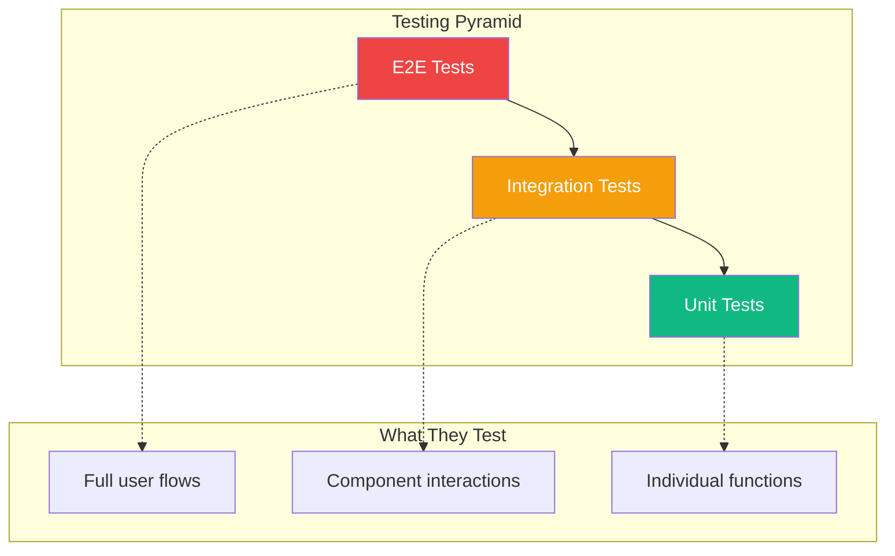

End-to-end (E2E) tests verify your application works correctly from a user's perspective, testing the full stack including the browser, API, and database. Playwright is a modern E2E testing framework that makes writing reliable tests straightforward.

## Why E2E Testing?



E2E tests:
- Test real user workflows
- Catch integration issues
- Verify critical paths work
- Run in real browsers

## Setting Up Playwright

### Installation

```bash
npm init playwright@latest
```

This creates:
- `playwright.config.ts` - Configuration file
- `tests/` - Test directory
- `tests-examples/` - Example tests

### Basic Configuration

```typescript
// playwright.config.ts
import { defineConfig, devices } from '@playwright/test';

export default defineConfig({
  testDir: './e2e',
  fullyParallel: true,
  forbidOnly: !!process.env.CI,
  retries: process.env.CI ? 2 : 0,
  workers: process.env.CI ? 1 : undefined,
  reporter: 'html',

  use: {
    baseURL: 'http://localhost:3000',
    trace: 'on-first-retry',
    screenshot: 'only-on-failure',
  },

  projects: [
    {
      name: 'chromium',
      use: { ...devices['Desktop Chrome'] },
    },
    {
      name: 'firefox',
      use: { ...devices['Desktop Firefox'] },
    },
    {
      name: 'webkit',
      use: { ...devices['Desktop Safari'] },
    },
  ],

  // Run dev server before tests
  webServer: {
    command: 'npm run dev',
    url: 'http://localhost:3000',
    reuseExistingServer: !process.env.CI,
  },
});
```

## Writing Your First Test

```typescript
// e2e/home.spec.ts
import { test, expect } from '@playwright/test';

test('has title', async ({ page }) => {
  await page.goto('/');

  await expect(page).toHaveTitle(/My App/);
});

test('navigates to about page', async ({ page }) => {
  await page.goto('/');

  await page.click('text=About');

  await expect(page).toHaveURL('/about');
  await expect(page.locator('h1')).toContainText('About Us');
});
```

### Running Tests

```bash
# Run all tests
npx playwright test

# Run in headed mode (see the browser)
npx playwright test --headed

# Run specific file
npx playwright test home.spec.ts

# Run in debug mode
npx playwright test --debug

# Show HTML report
npx playwright show-report
```

## Locators and Selectors

Playwright provides various ways to locate elements:

### Recommended Locators

```typescript
// By role (accessibility-first)
page.getByRole('button', { name: 'Submit' });
page.getByRole('heading', { level: 1 });
page.getByRole('textbox', { name: 'Email' });

// By label
page.getByLabel('Email address');

// By placeholder
page.getByPlaceholder('Enter your email');

// By text
page.getByText('Welcome');
page.getByText(/welcome/i); // Case-insensitive

// By test ID
page.getByTestId('submit-button');
```

### CSS and XPath (Less Preferred)

```typescript
// CSS selector
page.locator('.submit-btn');
page.locator('#email-input');

// XPath
page.locator('xpath=//button[@type="submit"]');
```

### Chaining Locators

```typescript
// Find button within a specific section
const section = page.locator('section.user-profile');
const editButton = section.getByRole('button', { name: 'Edit' });

// Or chain directly
page.locator('section.user-profile').getByRole('button', { name: 'Edit' });
```

## Actions

### Click Actions

```typescript
// Basic click
await page.click('button');
await page.getByRole('button').click();

// Double click
await page.dblclick('button');

// Right click
await page.click('button', { button: 'right' });

// Click with modifiers
await page.click('button', { modifiers: ['Shift'] });
```

### Form Interactions

```typescript
// Type text
await page.fill('input[name="email"]', 'test@example.com');
await page.getByLabel('Email').fill('test@example.com');

// Clear and type
await page.getByLabel('Email').clear();
await page.getByLabel('Email').fill('new@example.com');

// Type with delay (simulates real typing)
await page.getByLabel('Email').pressSequentially('test@example.com', { delay: 100 });

// Select option
await page.selectOption('select[name="country"]', 'us');
await page.getByLabel('Country').selectOption({ label: 'United States' });

// Check/uncheck
await page.check('input[type="checkbox"]');
await page.uncheck('input[type="checkbox"]');
await page.getByLabel('Accept terms').check();
```

### Keyboard Actions

```typescript
// Press key
await page.keyboard.press('Enter');
await page.keyboard.press('Control+a');

// Type text
await page.keyboard.type('Hello');

// Key combinations
await page.keyboard.down('Shift');
await page.keyboard.press('ArrowDown');
await page.keyboard.up('Shift');
```

## Assertions

### Page Assertions

```typescript
// URL
await expect(page).toHaveURL('/dashboard');
await expect(page).toHaveURL(/.*dashboard/);

// Title
await expect(page).toHaveTitle('Dashboard | My App');
await expect(page).toHaveTitle(/Dashboard/);
```

### Element Assertions

```typescript
const button = page.getByRole('button', { name: 'Submit' });

// Visibility
await expect(button).toBeVisible();
await expect(button).toBeHidden();

// Enabled/Disabled
await expect(button).toBeEnabled();
await expect(button).toBeDisabled();

// Text content
await expect(button).toHaveText('Submit');
await expect(button).toContainText('Sub');

// Attributes
await expect(button).toHaveAttribute('type', 'submit');

// CSS
await expect(button).toHaveClass(/primary/);
await expect(button).toHaveCSS('background-color', 'rgb(0, 128, 0)');

// Count
await expect(page.getByRole('listitem')).toHaveCount(5);

// Input values
await expect(page.getByLabel('Email')).toHaveValue('test@example.com');
```

### Soft Assertions

Continue test execution even if assertion fails:

```typescript
await expect.soft(page.getByText('Error')).not.toBeVisible();
await expect.soft(page.getByRole('button')).toBeEnabled();

// Test continues even if above assertions fail
await page.click('button');
```

## Testing User Flows

### Login Flow

```typescript
// e2e/auth.spec.ts
import { test, expect } from '@playwright/test';

test.describe('Authentication', () => {
  test('user can log in', async ({ page }) => {
    await page.goto('/login');

    await page.getByLabel('Email').fill('user@example.com');
    await page.getByLabel('Password').fill('password123');
    await page.getByRole('button', { name: 'Log in' }).click();

    // Should redirect to dashboard
    await expect(page).toHaveURL('/dashboard');
    await expect(page.getByText('Welcome back')).toBeVisible();
  });

  test('shows error for invalid credentials', async ({ page }) => {
    await page.goto('/login');

    await page.getByLabel('Email').fill('user@example.com');
    await page.getByLabel('Password').fill('wrong-password');
    await page.getByRole('button', { name: 'Log in' }).click();

    await expect(page.getByRole('alert')).toContainText('Invalid credentials');
    await expect(page).toHaveURL('/login');
  });
});
```

### Shopping Cart Flow

```typescript
test('complete purchase flow', async ({ page }) => {
  // Browse products
  await page.goto('/products');
  await page.getByRole('link', { name: /laptop/i }).click();

  // Add to cart
  await page.getByRole('button', { name: 'Add to Cart' }).click();
  await expect(page.getByText('Added to cart')).toBeVisible();

  // Go to cart
  await page.getByRole('link', { name: 'Cart (1)' }).click();
  await expect(page).toHaveURL('/cart');

  // Proceed to checkout
  await page.getByRole('button', { name: 'Checkout' }).click();

  // Fill shipping info
  await page.getByLabel('Address').fill('123 Main St');
  await page.getByLabel('City').fill('New York');
  await page.getByRole('button', { name: 'Continue' }).click();

  // Complete payment
  await page.getByLabel('Card number').fill('4242424242424242');
  await page.getByRole('button', { name: 'Pay' }).click();

  // Verify success
  await expect(page.getByRole('heading')).toContainText('Order Confirmed');
});
```

## Page Object Model

Organize tests with Page Object pattern:

```typescript
// e2e/pages/LoginPage.ts
import { Page, Locator } from '@playwright/test';

export class LoginPage {
  readonly page: Page;
  readonly emailInput: Locator;
  readonly passwordInput: Locator;
  readonly submitButton: Locator;
  readonly errorMessage: Locator;

  constructor(page: Page) {
    this.page = page;
    this.emailInput = page.getByLabel('Email');
    this.passwordInput = page.getByLabel('Password');
    this.submitButton = page.getByRole('button', { name: 'Log in' });
    this.errorMessage = page.getByRole('alert');
  }

  async goto() {
    await this.page.goto('/login');
  }

  async login(email: string, password: string) {
    await this.emailInput.fill(email);
    await this.passwordInput.fill(password);
    await this.submitButton.click();
  }
}
```

```typescript
// e2e/auth.spec.ts
import { test, expect } from '@playwright/test';
import { LoginPage } from './pages/LoginPage';

test('user can log in', async ({ page }) => {
  const loginPage = new LoginPage(page);

  await loginPage.goto();
  await loginPage.login('user@example.com', 'password123');

  await expect(page).toHaveURL('/dashboard');
});
```

## Handling Authentication

### Store Authentication State

```typescript
// e2e/auth.setup.ts
import { test as setup, expect } from '@playwright/test';

const authFile = 'playwright/.auth/user.json';

setup('authenticate', async ({ page }) => {
  await page.goto('/login');
  await page.getByLabel('Email').fill('user@example.com');
  await page.getByLabel('Password').fill('password123');
  await page.getByRole('button', { name: 'Log in' }).click();

  await expect(page).toHaveURL('/dashboard');

  // Save authentication state
  await page.context().storageState({ path: authFile });
});
```

```typescript
// playwright.config.ts
export default defineConfig({
  projects: [
    // Setup project
    { name: 'setup', testMatch: /.*\.setup\.ts/ },

    // Tests that need auth
    {
      name: 'chromium',
      use: {
        ...devices['Desktop Chrome'],
        storageState: 'playwright/.auth/user.json',
      },
      dependencies: ['setup'],
    },
  ],
});
```

## API Testing

```typescript
import { test, expect } from '@playwright/test';

test('API returns users', async ({ request }) => {
  const response = await request.get('/api/users');

  expect(response.ok()).toBeTruthy();

  const users = await response.json();
  expect(users).toHaveLength(10);
  expect(users[0]).toHaveProperty('email');
});

test('creates new user', async ({ request }) => {
  const response = await request.post('/api/users', {
    data: {
      name: 'Alice',
      email: 'alice@example.com',
    },
  });

  expect(response.status()).toBe(201);

  const user = await response.json();
  expect(user.name).toBe('Alice');
});
```

## Visual Testing

```typescript
test('homepage visual', async ({ page }) => {
  await page.goto('/');

  // Full page screenshot
  await expect(page).toHaveScreenshot('homepage.png');

  // Element screenshot
  await expect(page.getByRole('navigation')).toHaveScreenshot('nav.png');
});
```

Update screenshots:

```bash
npx playwright test --update-snapshots
```

## Best Practices

### 1. Use Reliable Selectors

```typescript
// Fragile - depends on structure
page.locator('div > div > button');

// Robust - uses accessibility
page.getByRole('button', { name: 'Submit' });
```

### 2. Wait for Elements Properly

```typescript
// Auto-waiting built in
await page.getByRole('button').click(); // Waits automatically

// Explicit wait when needed
await page.waitForSelector('.dynamic-content');
await page.waitForLoadState('networkidle');
```

### 3. Isolate Tests

```typescript
test.beforeEach(async ({ page }) => {
  // Reset state before each test
  await page.goto('/');
});
```

### 4. Use Test Hooks

```typescript
test.beforeAll(async () => {
  // Run once before all tests
});

test.afterEach(async ({ page }) => {
  // Clean up after each test
});
```

## Summary

| Concept | Description |
|---------|-------------|
| `page.goto()` | Navigate to URL |
| `page.getByRole()` | Find by accessibility role |
| `page.click()` | Click element |
| `page.fill()` | Enter text in input |
| `expect(page)` | Page assertions |
| `expect(locator)` | Element assertions |

Key takeaways:

- Use accessibility-based selectors (`getByRole`, `getByLabel`)
- Playwright has built-in auto-waiting for elements
- Use Page Object Model for maintainable tests
- Store authentication state to speed up tests
- Run tests in multiple browsers with projects
- Use visual testing for UI regression detection

E2E tests give confidence that your application works from the user's perspective. Playwright makes writing reliable, fast E2E tests straightforward with its modern API and powerful features.

## References

- [Playwright Documentation](https://playwright.dev/docs/intro)
- [Playwright Best Practices](https://playwright.dev/docs/best-practices)
- Ruscio, Daniel. *Testing JavaScript Applications*. Manning Publications, 2021.
