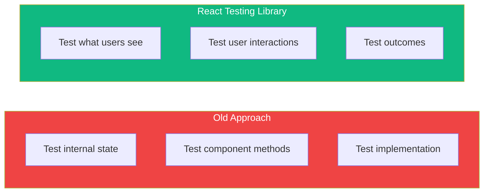

React Testing Library has become the standard for testing React components. Unlike older approaches that tested implementation details, it encourages testing your components the way users actually interact with them.

## The Core Philosophy

React Testing Library is built on one guiding principle:

> "The more your tests resemble the way your software is used, the more confidence they can give you."

This means:
- Test what users see and do, not internal state or methods
- Query elements the way users find them (by text, role, label)
- Avoid testing implementation details



## Setting Up

For a Vite project with Vitest:

```bash
npm install -D @testing-library/react @testing-library/jest-dom @testing-library/user-event jsdom
```

Configure Vitest in `vite.config.ts`:

```typescript
import { defineConfig } from 'vite';
import react from '@vitejs/plugin-react';

export default defineConfig({
  plugins: [react()],
  test: {
    environment: 'jsdom',
    globals: true,
    setupFiles: './src/test/setup.ts',
  },
});
```

Create `src/test/setup.ts`:

```typescript
import '@testing-library/jest-dom';
```

## Basic Test Structure

A typical test has three parts: **Arrange**, **Act**, **Assert**.

```tsx
import { render, screen } from '@testing-library/react';
import { Greeting } from './Greeting';

test('renders greeting message', () => {
  // Arrange: Render the component
  render(<Greeting name="World" />);

  // Act: (none needed for this test)

  // Assert: Check the output
  expect(screen.getByText('Hello, World!')).toBeInTheDocument();
});
```

## Rendering Components

The `render` function renders your component into a virtual DOM:

```tsx
import { render, screen } from '@testing-library/react';

// Basic render
render(<Button>Click me</Button>);

// With props
render(<UserCard user={{ name: 'John', email: 'john@example.com' }} />);

// With context providers
render(
  <ThemeProvider theme="dark">
    <Button>Click me</Button>
  </ThemeProvider>
);
```

### Creating a Custom Render

For components that need providers, create a custom render:

```tsx
// test/utils.tsx
import { render, RenderOptions } from '@testing-library/react';
import { ThemeProvider } from '../contexts/ThemeContext';
import { AuthProvider } from '../contexts/AuthContext';

function AllProviders({ children }: { children: React.ReactNode }) {
  return (
    <AuthProvider>
      <ThemeProvider>
        {children}
      </ThemeProvider>
    </AuthProvider>
  );
}

const customRender = (ui: React.ReactElement, options?: RenderOptions) =>
  render(ui, { wrapper: AllProviders, ...options });

export * from '@testing-library/react';
export { customRender as render };
```

## Querying Elements

React Testing Library provides several query types, prioritized by accessibility:

### Priority Order (Best to Worst)

1. **Accessible to everyone**: `getByRole`, `getByLabelText`, `getByPlaceholderText`, `getByText`
2. **Semantic queries**: `getByAltText`, `getByTitle`
3. **Test IDs** (last resort): `getByTestId`

### Query Types

| Query | Returns | Throws? | Async? | Use Case |
|-------|---------|---------|--------|----------|
| `getBy` | Element | Yes | No | Element exists |
| `queryBy` | Element or null | No | No | Element might not exist |
| `findBy` | Promise | Yes | Yes | Element appears async |

```tsx
// getBy - throws if not found
const button = screen.getByRole('button', { name: 'Submit' });

// queryBy - returns null if not found
const error = screen.queryByText('Error message');
expect(error).not.toBeInTheDocument();

// findBy - waits for element to appear
const data = await screen.findByText('Loaded data');
```

### Common Queries

```tsx
// By Role (preferred)
screen.getByRole('button', { name: 'Submit' });
screen.getByRole('heading', { level: 1 });
screen.getByRole('textbox', { name: 'Email' });
screen.getByRole('checkbox', { name: 'Remember me' });

// By Label Text (for form elements)
screen.getByLabelText('Email address');

// By Placeholder
screen.getByPlaceholderText('Enter your email');

// By Text
screen.getByText('Welcome back!');
screen.getByText(/welcome/i); // Case-insensitive regex

// By Alt Text (for images)
screen.getByAltText('User avatar');

// By Test ID (last resort)
screen.getByTestId('custom-element');
```

### Using `within` for Scoped Queries

```tsx
import { render, screen, within } from '@testing-library/react';

render(<UserList users={users} />);

// Query within a specific container
const userCard = screen.getByRole('article', { name: 'John Doe' });
const deleteButton = within(userCard).getByRole('button', { name: 'Delete' });
```

## Assertions with jest-dom

The `@testing-library/jest-dom` package provides custom matchers:

```tsx
// Presence
expect(element).toBeInTheDocument();
expect(element).not.toBeInTheDocument();

// Visibility
expect(element).toBeVisible();
expect(element).not.toBeVisible();

// Content
expect(element).toHaveTextContent('Hello');
expect(element).toHaveTextContent(/hello/i);

// Attributes
expect(input).toHaveValue('test@example.com');
expect(input).toHaveAttribute('type', 'email');
expect(button).toBeDisabled();
expect(button).toBeEnabled();

// CSS
expect(element).toHaveClass('active');
expect(element).toHaveStyle({ color: 'red' });

// Form state
expect(checkbox).toBeChecked();
expect(input).toBeRequired();
expect(input).toBeValid();
expect(input).toBeInvalid();

// Focus
expect(input).toHaveFocus();
```

## Debugging Tests

### Using `screen.debug()`

```tsx
render(<MyComponent />);

// Print the entire DOM
screen.debug();

// Print a specific element
screen.debug(screen.getByRole('button'));

// Increase output length
screen.debug(undefined, 30000);
```

### Using `logRoles`

```tsx
import { logRoles } from '@testing-library/react';

const { container } = render(<MyComponent />);
logRoles(container);
```

This prints all ARIA roles, helping you find the right queries.

## Testing Patterns

### Testing Conditional Rendering

```tsx
test('shows error message when validation fails', () => {
  render(<LoginForm />);

  // Initially no error
  expect(screen.queryByRole('alert')).not.toBeInTheDocument();

  // Trigger validation error
  fireEvent.click(screen.getByRole('button', { name: 'Submit' }));

  // Error should appear
  expect(screen.getByRole('alert')).toHaveTextContent('Email is required');
});
```

### Testing Lists

```tsx
test('renders list of users', () => {
  const users = [
    { id: 1, name: 'Alice' },
    { id: 2, name: 'Bob' },
  ];

  render(<UserList users={users} />);

  const items = screen.getAllByRole('listitem');
  expect(items).toHaveLength(2);
  expect(items[0]).toHaveTextContent('Alice');
  expect(items[1]).toHaveTextContent('Bob');
});
```

### Testing Accessibility

```tsx
test('form inputs have accessible labels', () => {
  render(<ContactForm />);

  // These queries will fail if labels are missing
  expect(screen.getByLabelText('Name')).toBeInTheDocument();
  expect(screen.getByLabelText('Email')).toBeInTheDocument();
  expect(screen.getByLabelText('Message')).toBeInTheDocument();
});
```

## Common Mistakes to Avoid

### 1. Testing Implementation Details

```tsx
// ❌ Bad: Testing internal state
expect(component.state.isOpen).toBe(true);

// ✅ Good: Testing what users see
expect(screen.getByRole('dialog')).toBeVisible();
```

### 2. Using Container Queries

```tsx
// ❌ Bad: Querying by class or structure
const { container } = render(<MyComponent />);
container.querySelector('.my-class');

// ✅ Good: Using accessible queries
screen.getByRole('button', { name: 'Submit' });
```

### 3. Not Waiting for Async Updates

```tsx
// ❌ Bad: Not waiting
render(<AsyncComponent />);
expect(screen.getByText('Data')).toBeInTheDocument(); // May fail!

// ✅ Good: Using findBy or waitFor
render(<AsyncComponent />);
expect(await screen.findByText('Data')).toBeInTheDocument();
```

## Summary

| Concept | Description |
|---------|-------------|
| `render()` | Renders component to virtual DOM |
| `screen` | Global queries for the rendered output |
| `getBy*` | Throws if element not found |
| `queryBy*` | Returns null if not found |
| `findBy*` | Async, waits for element |
| `*AllBy*` | Returns array of elements |

Key takeaways:

- Test user behavior, not implementation details
- Use accessible queries (`getByRole`, `getByLabelText`) first
- Use `getBy` when element should exist, `queryBy` when it might not
- Use `findBy` for elements that appear asynchronously
- Use `screen.debug()` to troubleshoot failing tests

React Testing Library encourages writing tests that give you confidence your app works for users. By focusing on what users see and do, your tests become more maintainable and meaningful.

## References

- [React Testing Library Documentation](https://testing-library.com/docs/react-testing-library/intro/)
- [Testing Library Queries](https://testing-library.com/docs/queries/about)
- Crump, Scottie. *Simplify Testing with React Testing Library*. Packt, 2021.
- Barklund, Morten. *React in Depth*. Manning Publications, 2024.
