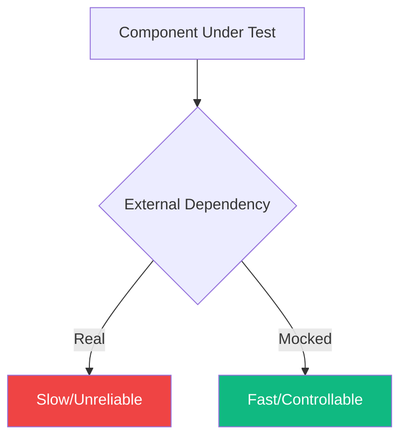
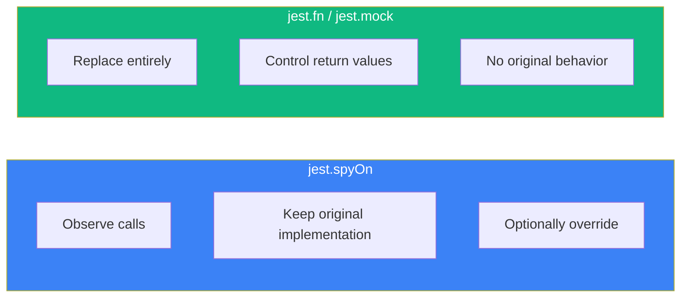

Mocking is essential for isolating components and testing them independently. This guide covers common mocking patterns in React testing with Jest and Vitest.

## Why Mock?

Mocking helps you:
- Isolate the code under test
- Control dependencies' behavior
- Avoid slow or unreliable operations (network, filesystem)
- Test edge cases and error scenarios



## Mocking Modules

### Basic Module Mock

```tsx
// api.ts
export async function fetchUsers() {
  const response = await fetch('/api/users');
  return response.json();
}

// UserList.tsx
import { fetchUsers } from './api';

function UserList() {
  const [users, setUsers] = useState([]);

  useEffect(() => {
    fetchUsers().then(setUsers);
  }, []);

  return (
    <ul>
      {users.map((user) => (
        <li key={user.id}>{user.name}</li>
      ))}
    </ul>
  );
}
```

```tsx
// UserList.test.tsx
import { render, screen } from '@testing-library/react';
import { UserList } from './UserList';
import { fetchUsers } from './api';

// Mock the entire module
jest.mock('./api');

// Type the mocked function
const mockFetchUsers = fetchUsers as jest.MockedFunction<typeof fetchUsers>;

test('displays users', async () => {
  mockFetchUsers.mockResolvedValue([
    { id: 1, name: 'Alice' },
    { id: 2, name: 'Bob' },
  ]);

  render(<UserList />);

  expect(await screen.findByText('Alice')).toBeInTheDocument();
  expect(screen.getByText('Bob')).toBeInTheDocument();
});

test('handles empty list', async () => {
  mockFetchUsers.mockResolvedValue([]);

  render(<UserList />);

  // Assert empty state
  await waitFor(() => {
    expect(screen.queryByRole('listitem')).not.toBeInTheDocument();
  });
});
```

### Partial Module Mock

Mock only specific exports:

```tsx
// utils.ts
export function formatDate(date: Date) { /* ... */ }
export function formatCurrency(amount: number) { /* ... */ }
export function calculateTax(amount: number) { /* ... */ }
```

```tsx
// Mock only formatDate, keep others real
jest.mock('./utils', () => ({
  ...jest.requireActual('./utils'),
  formatDate: jest.fn(() => '2024-01-01'),
}));
```

### Mock with Factory

```tsx
jest.mock('./api', () => ({
  fetchUsers: jest.fn(),
  createUser: jest.fn(),
  deleteUser: jest.fn(),
}));
```

## Mocking Components

### Child Component Mock

```tsx
// Dashboard.tsx
import { HeavyChart } from './HeavyChart';
import { UserStats } from './UserStats';

function Dashboard({ userId }) {
  return (
    <div>
      <h1>Dashboard</h1>
      <UserStats userId={userId} />
      <HeavyChart data={chartData} />
    </div>
  );
}
```

```tsx
// Dashboard.test.tsx
// Mock child components
jest.mock('./HeavyChart', () => ({
  HeavyChart: () => <div data-testid="mock-chart">Chart</div>,
}));

jest.mock('./UserStats', () => ({
  UserStats: ({ userId }) => <div data-testid="mock-stats">Stats for {userId}</div>,
}));

test('renders dashboard with mocked children', () => {
  render(<Dashboard userId={123} />);

  expect(screen.getByText('Dashboard')).toBeInTheDocument();
  expect(screen.getByTestId('mock-chart')).toBeInTheDocument();
  expect(screen.getByTestId('mock-stats')).toHaveTextContent('Stats for 123');
});
```

### Mock with Props Capture

```tsx
jest.mock('./UserStats', () => ({
  UserStats: jest.fn(() => null),
}));

import { UserStats } from './UserStats';

test('passes correct props to UserStats', () => {
  render(<Dashboard userId={123} />);

  expect(UserStats).toHaveBeenCalledWith(
    expect.objectContaining({ userId: 123 }),
    expect.anything()
  );
});
```

## Spying on Functions

### Spy vs Mock



### Using Spies

```tsx
// Spy on object method
const consoleSpy = jest.spyOn(console, 'error').mockImplementation();

test('logs error on failure', async () => {
  render(<ComponentThatMightError />);

  await waitFor(() => {
    expect(consoleSpy).toHaveBeenCalledWith('Something went wrong');
  });

  consoleSpy.mockRestore();
});
```

### Spy on Module Functions

```tsx
import * as api from './api';

test('calls fetchUsers on mount', () => {
  const spy = jest.spyOn(api, 'fetchUsers').mockResolvedValue([]);

  render(<UserList />);

  expect(spy).toHaveBeenCalledTimes(1);

  spy.mockRestore();
});
```

## Mock Functions (jest.fn)

### Basic Usage

```tsx
test('calls onClick handler', async () => {
  const handleClick = jest.fn();
  const user = userEvent.setup();

  render(<Button onClick={handleClick}>Click me</Button>);

  await user.click(screen.getByRole('button'));

  expect(handleClick).toHaveBeenCalledTimes(1);
});
```

### Mock Return Values

```tsx
const mockFn = jest.fn();

// Return value
mockFn.mockReturnValue('hello');

// Return value once
mockFn.mockReturnValueOnce('first').mockReturnValueOnce('second');

// Async return
mockFn.mockResolvedValue({ data: 'value' });
mockFn.mockRejectedValue(new Error('Failed'));
```

### Assertions

```tsx
// Was called
expect(mockFn).toHaveBeenCalled();
expect(mockFn).toHaveBeenCalledTimes(3);

// Called with specific arguments
expect(mockFn).toHaveBeenCalledWith('arg1', 'arg2');
expect(mockFn).toHaveBeenLastCalledWith('final');
expect(mockFn).toHaveBeenNthCalledWith(2, 'second call');

// Not called
expect(mockFn).not.toHaveBeenCalled();

// Check all calls
expect(mockFn.mock.calls).toEqual([
  ['first call'],
  ['second call'],
  ['third call'],
]);
```

## Mocking Browser APIs

### localStorage

```tsx
const localStorageMock = {
  getItem: jest.fn(),
  setItem: jest.fn(),
  removeItem: jest.fn(),
  clear: jest.fn(),
};

Object.defineProperty(window, 'localStorage', {
  value: localStorageMock,
});

test('saves to localStorage', () => {
  render(<SettingsForm />);

  // ... interact with form

  expect(localStorageMock.setItem).toHaveBeenCalledWith(
    'settings',
    expect.any(String)
  );
});
```

### window.matchMedia

```tsx
beforeAll(() => {
  Object.defineProperty(window, 'matchMedia', {
    writable: true,
    value: jest.fn().mockImplementation((query) => ({
      matches: false,
      media: query,
      onchange: null,
      addListener: jest.fn(),
      removeListener: jest.fn(),
      addEventListener: jest.fn(),
      removeEventListener: jest.fn(),
      dispatchEvent: jest.fn(),
    })),
  });
});

test('detects dark mode preference', () => {
  window.matchMedia = jest.fn().mockImplementation((query) => ({
    matches: query === '(prefers-color-scheme: dark)',
    media: query,
    // ... rest of mock
  }));

  render(<ThemeProvider><App /></ThemeProvider>);

  expect(screen.getByTestId('theme')).toHaveTextContent('dark');
});
```

### IntersectionObserver

```tsx
const mockIntersectionObserver = jest.fn();
mockIntersectionObserver.mockReturnValue({
  observe: jest.fn(),
  unobserve: jest.fn(),
  disconnect: jest.fn(),
});

window.IntersectionObserver = mockIntersectionObserver;

test('lazy loads images', () => {
  render(<LazyImage src="photo.jpg" />);

  expect(mockIntersectionObserver).toHaveBeenCalled();
});
```

## Mocking External Libraries

### React Router

```tsx
import { useNavigate, useParams } from 'react-router-dom';

jest.mock('react-router-dom', () => ({
  ...jest.requireActual('react-router-dom'),
  useNavigate: jest.fn(),
  useParams: jest.fn(),
}));

test('navigates on submit', async () => {
  const navigate = jest.fn();
  (useNavigate as jest.Mock).mockReturnValue(navigate);
  (useParams as jest.Mock).mockReturnValue({ id: '123' });

  const user = userEvent.setup();
  render(<EditForm />);

  await user.click(screen.getByRole('button', { name: 'Save' }));

  expect(navigate).toHaveBeenCalledWith('/success');
});
```

### Date/Time Libraries

```tsx
// Mock current date
beforeEach(() => {
  jest.useFakeTimers();
  jest.setSystemTime(new Date('2024-01-15'));
});

afterEach(() => {
  jest.useRealTimers();
});

test('shows current date', () => {
  render(<DateDisplay />);

  expect(screen.getByText('January 15, 2024')).toBeInTheDocument();
});
```

## Clearing and Resetting Mocks

### In Individual Tests

```tsx
const mockFn = jest.fn();

afterEach(() => {
  mockFn.mockClear(); // Clear call history
  // or
  mockFn.mockReset(); // Clear + remove return values
  // or
  mockFn.mockRestore(); // Restore original (for spies)
});
```

### Global Configuration

```tsx
// jest.config.js or vitest.config.ts
{
  clearMocks: true, // Clear mock calls between tests
  resetMocks: true, // Reset mock state between tests
  restoreMocks: true, // Restore original implementations
}
```

## Mock Patterns

### Factory Pattern for Complex Mocks

```tsx
// test-utils/mockUser.ts
export function createMockUser(overrides = {}) {
  return {
    id: 1,
    name: 'Test User',
    email: 'test@example.com',
    role: 'user',
    ...overrides,
  };
}

// Usage
test('shows admin badge for admin users', () => {
  const adminUser = createMockUser({ role: 'admin' });

  render(<UserProfile user={adminUser} />);

  expect(screen.getByText('Admin')).toBeInTheDocument();
});
```

### Context Mock Helper

```tsx
// test-utils/renderWithProviders.tsx
export function renderWithAuth(ui, { user = null } = {}) {
  return render(
    <AuthContext.Provider value={{ user, isAuthenticated: !!user }}>
      {ui}
    </AuthContext.Provider>
  );
}

// Usage
test('shows login button when not authenticated', () => {
  renderWithAuth(<Header />);

  expect(screen.getByRole('button', { name: 'Login' })).toBeInTheDocument();
});

test('shows user name when authenticated', () => {
  renderWithAuth(<Header />, { user: { name: 'Alice' } });

  expect(screen.getByText('Alice')).toBeInTheDocument();
});
```

## Best Practices

### 1. Don't Over-Mock

```tsx
// Bad: Mocking everything
jest.mock('./utils');
jest.mock('./helpers');
jest.mock('./formatters');

// Good: Mock only external dependencies
jest.mock('./api'); // External API calls only
```

### 2. Mock at the Right Level

```tsx
// Bad: Mocking implementation details
jest.mock('./useUserState'); // Internal hook

// Good: Mock external boundaries
jest.mock('./api'); // Network boundary
```

### 3. Keep Mocks Close to Real Behavior

```tsx
// Bad: Unrealistic mock
mockFetch.mockResolvedValue({ anything: 'goes' });

// Good: Match API shape
mockFetch.mockResolvedValue({
  users: [{ id: 1, name: 'Alice', email: 'alice@example.com' }],
  total: 1,
  page: 1,
});
```

### 4. Reset Mocks Between Tests

```tsx
afterEach(() => {
  jest.clearAllMocks();
});
```

## Summary

| Technique | Use Case |
|-----------|----------|
| `jest.mock()` | Mock entire modules |
| `jest.spyOn()` | Observe calls, optionally mock |
| `jest.fn()` | Create mock functions |
| `mockReturnValue` | Set return values |
| `mockResolvedValue` | Set async return values |
| `mockImplementation` | Custom mock behavior |

Key takeaways:

- Mock external dependencies, not internal implementation
- Use spies when you want to observe without changing behavior
- Create mock factories for complex data structures
- Clear mocks between tests to avoid pollution
- Keep mocks realistic to catch integration issues
- Prefer MSW for API mocking over manual fetch mocks

Effective mocking makes tests faster, more reliable, and easier to write. Focus on mocking at the boundaries of your application.

## References

- [Jest Mock Functions](https://jestjs.io/docs/mock-functions)
- [Vitest Mocking](https://vitest.dev/guide/mocking.html)
- Crump, Scottie. *Simplify Testing with React Testing Library*. Packt, 2021.
- Ruscio, Daniel. *Testing JavaScript Applications*. Manning Publications, 2021.
