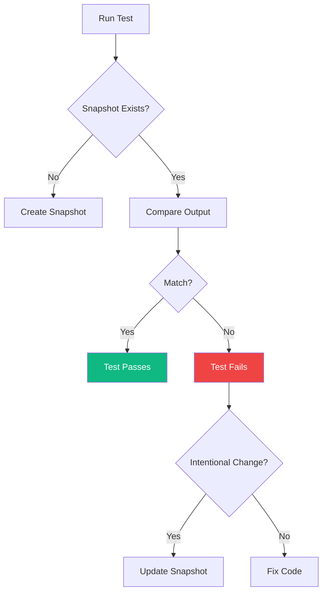
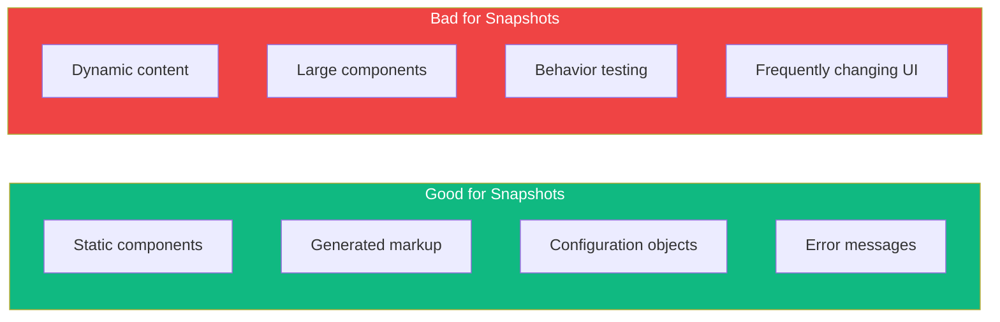

Snapshot testing captures a component's rendered output and compares it against a stored reference. While powerful for detecting unexpected changes, it's often misused. Let's explore how to use snapshots effectively.

## What is Snapshot Testing?

A snapshot test renders a component and saves its output to a file. Future test runs compare against this stored snapshot:



## Basic Snapshot Test

```tsx
import { render } from '@testing-library/react';
import { UserCard } from './UserCard';

test('renders user card', () => {
  const { container } = render(
    <UserCard
      user={{
        name: 'Alice',
        email: 'alice@example.com',
        avatar: 'avatar.jpg',
      }}
    />
  );

  expect(container).toMatchSnapshot();
});
```

This creates a snapshot file (`__snapshots__/UserCard.test.tsx.snap`):

```
exports[`renders user card 1`] = `
<div>
  <div
    class="user-card"
  >
    
    <div
      class="user-info"
    >
      <h3>
        Alice
      </h3>
      <p>
        alice@example.com
      </p>
    </div>
  </div>
</div>
`;
```

## Inline Snapshots

Instead of separate files, store snapshots inline in test files:

```tsx
test('renders greeting', () => {
  const { container } = render(<Greeting name="World" />);

  expect(container).toMatchInlineSnapshot(`
    <div>
      <h1>
        Hello, World!
      </h1>
    </div>
  `);
});
```

Benefits of inline snapshots:
- Easier to review in code review
- No need to find separate snapshot files
- Changes are visible in the same file

## When to Use Snapshots

### Good Use Cases



### 1. Small, Static Components

```tsx
// Good: Simple, presentational component
test('renders badge', () => {
  const { container } = render(<Badge type="success">Approved</Badge>);
  expect(container).toMatchInlineSnapshot(`
    <div>
      <span class="badge badge-success">
        Approved
      </span>
    </div>
  `);
});
```

### 2. Configuration/Data Objects

```tsx
test('generates correct config', () => {
  const config = generateChartConfig({
    type: 'bar',
    data: [1, 2, 3],
    title: 'Sales',
  });

  expect(config).toMatchInlineSnapshot(`
    {
      "options": {
        "responsive": true,
        "title": {
          "display": true,
          "text": "Sales",
        },
      },
      "type": "bar",
    }
  `);
});
```

### 3. Error Messages

```tsx
test('shows validation error', () => {
  const result = validateForm({ email: 'invalid' });

  expect(result.errors).toMatchInlineSnapshot(`
    [
      {
        "field": "email",
        "message": "Please enter a valid email address",
      },
    ]
  `);
});
```

## When NOT to Use Snapshots

### 1. Large Components

```tsx
// Bad: Snapshot is too large to meaningfully review
test('renders entire page', () => {
  const { container } = render(<DashboardPage />);
  expect(container).toMatchSnapshot(); // 500+ lines!
});

// Better: Test specific behaviors
test('shows user name in header', () => {
  render(<DashboardPage user={{ name: 'Alice' }} />);
  expect(screen.getByText('Alice')).toBeInTheDocument();
});
```

### 2. Dynamic Content

```tsx
// Bad: Snapshot will fail every time
test('renders timestamp', () => {
  const { container } = render(<Comment createdAt={new Date()} />);
  expect(container).toMatchSnapshot(); // Contains current date!
});

// Better: Mock the date or test the format
test('shows formatted date', () => {
  render(<Comment createdAt={new Date('2024-01-15')} />);
  expect(screen.getByText('January 15, 2024')).toBeInTheDocument();
});
```

### 3. Testing Behavior

```tsx
// Bad: Snapshots can't test interactions
test('button click', () => {
  const { container } = render(<Counter />);
  fireEvent.click(screen.getByRole('button'));
  expect(container).toMatchSnapshot(); // Just shows UI state

// Better: Test the behavior
test('increments count on click', async () => {
  const user = userEvent.setup();
  render(<Counter />);

  await user.click(screen.getByRole('button'));

  expect(screen.getByText('Count: 1')).toBeInTheDocument();
});
```

## Snapshot Anti-Patterns

### 1. Snapshot Everything

```tsx
// Anti-pattern: Snapshotting every test
describe('UserList', () => {
  test('renders empty', () => {
    const { container } = render(<UserList users={[]} />);
    expect(container).toMatchSnapshot();
  });

  test('renders with users', () => {
    const { container } = render(<UserList users={users} />);
    expect(container).toMatchSnapshot();
  });

  test('renders loading', () => {
    const { container } = render(<UserList loading />);
    expect(container).toMatchSnapshot();
  });
});

// Better: Explicit assertions
describe('UserList', () => {
  test('shows empty message when no users', () => {
    render(<UserList users={[]} />);
    expect(screen.getByText('No users found')).toBeInTheDocument();
  });

  test('displays all users', () => {
    render(<UserList users={[{ id: 1, name: 'Alice' }]} />);
    expect(screen.getByText('Alice')).toBeInTheDocument();
  });

  test('shows loading spinner', () => {
    render(<UserList loading />);
    expect(screen.getByRole('progressbar')).toBeInTheDocument();
  });
});
```

### 2. Blindly Updating Snapshots

```bash
# Dangerous! Updates all failing snapshots without review
npm test -- -u
```

Always review snapshot changes before updating:

```bash
# Interactive mode - review each change
npm test -- --watch
# Then press 'i' to interactively update
```

### 3. Testing Implementation Details

```tsx
// Anti-pattern: Snapshot includes CSS classes, internal structure
expect(container).toMatchInlineSnapshot(`
  <div class="sc-hKMtZM jPSxnS user-card__wrapper--active">
    <div class="sc-bdVaJa bULBFu">
      ...
    </div>
  </div>
`);

// Better: Test meaningful output
expect(screen.getByRole('article')).toHaveTextContent('Alice');
```

## Custom Serializers

Create custom serializers to clean up snapshot output:

```tsx
// Remove dynamic class names (styled-components, CSS modules)
expect.addSnapshotSerializer({
  test: (val) => typeof val === 'string' && val.match(/sc-[a-zA-Z]+/),
  print: (val) => val.replace(/sc-[a-zA-Z]+ [a-zA-Z]+/g, 'styled'),
});

// Simplify dates
expect.addSnapshotSerializer({
  test: (val) => val instanceof Date,
  print: (val) => `Date(${val.toISOString()})`,
});
```

## Focused Snapshot Testing

### Snapshot Specific Elements

```tsx
test('renders user name correctly', () => {
  render(<UserCard user={{ name: 'Alice', email: 'alice@example.com' }} />);

  // Snapshot only the name element
  expect(screen.getByRole('heading')).toMatchInlineSnapshot(`
    <h3>
      Alice
    </h3>
  `);
});
```

### Property Matchers

Handle dynamic values in object snapshots:

```tsx
test('creates user with timestamp', () => {
  const user = createUser({ name: 'Alice' });

  expect(user).toMatchSnapshot({
    id: expect.any(String),
    createdAt: expect.any(Date),
    name: 'Alice',
  });
});
```

## Snapshot Testing Strategy

### Component Snapshot Matrix

| Component Type | Snapshot? | Better Alternative |
|----------------|-----------|-------------------|
| Icon/Badge | Yes | - |
| Button | Maybe | Test click behavior |
| Form | No | Test validation, submission |
| List | No | Test items, empty state |
| Modal | No | Test open/close, content |
| Page | No | Test key elements |

### Combining Approaches

```tsx
describe('NotificationBadge', () => {
  // Snapshot for visual structure
  test('renders correctly', () => {
    const { container } = render(<NotificationBadge count={5} />);
    expect(container).toMatchInlineSnapshot(`
      <div>
        <span class="badge">
          5
        </span>
      </div>
    `);
  });

  // Explicit tests for behavior
  test('hides when count is zero', () => {
    render(<NotificationBadge count={0} />);
    expect(screen.queryByRole('status')).not.toBeInTheDocument();
  });

  test('shows 99+ for large counts', () => {
    render(<NotificationBadge count={150} />);
    expect(screen.getByText('99+')).toBeInTheDocument();
  });
});
```

## Updating Snapshots

### In Watch Mode

```
Press `u` to update all failing snapshots
Press `i` to update interactively
```

### Command Line

```bash
# Update all snapshots
npm test -- -u

# Update specific test file
npm test UserCard.test.tsx -- -u
```

### CI/CD Consideration

```yaml
# Fail CI if snapshots are outdated
test:
  script:
    - npm test -- --ci
```

The `--ci` flag prevents accidental snapshot updates in CI.

## Summary

| Aspect | Recommendation |
|--------|---------------|
| Size | Keep snapshots small (<50 lines) |
| Scope | Snapshot presentational components |
| Updates | Review every change, never blindly update |
| Alternative | Prefer explicit assertions for behavior |
| Inline | Use inline snapshots when possible |

Key takeaways:

- Snapshots are best for small, static components
- Avoid snapshotting entire pages or dynamic content
- Always review snapshot changes before updating
- Prefer explicit assertions for testing behavior
- Use inline snapshots for easier code review
- Don't use snapshots as a substitute for meaningful tests

Snapshot testing is a tool, not a strategy. Use it sparingly and intentionally to catch unexpected visual regressions, not as a replacement for thoughtful testing.

## References

- [Jest Snapshot Testing](https://jestjs.io/docs/snapshot-testing)
- [Effective Snapshot Testing](https://kentcdodds.com/blog/effective-snapshot-testing)
- Crump, Scottie. *Simplify Testing with React Testing Library*. Packt, 2021.
