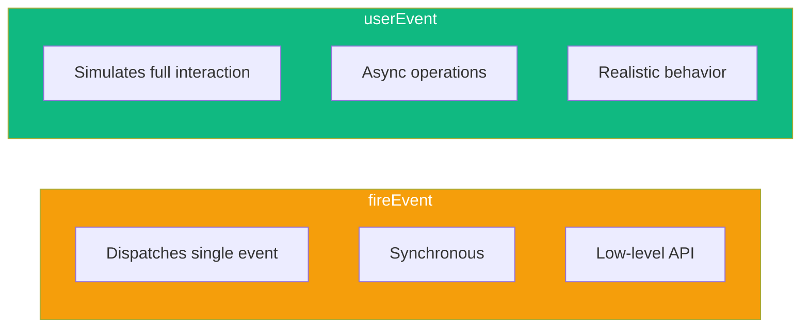

User interactions are at the heart of any React application. Testing these interactions properly ensures your components respond correctly to clicks, form inputs, and keyboard events.

## fireEvent vs userEvent

React Testing Library provides two ways to simulate user interactions:

### fireEvent

`fireEvent` is a low-level utility that dispatches DOM events directly:

```tsx
import { render, screen, fireEvent } from '@testing-library/react';

test('button click with fireEvent', () => {
  const handleClick = jest.fn();
  render(<button onClick={handleClick}>Click me</button>);

  fireEvent.click(screen.getByRole('button'));

  expect(handleClick).toHaveBeenCalledTimes(1);
});
```

### userEvent

`userEvent` simulates real user behavior more accurately:

```tsx
import { render, screen } from '@testing-library/react';
import userEvent from '@testing-library/user-event';

test('button click with userEvent', async () => {
  const user = userEvent.setup();
  const handleClick = jest.fn();
  render(<button onClick={handleClick}>Click me</button>);

  await user.click(screen.getByRole('button'));

  expect(handleClick).toHaveBeenCalledTimes(1);
});
```

### Key Differences



| Aspect | fireEvent | userEvent |
|--------|-----------|-----------|
| Click | Single click event | focus → mousedown → mouseup → click |
| Typing | Single change event | focus → keydown → keypress → input → keyup (per character) |
| API | Synchronous | Asynchronous (returns Promise) |
| Realism | Low | High |

**Recommendation**: Use `userEvent` for most tests. It catches more bugs because it simulates actual user behavior.

## Setting Up userEvent

Always create a user instance with `setup()`:

```tsx
import userEvent from '@testing-library/user-event';

test('example', async () => {
  // Create user instance before rendering
  const user = userEvent.setup();

  render(<MyComponent />);

  // Use the user instance for interactions
  await user.click(element);
});
```

### Setup Options

```tsx
const user = userEvent.setup({
  // Delay between key presses (ms)
  delay: 50,

  // Skip pointer events validation
  pointerEventsCheck: 0,

  // Custom document
  document: customDocument,
});
```

## Click Interactions

### Basic Click

```tsx
test('handles button click', async () => {
  const user = userEvent.setup();
  const handleClick = jest.fn();

  render(<Button onClick={handleClick}>Submit</Button>);

  await user.click(screen.getByRole('button', { name: 'Submit' }));

  expect(handleClick).toHaveBeenCalledTimes(1);
});
```

### Double Click

```tsx
test('handles double click', async () => {
  const user = userEvent.setup();
  const handleDoubleClick = jest.fn();

  render(<div onDoubleClick={handleDoubleClick}>Double click me</div>);

  await user.dblClick(screen.getByText('Double click me'));

  expect(handleDoubleClick).toHaveBeenCalledTimes(1);
});
```

### Right Click (Context Menu)

```tsx
test('opens context menu on right click', async () => {
  const user = userEvent.setup();
  const handleContextMenu = jest.fn();

  render(<div onContextMenu={handleContextMenu}>Right click me</div>);

  await user.pointer({
    keys: '[MouseRight]',
    target: screen.getByText('Right click me'),
  });

  expect(handleContextMenu).toHaveBeenCalled();
});
```

### Click with Modifiers

```tsx
test('handles ctrl+click', async () => {
  const user = userEvent.setup();
  const handleClick = jest.fn();

  render(<button onClick={handleClick}>Click</button>);

  await user.click(screen.getByRole('button'), {
    ctrlKey: true,
  });

  expect(handleClick).toHaveBeenCalledWith(
    expect.objectContaining({ ctrlKey: true })
  );
});
```

## Form Input Testing

### Text Input

```tsx
test('updates text input', async () => {
  const user = userEvent.setup();
  const handleChange = jest.fn();

  render(<input onChange={handleChange} placeholder="Enter name" />);

  const input = screen.getByPlaceholderText('Enter name');
  await user.type(input, 'John Doe');

  expect(input).toHaveValue('John Doe');
  // Called once per character
  expect(handleChange).toHaveBeenCalledTimes(8);
});
```

### Clearing and Typing

```tsx
test('clears and types new value', async () => {
  const user = userEvent.setup();

  render(<input defaultValue="old value" />);

  const input = screen.getByRole('textbox');
  await user.clear(input);
  await user.type(input, 'new value');

  expect(input).toHaveValue('new value');
});
```

### Special Characters

```tsx
test('types special characters', async () => {
  const user = userEvent.setup();

  render(<input />);

  const input = screen.getByRole('textbox');

  // {selectall} - select all text
  // {backspace} - delete selection
  // {enter} - press enter
  await user.type(input, 'Hello{selectall}{backspace}World{enter}');

  expect(input).toHaveValue('World');
});
```

### Checkbox and Radio

```tsx
test('toggles checkbox', async () => {
  const user = userEvent.setup();
  const handleChange = jest.fn();

  render(
    <label>
      <input type="checkbox" onChange={handleChange} />
      Accept terms
    </label>
  );

  const checkbox = screen.getByRole('checkbox');

  expect(checkbox).not.toBeChecked();

  await user.click(checkbox);
  expect(checkbox).toBeChecked();

  await user.click(checkbox);
  expect(checkbox).not.toBeChecked();
});

test('selects radio option', async () => {
  const user = userEvent.setup();

  render(
    <fieldset>
      <label><input type="radio" name="size" value="small" /> Small</label>
      <label><input type="radio" name="size" value="large" /> Large</label>
    </fieldset>
  );

  await user.click(screen.getByLabelText('Large'));

  expect(screen.getByLabelText('Large')).toBeChecked();
  expect(screen.getByLabelText('Small')).not.toBeChecked();
});
```

### Select Dropdown

```tsx
test('selects option from dropdown', async () => {
  const user = userEvent.setup();
  const handleChange = jest.fn();

  render(
    <select onChange={handleChange}>
      <option value="">Select color</option>
      <option value="red">Red</option>
      <option value="blue">Blue</option>
    </select>
  );

  await user.selectOptions(screen.getByRole('combobox'), 'blue');

  expect(screen.getByRole('combobox')).toHaveValue('blue');
  expect(handleChange).toHaveBeenCalled();
});

test('selects multiple options', async () => {
  const user = userEvent.setup();

  render(
    <select multiple>
      <option value="apple">Apple</option>
      <option value="banana">Banana</option>
      <option value="cherry">Cherry</option>
    </select>
  );

  await user.selectOptions(screen.getByRole('listbox'), ['apple', 'cherry']);

  expect(screen.getByRole('option', { name: 'Apple' })).toBeSelected();
  expect(screen.getByRole('option', { name: 'Banana' })).not.toBeSelected();
  expect(screen.getByRole('option', { name: 'Cherry' })).toBeSelected();
});
```

## Form Submission

### Testing Form Submit

```tsx
test('submits form with user data', async () => {
  const user = userEvent.setup();
  const handleSubmit = jest.fn((e) => e.preventDefault());

  render(
    <form onSubmit={handleSubmit}>
      <label htmlFor="email">Email</label>
      <input id="email" name="email" type="email" />

      <label htmlFor="password">Password</label>
      <input id="password" name="password" type="password" />

      <button type="submit">Login</button>
    </form>
  );

  await user.type(screen.getByLabelText('Email'), 'test@example.com');
  await user.type(screen.getByLabelText('Password'), 'secret123');
  await user.click(screen.getByRole('button', { name: 'Login' }));

  expect(handleSubmit).toHaveBeenCalledTimes(1);
});
```

### Testing Form Validation

```tsx
function LoginForm({ onSubmit }) {
  const [errors, setErrors] = useState({});

  const handleSubmit = (e) => {
    e.preventDefault();
    const form = e.target;
    const email = form.email.value;
    const password = form.password.value;

    const newErrors = {};
    if (!email) newErrors.email = 'Email is required';
    if (!password) newErrors.password = 'Password is required';

    if (Object.keys(newErrors).length > 0) {
      setErrors(newErrors);
      return;
    }

    onSubmit({ email, password });
  };

  return (
    <form onSubmit={handleSubmit}>
      <div>
        <label htmlFor="email">Email</label>
        <input id="email" name="email" />
        {errors.email && <span role="alert">{errors.email}</span>}
      </div>
      <div>
        <label htmlFor="password">Password</label>
        <input id="password" name="password" type="password" />
        {errors.password && <span role="alert">{errors.password}</span>}
      </div>
      <button type="submit">Login</button>
    </form>
  );
}

test('shows validation errors', async () => {
  const user = userEvent.setup();
  const handleSubmit = jest.fn();

  render(<LoginForm onSubmit={handleSubmit} />);

  // Submit without filling form
  await user.click(screen.getByRole('button', { name: 'Login' }));

  expect(screen.getByText('Email is required')).toBeInTheDocument();
  expect(screen.getByText('Password is required')).toBeInTheDocument();
  expect(handleSubmit).not.toHaveBeenCalled();
});

test('submits when validation passes', async () => {
  const user = userEvent.setup();
  const handleSubmit = jest.fn();

  render(<LoginForm onSubmit={handleSubmit} />);

  await user.type(screen.getByLabelText('Email'), 'test@example.com');
  await user.type(screen.getByLabelText('Password'), 'password123');
  await user.click(screen.getByRole('button', { name: 'Login' }));

  expect(screen.queryByRole('alert')).not.toBeInTheDocument();
  expect(handleSubmit).toHaveBeenCalledWith({
    email: 'test@example.com',
    password: 'password123',
  });
});
```

## Keyboard Events

### Basic Keyboard Input

```tsx
test('handles keyboard shortcut', async () => {
  const user = userEvent.setup();
  const handleKeyDown = jest.fn();

  render(<input onKeyDown={handleKeyDown} />);

  const input = screen.getByRole('textbox');
  await user.type(input, '{Control>}s{/Control}');

  expect(handleKeyDown).toHaveBeenCalledWith(
    expect.objectContaining({
      key: 's',
      ctrlKey: true,
    })
  );
});
```

### Tab Navigation

```tsx
test('navigates with tab key', async () => {
  const user = userEvent.setup();

  render(
    <form>
      <input placeholder="First" />
      <input placeholder="Second" />
      <button>Submit</button>
    </form>
  );

  // Tab through elements
  await user.tab();
  expect(screen.getByPlaceholderText('First')).toHaveFocus();

  await user.tab();
  expect(screen.getByPlaceholderText('Second')).toHaveFocus();

  await user.tab();
  expect(screen.getByRole('button')).toHaveFocus();

  // Shift+Tab to go back
  await user.tab({ shift: true });
  expect(screen.getByPlaceholderText('Second')).toHaveFocus();
});
```

### Enter Key Submission

```tsx
test('submits on enter key', async () => {
  const user = userEvent.setup();
  const handleSubmit = jest.fn((e) => e.preventDefault());

  render(
    <form onSubmit={handleSubmit}>
      <input placeholder="Search" />
      <button type="submit">Search</button>
    </form>
  );

  const input = screen.getByPlaceholderText('Search');
  await user.type(input, 'react testing{enter}');

  expect(handleSubmit).toHaveBeenCalled();
});
```

### Escape Key

```tsx
test('closes modal on escape', async () => {
  const user = userEvent.setup();
  const handleClose = jest.fn();

  render(
    <div role="dialog" onKeyDown={(e) => e.key === 'Escape' && handleClose()}>
      <p>Modal content</p>
    </div>
  );

  await user.keyboard('{Escape}');

  expect(handleClose).toHaveBeenCalled();
});
```

## Hover and Focus

### Hover Events

```tsx
test('shows tooltip on hover', async () => {
  const user = userEvent.setup();

  render(
    <Tooltip text="More info">
      <button>Hover me</button>
    </Tooltip>
  );

  // Tooltip not visible initially
  expect(screen.queryByText('More info')).not.toBeInTheDocument();

  // Hover over button
  await user.hover(screen.getByRole('button'));
  expect(screen.getByText('More info')).toBeInTheDocument();

  // Move away
  await user.unhover(screen.getByRole('button'));
  expect(screen.queryByText('More info')).not.toBeInTheDocument();
});
```

### Focus Events

```tsx
test('shows focus indicator', async () => {
  const user = userEvent.setup();
  const handleFocus = jest.fn();
  const handleBlur = jest.fn();

  render(
    <input
      onFocus={handleFocus}
      onBlur={handleBlur}
      placeholder="Focus me"
    />
  );

  const input = screen.getByPlaceholderText('Focus me');

  // Tab to focus
  await user.tab();
  expect(handleFocus).toHaveBeenCalled();
  expect(input).toHaveFocus();

  // Tab away
  await user.tab();
  expect(handleBlur).toHaveBeenCalled();
  expect(input).not.toHaveFocus();
});
```

## Common Patterns

### Testing Controlled Components

```tsx
function ControlledInput({ value, onChange }) {
  return (
    <input
      value={value}
      onChange={(e) => onChange(e.target.value)}
    />
  );
}

test('controlled input updates parent state', async () => {
  const user = userEvent.setup();
  let value = '';
  const setValue = jest.fn((v) => { value = v; });

  const { rerender } = render(
    <ControlledInput value={value} onChange={setValue} />
  );

  const input = screen.getByRole('textbox');
  await user.type(input, 'a');

  expect(setValue).toHaveBeenCalledWith('a');

  // Rerender with new value to simulate parent update
  rerender(<ControlledInput value="a" onChange={setValue} />);
  expect(input).toHaveValue('a');
});
```

### Testing Debounced Input

```tsx
test('debounced search input', async () => {
  jest.useFakeTimers();
  const user = userEvent.setup({ advanceTimers: jest.advanceTimersByTime });
  const handleSearch = jest.fn();

  render(<SearchInput onSearch={handleSearch} debounceMs={300} />);

  await user.type(screen.getByRole('searchbox'), 'react');

  // Not called yet (debouncing)
  expect(handleSearch).not.toHaveBeenCalled();

  // Advance timers
  jest.advanceTimersByTime(300);

  expect(handleSearch).toHaveBeenCalledWith('react');

  jest.useRealTimers();
});
```

## Summary

| Method | Use Case |
|--------|----------|
| `user.click()` | Button clicks, checkboxes, links |
| `user.dblClick()` | Double-click interactions |
| `user.type()` | Text input with realistic keystrokes |
| `user.clear()` | Clear input fields |
| `user.selectOptions()` | Select dropdown options |
| `user.tab()` | Keyboard navigation |
| `user.keyboard()` | Complex keyboard sequences |
| `user.hover()` / `user.unhover()` | Mouse hover events |

Key takeaways:

- Prefer `userEvent` over `fireEvent` for realistic interactions
- Always create a user instance with `userEvent.setup()` before rendering
- Use `await` with all `userEvent` methods (they're async)
- Test form validation by submitting with invalid/valid data
- Use `user.tab()` to test keyboard navigation and accessibility
- Special characters in `type()` are wrapped in curly braces: `{enter}`, `{backspace}`

Testing user interactions properly ensures your components behave as users expect. `userEvent` catches more bugs by simulating actual browser behavior.

## References

- [Testing Library User Event Documentation](https://testing-library.com/docs/user-event/intro)
- [Testing Library fireEvent Documentation](https://testing-library.com/docs/dom-testing-library/api-events)
- Crump, Scottie. *Simplify Testing with React Testing Library*. Packt, 2021.
- Barklund, Morten. *React in Depth*. Manning Publications, 2024.
