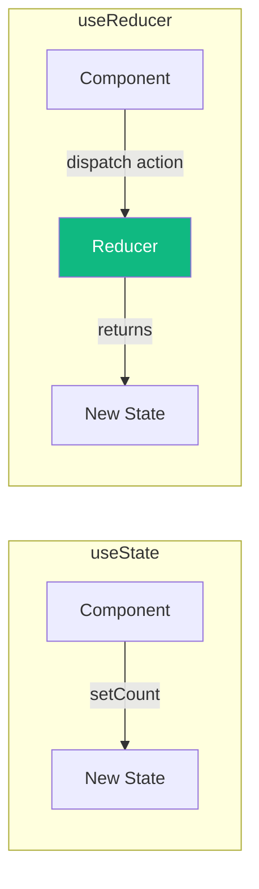
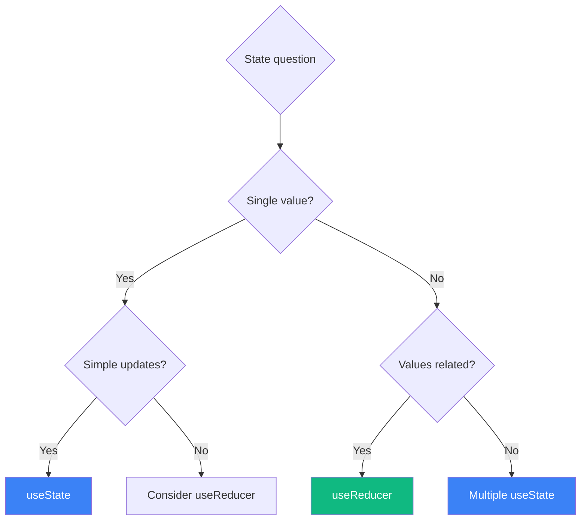

React provides two main hooks for managing state: `useState` and `useReducer`. While `useState` is more common, `useReducer` offers advantages for complex state logic. Let's explore when to use each.

## Quick Comparison

```jsx
// useState: Simple, direct state updates
const [count, setCount] = useState(0);
setCount(count + 1);

// useReducer: Action-based state updates
const [state, dispatch] = useReducer(reducer, { count: 0 });
dispatch({ type: 'INCREMENT' });
```



## When to Use useState

`useState` is perfect for:

### 1. Simple, Independent Values

```jsx
function Form() {
  const [name, setName] = useState('');
  const [email, setEmail] = useState('');
  const [age, setAge] = useState(0);

  return (
    <form>
      <input value={name} onChange={e => setName(e.target.value)} />
      <input value={email} onChange={e => setEmail(e.target.value)} />
      <input type="number" value={age} onChange={e => setAge(Number(e.target.value))} />
    </form>
  );
}
```

### 2. Boolean Toggles

```jsx
function Modal() {
  const [isOpen, setIsOpen] = useState(false);

  return (
    <>
      <button onClick={() => setIsOpen(true)}>Open</button>
      {isOpen && <Dialog onClose={() => setIsOpen(false)} />}
    </>
  );
}
```

### 3. Simple Counters

```jsx
function Counter() {
  const [count, setCount] = useState(0);

  return (
    <button onClick={() => setCount(c => c + 1)}>
      Clicked {count} times
    </button>
  );
}
```

## When to Use useReducer

`useReducer` shines when:

### 1. Multiple Related State Values

When state values depend on each other:

```jsx
// With useState: Easy to get out of sync
const [items, setItems] = useState([]);
const [total, setTotal] = useState(0);
const [selectedId, setSelectedId] = useState(null);

// Problem: Must remember to update all related state
const addItem = (item) => {
  setItems([...items, item]);
  setTotal(total + item.price); // Easy to forget!
};

// With useReducer: State changes are coordinated
const initialState = { items: [], total: 0, selectedId: null };

function reducer(state, action) {
  switch (action.type) {
    case 'ADD_ITEM':
      return {
        ...state,
        items: [...state.items, action.item],
        total: state.total + action.item.price,
      };
    case 'SELECT_ITEM':
      return { ...state, selectedId: action.id };
    default:
      return state;
  }
}

const [state, dispatch] = useReducer(reducer, initialState);
```

### 2. Complex State Transitions

When the next state depends on the previous state in complex ways:

```jsx
function reducer(state, action) {
  switch (action.type) {
    case 'FETCH_START':
      return { ...state, loading: true, error: null };
    case 'FETCH_SUCCESS':
      return { ...state, loading: false, data: action.payload };
    case 'FETCH_ERROR':
      return { ...state, loading: false, error: action.error };
    case 'RESET':
      return initialState;
    default:
      throw new Error(`Unknown action: ${action.type}`);
  }
}

function DataFetcher({ url }) {
  const [state, dispatch] = useReducer(reducer, {
    data: null,
    loading: false,
    error: null,
  });

  useEffect(() => {
    dispatch({ type: 'FETCH_START' });
    fetch(url)
      .then(res => res.json())
      .then(data => dispatch({ type: 'FETCH_SUCCESS', payload: data }))
      .catch(error => dispatch({ type: 'FETCH_ERROR', error }));
  }, [url]);

  // ...
}
```

### 3. State Machines / Finite States

When state transitions follow strict rules:

```jsx
const initialState = { status: 'idle' }; // idle | loading | success | error

function reducer(state, action) {
  switch (state.status) {
    case 'idle':
      if (action.type === 'FETCH') {
        return { status: 'loading' };
      }
      return state;

    case 'loading':
      if (action.type === 'SUCCESS') {
        return { status: 'success', data: action.data };
      }
      if (action.type === 'ERROR') {
        return { status: 'error', error: action.error };
      }
      return state;

    case 'success':
    case 'error':
      if (action.type === 'RESET') {
        return { status: 'idle' };
      }
      return state;

    default:
      return state;
  }
}
```

### 4. Easy Testing

Reducers are pure functions, making them easy to test:

```jsx
// reducer.test.js
test('ADD_ITEM adds item and updates total', () => {
  const state = { items: [], total: 0 };
  const action = { type: 'ADD_ITEM', item: { id: 1, price: 10 } };

  const newState = reducer(state, action);

  expect(newState.items).toHaveLength(1);
  expect(newState.total).toBe(10);
});

test('unknown action returns current state', () => {
  const state = { items: [], total: 0 };
  const newState = reducer(state, { type: 'UNKNOWN' });

  expect(newState).toBe(state);
});
```

### 5. Passing Dispatch to Children

`dispatch` has a stable identity, unlike setter functions:

```jsx
function Parent() {
  const [state, dispatch] = useReducer(reducer, initialState);

  // dispatch never changes, so Child won't re-render unnecessarily
  return <Child dispatch={dispatch} />;
}

// vs useState where you need useCallback
function Parent() {
  const [state, setState] = useState(initialState);

  // Must memoize to prevent child re-renders
  const handleAction = useCallback((action) => {
    setState(prev => /* complex logic */);
  }, []);

  return <Child onAction={handleAction} />;
}
```

## Decision Guide



### Use `useState` when:
- Managing a single primitive value
- State updates are simple (set to new value)
- State values are independent of each other
- You want minimal boilerplate

### Use `useReducer` when:
- Multiple state values that update together
- Next state depends on previous state in complex ways
- You want predictable state transitions
- You need to pass update logic to children
- You want easier testing

## Practical Example: Shopping Cart

### With useState (Gets Messy)

```jsx
function ShoppingCart() {
  const [items, setItems] = useState([]);
  const [total, setTotal] = useState(0);
  const [discount, setDiscount] = useState(0);
  const [shipping, setShipping] = useState(0);

  const addItem = (item) => {
    setItems([...items, item]);
    setTotal(total + item.price);
    // Forgot to update shipping based on total!
  };

  const removeItem = (id) => {
    const item = items.find(i => i.id === id);
    setItems(items.filter(i => i.id !== id));
    setTotal(total - item.price);
    // Need to recalculate discount too...
  };

  const applyDiscount = (code) => {
    // Complex logic involving total and items...
  };
}
```

### With useReducer (Clean and Predictable)

```jsx
const initialState = {
  items: [],
  total: 0,
  discount: 0,
  shipping: 0,
};

function cartReducer(state, action) {
  switch (action.type) {
    case 'ADD_ITEM': {
      const newItems = [...state.items, action.item];
      const newTotal = state.total + action.item.price;
      return {
        ...state,
        items: newItems,
        total: newTotal,
        shipping: calculateShipping(newTotal),
      };
    }

    case 'REMOVE_ITEM': {
      const item = state.items.find(i => i.id === action.id);
      const newItems = state.items.filter(i => i.id !== action.id);
      const newTotal = state.total - item.price;
      return {
        ...state,
        items: newItems,
        total: newTotal,
        discount: recalculateDiscount(newItems, state.discount),
        shipping: calculateShipping(newTotal),
      };
    }

    case 'APPLY_DISCOUNT':
      return {
        ...state,
        discount: calculateDiscount(action.code, state.items, state.total),
      };

    case 'CLEAR_CART':
      return initialState;

    default:
      return state;
  }
}

function ShoppingCart() {
  const [state, dispatch] = useReducer(cartReducer, initialState);

  return (
    <div>
      {state.items.map(item => (
        <CartItem
          key={item.id}
          item={item}
          onRemove={() => dispatch({ type: 'REMOVE_ITEM', id: item.id })}
        />
      ))}
      <CartSummary
        total={state.total}
        discount={state.discount}
        shipping={state.shipping}
      />
    </div>
  );
}
```

## Using with TypeScript

TypeScript makes reducers even better with type safety:

```typescript
type State = {
  count: number;
  step: number;
};

type Action =
  | { type: 'INCREMENT' }
  | { type: 'DECREMENT' }
  | { type: 'SET_STEP'; payload: number }
  | { type: 'RESET' };

function reducer(state: State, action: Action): State {
  switch (action.type) {
    case 'INCREMENT':
      return { ...state, count: state.count + state.step };
    case 'DECREMENT':
      return { ...state, count: state.count - state.step };
    case 'SET_STEP':
      return { ...state, step: action.payload };
    case 'RESET':
      return { count: 0, step: 1 };
  }
}
```

## Summary

| Criteria | useState | useReducer |
|----------|----------|------------|
| Simple values | ✓ | |
| Related state values | | ✓ |
| Complex transitions | | ✓ |
| Testing | Harder | Easier |
| Boilerplate | Less | More |
| Stability | Need useCallback | dispatch is stable |

Both hooks have their place. Start with `useState` for simplicity, and refactor to `useReducer` when state logic becomes complex or error-prone. The goal is code that's easy to understand and maintain.

## References

- [React Documentation: useReducer](https://react.dev/reference/react/useReducer)
- [React Documentation: Extracting State Logic into a Reducer](https://react.dev/learn/extracting-state-logic-into-a-reducer)
- Kumar, Tejas. *Fluent React*. O'Reilly Media, 2024.
