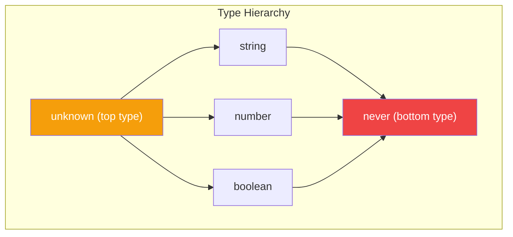
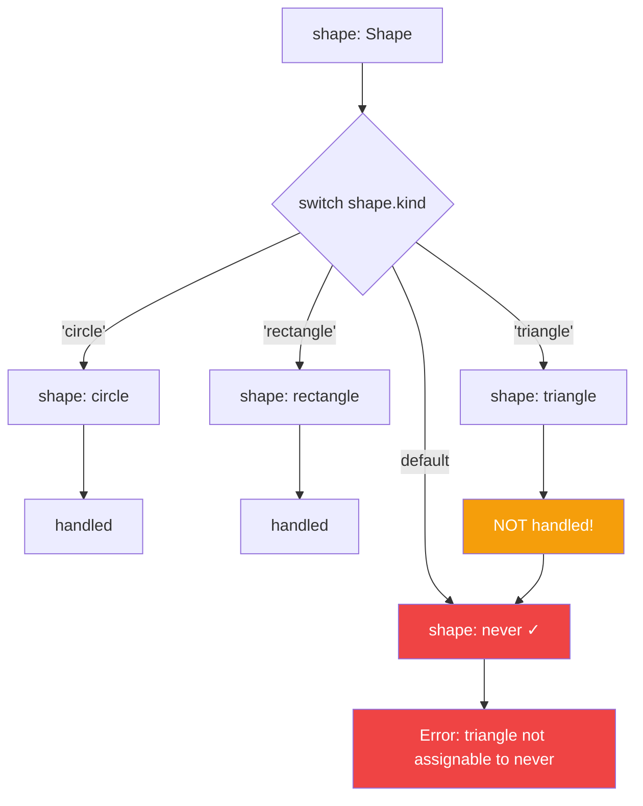

TypeScript's static type analysis is excellent at catching errors when you do something wrong. But what about errors of *omission*—when you should do something but don't? This is where **exhaustiveness checking** comes in, and the `never` type is the key.

## The Problem: Missing Cases

Suppose you're building a shape drawing application:

```typescript
type Shape =
  | { kind: 'circle'; radius: number }
  | { kind: 'rectangle'; width: number; height: number };

function getArea(shape: Shape): number {
  switch (shape.kind) {
    case 'circle':
      return Math.PI * shape.radius ** 2;
    case 'rectangle':
      return shape.width * shape.height;
  }
}
```

This works fine. But what happens when you add a new shape?

```typescript
type Shape =
  | { kind: 'circle'; radius: number }
  | { kind: 'rectangle'; width: number; height: number }
  | { kind: 'triangle'; base: number; height: number };  // New!

function getArea(shape: Shape): number {
  switch (shape.kind) {
    case 'circle':
      return Math.PI * shape.radius ** 2;
    case 'rectangle':
      return shape.width * shape.height;
    // Oops! Forgot to handle 'triangle'
  }
}
```

TypeScript won't warn you about the missing case. The function might return `undefined` at runtime, causing bugs.

## The Solution: Exhaustiveness Checking

The trick is to add a `default` case that assigns the value to a `never` type:

```typescript
function assertNever(x: never): never {
  throw new Error(`Unexpected value: ${x}`);
}

function getArea(shape: Shape): number {
  switch (shape.kind) {
    case 'circle':
      return Math.PI * shape.radius ** 2;
    case 'rectangle':
      return shape.width * shape.height;
    default:
      return assertNever(shape);
      //                 ~~~~~
      // Error: Argument of type '{ kind: "triangle"; ... }'
      // is not assignable to parameter of type 'never'
  }
}
```

Now TypeScript will tell you exactly which case you forgot to handle!

## Understanding the `never` Type



The `never` type represents values that never occur:
- A function that always throws
- A function with an infinite loop
- A value that has been narrowed to nothing

Most importantly, **no value is assignable to `never`** (except `never` itself). This is what makes exhaustiveness checking work.

## How It Works



When you handle all cases:
1. Each `case` narrows the type
2. After all cases, the type is narrowed to `never`
3. Assigning `never` to `never` is fine—no error

When you miss a case:
1. The unhandled case remains in the type
2. That type is not assignable to `never`
3. TypeScript shows an error

## Different Patterns

### Pattern 1: Assert Function (Recommended)

```typescript
function assertNever(x: never): never {
  throw new Error(`Unexpected value: ${JSON.stringify(x)}`);
}

function getArea(shape: Shape): number {
  switch (shape.kind) {
    case 'circle':
      return Math.PI * shape.radius ** 2;
    case 'rectangle':
      return shape.width * shape.height;
    default:
      return assertNever(shape);
  }
}
```

**Advantages:**
- Runtime safety (throws if somehow reached)
- The error message helps with debugging
- Reusable across your codebase

### Pattern 2: Type Annotation

```typescript
function getArea(shape: Shape): number {
  switch (shape.kind) {
    case 'circle':
      return Math.PI * shape.radius ** 2;
    case 'rectangle':
      return shape.width * shape.height;
    default:
      const _exhaustiveCheck: never = shape;
      return _exhaustiveCheck;
  }
}
```

**Advantages:**
- No function call overhead
- Works without additional utilities

### Pattern 3: Satisfies (TypeScript 4.9+)

```typescript
function getArea(shape: Shape): number {
  switch (shape.kind) {
    case 'circle':
      return Math.PI * shape.radius ** 2;
    case 'rectangle':
      return shape.width * shape.height;
    default:
      return shape satisfies never;
  }
}
```

**Advantages:**
- Most concise syntax
- Modern TypeScript feature

## Real-World Examples

### Redux Reducers

```typescript
type Action =
  | { type: 'INCREMENT' }
  | { type: 'DECREMENT' }
  | { type: 'SET'; value: number };

interface State {
  count: number;
}

function reducer(state: State, action: Action): State {
  switch (action.type) {
    case 'INCREMENT':
      return { count: state.count + 1 };
    case 'DECREMENT':
      return { count: state.count - 1 };
    case 'SET':
      return { count: action.value };
    default:
      return assertNever(action);
  }
}
```

### API Response Handling

```typescript
type ApiResponse =
  | { status: 'success'; data: User }
  | { status: 'error'; message: string }
  | { status: 'loading' };

function renderResponse(response: ApiResponse): string {
  switch (response.status) {
    case 'success':
      return `Welcome, ${response.data.name}!`;
    case 'error':
      return `Error: ${response.message}`;
    case 'loading':
      return 'Loading...';
    default:
      return assertNever(response);
  }
}
```

### Event Handling

```typescript
type AppEvent =
  | { type: 'click'; x: number; y: number }
  | { type: 'keydown'; key: string }
  | { type: 'scroll'; offset: number };

function handleEvent(event: AppEvent): void {
  switch (event.type) {
    case 'click':
      console.log(`Clicked at (${event.x}, ${event.y})`);
      break;
    case 'keydown':
      console.log(`Key pressed: ${event.key}`);
      break;
    case 'scroll':
      console.log(`Scrolled to ${event.offset}`);
      break;
    default:
      assertNever(event);
  }
}
```

## Using with If Statements

Exhaustiveness checking isn't limited to switch statements:

```typescript
function getArea(shape: Shape): number {
  if (shape.kind === 'circle') {
    return Math.PI * shape.radius ** 2;
  }
  if (shape.kind === 'rectangle') {
    return shape.width * shape.height;
  }
  // If you add a new shape, this will error
  return assertNever(shape);
}
```

## ESLint Integration

You can also use ESLint's `@typescript-eslint/switch-exhaustiveness-check` rule for an additional layer of safety:

```json
{
  "rules": {
    "@typescript-eslint/switch-exhaustiveness-check": "error"
  }
}
```

This rule will warn you when a switch statement doesn't handle all union members, even without the `assertNever` pattern.

## Summary

- **The `never` type** represents values that should never occur
- **Exhaustiveness checking** uses `never` to catch missing cases at compile time
- Use `assertNever()` function for runtime safety and better debugging
- This pattern works great with tagged unions and Redux-style reducers
- Consider combining with ESLint rules for maximum safety

When you add a new variant to a union type, exhaustiveness checking ensures that TypeScript will guide you to every place in your code that needs to be updated. This makes refactoring safer and helps prevent bugs from slipping through.

## References

- [TypeScript Handbook: Narrowing - Exhaustiveness checking](https://www.typescriptlang.org/docs/handbook/2/narrowing.html#exhaustiveness-checking)
- Vanderkam, Dan. *Effective TypeScript*, 2nd Edition. O'Reilly Media, 2024.
