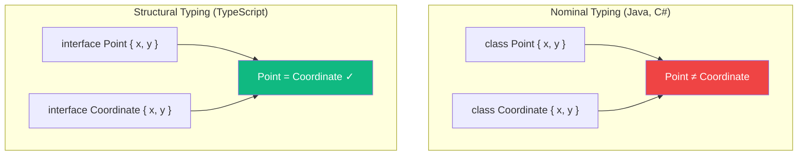

If you come from Java, C#, or other nominally-typed languages, TypeScript's type system might surprise you. TypeScript uses **structural typing** (also called "duck typing"), which means that types are compatible based on their structure, not their names.

## What is Structural Typing?

In TypeScript, two types are compatible if they have the same structure—the same properties with compatible types. The name of the type doesn't matter.

```typescript
interface Point {
  x: number;
  y: number;
}

interface Coordinate {
  x: number;
  y: number;
}

const point: Point = { x: 10, y: 20 };
const coord: Coordinate = point; // OK! Same structure
```

Even though `Point` and `Coordinate` are different interfaces, TypeScript treats them as compatible because they have the same shape.

## Nominal vs Structural Typing



In **nominal typing** (Java, C#):
- Types are compatible only if they have the same name or explicit inheritance
- `class Point` and `class Coordinate` are different types, period

In **structural typing** (TypeScript):
- Types are compatible if they have the same structure
- The type's name is just a label for documentation

## Duck Typing: "If It Quacks Like a Duck..."

The phrase "duck typing" comes from the saying:

> If it walks like a duck and quacks like a duck, then it must be a duck.

TypeScript applies this principle at compile time:

```typescript
interface Duck {
  walk(): void;
  quack(): void;
}

// This object isn't declared as Duck, but it has the right shape
const bird = {
  walk() { console.log('Walking...'); },
  quack() { console.log('Quack!'); },
  fly() { console.log('Flying...'); }  // Extra method is fine
};

function makeDuckQuack(duck: Duck) {
  duck.quack();
}

makeDuckQuack(bird); // OK! bird has walk() and quack()
```

The `bird` object was never declared as a `Duck`, but it's compatible because it has all the required properties.

## Why Structural Typing?

### 1. Flexibility with Third-Party Libraries

You can create objects that work with library types without importing them:

```typescript
// Some library defines this interface
interface Serializable {
  toJSON(): string;
}

// Your code - no need to import or implement Serializable
const user = {
  name: 'Alice',
  toJSON() {
    return JSON.stringify({ name: this.name });
  }
};

// Works with any function expecting Serializable
function save(item: Serializable) {
  console.log(item.toJSON());
}

save(user); // OK!
```

### 2. Easy Testing with Mocks

You don't need complex mocking frameworks—just create objects with the right shape:

```typescript
interface UserRepository {
  findById(id: string): User | null;
  save(user: User): void;
}

// In tests, just create an object with the same shape
const mockRepo = {
  findById(id: string) {
    return { id, name: 'Test User', email: 'test@example.com' };
  },
  save(user: User) {
    console.log('Saved:', user);
  }
};

// Use mockRepo anywhere UserRepository is expected
```

### 3. Working with JSON

Structural typing makes it natural to work with JSON data:

```typescript
interface ApiResponse {
  status: string;
  data: {
    id: number;
    name: string;
  };
}

// JSON.parse returns any, but we can assign to our interface
const response: ApiResponse = JSON.parse(jsonString);
// TypeScript checks the structure at compile time
```

## The "Extra Properties" Gotcha

Structural typing means an object can have *more* properties than required:

```typescript
interface Point {
  x: number;
  y: number;
}

const point3D = { x: 1, y: 2, z: 3 };
const point2D: Point = point3D; // OK! Has x and y

function logPoint(p: Point) {
  console.log(p.x, p.y);
}

logPoint(point3D); // OK!
```

However, TypeScript applies **excess property checking** on object literals:

```typescript
const point: Point = { x: 1, y: 2, z: 3 };
//                                  ~~~
// Error: Object literal may only specify known properties
```

This catches typos and mistakes when creating objects directly.

## When Structural Typing Surprises You

### Surprise 1: Functions Are Structurally Typed Too

```typescript
type Handler = (event: MouseEvent) => void;

// This function takes fewer parameters - that's OK!
const simpleHandler = () => console.log('clicked');

const handler: Handler = simpleHandler; // OK!
```

A function that ignores some parameters is still compatible. This is because it's always safe to pass more arguments than a function uses.

### Surprise 2: Class Instances Are Structural

```typescript
class Person {
  constructor(public name: string) {}
}

class Dog {
  constructor(public name: string) {}
}

const person: Person = new Dog('Buddy'); // OK! Same structure
```

Even class instances are compared structurally. If you need nominal typing for classes, you can use private members:

```typescript
class Person {
  private readonly __brand = 'Person';
  constructor(public name: string) {}
}

class Dog {
  private readonly __brand = 'Dog';
  constructor(public name: string) {}
}

const person: Person = new Dog('Buddy');
//    ~~~~~~
// Error: Types have separate declarations of a private property '__brand'
```

### Surprise 3: Wider Types Accept Narrower Values

```typescript
interface Named {
  name: string;
}

interface Person extends Named {
  age: number;
}

const people: Named[] = [];
const person: Person = { name: 'Alice', age: 30 };

people.push(person); // OK! Person has all properties of Named
```

## Branded Types: Simulating Nominal Typing

Sometimes you need to distinguish types that have the same structure:

```typescript
type USD = number & { readonly brand: unique symbol };
type EUR = number & { readonly brand: unique symbol };

function usd(amount: number): USD {
  return amount as USD;
}

function eur(amount: number): EUR {
  return amount as EUR;
}

function addUSD(a: USD, b: USD): USD {
  return (a + b) as USD;
}

const dollars = usd(100);
const euros = eur(100);

addUSD(dollars, dollars); // OK
addUSD(dollars, euros);   // Error! EUR is not assignable to USD
```

This "branded types" pattern adds a phantom property that exists only in the type system.

## Practical Tips

### Tip 1: Use Interfaces for Public APIs

When defining types for others to implement, interfaces work naturally with structural typing:

```typescript
// Library code
interface Logger {
  log(message: string): void;
  error(message: string): void;
}

// User code - no need to explicitly implement
const consoleLogger = {
  log: console.log,
  error: console.error,
};
```

### Tip 2: Embrace Structural Compatibility

Don't fight structural typing—use it to your advantage:

```typescript
// Instead of this:
function processUser(user: User) { ... }

// Consider accepting any object with the needed properties:
function processUser(user: { name: string; email: string }) { ... }
```

### Tip 3: Use Type Guards for Runtime Safety

Structural typing is compile-time only. For runtime safety, add type guards:

```typescript
function isPoint(obj: unknown): obj is Point {
  return (
    typeof obj === 'object' &&
    obj !== null &&
    'x' in obj &&
    'y' in obj &&
    typeof (obj as Point).x === 'number' &&
    typeof (obj as Point).y === 'number'
  );
}
```

## Summary

| Aspect | Structural Typing |
|--------|-------------------|
| Compatibility | Based on shape, not name |
| Flexibility | High - any matching object works |
| Testing | Easy - create objects with matching shape |
| Third-party code | Works without imports |
| Runtime | Not enforced - compile-time only |

Key takeaways:
- TypeScript uses structural typing: if it has the right shape, it's compatible
- This enables flexibility with mocks, third-party code, and JSON
- Extra properties are allowed (except in object literals)
- Functions with fewer parameters are compatible with those expecting more
- Use branded types when you need nominal-like behavior

Understanding structural typing is essential to writing idiomatic TypeScript. Embrace it, and you'll find TypeScript's type system surprisingly flexible and powerful.

## References

- [TypeScript Handbook: Type Compatibility](https://www.typescriptlang.org/docs/handbook/type-compatibility.html)
- Vanderkam, Dan. *Effective TypeScript*, 2nd Edition. O'Reilly Media, 2024.
