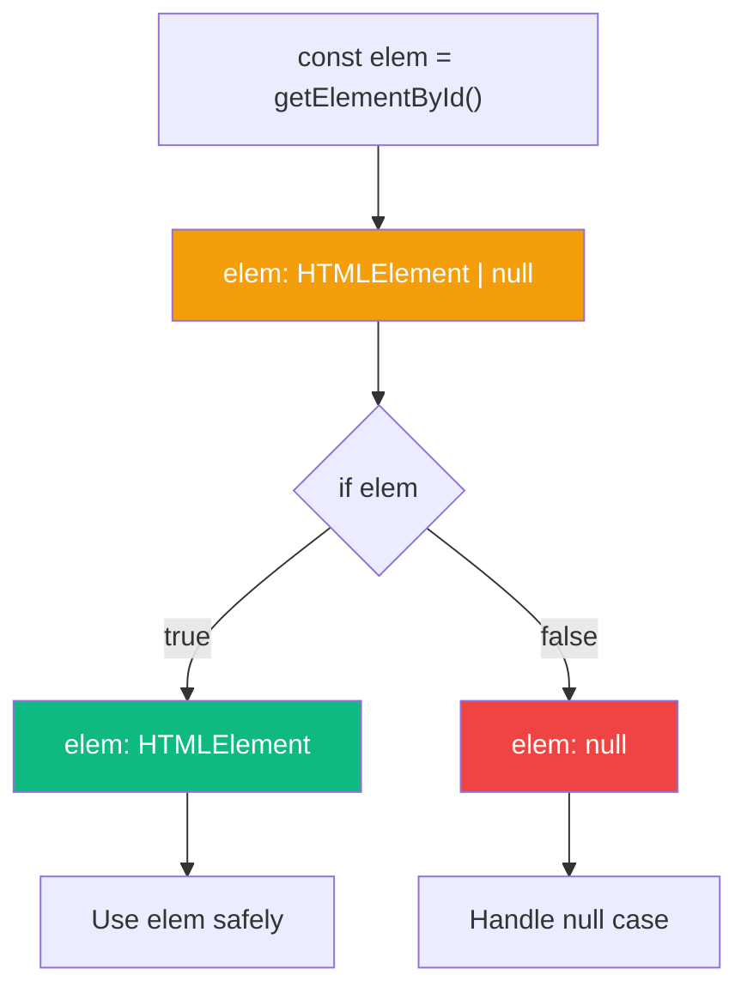
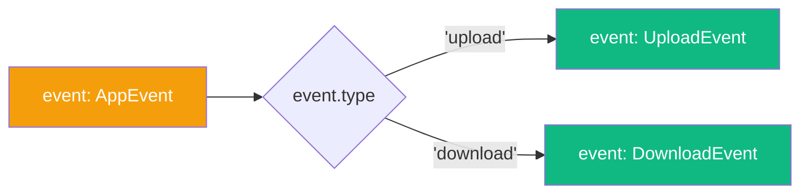

TypeScript's type system is powerful, but what makes it truly special is how it narrows types based on your code's control flow. This feature, called **type narrowing** (or refinement), lets you write code that's both type-safe and elegant.

## What is Type Narrowing?

Type narrowing is the process by which TypeScript goes from a broad type to a more specific one based on the code's execution path. The most common example is null checking:

```typescript
const elem = document.getElementById('my-element');
// elem is HTMLElement | null

if (elem) {
  elem.innerHTML = 'Hello!';
  // elem is HTMLElement (null is excluded)
} else {
  // elem is null
  console.log('Element not found');
}
```

Because the compiler follows the paths of execution of your code, this is also known as **control flow analysis**.

## The Key Insight: Types Change by Location

Here's a crucial concept that sets TypeScript apart from languages like Java or C++:



In TypeScript, **a symbol has a type at a location**. The same variable can have different types at different points in your code. This is unusual among programming languages but incredibly powerful.

## Ways to Narrow Types

### 1. Throwing or Returning Early

```typescript
function processValue(value: string | null) {
  if (!value) {
    throw new Error('Value is required');
  }
  // value is now string
  return value.toUpperCase();
}
```

### 2. Using `typeof`

```typescript
function formatValue(value: string | number) {
  if (typeof value === 'string') {
    return value.toUpperCase();
    // value is string
  }
  return value.toFixed(2);
  // value is number
}
```

### 3. Using `instanceof`

```typescript
function processInput(input: Date | string) {
  if (input instanceof Date) {
    return input.toISOString();
    // input is Date
  }
  return new Date(input).toISOString();
  // input is string
}
```

### 4. Property Checks with `in`

```typescript
interface Bird {
  fly(): void;
  layEggs(): void;
}

interface Fish {
  swim(): void;
  layEggs(): void;
}

function move(animal: Bird | Fish) {
  if ('fly' in animal) {
    animal.fly();
    // animal is Bird
  } else {
    animal.swim();
    // animal is Fish
  }
}
```

### 5. Using `Array.isArray()`

```typescript
function processItems(items: string | string[]) {
  const list = Array.isArray(items) ? items : [items];
  // list is string[]
  return list.join(', ');
}
```

## Tagged Unions: The Most Powerful Pattern

One of the most effective ways to narrow types is using **tagged unions** (also called discriminated unions):

```typescript
interface UploadEvent {
  type: 'upload';
  filename: string;
  contents: string;
}

interface DownloadEvent {
  type: 'download';
  filename: string;
}

type AppEvent = UploadEvent | DownloadEvent;

function handleEvent(event: AppEvent) {
  switch (event.type) {
    case 'upload':
      // event is UploadEvent
      console.log(`Uploading ${event.filename}: ${event.contents.length} bytes`);
      break;
    case 'download':
      // event is DownloadEvent
      console.log(`Downloading ${event.filename}`);
      break;
  }
}
```



The `type` property acts as a "tag" that TypeScript uses to discriminate between union members.

## User-Defined Type Guards

When TypeScript can't figure out a type on its own, you can help it with a **user-defined type guard**:

```typescript
interface User {
  name: string;
  email: string;
}

function isUser(value: unknown): value is User {
  return (
    typeof value === 'object' &&
    value !== null &&
    'name' in value &&
    'email' in value &&
    typeof (value as User).name === 'string' &&
    typeof (value as User).email === 'string'
  );
}

function greet(data: unknown) {
  if (isUser(data)) {
    // data is User
    console.log(`Hello, ${data.name}!`);
  }
}
```

The `value is User` return type is called a **type predicate**. It tells TypeScript that if the function returns `true`, the parameter is of the specified type.

## Common Pitfalls

### Pitfall 1: `typeof null` is "object"

```typescript
function process(value: object | null) {
  if (typeof value === 'object') {
    // value is still object | null!
    // typeof null === 'object' in JavaScript
  }
}
```

Use explicit null checks instead:

```typescript
function process(value: object | null) {
  if (value !== null) {
    // value is object
  }
}
```

### Pitfall 2: Falsy Values

```typescript
function process(value: string | number | null) {
  if (!value) {
    // value could be '', 0, or null!
  }
}
```

Be explicit about what you're checking:

```typescript
function process(value: string | number | null) {
  if (value === null) {
    // value is null
  } else {
    // value is string | number (including '' and 0)
  }
}
```

### Pitfall 3: Callbacks Don't Preserve Narrowing

```typescript
function processLater(obj: { value: string | number }) {
  if (typeof obj.value === 'number') {
    setTimeout(() => {
      // obj.value is string | number again!
      console.log(obj.value.toFixed(2)); // Error!
    });
  }
}
```

TypeScript knows that `obj.value` might change before the callback runs. Capture the value in a local variable:

```typescript
function processLater(obj: { value: string | number }) {
  if (typeof obj.value === 'number') {
    const value = obj.value; // Capture as number
    setTimeout(() => {
      console.log(value.toFixed(2)); // OK
    });
  }
}
```

## Practical Example: Safe JSON Parsing

Here's how to combine type guards with narrowing for safe API responses:

```typescript
interface ApiResponse<T> {
  status: 'success' | 'error';
  data?: T;
  error?: string;
}

interface User {
  id: number;
  name: string;
}

function isSuccessResponse<T>(
  response: ApiResponse<T>
): response is ApiResponse<T> & { status: 'success'; data: T } {
  return response.status === 'success' && response.data !== undefined;
}

async function fetchUser(id: number): Promise<User | null> {
  const response: ApiResponse<User> = await fetch(`/api/users/${id}`)
    .then(r => r.json());

  if (isSuccessResponse(response)) {
    // response.data is User (guaranteed)
    return response.data;
  }

  console.error(response.error);
  return null;
}
```

## Summary

- Type narrowing is TypeScript's ability to refine types based on control flow
- A variable can have different types at different locations in your code
- Use `typeof`, `instanceof`, `in`, and `Array.isArray()` for narrowing
- Tagged unions are the most powerful pattern for discriminating types
- User-defined type guards let you teach TypeScript about custom type checks
- Be aware of pitfalls: `typeof null`, falsy values, and callbacks

Mastering type narrowing will help you write TypeScript code that's both type-safe and reads naturally. Let the compiler work for you!

## References

- [TypeScript Handbook: Narrowing](https://www.typescriptlang.org/docs/handbook/2/narrowing.html)
- Vanderkam, Dan. *Effective TypeScript*, 2nd Edition. O'Reilly Media, 2024.
