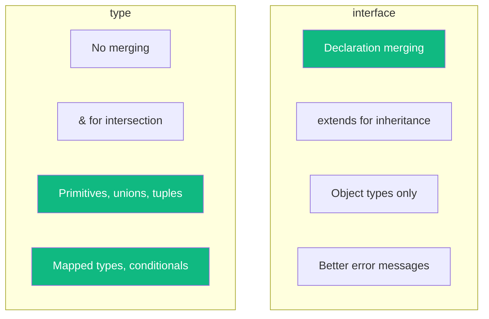
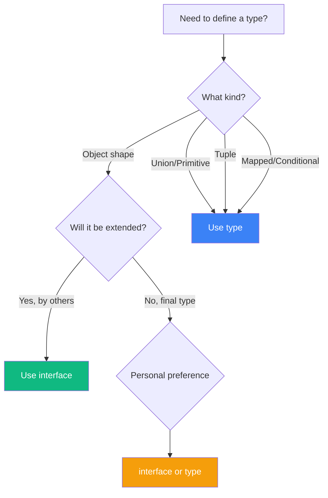

One of the most common questions TypeScript developers ask is: "Should I use `type` or `interface`?" The answer isn't always straightforward, but understanding the differences will help you make better choices.

## The Basics

Both `type` and `interface` can describe the shape of an object:

```typescript
// Using interface
interface Person {
  name: string;
  age: number;
}

// Using type
type PersonType = {
  name: string;
  age: number;
};

// Both work the same way
const alice: Person = { name: 'Alice', age: 30 };
const bob: PersonType = { name: 'Bob', age: 25 };
```

For simple object types, they're largely interchangeable. But there are important differences.

## Key Differences



### 1. Declaration Merging

Interfaces can be declared multiple times and TypeScript will merge them:

```typescript
interface User {
  name: string;
}

interface User {
  email: string;
}

// User now has both name and email
const user: User = {
  name: 'Alice',
  email: 'alice@example.com'
};
```

Type aliases cannot be merged:

```typescript
type User = {
  name: string;
};

type User = {  // Error: Duplicate identifier 'User'
  email: string;
};
```

**When is this useful?** Declaration merging is great for extending third-party libraries or built-in types:

```typescript
// Extend the Window interface
interface Window {
  myCustomProperty: string;
}

window.myCustomProperty = 'Hello!'; // OK
```

### 2. Extending vs Intersection

Interfaces use `extends`, types use `&`:

```typescript
// Interface extension
interface Animal {
  name: string;
}

interface Dog extends Animal {
  breed: string;
}

// Type intersection
type AnimalType = {
  name: string;
};

type DogType = AnimalType & {
  breed: string;
};
```

Both achieve similar results, but there's a subtle difference in error handling:

```typescript
interface Named {
  name: string;
}

interface Person extends Named {
  name: number;  // Error: incompatible types
}

type PersonType = Named & {
  name: number;  // No error, but name becomes 'never'
};
```

Interfaces catch conflicts at the declaration site, while type intersections silently create `never` types.

### 3. Only Types Can Do This

Type aliases can represent things that interfaces cannot:

```typescript
// Primitive types
type ID = string | number;

// Union types
type Status = 'pending' | 'approved' | 'rejected';

// Tuple types
type Point = [number, number];

// Function types (cleaner syntax)
type Callback = (data: string) => void;

// Mapped types
type Readonly<T> = {
  readonly [P in keyof T]: T[P];
};

// Conditional types
type NonNullable<T> = T extends null | undefined ? never : T;
```

### 4. Error Messages

Interfaces often provide clearer error messages because they have names that TypeScript can reference:

```typescript
interface User {
  name: string;
  email: string;
}

function greet(user: User) {
  console.log(user.name);
}

greet({ name: 'Alice' });
// Error: Property 'email' is missing in type '{ name: string; }'
// but required in type 'User'
```

With complex type aliases, error messages can become harder to read.

## When to Use Each



### Use `interface` when:

1. **Defining object shapes for public APIs** - Declaration merging allows consumers to extend your types
2. **Working with classes** - Interfaces work naturally with `implements`
3. **You want clear error messages** - Named interfaces are easier to understand in errors

```typescript
// Good use of interface: class implementation
interface Serializable {
  serialize(): string;
}

class User implements Serializable {
  constructor(public name: string) {}

  serialize() {
    return JSON.stringify({ name: this.name });
  }
}
```

### Use `type` when:

1. **Defining unions or intersections** - Only types can do this
2. **Working with primitives** - `type ID = string | number`
3. **Creating mapped or conditional types** - Advanced type operations
4. **You want to prevent extension** - Types can't be merged

```typescript
// Good use of type: union types
type Result<T> =
  | { status: 'success'; data: T }
  | { status: 'error'; error: string };

async function fetchData(): Promise<Result<User>> {
  try {
    const data = await fetch('/api/user').then(r => r.json());
    return { status: 'success', data };
  } catch (e) {
    return { status: 'error', error: String(e) };
  }
}
```

## The Practical Recommendation

For most codebases, consistency matters more than the specific choice. Here's a practical approach:

1. **Use `interface` for object shapes** that might be extended
2. **Use `type` for everything else** (unions, tuples, primitives, mapped types)
3. **Pick one and be consistent** within your codebase

```typescript
// Consistent approach example

// Interfaces for data shapes
interface User {
  id: string;
  name: string;
  email: string;
}

interface Post {
  id: string;
  title: string;
  authorId: string;
}

// Types for unions and utilities
type ID = string | number;
type Status = 'draft' | 'published' | 'archived';
type UserWithPosts = User & { posts: Post[] };
```

## Common Misconceptions

### "Interfaces are faster"

This was true in older TypeScript versions, but modern TypeScript handles both equally well. Don't choose based on performance.

### "You should always use one or the other"

Both have their place. The best codebases use both appropriately.

### "They're completely interchangeable"

They're not! As shown above, types can do things interfaces cannot (and vice versa with declaration merging).

## Summary

| Feature | `interface` | `type` |
|---------|-------------|--------|
| Object shapes | Yes | Yes |
| Declaration merging | Yes | No |
| `extends` keyword | Yes | No (use `&`) |
| Union types | No | Yes |
| Primitive types | No | Yes |
| Tuple types | No | Yes |
| Mapped types | No | Yes |
| Conditional types | No | Yes |

Choose based on what you need:
- **Extensibility needed?** Use `interface`
- **Unions/primitives/advanced types?** Use `type`
- **Not sure?** Use `interface` for objects, `type` for everything else

## References

- [TypeScript Handbook: Object Types](https://www.typescriptlang.org/docs/handbook/2/objects.html)
- Vanderkam, Dan. *Effective TypeScript*, 2nd Edition. O'Reilly Media, 2024.
