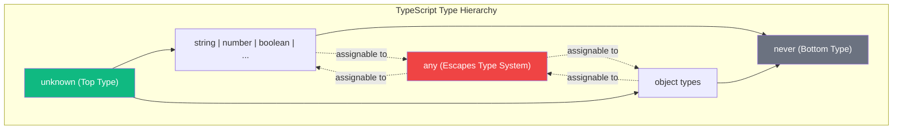
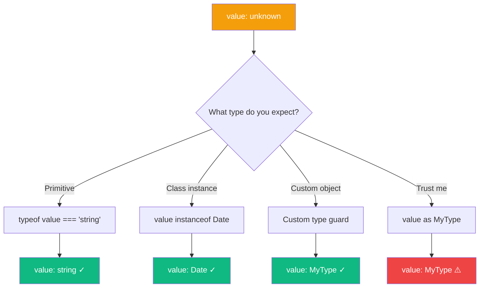

When working with TypeScript, you'll inevitably encounter situations where you don't know the type of a value at compile time. Whether it's parsing JSON, handling API responses, or working with third-party libraries, you need a way to represent "any possible value."

TypeScript offers two options for this: `any` and `unknown`. While they might seem similar at first glance, they behave very differently, and choosing the right one can make a significant impact on your code's type safety.

## The Problem with `any`

The `any` type is TypeScript's escape hatch from the type system. When you use `any`, you're essentially telling TypeScript: "Trust me, I know what I'm doing."

```typescript
function parseJSON(json: string): any {
  return JSON.parse(json);
}

const data = parseJSON('{"name": "Alice", "age": 30}');
console.log(data.name);        // OK
console.log(data.foo.bar.baz); // No error, but crashes at runtime!
data();                         // No error, but crashes at runtime!
```

The problem is that `any` disables all type checking. TypeScript won't warn you about:

- Accessing properties that don't exist
- Calling values that aren't functions
- Passing incorrect arguments to methods

Even worse, `any` is **contagious**. When you assign an `any` value to another variable, that variable also becomes `any`:

```typescript
const data: any = getExternalData();
const name = data.name;  // name is also 'any'
const age = data.age;    // age is also 'any'
name.toFixed(2);         // No error, but might crash!
```

## Enter `unknown`: The Type-Safe Alternative

The `unknown` type was introduced in TypeScript 3.0 as a safer alternative to `any`. Like `any`, it can hold any value. But unlike `any`, you can't do anything with an `unknown` value without first narrowing its type.

```typescript
function parseJSON(json: string): unknown {
  return JSON.parse(json);
}

const data = parseJSON('{"name": "Alice"}');
console.log(data.name);  // Error: 'data' is of type 'unknown'
data();                   // Error: 'data' is of type 'unknown'
```

This might seem inconvenient at first, but it's actually a feature. TypeScript is forcing you to verify the type before using the value.

## Understanding the Type System

To understand why `unknown` is safer, let's think about how these types fit into TypeScript's type system:



### `any` breaks the type system

`any` has two contradictory properties:

1. Any type is assignable to `any`
2. `any` is assignable to any type

This means `any` is simultaneously a supertype and subtype of all other types, which is mathematically impossible. This is why `any` effectively disables type checking.

### `unknown` respects the type system

`unknown` is a "top type" that only has the first property:

1. Any type is assignable to `unknown`
2. `unknown` is only assignable to `unknown` and `any`

This makes `unknown` the true "any value" type while maintaining type safety.

## How to Work with `unknown`

Since you can't directly use `unknown` values, you need to narrow the type first. Here are several ways to do this:



### Type Assertions

```typescript
const data: unknown = fetchData();
const user = data as User;
console.log(user.name);
```

Note: Type assertions bypass type checking, so use them carefully.

### Type Guards with `typeof`

```typescript
function processValue(value: unknown) {
  if (typeof value === "string") {
    console.log(value.toUpperCase()); // OK, value is string
  } else if (typeof value === "number") {
    console.log(value.toFixed(2));    // OK, value is number
  }
}
```

### Instance Checks with `instanceof`

```typescript
function processValue(value: unknown) {
  if (value instanceof Date) {
    console.log(value.toISOString()); // OK, value is Date
  } else if (value instanceof Error) {
    console.log(value.message);       // OK, value is Error
  }
}
```

### Custom Type Guards

```typescript
interface User {
  name: string;
  email: string;
}

function isUser(value: unknown): value is User {
  return (
    typeof value === "object" &&
    value !== null &&
    "name" in value &&
    "email" in value
  );
}

function greetUser(data: unknown) {
  if (isUser(data)) {
    console.log(`Hello, ${data.name}!`); // OK, data is User
  }
}
```

## Practical Examples

### Parsing JSON Safely

```typescript
interface ApiResponse {
  status: string;
  data: {
    id: number;
    name: string;
  };
}

function isApiResponse(value: unknown): value is ApiResponse {
  return (
    typeof value === "object" &&
    value !== null &&
    "status" in value &&
    "data" in value
  );
}

async function fetchUser(): Promise<ApiResponse> {
  const response = await fetch("/api/user");
  const json: unknown = await response.json();

  if (isApiResponse(json)) {
    return json;
  }

  throw new Error("Invalid API response");
}
```

### Handling External Data

```typescript
function processExternalData(data: unknown): string {
  if (typeof data === "string") {
    return data;
  }
  if (typeof data === "number") {
    return data.toString();
  }
  if (Array.isArray(data)) {
    return data.join(", ");
  }
  return JSON.stringify(data);
}
```

## When to Use Each

| Use `any` when... | Use `unknown` when... |
|-------------------|----------------------|
| Migrating JavaScript to TypeScript | You don't know the type of a value |
| Dealing with truly dynamic code | Parsing external data (JSON, API responses) |
| Temporary workaround (with a plan to fix) | Building type-safe generic utilities |

## Summary

- **`any`** disables type checking and should be avoided when possible
- **`unknown`** is the type-safe way to represent "any value"
- You must narrow `unknown` before using it, which forces you to handle types properly
- Use type guards, `instanceof`, or `typeof` to narrow `unknown` types
- Prefer `unknown` over `any` in function return types and when handling external data

By choosing `unknown` over `any`, you maintain TypeScript's type safety while still handling values of uncertain types. It might require a bit more code upfront, but it prevents runtime errors and makes your code more robust.

## References

- [TypeScript Handbook: The `unknown` Type](https://www.typescriptlang.org/docs/handbook/2/functions.html#unknown)
- Vanderkam, Dan. *Effective TypeScript*, 2nd Edition. O'Reilly Media, 2024.
