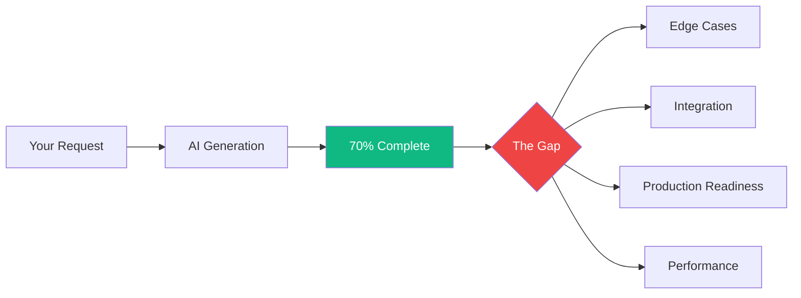
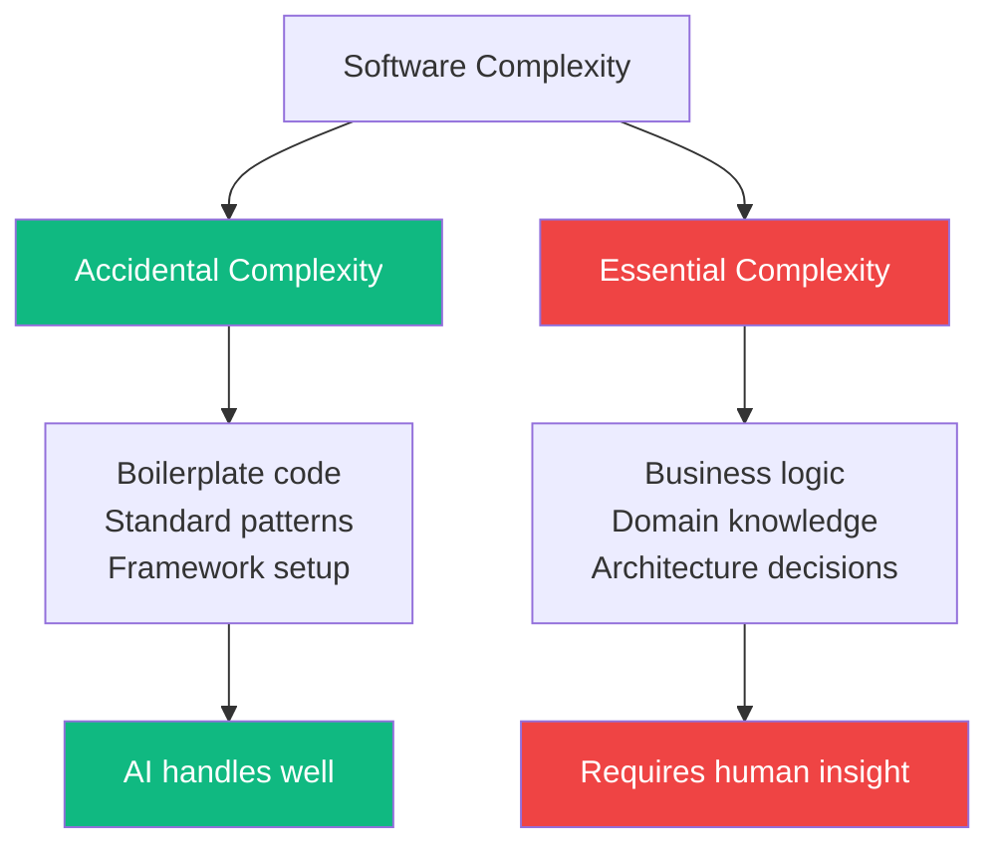
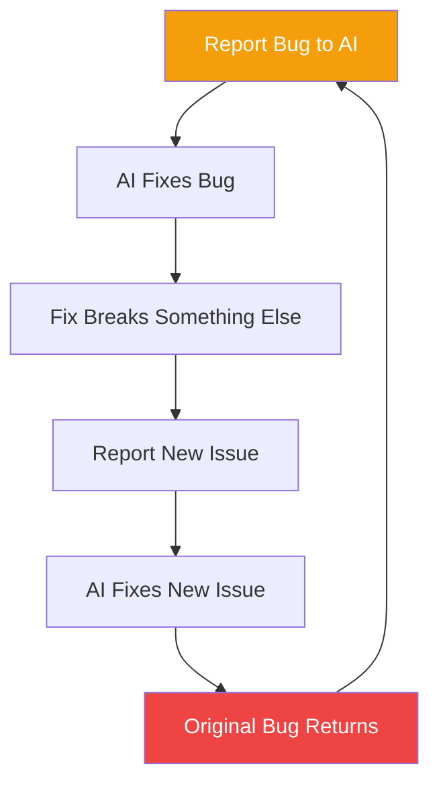
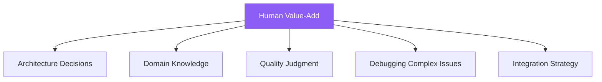

AI coding assistants can generate impressive results fast. They produce boilerplate, write routine functions, and create working prototypes in minutes. But many developers hit a frustrating wall: AI gets you roughly 70% of the way there, while the remaining 30% becomes an exercise in diminishing returns.

## Understanding the 70% Problem



### What the 70% Looks Like

The first 70% feels magical:

```
Initial AI output: Working prototype
├── Basic functionality: ✓
├── Happy path: ✓
├── Standard patterns: ✓
├── Boilerplate code: ✓
└── Common use cases: ✓
```

### What the 30% Contains

The remaining 30% is where difficulty hides:

```
The challenging 30%:
├── Edge cases and error handling
├── Security considerations
├── Performance optimization
├── Integration with existing systems
├── Business logic nuances
├── Production-grade reliability
└── Maintainable architecture
```

## Why This Gap Exists

### AI's Pattern Matching Strengths

AI excels at "accidental complexity"—the repetitive, patterned work:

| AI Does Well | AI Struggles With |
|--------------|-------------------|
| CRUD operations | Novel algorithms |
| Standard UI patterns | Unique business rules |
| Common integrations | Edge case handling |
| Framework boilerplate | Performance tuning |
| Routine validations | Security hardening |

### The Essential Complexity Problem



AI has seen millions of examples of standard patterns. But your specific:
- Business requirements
- Integration constraints
- Performance targets
- Security requirements

...are unique combinations that may not match training data.

## The Diminishing Returns Cycle

Many developers experience this pattern:

```
Iteration 1: AI generates 70% of solution
Iteration 2: Fix bug, AI introduces new bug
Iteration 3: Fix new bug, breaks original feature
Iteration 4: Patch that, edge case appears
...
Iteration N: "I should have just written this myself"
```

### Why AI Takes "One Step Forward, Two Steps Back"



This happens because:
1. **Limited context**: AI doesn't understand the full system
2. **No runtime visibility**: AI can't see how code actually behaves
3. **Pattern over understanding**: AI matches patterns, doesn't reason
4. **Training data bias**: Solutions reflect common approaches, not optimal ones

## Bridging the Gap: Practical Strategies

### 1. Start with Clear Specifications

```
Poor prompt:
"Create a user authentication system"

Better prompt:
"Create a user authentication system with:
- Email/password login
- JWT tokens with 1-hour expiry
- Rate limiting: 5 failed attempts locks account for 15 min
- Password requirements: 8+ chars, mixed case, number
- Integration with our existing User model in models/user.js"
```

The more specific your requirements, the more of the 30% you address upfront.

### 2. Use AI for Drafts, Not Finals


Treat AI output as a first draft that needs:
- Error handling review
- Edge case analysis
- Security audit
- Performance check

### 3. Incremental, Not Big-Bang

Instead of asking AI to build entire features:

```
# Less effective
"Build a complete e-commerce checkout system"

# More effective
"Create the cart data model"
[Review, refine]
"Add the add-to-cart function"
[Review, refine]
"Implement price calculation with tax"
[Review, refine]
...
```

### 4. The Review Checklist

After AI generates code, systematically check:

| Area | Questions to Ask |
|------|------------------|
| Error handling | What if the API fails? What if input is invalid? |
| Edge cases | Empty lists? Null values? Concurrent access? |
| Security | SQL injection? XSS? Authentication bypass? |
| Performance | N+1 queries? Memory leaks? Inefficient loops? |
| Integration | Compatible with existing patterns? Follows conventions? |

### 5. Know When to Take Over

Recognize patterns where manual coding is faster:

```
Signs AI is stuck:
- Same bug reappearing after "fix"
- Solutions getting increasingly complex
- Breaking unrelated functionality
- Suggesting workarounds instead of solutions

Action: Stop, understand the code, fix manually
```

## The Human 30%: Skills That Matter

### What AI Can't Replace



### Skills to Develop

| Skill | Why It Matters |
|-------|----------------|
| Code reading | Understand and verify AI output |
| Architecture | Design systems AI implements |
| Debugging | Fix issues AI can't diagnose |
| Domain expertise | Apply business context AI lacks |
| Testing strategy | Verify correctness comprehensively |

## Practical Workflow

### The 70/30 Development Cycle

```
Phase 1: AI-Assisted (70%)
├── Generate initial structure
├── Create boilerplate
├── Implement standard patterns
└── Build happy path functionality

Phase 2: Human Engineering (30%)
├── Review all generated code
├── Add error handling
├── Handle edge cases
├── Optimize performance
├── Security hardening
└── Integration testing
```

### Time Allocation

Realistically plan your time:

```
Feature Development with AI:
├── AI generation: 20% of time
├── Review and testing: 30% of time
├── Manual refinement: 40% of time
└── Integration: 10% of time

The 70% of code takes 20% of time
The 30% of code takes 80% of time
```

## Example: Building a Login System

### AI's 70%

```javascript
// AI generates this quickly
async function login(email, password) {
  const user = await User.findOne({ email });
  if (!user) return { error: 'User not found' };

  const valid = await bcrypt.compare(password, user.password);
  if (!valid) return { error: 'Invalid password' };

  const token = jwt.sign({ userId: user.id }, SECRET);
  return { token };
}
```

### Human's 30%

```javascript
// Human adds the production-ready parts
async function login(email, password) {
  // Input validation
  if (!email || !isValidEmail(email)) {
    return { error: 'Invalid email format' };
  }

  // Rate limiting check
  const attempts = await getLoginAttempts(email);
  if (attempts >= 5) {
    return { error: 'Account locked. Try again later.' };
  }

  const user = await User.findOne({ email });

  // Timing-safe response (prevent enumeration)
  if (!user) {
    await bcrypt.compare(password, DUMMY_HASH);
    await recordFailedAttempt(email);
    return { error: 'Invalid credentials' };
  }

  const valid = await bcrypt.compare(password, user.password);
  if (!valid) {
    await recordFailedAttempt(email);
    return { error: 'Invalid credentials' };
  }

  // Clear failed attempts on success
  await clearLoginAttempts(email);

  // Audit logging
  await auditLog('login', user.id, { ip: req.ip });

  const token = jwt.sign(
    { userId: user.id, version: user.tokenVersion },
    SECRET,
    { expiresIn: '1h' }
  );

  return {
    token,
    expiresIn: 3600
  };
}
```

## Summary

| Aspect | The 70% | The 30% |
|--------|---------|---------|
| What it is | Standard patterns, boilerplate | Edge cases, production readiness |
| Who handles it | AI excels | Human essential |
| Time required | Fast | Majority of effort |
| Skill needed | Prompting | Engineering judgment |

The 70% problem isn't a flaw to fix—it's a reality to embrace. AI dramatically accelerates the routine parts of coding, freeing you to focus your expertise on the genuinely difficult 30% where human judgment matters most.

The best developers don't fight this dynamic. They leverage AI for rapid drafts while maintaining the engineering discipline to complete, secure, and optimize that crucial final stretch.

## References

- Osmani, Addy. *Beyond Vibe Coding*. O'Reilly Media, 2025.
- Yang, Peter. "Honest reflections from coding with AI." X/Twitter, 2024.
