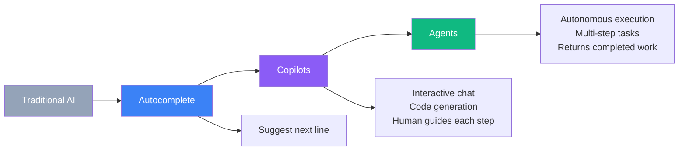
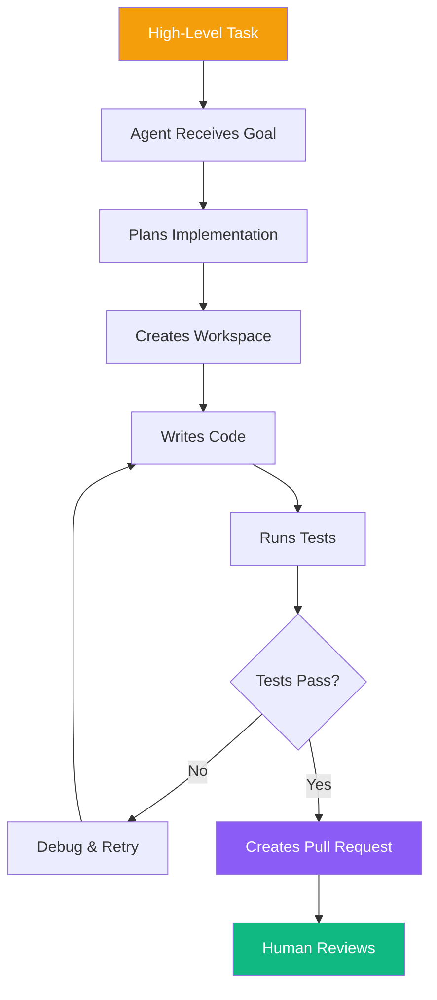
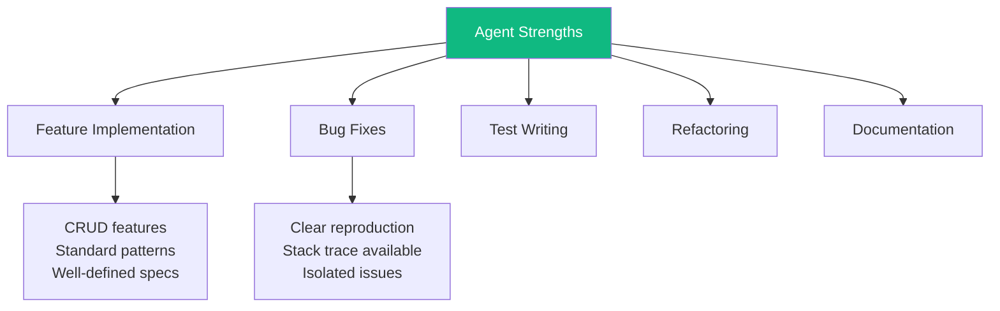
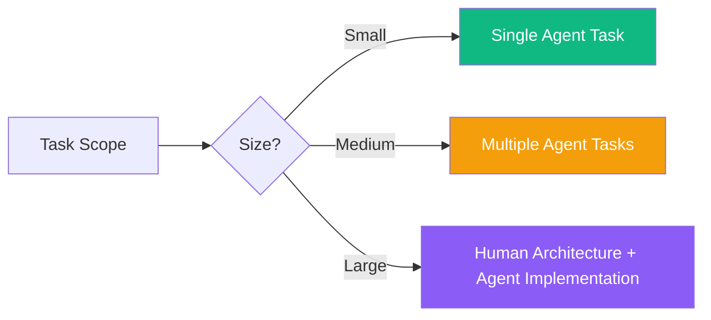
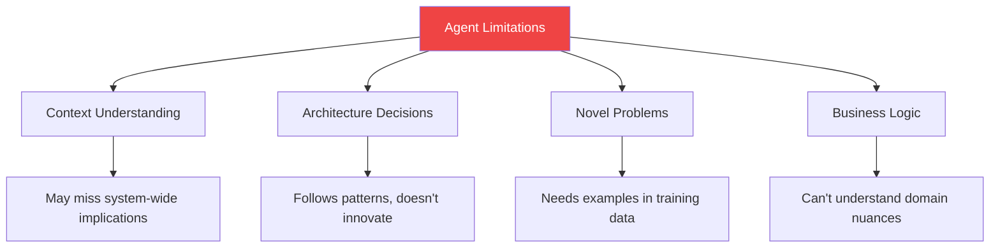
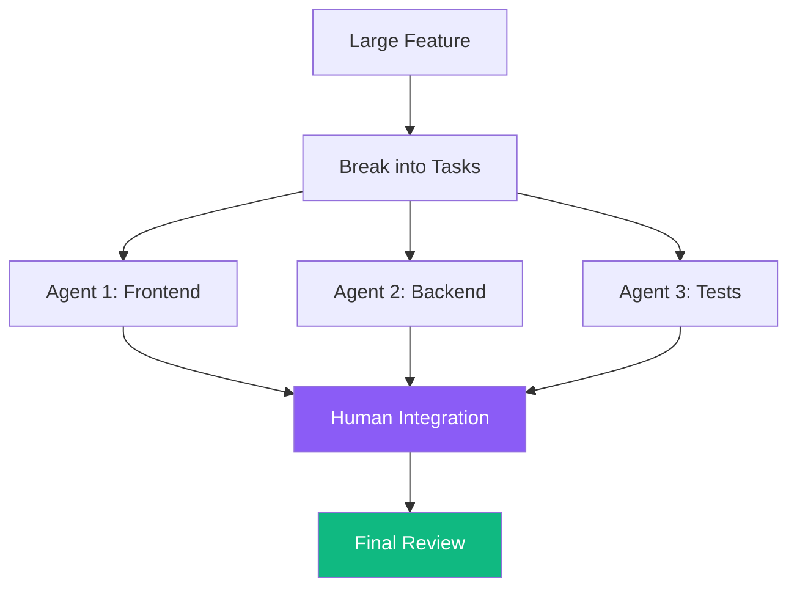
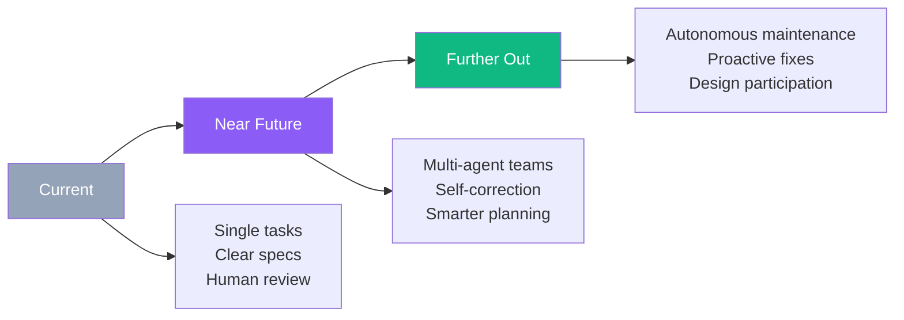

AI coding is evolving from interactive assistants to autonomous agents that can handle entire tasks independently. These agents represent a fundamental shift: instead of suggesting code while you type, they work in the background like junior developers you dispatch to complete work.

## From Copilots to Agents



### Key Differences

| Aspect | Copilot Style | Autonomous Agent |
|--------|---------------|------------------|
| Interaction | Continuous guidance | Fire and forget |
| Output | Suggestions to review | Completed PRs |
| Human role | Driver | Reviewer |
| Scope | Single edits | Entire features |
| Environment | Your IDE | Isolated sandbox |

## How Autonomous Agents Work



### The Agent Loop

1. **Task Assignment**: You describe what you want done
2. **Planning**: Agent breaks down the task
3. **Execution**: Works in isolated environment
4. **Verification**: Runs tests, checks output
5. **Iteration**: Fixes issues automatically
6. **Delivery**: Returns completed work for review

## Current Agent Landscape

### Integrated Agents

| Tool | Agent Feature | How It Works |
|------|---------------|--------------|
| Cursor | Agent Mode | Multi-file edits with tool calling |
| Cline | Autonomous Mode | Task execution in VSCode |
| GitHub Copilot | Agent Mode | PR-generating capabilities |
| Windsurf | Cascade Mode | Codebase-aware task execution |

### Dedicated Agent Platforms

| Platform | Focus | Key Feature |
|----------|-------|-------------|
| Devin | Full-stack development | Complete engineering environment |
| Jules | Google's agent | Deep IDE integration |
| Codex CLI | OpenAI's agent | Command-line focused |
| Replit Agent | Rapid prototyping | Deploy-ready outputs |

## Agent Capabilities

### What Agents Do Well



### Ideal Tasks for Agents

| Task Type | Suitability | Example |
|-----------|-------------|---------|
| Boilerplate features | Excellent | "Add user profile page with edit form" |
| Bug with stack trace | Excellent | "Fix this TypeError in checkout" |
| Test coverage | Good | "Add unit tests for UserService" |
| Documentation | Good | "Generate API docs for endpoints" |
| Complex architecture | Poor | "Design microservices migration" |
| Ambiguous requirements | Poor | "Make it more user-friendly" |

## Best Practices for Agent Usage

### 1. Clear Task Definition

```
Poor task:
"Fix the bugs"

Better task:
"Fix the TypeError in src/checkout/payment.js:45
where 'undefined' is passed to calculateTotal().
The error occurs when a user has no items in cart.
Add a guard clause and unit test."
```

### 2. Scope Appropriately



### 3. Provide Context

| Context Type | Why It Helps |
|--------------|--------------|
| Relevant files | Agent knows where to look |
| Existing patterns | Agent follows conventions |
| Test examples | Agent writes consistent tests |
| Constraints | Agent avoids wrong approaches |

### 4. Review Rigorously

Even autonomous work needs human verification:

```
Review checklist for agent PRs:
├── Does it solve the stated problem?
├── Are there unintended changes?
├── Tests actually test the right things?
├── Security implications?
├── Performance acceptable?
└── Matches codebase style?
```

## Agent Limitations

### Current Challenges



### When Not to Use Agents

| Scenario | Why Problematic |
|----------|-----------------|
| Security-critical code | Needs expert review upfront |
| Performance-critical paths | Requires deep analysis |
| Cross-system integration | Too much context needed |
| Architectural changes | Needs human judgment |
| Unclear requirements | Will make assumptions |

## Human-Agent Collaboration Patterns

### Pattern 1: Agent as Drafter

```
Human: Define task and constraints
Agent: Generates initial implementation
Human: Reviews, refines, guides
Agent: Incorporates feedback
Human: Final approval and merge
```

### Pattern 2: Parallel Agents



### Pattern 3: Human Architecture, Agent Implementation

```
Human architect designs:
├── System boundaries
├── Data models
├── API contracts
└── Key algorithms

Agents implement:
├── Individual components
├── Unit tests
├── Documentation
└── Boilerplate code
```

## Managing Agent Output

### Version Control Strategy

```
Branch naming:
feature/agent-task-description
bugfix/agent-issue-number

Commit conventions:
[agent] Initial implementation of feature X
[human] Review fixes for agent implementation
[agent] Applied review feedback
```

### Code Ownership

Despite agent generation, humans own the code:

| Responsibility | Owner |
|----------------|-------|
| Task definition | Human |
| Implementation | Agent (initial) |
| Review | Human |
| Approval | Human |
| Maintenance | Human |
| Bugs | Human (you approved it) |

## The Future of Agent Development

### Emerging Capabilities



### Preparing Your Workflow

1. **Structured specifications**: Agents work better with clear requirements
2. **Robust testing**: Automated tests become essential gatekeepers
3. **Code review practices**: Adapt to reviewing machine-generated code
4. **Architecture documentation**: Agents need context to work effectively

## Practical Workflow Example

### Scenario: Adding a Feature

```
1. Human creates task spec:
   "Add password reset flow:
   - Email request form at /reset-password
   - Send reset link via email service
   - Token-based verification
   - Password update form
   - Tests for each endpoint
   Use existing auth patterns from src/auth/"

2. Agent executes:
   - Analyzes existing auth code
   - Creates new components
   - Writes API endpoints
   - Adds email templates
   - Generates tests
   - Creates PR

3. Human reviews:
   - Security of token handling
   - Email template content
   - Test coverage
   - Integration points

4. Iteration:
   - Human: "Add rate limiting to prevent abuse"
   - Agent: Updates implementation
   - Human: Approves and merges
```

## Summary

| Aspect | Key Point |
|--------|-----------|
| What they are | Background workers for coding tasks |
| Best for | Well-defined, bounded features |
| Not for | Architecture, ambiguous requirements |
| Human role | Task definition, review, approval |
| Key practice | Clear specs, rigorous review |

Autonomous agents represent a significant shift in how we build software. They're not replacing developers but augmenting our capacity—like having a team of junior developers who never sleep. The key to success is learning to be an effective manager: defining clear tasks, providing good context, and maintaining quality through diligent review.

The future of development likely involves orchestrating multiple AI agents while focusing human expertise on the truly difficult problems—architecture, requirements, and the subtle judgment calls that machines can't yet make.

## References

- Osmani, Addy. *Beyond Vibe Coding*. O'Reilly Media, 2025.
- Anthropic. "Claude Agent Documentation." 2025.
