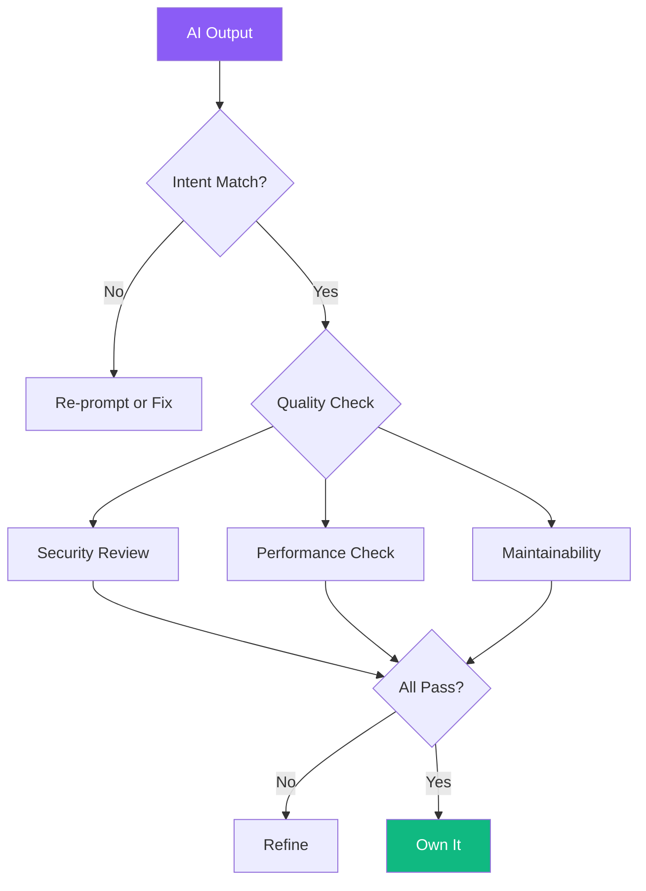
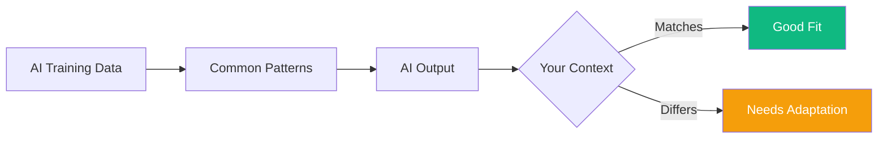
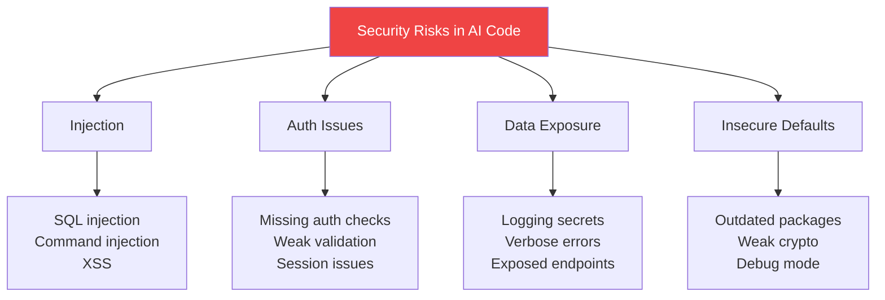
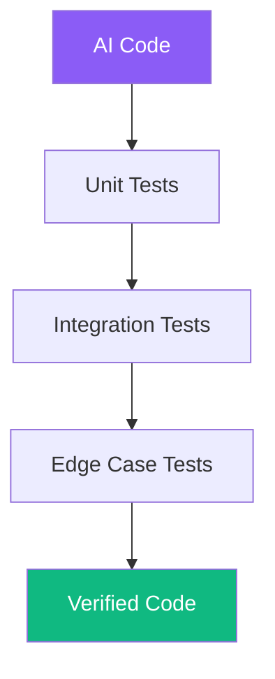

AI coding tools can generate impressive amounts of code quickly, but speed without quality leads to technical debt. Reviewing AI-generated code requires a different mindset than reviewing human-written code. This guide covers practical techniques for ensuring AI output is correct, secure, and maintainable.

## The Review Mindset



### Treat AI Like a Junior Developer

Think of AI as an eager but inexperienced team member:
- Fast at producing code
- Good at common patterns
- May miss edge cases
- Doesn't understand business context
- Requires supervision

Every piece of AI code needs human verification before shipping.

## Step 1: Intent Verification

First, check if the code matches your requirements.

### Questions to Ask

| Area | Questions |
|------|-----------|
| Functionality | Does it do what I asked? |
| Completeness | Are all requirements addressed? |
| Interpretation | Did AI understand my intent correctly? |
| Assumptions | What assumptions did AI make? |

### Common Misinterpretations

```
You asked: "Sort users by name"
AI assumed: Alphabetical ascending, case-sensitive

You asked: "Validate the form"
AI assumed: Basic field presence checks only

You asked: "Handle errors"
AI assumed: Try-catch with generic message
```

## Step 2: The Majority Problem

AI generates code that looks like the most common solution in its training data. This isn't always the best solution for your context.



### Signs of "Majority Solution" Issues

| Pattern | Problem | Solution |
|---------|---------|----------|
| Generic variable names | Hard to understand | Rename to domain terms |
| Over-engineered | More complex than needed | Simplify |
| Under-engineered | Missing your requirements | Add missing logic |
| Wrong technology choice | Uses popular, not appropriate | Replace with correct one |

### Example

```javascript
// AI generated (common pattern)
function fetchData() {
  return fetch('/api/data')
    .then(res => res.json())
    .then(data => data);
}

// Your context needs error handling, auth, retries
async function fetchData() {
  const token = getAuthToken();

  for (let attempt = 0; attempt < 3; attempt++) {
    try {
      const res = await fetch('/api/data', {
        headers: { Authorization: `Bearer ${token}` }
      });

      if (!res.ok) {
        throw new Error(`HTTP ${res.status}`);
      }

      return await res.json();
    } catch (error) {
      if (attempt === 2) throw error;
      await delay(1000 * Math.pow(2, attempt));
    }
  }
}
```

## Step 3: Security Review

AI-generated code often contains security vulnerabilities. Always check these areas.

### Common Vulnerabilities



### Security Checklist

| Category | Check For |
|----------|-----------|
| Input Validation | All inputs sanitized and validated? |
| SQL/NoSQL | Using parameterized queries? |
| Authentication | Proper auth checks on all routes? |
| Authorization | Access control verified? |
| Secrets | No hardcoded credentials? |
| Dependencies | Known vulnerable packages? |
| Error Handling | No sensitive info in errors? |

### Red Flags in AI Code

```javascript
// RED FLAG: SQL injection vulnerability
const query = `SELECT * FROM users WHERE id = ${userId}`;

// RED FLAG: Hardcoded secret
const API_KEY = "sk-abc123...";

// RED FLAG: Missing auth check
app.get('/admin/users', (req, res) => {
  // Should verify admin role first!
  return db.getAllUsers();
});

// RED FLAG: Sensitive data in logs
console.log('Login attempt:', { email, password });
```

## Step 4: Performance Analysis

AI often generates correct but inefficient code.

### Common Performance Issues

| Issue | Example | Fix |
|-------|---------|-----|
| N+1 queries | Loop with DB call inside | Batch or join |
| Memory bloat | Loading everything to filter | Query-level filter |
| Sync in async | Blocking I/O operations | Proper async patterns |
| Repeated computation | Same calculation in loop | Memoization |

### Example: N+1 Problem

```javascript
// AI generated (N+1 problem)
async function getOrdersWithProducts(userId) {
  const orders = await Order.find({ userId });

  for (const order of orders) {
    order.products = await Product.find({
      _id: { $in: order.productIds }
    });
  }

  return orders;
}

// Optimized version
async function getOrdersWithProducts(userId) {
  const orders = await Order.find({ userId });

  const allProductIds = orders.flatMap(o => o.productIds);
  const products = await Product.find({
    _id: { $in: allProductIds }
  });

  const productMap = new Map(
    products.map(p => [p._id.toString(), p])
  );

  return orders.map(order => ({
    ...order.toObject(),
    products: order.productIds.map(id =>
      productMap.get(id.toString())
    )
  }));
}
```

## Step 5: Maintainability Check

Code you can't understand later becomes liability.

### Code Clarity Review

```
Ask yourself:
├── Can I understand this without AI explanation?
├── Will teammates understand it?
├── Are variable names meaningful?
├── Is the structure logical?
└── Are there comments where needed?
```

### Naming Conventions

```javascript
// AI generated (generic)
const d = getData();
const r = d.filter(x => x.a > 10);
const m = r.map(i => i.b);

// Meaningful names
const users = fetchActiveUsers();
const adultUsers = users.filter(user => user.age > 18);
const userEmails = adultUsers.map(user => user.email);
```

### Structure Assessment

| Good Signs | Bad Signs |
|------------|-----------|
| Single responsibility | God functions/classes |
| Clear data flow | Tangled dependencies |
| Consistent style | Mixed patterns |
| Appropriate abstraction | Over/under abstraction |

## Step 6: Testing AI-Generated Code

Never trust AI code without tests.

### Testing Strategy



### What to Test

| Test Type | Focus |
|-----------|-------|
| Happy path | Does it work as expected? |
| Edge cases | Empty inputs, nulls, boundaries |
| Error cases | How does it fail? |
| Integration | Works with real dependencies? |

### Let AI Help Write Tests

```
Prompt: "Write unit tests for this function, including:
- Normal operation
- Empty input
- Invalid input
- Boundary conditions
- Error handling"
```

Then review the tests for completeness!

## The Review Workflow

### Quick Review (5 minutes)

```
1. Skim the code structure
2. Check for obvious security issues
3. Verify it compiles/runs
4. Test the happy path manually
```

### Full Review (30+ minutes)

```
1. Intent verification
2. Line-by-line reading
3. Security audit
4. Performance analysis
5. Maintainability check
6. Write/run tests
7. Document changes
```

### When to Do What

| Scenario | Review Level |
|----------|--------------|
| Prototype/POC | Quick |
| Production feature | Full |
| Security-critical | Full + security specialist |
| Performance-critical | Full + benchmarking |

## Refactoring AI Code

### When to Refactor

```
Refactor when:
├── Code is correct but unclear
├── Better patterns exist for your context
├── Performance is inadequate
├── Style doesn't match codebase
└── Abstractions are wrong level
```

### Refactoring Example

```javascript
// AI generated (works but unclear)
function proc(d) {
  let r = [];
  for (let i = 0; i < d.length; i++) {
    if (d[i].s === 'A' && d[i].v > 100) {
      r.push({ n: d[i].n, t: d[i].v * 0.1 });
    }
  }
  return r;
}

// Refactored for clarity
function calculateActiveTaxes(orders) {
  const TAX_RATE = 0.1;
  const MINIMUM_VALUE = 100;

  return orders
    .filter(order =>
      order.status === 'ACTIVE' &&
      order.value > MINIMUM_VALUE
    )
    .map(order => ({
      name: order.name,
      tax: order.value * TAX_RATE
    }));
}
```

## Summary: The Review Checklist

| Stage | Key Actions |
|-------|-------------|
| 1. Intent | Does it match requirements? |
| 2. Majority | Is common solution right for you? |
| 3. Security | Check OWASP Top 10 vulnerabilities |
| 4. Performance | Identify N+1, memory, async issues |
| 5. Maintainability | Clear names, structure, comments |
| 6. Testing | Unit, integration, edge cases |
| 7. Ownership | You understand and can modify it |

The goal isn't just working code—it's code you own, understand, and can confidently maintain. AI is your draft writer; you're the editor who ensures quality before publication.

## References

- Osmani, Addy. *Beyond Vibe Coding*. O'Reilly Media, 2025.
- OWASP Foundation. "OWASP Top Ten." 2024.
