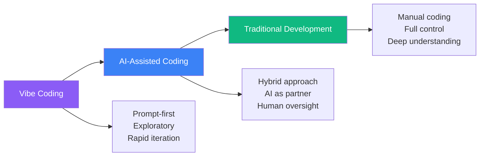
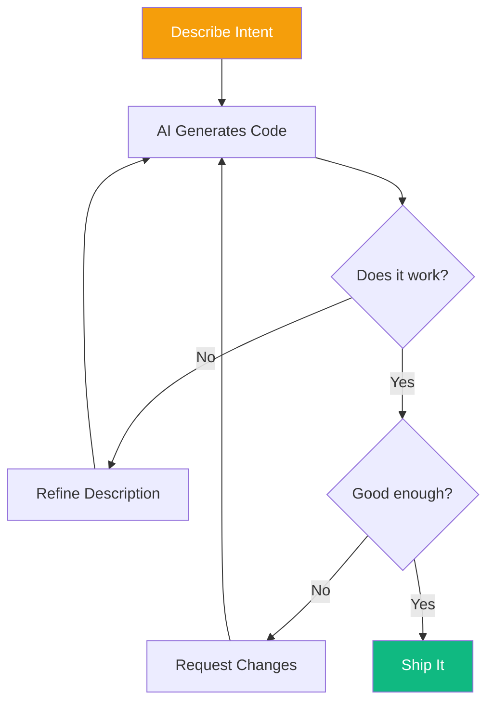
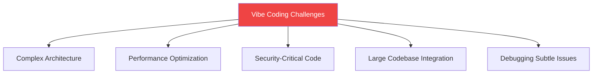
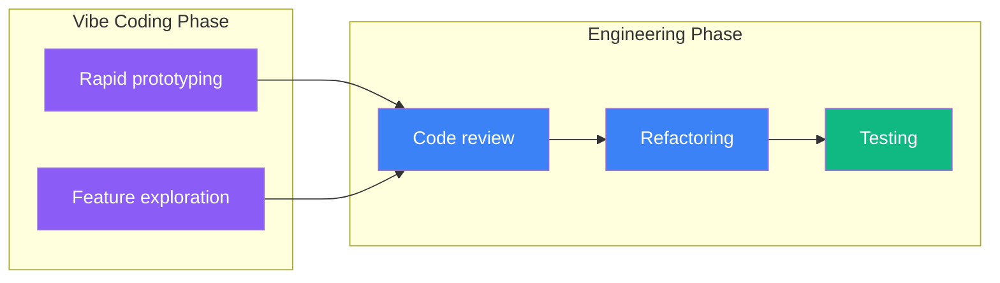

Imagine writing software by simply describing what you want it to do—almost like talking to a teammate—while an AI translates your ideas into code. This is vibe coding, a term coined by AI pioneer Andrej Karpathy to describe a prompt-first, exploratory approach to programming where developers "fully give in to the vibes" of AI assistance.

## The AI Coding Spectrum

AI-assisted development exists on a spectrum, from loose exploration to structured engineering:



### Vibe Coding Approach

In vibe coding, you:
- Describe functionality in natural language
- Let AI generate initial implementation
- Iterate through conversation
- Accept "good enough" solutions
- Prioritize speed over perfection

### AI-Assisted Engineering Approach

In structured AI-assisted development:
- Plan architecture before prompting
- Review and understand all generated code
- Maintain full codebase comprehension
- Use AI as a productivity tool, not replacement
- Prioritize maintainability

## How Vibe Coding Works



### Example Conversation

```
You: Create a React component that displays a list of users with
their names and emails. Add a search box to filter users.

AI: [Generates component code]

You: The search should be case-insensitive and also filter by email.

AI: [Updates the code]

You: Add loading and error states.

AI: [Adds loading spinner and error handling]

You: Perfect, that works!
```

## When Vibe Coding Shines

### Ideal Use Cases

| Use Case | Why It Works |
|----------|--------------|
| Prototypes | Speed over polish |
| One-off scripts | Disposable code |
| Learning projects | Exploration mode |
| Hackathons | Time pressure |
| Internal tools | Lower quality bar |
| Proof of concepts | Validate ideas fast |

### Example: Quick Prototype

```
Prompt: Create a simple expense tracker app with:
- Add/delete expenses with amount and category
- Show total by category
- Display as a pie chart
- Use localStorage for persistence

Just make it work, don't worry about perfect code structure.
```

This prompt can generate a working prototype in minutes that would take hours to code manually.

## Where Vibe Coding Struggles

### Limitations



| Challenge | Why It's Hard |
|-----------|---------------|
| Complex systems | AI lacks full context |
| Performance tuning | Requires deep analysis |
| Security | AI may miss vulnerabilities |
| Legacy integration | Needs existing code understanding |
| Debugging | AI doesn't see runtime behavior |

### The 70% Problem

AI can often get you 70% of the way to a solution quickly, but the last 30% requires human expertise:

```
Initial AI output: 70% functional
+ Debugging: 80%
+ Edge cases: 90%
+ Production readiness: 100%

The last 30% often takes more time than the first 70%.
```

## The Vibe Coder's Toolkit

### Essential Skills

1. **Prompt clarity**: Describe intent precisely
2. **Iteration speed**: Quick feedback loops
3. **Code reading**: Understand what AI generates
4. **Pattern recognition**: Spot common AI mistakes
5. **Knowing when to stop**: Accept good enough

### Effective Prompting for Code

```
Good prompt structure:
1. Context: What you're building
2. Requirements: Specific functionality
3. Constraints: Technology, style, limitations
4. Examples: Input/output samples
5. Quality notes: What matters, what doesn't
```

Example:
```
Context: Building a REST API with Express.js
Requirements:
- POST /users endpoint to create users
- Validate email format and required fields
- Return appropriate HTTP status codes
Constraints:
- Use async/await
- No database, just in-memory array
Quality: Working code, don't need extensive error handling
```

## Balancing Vibes and Engineering

The best approach often combines both mindsets:



### Workflow Recommendation

1. **Start with vibes**: Get something working
2. **Validate the approach**: Does the prototype prove the concept?
3. **Shift to engineering**: Review, refactor, test
4. **Iterate**: Use AI for specific improvements
5. **Own the code**: Understand every line you ship

## Summary

| Aspect | Vibe Coding | Traditional |
|--------|-------------|-------------|
| Speed | Very fast | Slower |
| Control | Less | Full |
| Understanding | May be partial | Complete |
| Best for | Prototypes, learning | Production systems |
| Risk | Technical debt | Over-engineering |

Vibe coding is a powerful tool when used appropriately. Embrace it for rapid exploration and prototyping, but know when to shift into engineering mode for code that needs to be maintained, scaled, or secured.

The future likely involves fluid movement between these approaches—knowing when to let the vibes flow and when to take back control.

## References

- Osmani, Addy. *Beyond Vibe Coding*. O'Reilly Media, 2025.
- Karpathy, Andrej. "There's a new kind of coding emerging..." Twitter/X, 2024.
