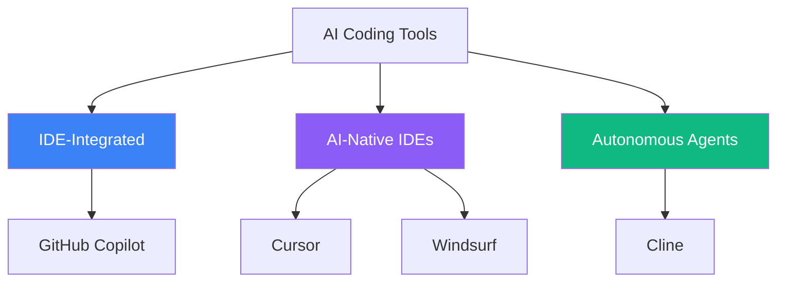
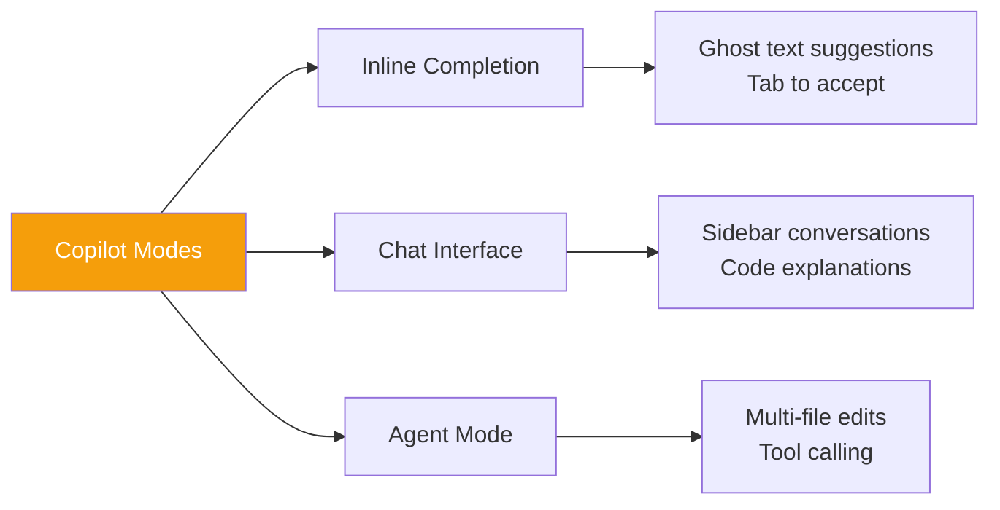
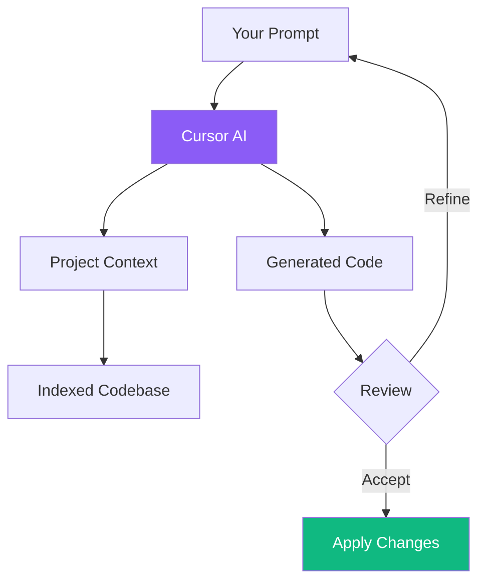
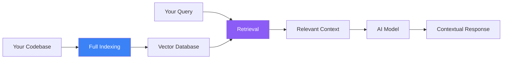
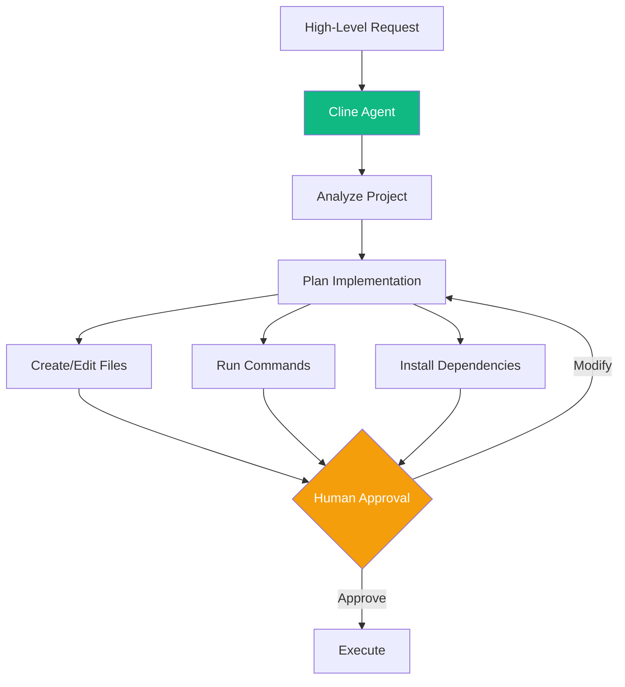
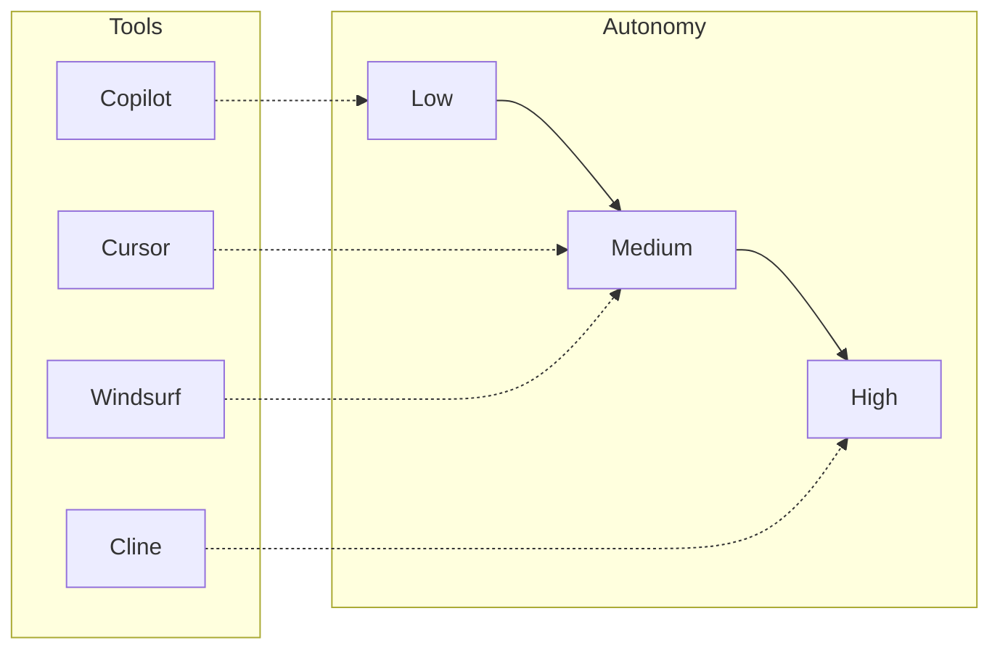
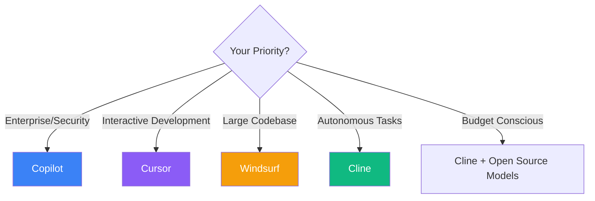

The AI coding tool landscape has exploded with options, each offering unique approaches to AI-assisted development. Understanding their differences helps you choose the right tool—or combination of tools—for your workflow.

## The AI Coding Tool Ecosystem



### Tool Categories

| Category | Tools | Approach |
|----------|-------|----------|
| IDE-Integrated | Copilot | AI as an add-on to existing editor |
| AI-Native IDEs | Cursor, Windsurf | Editor built around AI capabilities |
| Autonomous Agents | Cline | AI as an independent coding agent |

## GitHub Copilot: The Industry Standard

GitHub Copilot integrates deeply into VSCode, providing AI assistance within Microsoft's popular editor ecosystem.

### Key Features



**Strengths:**
- Seamless VSCode integration
- Familiar environment for existing VSCode users
- Enterprise-grade security and compliance
- Model Context Protocol (MCP) support for extensibility

**Workflow Example:**

```
1. Start typing a function signature
2. Copilot suggests the implementation (ghost text)
3. Press Tab to accept, or keep typing to refine
4. Use chat sidebar for complex questions
5. Agent mode for multi-file changes
```

### When to Use Copilot

| Scenario | Effectiveness |
|----------|---------------|
| Code completion while typing | Excellent |
| Enterprise environments | Excellent |
| Existing VSCode workflows | Excellent |
| Complex refactoring | Good |
| Full project generation | Limited |

## Cursor: The AI-First Editor

Cursor reimagines the IDE with AI at its core. As a fork of VSCode, it feels familiar but adds powerful AI-native features.

### Architecture



**Key Differentiators:**
- Project-aware suggestions (indexes your codebase)
- Composer mode for multi-step generation
- Direct code editing via natural language
- Multiple model support (Claude, GPT-4, etc.)

### Cursor Workflow

```
You: "Add user authentication with email/password to this React app"

Cursor: [Analyzes project structure]
        [Generates auth components]
        [Creates API endpoints]
        [Updates routing]

You: "Use Tailwind for the login form styling"

Cursor: [Updates with Tailwind classes]

You: "Handle the case where email is already registered"

Cursor: [Adds error handling and validation]
```

### Cursor Modes

| Mode | Purpose | Best For |
|------|---------|----------|
| Chat | Conversation about code | Questions, explanations |
| Edit | Direct code modifications | Targeted changes |
| Composer | Multi-file generation | Features, refactoring |

## Windsurf: The Codebase-Aware IDE

Windsurf excels at understanding large codebases through advanced indexing and retrieval.

### How Windsurf Works



**Key Features:**
- Retrieval-Augmented Generation (RAG) for code
- Full codebase indexing
- Write mode for automatic file changes
- Cascade view for complex operations

### Windsurf Strengths

```
Codebase Q&A:
"Where is the user authentication logic handled?"
→ Points to exact files and functions

Global Context:
"Refactor the payment module to use our new logging utility"
→ Knows about both modules, makes consistent changes

Multi-file Operations:
"Add phone-based 2FA to the login flow"
→ Updates database, API, and frontend coherently
```

### Windsurf vs Cursor

| Aspect | Cursor | Windsurf |
|--------|--------|----------|
| Philosophy | AI pair programmer | Codebase-aware assistant |
| Context handling | Selected files + prompt | Full indexed codebase |
| Change application | Review then apply | Automatic in Write mode |
| Speed | Fast | Very fast |
| Best for | Interactive development | Large project navigation |

## Cline: The Autonomous Agent

Cline (formerly Claude Dev) transforms VSCode into an autonomous coding environment. Unlike assistants that suggest, Cline can execute.

### Agent Architecture



**Unique Capabilities:**
- Multi-step task execution
- File creation and modification
- Terminal command execution
- Browser automation for research
- MCP integration for external services

### Cline Workflow

```
You: "Create a REST API for user management with authentication"

Cline: [Plans implementation]
       ├── Create folder structure
       ├── Install express, jsonwebtoken, bcrypt
       ├── Create user model
       ├── Implement auth endpoints
       ├── Add middleware
       └── Create tests

       [Shows each action for approval]

You: [Approve each step or modify]

Cline: [Executes approved actions]
       [Reports completion with summary]
```

### Human-in-the-Loop Design

Cline shows every planned action before execution:

| Action Type | What Cline Shows | Your Options |
|-------------|------------------|--------------|
| File creation | File path and content | Approve, Edit, Skip |
| File modification | Diff view | Approve, Edit, Skip |
| Terminal command | Exact command | Approve, Modify, Skip |
| Dependency install | Package list | Approve, Review, Skip |

## Tool Comparison Matrix



### Feature Comparison

| Feature | Copilot | Cursor | Windsurf | Cline |
|---------|---------|--------|----------|-------|
| Inline completion | Excellent | Good | Good | N/A |
| Chat interface | Yes | Yes | Yes | Yes |
| Multi-file edits | Agent mode | Composer | Write mode | Native |
| Codebase indexing | Limited | Yes | Excellent | Yes |
| Terminal execution | No | No | No | Yes |
| Model flexibility | Limited | High | Medium | High |
| Open source | No | No | No | Yes |

## Choosing the Right Tool

### Decision Framework



### Use Case Recommendations

| Use Case | Best Tool | Why |
|----------|-----------|-----|
| Day-to-day coding | Copilot | Minimal friction, great autocomplete |
| Feature development | Cursor | Interactive refinement, good context |
| Legacy codebase exploration | Windsurf | Superior indexing and search |
| Scaffolding new projects | Cline | Autonomous setup and configuration |
| Learning/experimentation | Cursor | Great explanations, iterative |

## Portfolio Approach

Many developers use multiple tools strategically:

```
Morning: Feature Development
→ Cursor for interactive coding and refactoring

Afternoon: Bug Investigation
→ Windsurf to search through codebase for root cause

Evening: New Project Setup
→ Cline to scaffold and configure project structure

Throughout: Quick Edits
→ Copilot for fast completions while typing
```

## Model Selection

Each tool supports different AI models:

| Tool | Available Models | Default |
|------|------------------|---------|
| Copilot | GPT-4, Claude (preview) | GPT-4 |
| Cursor | Claude, GPT-4, Gemini | Claude |
| Windsurf | Multiple | Varies |
| Cline | Claude, GPT-4, Gemini, Local | User choice |

### Model Matching

```
Complex reasoning → Claude
Fast responses → GPT-4 Turbo
Large context → Gemini
Privacy sensitive → Local models (Ollama)
```

## Summary

| Tool | Best For | Trade-off |
|------|----------|-----------|
| Copilot | Enterprise, existing VSCode users | Less autonomous |
| Cursor | Interactive feature development | Subscription cost |
| Windsurf | Large codebase navigation | Learning curve |
| Cline | Autonomous task execution | Requires oversight |

The AI coding landscape continues to evolve rapidly. Rather than choosing a single tool, consider building a toolkit that leverages each tool's strengths. The best developers use AI strategically—knowing when each tool excels and when to take manual control.

## References

- Osmani, Addy. *Beyond Vibe Coding*. O'Reilly Media, 2025.
- Morgan, Jeremy. *Coding with AI*. Manning Publications, 2025.
- Wienholt, Nick. *GitHub Copilot and AI Coding Tools in Practice*. Apress, 2025.
