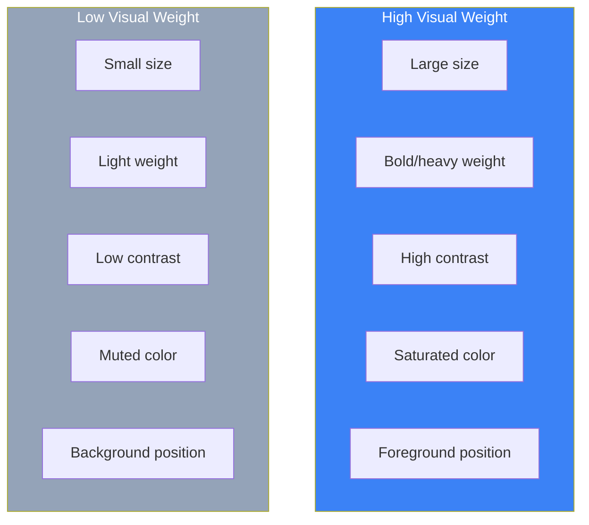
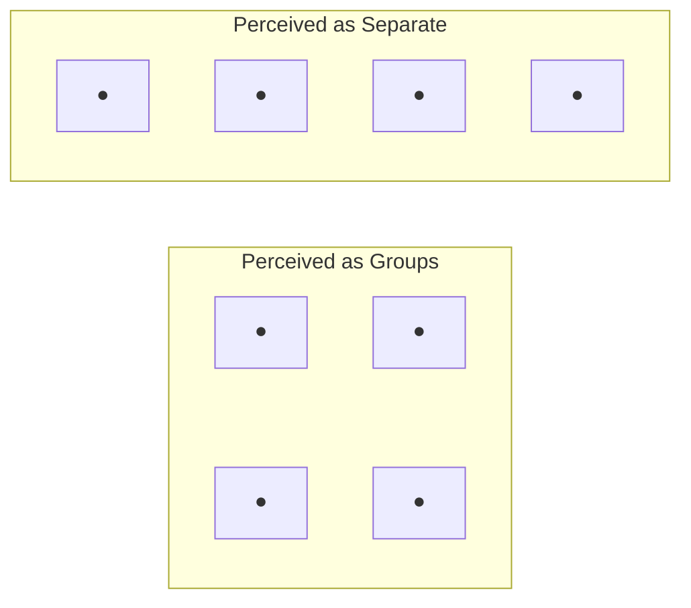
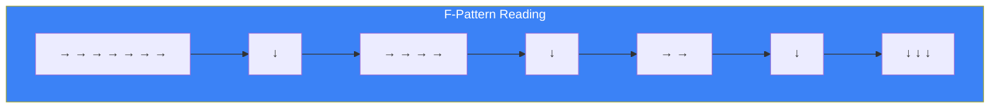
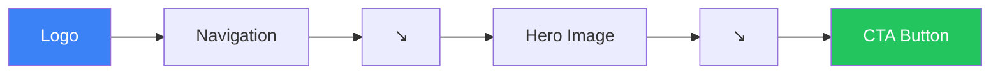

## Introduction

A well-designed interface doesn't require users to read every word or think about where to look. Through visual hierarchy and Gestalt principles, you can guide users' attention and communicate structure instantly.

Visual hierarchy determines what users see first, second, and third. Gestalt principles explain how humans naturally group and interpret visual elements. Together, they form the foundation of effective layout design.

## Visual Hierarchy

Visual hierarchy is the arrangement of elements to show their order of importance. Users should be able to deduce the informational structure from layout alone.

### What Makes Things Look Important?

Several visual properties contribute to perceived importance:



### Visual Weight Factors

| Factor | High Importance | Low Importance |
|--------|-----------------|----------------|
| Size | Large | Small |
| Weight | Bold | Light |
| Color | Saturated, warm | Muted, cool |
| Contrast | High against background | Low against background |
| Position | Top, left, center | Bottom, edges |
| Whitespace | Surrounded by space | Crowded |
| Detail | Complex, detailed | Simple, plain |

### Creating Hierarchy in CSS

```css
/* Primary heading - highest visual weight */
.heading-primary {
  font-size: 2.5rem;
  font-weight: 800;
  color: #111827;
  line-height: 1.2;
}

/* Secondary heading */
.heading-secondary {
  font-size: 1.75rem;
  font-weight: 700;
  color: #1f2937;
  line-height: 1.3;
}

/* Tertiary heading */
.heading-tertiary {
  font-size: 1.25rem;
  font-weight: 600;
  color: #374151;
  line-height: 1.4;
}

/* Body text - lowest hierarchy level */
.body-text {
  font-size: 1rem;
  font-weight: 400;
  color: #4b5563;
  line-height: 1.6;
}

/* De-emphasized text */
.text-muted {
  font-size: 0.875rem;
  font-weight: 400;
  color: #9ca3af;
}
```

### Hierarchy in Practice

```tsx
function ProductCard({ product }) {
  return (
    <article className="p-6 bg-white rounded-lg shadow">
      {/* Primary: Product name - largest, boldest */}
      <h2 className="text-xl font-bold text-gray-900">
        {product.name}
      </h2>

      {/* Secondary: Price - prominent but smaller */}
      <p className="mt-2 text-lg font-semibold text-blue-600">
        ${product.price}
      </p>

      {/* Tertiary: Description - normal weight */}
      <p className="mt-2 text-gray-600">
        {product.description}
      </p>

      {/* Quaternary: Metadata - smallest, muted */}
      <p className="mt-4 text-sm text-gray-400">
        SKU: {product.sku} • {product.stock} in stock
      </p>

      {/* Action: High contrast button */}
      <button className="mt-4 w-full py-2 bg-blue-600 text-white
                         font-medium rounded hover:bg-blue-700">
        Add to Cart
      </button>
    </article>
  );
}
```

## Gestalt Principles

Gestalt psychology explains how humans perceive patterns and organize visual information. These principles are fundamental to interface design.

### 1. Proximity

Elements that are close together are perceived as a group.



**Implementation:**

```tsx
function FormSection() {
  return (
    <form>
      {/* Shipping fields - grouped by proximity */}
      <div className="space-y-3 mb-8">
        <h3 className="font-semibold">Shipping Address</h3>
        <input placeholder="Street address" />
        <input placeholder="City" />
        <input placeholder="Postal code" />
      </div>

      {/* Payment fields - separate group via spacing */}
      <div className="space-y-3 mb-8">
        <h3 className="font-semibold">Payment Details</h3>
        <input placeholder="Card number" />
        <input placeholder="Expiry" />
        <input placeholder="CVV" />
      </div>
    </form>
  );
}
```

```css
/* Use consistent spacing to indicate grouping */
.form-group {
  margin-bottom: 2rem; /* Large gap between groups */
}

.form-group > * + * {
  margin-top: 0.75rem; /* Small gap within groups */
}
```

### 2. Similarity

Elements that look similar are perceived as related.

```tsx
function StatusIndicators() {
  return (
    <div className="flex gap-4">
      {/* Similar style = same category */}
      <span className="px-2 py-1 bg-green-100 text-green-800 rounded">
        Active
      </span>
      <span className="px-2 py-1 bg-green-100 text-green-800 rounded">
        Verified
      </span>

      {/* Different style = different category */}
      <span className="px-2 py-1 bg-red-100 text-red-800 rounded">
        Overdue
      </span>
    </div>
  );
}

function NavigationMenu() {
  return (
    <nav>
      {/* Primary nav - similar styling */}
      <div className="flex gap-4 text-gray-900 font-medium">
        <a href="/">Home</a>
        <a href="/products">Products</a>
        <a href="/about">About</a>
      </div>

      {/* Utility nav - different styling indicates different purpose */}
      <div className="flex gap-4 text-gray-500 text-sm">
        <a href="/help">Help</a>
        <a href="/contact">Contact</a>
      </div>
    </nav>
  );
}
```

### 3. Closure

The mind completes incomplete shapes, perceiving them as whole.

```tsx
// Users perceive cards as complete units even without full borders
function Card({ children }) {
  return (
    <div className="bg-white rounded-lg shadow-sm p-4">
      {/* Shadow and background create implicit boundary */}
      {children}
    </div>
  );
}

// Progress indicator uses closure
function ProgressRing({ progress }) {
  const circumference = 2 * Math.PI * 40;
  const offset = circumference - (progress / 100) * circumference;

  return (
    <svg width="100" height="100">
      {/* Background circle provides closure context */}
      <circle
        cx="50" cy="50" r="40"
        fill="none"
        stroke="#e5e7eb"
        strokeWidth="8"
      />
      {/* Partial arc - mind completes the circle */}
      <circle
        cx="50" cy="50" r="40"
        fill="none"
        stroke="#3b82f6"
        strokeWidth="8"
        strokeDasharray={circumference}
        strokeDashoffset={offset}
        transform="rotate(-90 50 50)"
      />
    </svg>
  );
}
```

### 4. Continuity

Elements arranged in a line or curve are perceived as related.

```tsx
function StepIndicator({ steps, currentStep }) {
  return (
    <div className="flex items-center">
      {steps.map((step, index) => (
        <React.Fragment key={step.id}>
          {/* Step circle */}
          <div className={`
            w-8 h-8 rounded-full flex items-center justify-center
            ${index <= currentStep
              ? 'bg-blue-600 text-white'
              : 'bg-gray-200 text-gray-600'
            }
          `}>
            {index + 1}
          </div>

          {/* Connecting line creates continuity */}
          {index < steps.length - 1 && (
            <div className={`
              h-1 w-16
              ${index < currentStep ? 'bg-blue-600' : 'bg-gray-200'}
            `} />
          )}
        </React.Fragment>
      ))}
    </div>
  );
}

// Breadcrumbs use continuity
function Breadcrumbs({ items }) {
  return (
    <nav className="flex items-center gap-2 text-sm">
      {items.map((item, index) => (
        <React.Fragment key={item.href}>
          <a href={item.href} className="text-gray-600 hover:text-gray-900">
            {item.label}
          </a>
          {/* Separator creates visual continuity */}
          {index < items.length - 1 && (
            <span className="text-gray-400">/</span>
          )}
        </React.Fragment>
      ))}
    </nav>
  );
}
```

### 5. Common Region

Elements within a boundary are perceived as a group.

```tsx
function FeatureComparison({ plans }) {
  return (
    <div className="grid grid-cols-3 gap-4">
      {plans.map(plan => (
        // Each card creates a common region
        <div
          key={plan.id}
          className="border rounded-lg p-6 bg-white"
        >
          <h3 className="text-xl font-bold">{plan.name}</h3>
          <p className="text-3xl font-bold mt-2">${plan.price}</p>

          {/* Nested region for features */}
          <div className="mt-4 p-4 bg-gray-50 rounded">
            <ul className="space-y-2">
              {plan.features.map(feature => (
                <li key={feature}>✓ {feature}</li>
              ))}
            </ul>
          </div>

          <button className="mt-4 w-full btn-primary">
            Choose {plan.name}
          </button>
        </div>
      ))}
    </div>
  );
}
```

### 6. Figure-Ground

Users distinguish between foreground (figure) and background (ground).

```tsx
// Modal uses figure-ground separation
function Modal({ isOpen, onClose, children }) {
  if (!isOpen) return null;

  return (
    <>
      {/* Ground: dimmed background */}
      <div
        className="fixed inset-0 bg-black/50"
        onClick={onClose}
      />

      {/* Figure: elevated modal */}
      <div className="fixed inset-0 flex items-center justify-center">
        <div className="bg-white rounded-lg shadow-xl p-6 max-w-md
                        relative z-10">
          {children}
        </div>
      </div>
    </>
  );
}

// Dropdown uses figure-ground
function Dropdown({ trigger, items }) {
  const [isOpen, setIsOpen] = useState(false);

  return (
    <div className="relative">
      <button onClick={() => setIsOpen(!isOpen)}>
        {trigger}
      </button>

      {isOpen && (
        <>
          {/* Ground: click-away area */}
          <div
            className="fixed inset-0"
            onClick={() => setIsOpen(false)}
          />

          {/* Figure: dropdown menu with elevation */}
          <div className="absolute top-full mt-2 bg-white rounded-lg
                          shadow-lg border z-10">
            {items.map(item => (
              <button
                key={item.id}
                className="block w-full px-4 py-2 text-left
                           hover:bg-gray-100"
              >
                {item.label}
              </button>
            ))}
          </div>
        </>
      )}
    </div>
  );
}
```

## Visual Flow

Visual flow is the path users' eyes naturally follow through a design.

### F-Pattern for Text-Heavy Pages



```tsx
function ArticlePage({ article }) {
  return (
    <article>
      {/* Top: Full-width headline catches horizontal scan */}
      <h1 className="text-3xl font-bold">{article.title}</h1>

      {/* Second scan: Important info in first paragraph */}
      <p className="text-lg text-gray-600 mt-4">
        {article.summary}
      </p>

      {/* Content: Key info at start of each section */}
      {article.sections.map(section => (
        <section key={section.id} className="mt-8">
          <h2 className="text-xl font-semibold">{section.title}</h2>
          <p className="mt-2">{section.content}</p>
        </section>
      ))}
    </article>
  );
}
```

### Z-Pattern for Minimal Content



```tsx
function LandingPage() {
  return (
    <div className="min-h-screen">
      {/* Top bar follows Z start */}
      <header className="flex justify-between items-center p-4">
        <Logo />                    {/* Top left: Z start */}
        <Navigation />              {/* Top right: Z moves right */}
      </header>

      {/* Hero follows Z diagonal */}
      <main className="flex flex-col items-center py-20">
        <h1 className="text-5xl font-bold text-center">
          Transform Your Workflow
        </h1>

        <p className="mt-4 text-xl text-gray-600 text-center max-w-2xl">
          The all-in-one platform for modern teams
        </p>

        {/* CTA at Z end - bottom right area */}
        <button className="mt-8 px-8 py-4 bg-blue-600 text-white
                           text-lg font-semibold rounded-lg">
          Get Started Free
        </button>
      </main>
    </div>
  );
}
```

## Progressive Disclosure

Show only essential information first, with more detail available on demand.

```tsx
function ProductDetails({ product }) {
  const [showSpecs, setShowSpecs] = useState(false);

  return (
    <div>
      {/* Level 1: Essential info always visible */}
      <h1>{product.name}</h1>
      <p className="text-2xl font-bold">${product.price}</p>
      <p>{product.shortDescription}</p>

      {/* Level 2: Expandable details */}
      <button
        onClick={() => setShowSpecs(!showSpecs)}
        className="mt-4 text-blue-600"
      >
        {showSpecs ? 'Hide' : 'Show'} specifications
      </button>

      {showSpecs && (
        <table className="mt-4">
          {Object.entries(product.specs).map(([key, value]) => (
            <tr key={key}>
              <td className="font-medium pr-4">{key}</td>
              <td>{value}</td>
            </tr>
          ))}
        </table>
      )}

      {/* Level 3: Link to full documentation */}
      <a href={`/products/${product.id}/docs`} className="block mt-4">
        View complete documentation →
      </a>
    </div>
  );
}
```

## Summary

| Principle | Key Insight | Design Application |
|-----------|-------------|-------------------|
| Visual Hierarchy | Size, weight, color indicate importance | Make primary content largest and boldest |
| Proximity | Close = related | Group related elements, separate unrelated |
| Similarity | Same style = same meaning | Use consistent styling for related elements |
| Closure | Mind completes shapes | Use cards, shadows for implicit boundaries |
| Continuity | Lines guide the eye | Use connectors in steps, breadcrumbs |
| Common Region | Boundaries group | Use containers to group content |
| Figure-Ground | Foreground stands out | Use overlays, shadows for modal content |
| Visual Flow | Eyes follow patterns | Use F/Z patterns to place important content |

These principles work together. A well-designed interface uses proximity and common region to group related content, similarity to show relationships, visual hierarchy to indicate importance, and visual flow to guide users through the intended path.

## References

- Tidwell, Jenifer, et al. "Designing Interfaces" (3rd Edition), Chapters 4-5
- Bradley, Steven. "Design Fundamentals: Elements, Attributes, and Principles"
- Gestalt Principles - Laws of UX
- Nielsen Norman Group - Visual Hierarchy
