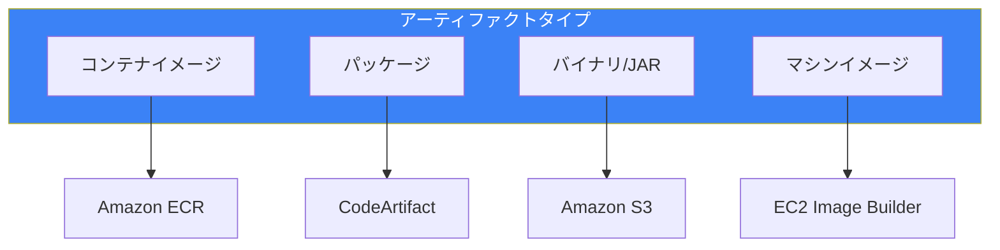
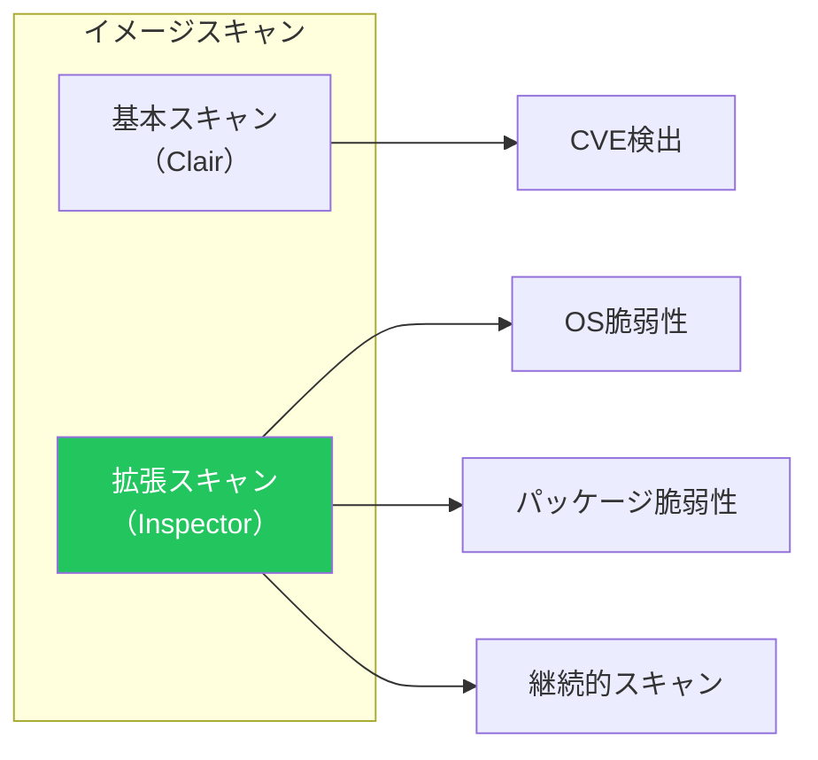
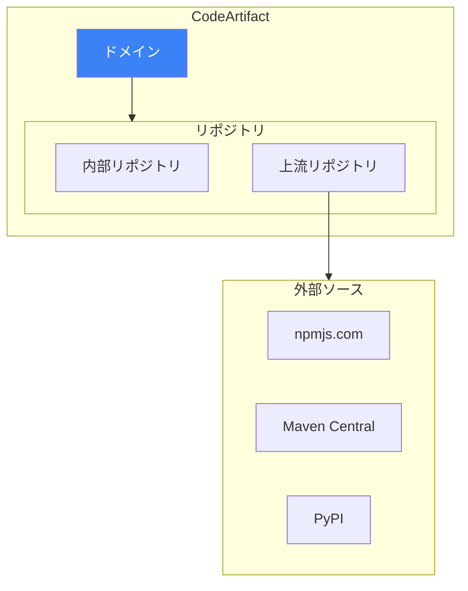
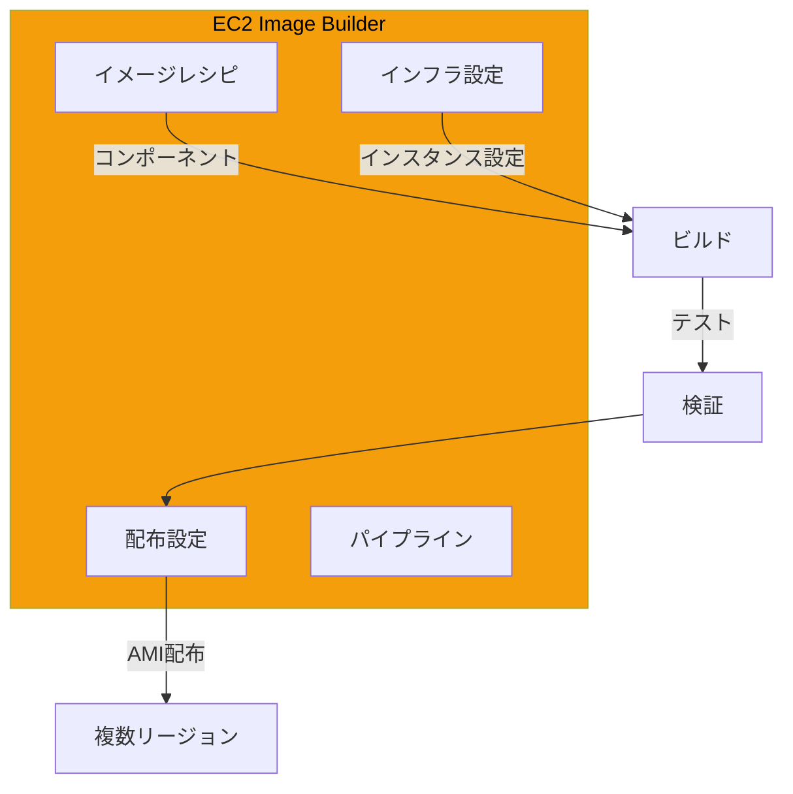
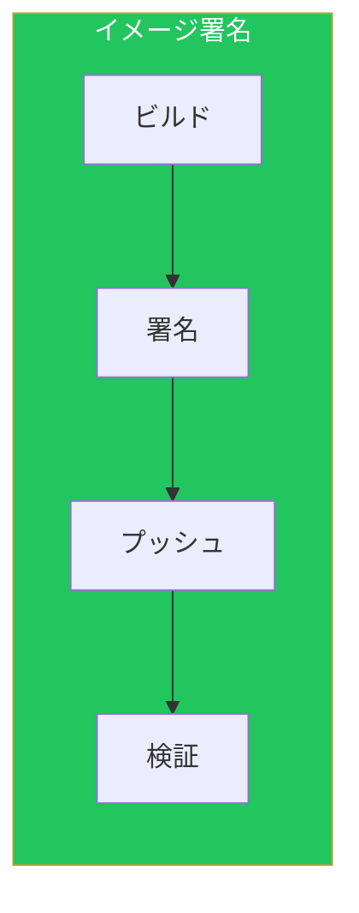
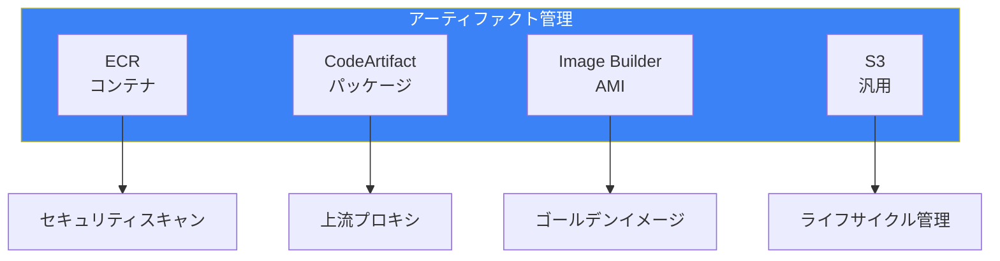

CI/CDパイプラインにおいて、アーティファクトの適切な管理は品質とセキュリティの要です。本記事では、AWSでのアーティファクト管理サービスと戦略を解説します。

## アーティファクト管理の全体像

### サービス比較



| サービス | 用途 | 対応形式 |
|---------|------|---------|
| ECR | コンテナイメージ | Docker, OCI |
| CodeArtifact | パッケージ管理 | npm, Maven, pip, NuGet |
| S3 | 汎用アーティファクト | 任意のファイル |
| EC2 Image Builder | AMI | Amazon Linux, Windows |

## Amazon ECR

### リポジトリ設定

```yaml
ECRRepository:
  Type: AWS::ECR::Repository
  Properties:
    RepositoryName: my-app
    ImageTagMutability: IMMUTABLE  # タグの上書き禁止
    ImageScanningConfiguration:
      ScanOnPush: true  # プッシュ時スキャン
    EncryptionConfiguration:
      EncryptionType: KMS
      KmsKey: !GetAtt KMSKey.Arn
    Tags:
      - Key: Environment
        Value: production
```

### ライフサイクルポリシー

```json
{
  "rules": [
    {
      "rulePriority": 1,
      "description": "Keep last 10 production images",
      "selection": {
        "tagStatus": "tagged",
        "tagPrefixList": ["prod-", "release-"],
        "countType": "imageCountMoreThan",
        "countNumber": 10
      },
      "action": {
        "type": "expire"
      }
    },
    {
      "rulePriority": 2,
      "description": "Delete untagged images older than 1 day",
      "selection": {
        "tagStatus": "untagged",
        "countType": "sinceImagePushed",
        "countUnit": "days",
        "countNumber": 1
      },
      "action": {
        "type": "expire"
      }
    },
    {
      "rulePriority": 3,
      "description": "Delete dev images older than 14 days",
      "selection": {
        "tagStatus": "tagged",
        "tagPrefixList": ["dev-", "feature-"],
        "countType": "sinceImagePushed",
        "countUnit": "days",
        "countNumber": 14
      },
      "action": {
        "type": "expire"
      }
    }
  ]
}
```

### イメージスキャン



```yaml
# 拡張スキャンの有効化
ECRScanningConfiguration:
  Type: AWS::ECR::RegistryPolicy
  Properties:
    PolicyText:
      rules:
        - repositoryFilters:
            - filter: "*"
              filterType: WILDCARD
          scanFrequency: CONTINUOUS_SCAN
```

### クロスアカウント/リージョン複製

```yaml
ECRReplicationConfiguration:
  Type: AWS::ECR::ReplicationConfiguration
  Properties:
    ReplicationConfiguration:
      Rules:
        - Destinations:
            - Region: us-west-2
              RegistryId: !Ref AWS::AccountId
            - Region: ap-northeast-1
              RegistryId: "222222222222"  # 別アカウント
          RepositoryFilters:
            - Filter: prod-
              FilterType: PREFIX_MATCH
```

### プルスルーキャッシュ

```yaml
# パブリックレジストリのキャッシュ
PullThroughCacheRule:
  Type: AWS::ECR::PullThroughCacheRule
  Properties:
    EcrRepositoryPrefix: ecr-public
    UpstreamRegistryUrl: public.ecr.aws
```

```bash
# 使用例: ECR Public経由でイメージ取得
docker pull 123456789012.dkr.ecr.ap-northeast-1.amazonaws.com/ecr-public/amazonlinux/amazonlinux:2023
```

## AWS CodeArtifact

### ドメインとリポジトリ



### セットアップ

```yaml
CodeArtifactDomain:
  Type: AWS::CodeArtifact::Domain
  Properties:
    DomainName: my-organization
    EncryptionKey: !GetAtt KMSKey.Arn
    Tags:
      - Key: Environment
        Value: production

CodeArtifactRepository:
  Type: AWS::CodeArtifact::Repository
  Properties:
    DomainName: !GetAtt CodeArtifactDomain.Name
    RepositoryName: my-packages
    Description: Internal packages repository
    ExternalConnections:
      - public:npmjs
    Upstreams:
      - !GetAtt UpstreamRepository.Name
```

### npm設定

```bash
# 認証トークン取得
aws codeartifact get-authorization-token \
    --domain my-organization \
    --domain-owner 123456789012 \
    --query authorizationToken \
    --output text

# npm設定
aws codeartifact login \
    --tool npm \
    --domain my-organization \
    --domain-owner 123456789012 \
    --repository my-packages

# .npmrc（自動生成される）
# registry=https://my-organization-123456789012.d.codeartifact.ap-northeast-1.amazonaws.com/npm/my-packages/
# //my-organization-123456789012.d.codeartifact.ap-northeast-1.amazonaws.com/npm/my-packages/:_authToken=${CODEARTIFACT_AUTH_TOKEN}
```

### Maven設定

```xml
<!-- settings.xml -->
<settings>
  <profiles>
    <profile>
      <id>codeartifact</id>
      <repositories>
        <repository>
          <id>codeartifact</id>
          <url>https://my-organization-123456789012.d.codeartifact.ap-northeast-1.amazonaws.com/maven/my-packages/</url>
        </repository>
      </repositories>
    </profile>
  </profiles>
  <servers>
    <server>
      <id>codeartifact</id>
      <username>aws</username>
      <password>${env.CODEARTIFACT_AUTH_TOKEN}</password>
    </server>
  </servers>
  <activeProfiles>
    <activeProfile>codeartifact</activeProfile>
  </activeProfiles>
</settings>
```

### CodeBuildでの使用

```yaml
version: 0.2

env:
  exported-variables:
    - CODEARTIFACT_AUTH_TOKEN

phases:
  pre_build:
    commands:
      # CodeArtifact認証
      - export CODEARTIFACT_AUTH_TOKEN=$(aws codeartifact get-authorization-token --domain my-organization --domain-owner $AWS_ACCOUNT_ID --query authorizationToken --output text)
      - aws codeartifact login --tool npm --domain my-organization --domain-owner $AWS_ACCOUNT_ID --repository my-packages

  build:
    commands:
      - npm ci
      - npm run build

  post_build:
    commands:
      # パッケージ公開
      - npm publish
```

## EC2 Image Builder

### パイプライン構成



### イメージレシピ

```yaml
ImageRecipe:
  Type: AWS::ImageBuilder::ImageRecipe
  Properties:
    Name: my-golden-image
    Version: 1.0.0
    ParentImage: arn:aws:imagebuilder:ap-northeast-1:aws:image/amazon-linux-2023-x86/x.x.x
    Components:
      # AWS提供コンポーネント
      - ComponentArn: arn:aws:imagebuilder:ap-northeast-1:aws:component/update-linux/x.x.x
      - ComponentArn: arn:aws:imagebuilder:ap-northeast-1:aws:component/amazon-cloudwatch-agent-linux/x.x.x
      # カスタムコンポーネント
      - ComponentArn: !Ref CustomComponent
    BlockDeviceMappings:
      - DeviceName: /dev/xvda
        Ebs:
          VolumeSize: 30
          VolumeType: gp3
          Encrypted: true
          KmsKeyId: !Ref KMSKey
    WorkingDirectory: /tmp
    Tags:
      BaseOS: AmazonLinux2023

CustomComponent:
  Type: AWS::ImageBuilder::Component
  Properties:
    Name: install-app-dependencies
    Version: 1.0.0
    Platform: Linux
    Data: |
      name: InstallAppDependencies
      schemaVersion: 1.0
      phases:
        - name: build
          steps:
            - name: InstallPackages
              action: ExecuteBash
              inputs:
                commands:
                  - dnf install -y docker git jq
                  - systemctl enable docker

            - name: InstallCodeDeployAgent
              action: ExecuteBash
              inputs:
                commands:
                  - dnf install -y ruby wget
                  - cd /tmp
                  - wget https://aws-codedeploy-ap-northeast-1.s3.amazonaws.com/latest/install
                  - chmod +x install
                  - ./install auto
                  - systemctl enable codedeploy-agent

        - name: validate
          steps:
            - name: ValidateInstallation
              action: ExecuteBash
              inputs:
                commands:
                  - docker --version
                  - systemctl is-enabled codedeploy-agent
```

### 配布設定

```yaml
DistributionConfiguration:
  Type: AWS::ImageBuilder::DistributionConfiguration
  Properties:
    Name: multi-region-distribution
    Distributions:
      - Region: ap-northeast-1
        AmiDistributionConfiguration:
          Name: my-app-{{ imagebuilder:buildDate }}
          Description: Golden AMI for my-app
          AmiTags:
            Name: my-app-golden
            BuildDate: "{{ imagebuilder:buildDate }}"
          LaunchPermissionConfiguration:
            UserIds:
              - "222222222222"  # 共有先アカウント
              - "333333333333"
      - Region: us-west-2
        AmiDistributionConfiguration:
          Name: my-app-{{ imagebuilder:buildDate }}
```

### パイプライン

```yaml
ImagePipeline:
  Type: AWS::ImageBuilder::ImagePipeline
  Properties:
    Name: weekly-golden-image
    ImageRecipeArn: !Ref ImageRecipe
    InfrastructureConfigurationArn: !Ref InfrastructureConfiguration
    DistributionConfigurationArn: !Ref DistributionConfiguration
    Schedule:
      ScheduleExpression: cron(0 0 ? * SUN *)  # 毎週日曜
      PipelineExecutionStartCondition: EXPRESSION_MATCH_AND_DEPENDENCY_UPDATES_AVAILABLE
    ImageTestsConfiguration:
      ImageTestsEnabled: true
      TimeoutMinutes: 60
    Status: ENABLED

InfrastructureConfiguration:
  Type: AWS::ImageBuilder::InfrastructureConfiguration
  Properties:
    Name: build-infrastructure
    InstanceProfileName: !Ref ImageBuilderInstanceProfile
    InstanceTypes:
      - m5.large
    SubnetId: !Ref PrivateSubnet
    SecurityGroupIds:
      - !Ref BuildSecurityGroup
    TerminateInstanceOnFailure: true
    Logging:
      S3Logs:
        S3BucketName: !Ref LogBucket
        S3KeyPrefix: image-builder/
```

## S3アーティファクト管理

### バージョニングとライフサイクル

```yaml
ArtifactBucket:
  Type: AWS::S3::Bucket
  Properties:
    BucketName: !Sub "${AWS::StackName}-artifacts"
    VersioningConfiguration:
      Status: Enabled
    LifecycleConfiguration:
      Rules:
        - Id: DeleteOldVersions
          Status: Enabled
          NoncurrentVersionExpiration:
            NoncurrentDays: 30
        - Id: MoveToGlacier
          Status: Enabled
          Transitions:
            - StorageClass: GLACIER
              TransitionInDays: 90
          TagFilters:
            - Key: Archive
              Value: "true"
        - Id: CleanupIncompleteUploads
          Status: Enabled
          AbortIncompleteMultipartUpload:
            DaysAfterInitiation: 7
    BucketEncryption:
      ServerSideEncryptionConfiguration:
        - ServerSideEncryptionByDefault:
            SSEAlgorithm: aws:kms
            KMSMasterKeyID: !Ref KMSKey
```

### アーティファクト構造

```
s3://my-artifacts/
├── releases/
│   ├── v1.0.0/
│   │   ├── app.jar
│   │   └── checksums.txt
│   └── v1.1.0/
│       ├── app.jar
│       └── checksums.txt
├── snapshots/
│   └── develop/
│       └── build-123/
│           └── app.jar
└── docker/
    └── my-app/
        └── v1.0.0/
            └── image.tar.gz
```

## セキュリティベストプラクティス

### イメージ署名



### ECRイメージ署名（Notation）

```bash
# 署名の作成
notation sign \
    123456789012.dkr.ecr.ap-northeast-1.amazonaws.com/my-app:v1.0.0 \
    --key my-signing-key

# 署名の検証
notation verify \
    123456789012.dkr.ecr.ap-northeast-1.amazonaws.com/my-app:v1.0.0 \
    --trust-policy trust-policy.json
```

### 脆弱性対応フロー

```yaml
# EventBridgeルール
ImageScanFindingsRule:
  Type: AWS::Events::Rule
  Properties:
    EventPattern:
      source:
        - aws.ecr
      detail-type:
        - ECR Image Scan
      detail:
        scan-status:
          - COMPLETE
        finding-severity-counts:
          CRITICAL:
            - numeric:
                - ">"
                - 0
    Targets:
      - Id: NotifySecurityTeam
        Arn: !Ref SecuritySNSTopic
      - Id: BlockDeployment
        Arn: !GetAtt BlockDeploymentLambda.Arn
```

## まとめ



| サービス | ベストプラクティス |
|---------|-------------------|
| ECR | イミュータブルタグ、スキャン有効化 |
| CodeArtifact | 上流接続、ドメイン分離 |
| Image Builder | 定期ビルド、テスト自動化 |
| S3 | バージョニング、ライフサイクル |

適切なアーティファクト管理により、セキュアで効率的なCI/CDパイプラインを実現できます。

## 参考資料

- [Amazon ECR User Guide](https://docs.aws.amazon.com/AmazonECR/latest/userguide/)
- [AWS CodeArtifact User Guide](https://docs.aws.amazon.com/codeartifact/latest/ug/)
- [EC2 Image Builder User Guide](https://docs.aws.amazon.com/imagebuilder/latest/userguide/)
