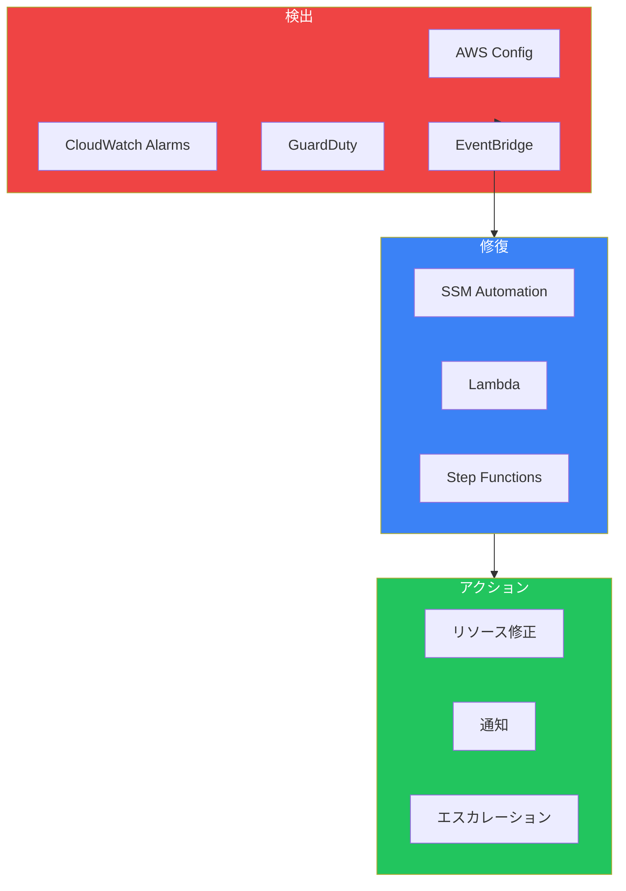
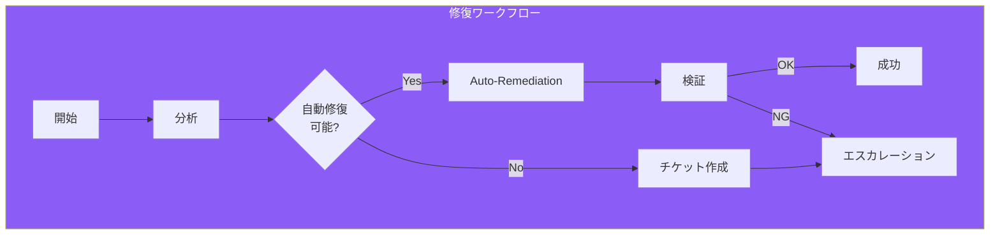
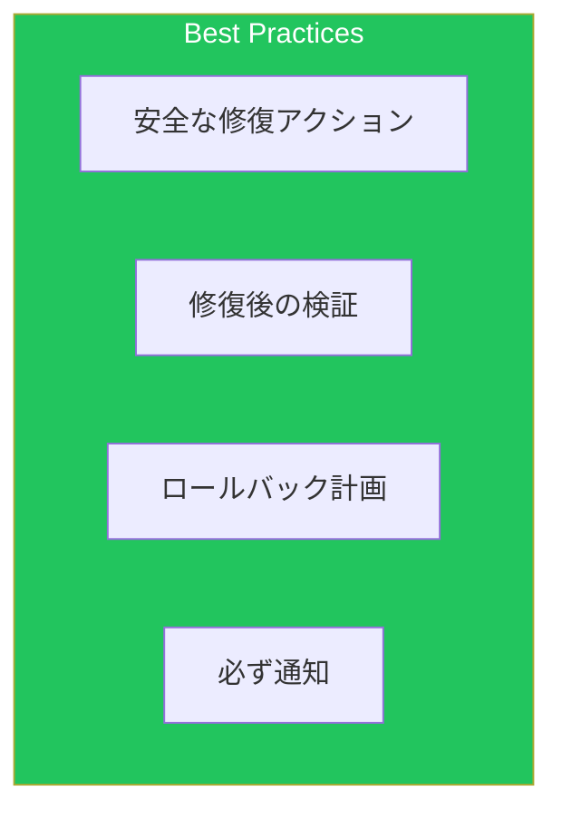

自動修復は、検出した問題を人手を介さずに解決する仕組みです。本記事では、AWSサービスを組み合わせた自動修復パターンを解説します。

## 自動修復アーキテクチャ



## AWS Config自動修復

### 修復設定

```yaml
# S3パブリックアクセスブロック修復
S3PublicAccessRule:
  Type: AWS::Config::ConfigRule
  Properties:
    ConfigRuleName: s3-bucket-public-read-prohibited
    Source:
      Owner: AWS
      SourceIdentifier: S3_BUCKET_PUBLIC_READ_PROHIBITED

S3PublicAccessRemediation:
  Type: AWS::Config::RemediationConfiguration
  Properties:
    ConfigRuleName: !Ref S3PublicAccessRule
    Automatic: true
    MaximumAutomaticAttempts: 5
    RetryAttemptSeconds: 60
    TargetId: AWS-DisableS3BucketPublicReadWrite
    TargetType: SSM_DOCUMENT
    TargetVersion: "1"
    Parameters:
      S3BucketName:
        ResourceValue:
          Value: RESOURCE_ID
      AutomationAssumeRole:
        StaticValue:
          Values:
            - !GetAtt RemediationRole.Arn

# EC2インスタンスIMDSv2強制
EC2IMDSv2Rule:
  Type: AWS::Config::ConfigRule
  Properties:
    ConfigRuleName: ec2-imdsv2-check
    Source:
      Owner: AWS
      SourceIdentifier: EC2_IMDSV2_CHECK

EC2IMDSv2Remediation:
  Type: AWS::Config::RemediationConfiguration
  Properties:
    ConfigRuleName: !Ref EC2IMDSv2Rule
    Automatic: true
    MaximumAutomaticAttempts: 3
    RetryAttemptSeconds: 60
    TargetId: !Ref EnforceIMDSv2Document
    TargetType: SSM_DOCUMENT
    Parameters:
      InstanceId:
        ResourceValue:
          Value: RESOURCE_ID
      AutomationAssumeRole:
        StaticValue:
          Values:
            - !GetAtt RemediationRole.Arn
```

### カスタムSSM Automationドキュメント

```yaml
EnforceIMDSv2Document:
  Type: AWS::SSM::Document
  Properties:
    DocumentType: Automation
    Content:
      schemaVersion: "0.3"
      description: "Enforce IMDSv2 on EC2 instances"
      assumeRole: "{{AutomationAssumeRole}}"
      parameters:
        InstanceId:
          type: String
        AutomationAssumeRole:
          type: String
      mainSteps:
        - name: ModifyInstanceMetadataOptions
          action: aws:executeAwsApi
          inputs:
            Service: ec2
            Api: ModifyInstanceMetadataOptions
            InstanceId: "{{InstanceId}}"
            HttpTokens: required
            HttpEndpoint: enabled
          isEnd: true

# EBS暗号化強制ドキュメント
EnableEBSEncryptionDocument:
  Type: AWS::SSM::Document
  Properties:
    DocumentType: Automation
    Content:
      schemaVersion: "0.3"
      description: "Enable EBS encryption by default"
      assumeRole: "{{AutomationAssumeRole}}"
      parameters:
        AutomationAssumeRole:
          type: String
      mainSteps:
        - name: EnableEBSEncryptionByDefault
          action: aws:executeAwsApi
          inputs:
            Service: ec2
            Api: EnableEbsEncryptionByDefault
        - name: VerifyEncryptionEnabled
          action: aws:executeAwsApi
          inputs:
            Service: ec2
            Api: GetEbsEncryptionByDefault
          outputs:
            - Name: EbsEncryptionByDefault
              Selector: $.EbsEncryptionByDefault
              Type: Boolean
          isEnd: true
```

## Lambda自動修復

### 修復Lambda関数

```python
import boto3
import json
import os
from datetime import datetime

ec2 = boto3.client('ec2')
config = boto3.client('config')
sns = boto3.client('sns')

ALERT_TOPIC = os.environ['ALERT_TOPIC_ARN']

def lambda_handler(event, context):
    """Config Ruleの非準拠リソースを自動修復"""

    # EventBridgeからのイベント解析
    detail = event.get('detail', {})
    resource_id = detail.get('resourceId')
    resource_type = detail.get('resourceType')
    compliance_type = detail.get('newEvaluationResult', {}).get('complianceType')

    if compliance_type != 'NON_COMPLIANT':
        return {'statusCode': 200, 'body': 'Resource is compliant'}

    # リソースタイプに応じた修復
    remediation_result = None

    if resource_type == 'AWS::EC2::SecurityGroup':
        remediation_result = remediate_security_group(resource_id)
    elif resource_type == 'AWS::S3::Bucket':
        remediation_result = remediate_s3_bucket(resource_id)
    elif resource_type == 'AWS::EC2::Instance':
        remediation_result = remediate_ec2_instance(resource_id)

    # 結果通知
    notify_result(resource_id, resource_type, remediation_result)

    return {
        'statusCode': 200,
        'body': json.dumps(remediation_result)
    }

def remediate_security_group(sg_id):
    """セキュリティグループの危険なルールを削除"""
    try:
        # 0.0.0.0/0からのSSHルールを検索・削除
        sg = ec2.describe_security_groups(GroupIds=[sg_id])['SecurityGroups'][0]

        dangerous_rules = []
        for rule in sg.get('IpPermissions', []):
            for ip_range in rule.get('IpRanges', []):
                if ip_range.get('CidrIp') == '0.0.0.0/0' and rule.get('FromPort') == 22:
                    dangerous_rules.append(rule)

        if dangerous_rules:
            ec2.revoke_security_group_ingress(
                GroupId=sg_id,
                IpPermissions=dangerous_rules
            )
            return {
                'status': 'remediated',
                'action': 'removed_open_ssh_rules',
                'rules_removed': len(dangerous_rules)
            }

        return {'status': 'no_action_needed'}

    except Exception as e:
        return {'status': 'failed', 'error': str(e)}

def remediate_s3_bucket(bucket_name):
    """S3バケットのパブリックアクセスをブロック"""
    s3 = boto3.client('s3')

    try:
        s3.put_public_access_block(
            Bucket=bucket_name,
            PublicAccessBlockConfiguration={
                'BlockPublicAcls': True,
                'IgnorePublicAcls': True,
                'BlockPublicPolicy': True,
                'RestrictPublicBuckets': True
            }
        )
        return {
            'status': 'remediated',
            'action': 'enabled_public_access_block'
        }

    except Exception as e:
        return {'status': 'failed', 'error': str(e)}

def remediate_ec2_instance(instance_id):
    """EC2インスタンスのIMDSv2を強制"""
    try:
        ec2.modify_instance_metadata_options(
            InstanceId=instance_id,
            HttpTokens='required',
            HttpEndpoint='enabled'
        )
        return {
            'status': 'remediated',
            'action': 'enforced_imdsv2'
        }

    except Exception as e:
        return {'status': 'failed', 'error': str(e)}

def notify_result(resource_id, resource_type, result):
    """修復結果を通知"""
    message = {
        'timestamp': datetime.utcnow().isoformat(),
        'resource_id': resource_id,
        'resource_type': resource_type,
        'remediation_result': result
    }

    sns.publish(
        TopicArn=ALERT_TOPIC,
        Subject=f"Auto-Remediation: {result.get('status', 'unknown')}",
        Message=json.dumps(message, indent=2)
    )
```

### EventBridgeトリガー

```yaml
ConfigComplianceRule:
  Type: AWS::Events::Rule
  Properties:
    EventPattern:
      source:
        - aws.config
      detail-type:
        - Config Rules Compliance Change
      detail:
        messageType:
          - ComplianceChangeNotification
        newEvaluationResult:
          complianceType:
            - NON_COMPLIANT
    Targets:
      - Id: RemediationLambda
        Arn: !GetAtt RemediationFunction.Arn
```

## Step Functions修復ワークフロー

### 修復ワークフロー



### ASL定義

```json
{
  "Comment": "Automated Remediation Workflow",
  "StartAt": "AnalyzeIssue",
  "States": {
    "AnalyzeIssue": {
      "Type": "Task",
      "Resource": "arn:aws:lambda:ap-northeast-1:xxx:function:analyze-issue",
      "ResultPath": "$.analysis",
      "Next": "CanAutoRemediate"
    },
    "CanAutoRemediate": {
      "Type": "Choice",
      "Choices": [
        {
          "Variable": "$.analysis.canAutoRemediate",
          "BooleanEquals": true,
          "Next": "ExecuteRemediation"
        }
      ],
      "Default": "CreateIncidentTicket"
    },
    "ExecuteRemediation": {
      "Type": "Task",
      "Resource": "arn:aws:states:::lambda:invoke",
      "Parameters": {
        "FunctionName": "arn:aws:lambda:ap-northeast-1:xxx:function:execute-remediation",
        "Payload": {
          "resourceId.$": "$.resourceId",
          "resourceType.$": "$.resourceType",
          "remediationAction.$": "$.analysis.recommendedAction"
        }
      },
      "ResultPath": "$.remediationResult",
      "Retry": [
        {
          "ErrorEquals": ["States.TaskFailed"],
          "IntervalSeconds": 30,
          "MaxAttempts": 3,
          "BackoffRate": 2
        }
      ],
      "Catch": [
        {
          "ErrorEquals": ["States.ALL"],
          "Next": "Escalate",
          "ResultPath": "$.error"
        }
      ],
      "Next": "WaitForPropagation"
    },
    "WaitForPropagation": {
      "Type": "Wait",
      "Seconds": 60,
      "Next": "VerifyRemediation"
    },
    "VerifyRemediation": {
      "Type": "Task",
      "Resource": "arn:aws:lambda:ap-northeast-1:xxx:function:verify-remediation",
      "ResultPath": "$.verification",
      "Next": "IsRemediated"
    },
    "IsRemediated": {
      "Type": "Choice",
      "Choices": [
        {
          "Variable": "$.verification.isCompliant",
          "BooleanEquals": true,
          "Next": "NotifySuccess"
        }
      ],
      "Default": "Escalate"
    },
    "NotifySuccess": {
      "Type": "Task",
      "Resource": "arn:aws:states:::sns:publish",
      "Parameters": {
        "TopicArn": "arn:aws:sns:ap-northeast-1:xxx:remediation-notifications",
        "Subject": "Auto-Remediation Successful",
        "Message.$": "States.Format('Resource {} has been remediated successfully.', $.resourceId)"
      },
      "End": true
    },
    "CreateIncidentTicket": {
      "Type": "Task",
      "Resource": "arn:aws:states:::lambda:invoke",
      "Parameters": {
        "FunctionName": "arn:aws:lambda:ap-northeast-1:xxx:function:create-ticket",
        "Payload": {
          "resourceId.$": "$.resourceId",
          "resourceType.$": "$.resourceType",
          "analysis.$": "$.analysis"
        }
      },
      "ResultPath": "$.ticket",
      "Next": "Escalate"
    },
    "Escalate": {
      "Type": "Parallel",
      "Branches": [
        {
          "StartAt": "NotifyOncall",
          "States": {
            "NotifyOncall": {
              "Type": "Task",
              "Resource": "arn:aws:states:::sns:publish",
              "Parameters": {
                "TopicArn": "arn:aws:sns:ap-northeast-1:xxx:oncall-alerts",
                "Subject": "Manual Intervention Required",
                "Message.$": "States.Format('Resource {} requires manual intervention. Analysis: {}', $.resourceId, $.analysis.reason)"
              },
              "End": true
            }
          }
        },
        {
          "StartAt": "UpdateDashboard",
          "States": {
            "UpdateDashboard": {
              "Type": "Task",
              "Resource": "arn:aws:lambda:ap-northeast-1:xxx:function:update-dashboard",
              "End": true
            }
          }
        }
      ],
      "End": true
    }
  }
}
```

## CloudWatch Alarm修復

### アラームベース修復

```yaml
# CPU高負荷時のスケールアウト
HighCPUAlarm:
  Type: AWS::CloudWatch::Alarm
  Properties:
    AlarmName: high-cpu-alarm
    MetricName: CPUUtilization
    Namespace: AWS/EC2
    Statistic: Average
    Period: 300
    EvaluationPeriods: 2
    Threshold: 80
    ComparisonOperator: GreaterThanThreshold
    Dimensions:
      - Name: AutoScalingGroupName
        Value: !Ref AutoScalingGroup
    AlarmActions:
      - !Ref ScaleOutPolicy
      - !Ref AlertTopic

# EC2インスタンスリカバリ
EC2RecoveryAlarm:
  Type: AWS::CloudWatch::Alarm
  Properties:
    AlarmName: ec2-recovery-alarm
    MetricName: StatusCheckFailed_System
    Namespace: AWS/EC2
    Statistic: Maximum
    Period: 60
    EvaluationPeriods: 2
    Threshold: 1
    ComparisonOperator: GreaterThanOrEqualToThreshold
    Dimensions:
      - Name: InstanceId
        Value: !Ref EC2Instance
    AlarmActions:
      - !Sub arn:aws:automate:${AWS::Region}:ec2:recover
```

## GuardDuty修復

### 脅威検出修復

```yaml
GuardDutyFindingRule:
  Type: AWS::Events::Rule
  Properties:
    EventPattern:
      source:
        - aws.guardduty
      detail-type:
        - GuardDuty Finding
      detail:
        severity:
          - numeric:
              - ">="
              - 7
    Targets:
      - Id: ThreatRemediation
        Arn: !Ref ThreatRemediationStateMachine
        RoleArn: !GetAtt EventBridgeRole.Arn
```

### 脅威修復Lambda

```python
import boto3

ec2 = boto3.client('ec2')
iam = boto3.client('iam')

def lambda_handler(event, context):
    """GuardDuty検出に基づく自動修復"""

    finding = event.get('detail', {})
    finding_type = finding.get('type', '')
    resource = finding.get('resource', {})

    if 'UnauthorizedAccess:EC2' in finding_type:
        return isolate_ec2_instance(resource)
    elif 'UnauthorizedAccess:IAMUser' in finding_type:
        return disable_iam_credentials(resource)
    elif 'CryptoCurrency:EC2' in finding_type:
        return quarantine_ec2_instance(resource)

    return {'status': 'no_action', 'finding_type': finding_type}

def isolate_ec2_instance(resource):
    """EC2インスタンスをネットワーク分離"""
    instance_id = resource.get('instanceDetails', {}).get('instanceId')

    if not instance_id:
        return {'status': 'error', 'message': 'No instance ID found'}

    # 分離用セキュリティグループを適用
    isolation_sg = create_isolation_security_group(instance_id)

    # 現在のセキュリティグループを記録してから変更
    instance = ec2.describe_instances(InstanceIds=[instance_id])
    current_sgs = [sg['GroupId'] for sg in
                   instance['Reservations'][0]['Instances'][0]['SecurityGroups']]

    # タグに元のSGを保存
    ec2.create_tags(
        Resources=[instance_id],
        Tags=[{'Key': 'OriginalSecurityGroups', 'Value': ','.join(current_sgs)}]
    )

    # 分離SGのみを適用
    ec2.modify_instance_attribute(
        InstanceId=instance_id,
        Groups=[isolation_sg]
    )

    return {
        'status': 'isolated',
        'instance_id': instance_id,
        'original_security_groups': current_sgs
    }

def create_isolation_security_group(instance_id):
    """分離用セキュリティグループを作成"""
    instance = ec2.describe_instances(InstanceIds=[instance_id])
    vpc_id = instance['Reservations'][0]['Instances'][0]['VpcId']

    try:
        sg = ec2.create_security_group(
            GroupName=f'isolation-{instance_id}',
            Description='Isolation security group for compromised instance',
            VpcId=vpc_id
        )
        # すべてのアウトバウンドトラフィックを拒否
        ec2.revoke_security_group_egress(
            GroupId=sg['GroupId'],
            IpPermissions=[{
                'IpProtocol': '-1',
                'IpRanges': [{'CidrIp': '0.0.0.0/0'}]
            }]
        )
        return sg['GroupId']
    except ec2.exceptions.ClientError as e:
        if 'InvalidGroup.Duplicate' in str(e):
            sgs = ec2.describe_security_groups(
                Filters=[{'Name': 'group-name', 'Values': [f'isolation-{instance_id}']}]
            )
            return sgs['SecurityGroups'][0]['GroupId']
        raise

def disable_iam_credentials(resource):
    """IAMユーザーのアクセスキーを無効化"""
    user_name = resource.get('accessKeyDetails', {}).get('userName')
    access_key_id = resource.get('accessKeyDetails', {}).get('accessKeyId')

    if not user_name or not access_key_id:
        return {'status': 'error', 'message': 'Insufficient IAM details'}

    iam.update_access_key(
        UserName=user_name,
        AccessKeyId=access_key_id,
        Status='Inactive'
    )

    return {
        'status': 'disabled',
        'user_name': user_name,
        'access_key_id': access_key_id
    }
```

## ベストプラクティス



| カテゴリ | 項目 |
|---------|------|
| 安全性 | 破壊的でない修復アクションを選択 |
| 検証 | 修復後に必ずコンプライアンス確認 |
| 復旧 | ロールバック手順を用意 |
| 可視性 | 全ての修復アクションを通知・記録 |

## まとめ

| パターン | 用途 |
|---------|------|
| Config自動修復 | コンプライアンス違反の自動修正 |
| Lambda修復 | カスタムロジックの修復処理 |
| Step Functions | 複雑な修復ワークフロー |
| CloudWatchアクション | メトリクスベースの自動対応 |

自動修復を適切に実装することで、インシデント対応時間を大幅に短縮できます。

## 参考資料

- [AWS Config Remediation](https://docs.aws.amazon.com/config/latest/developerguide/remediation.html)
- [SSM Automation](https://docs.aws.amazon.com/systems-manager/latest/userguide/systems-manager-automation.html)
- [GuardDuty Response](https://docs.aws.amazon.com/guardduty/latest/ug/guardduty_remediation.html)
