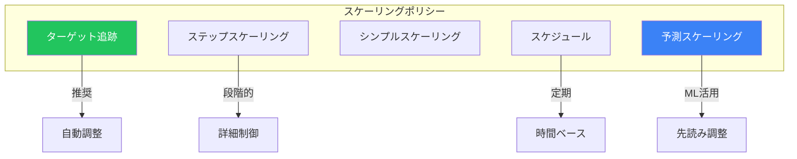
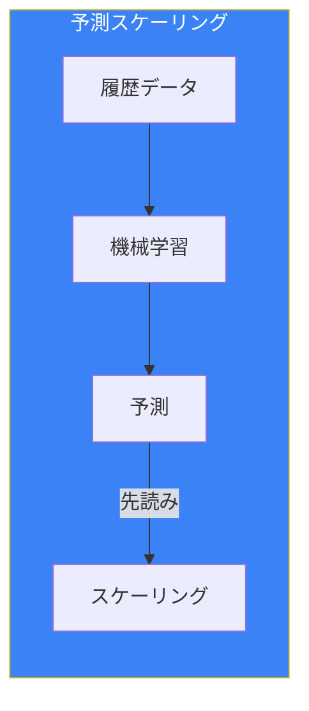
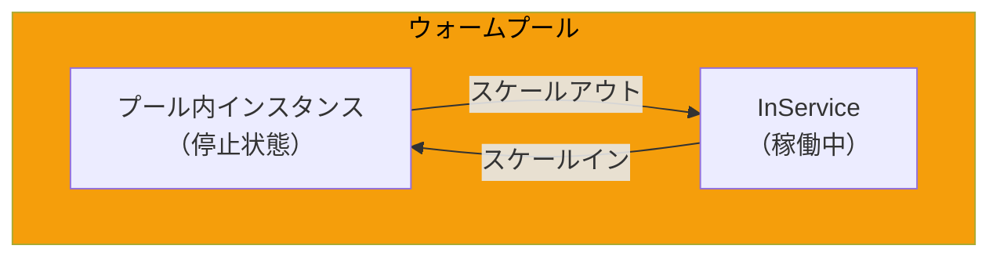
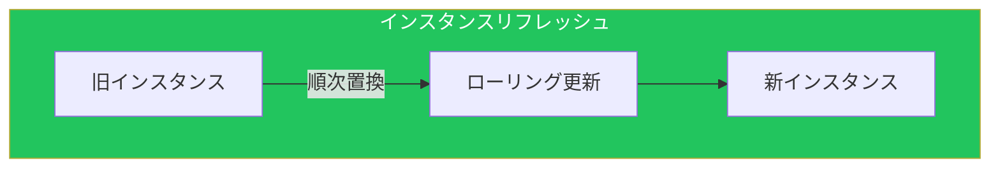
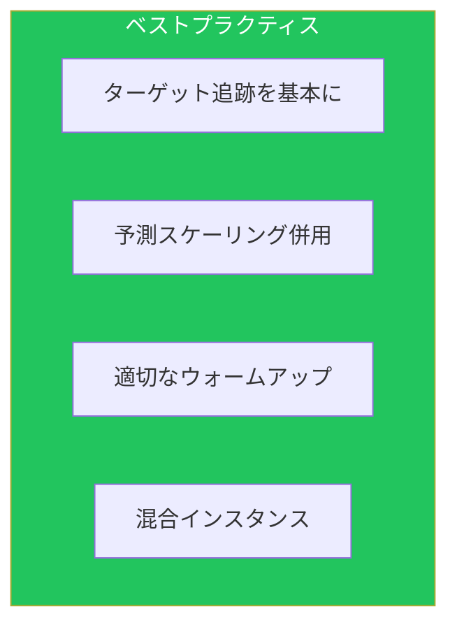

Auto Scalingは、需要に応じてリソースを自動調整するサービスです。本記事では、効率的なスケーリング戦略と高度な機能を解説します。

## スケーリングポリシーの種類

### 比較



| ポリシー | 用途 | 特徴 |
|---------|------|------|
| ターゲット追跡 | 一般的なワークロード | 自動調整、推奨 |
| 予測スケーリング | パターンのあるワークロード | ML活用、先読み |
| ステップスケーリング | 複雑な要件 | 段階的なスケーリング |
| スケジュール | 予測可能なパターン | 時間ベース |

## ターゲット追跡スケーリング

### 設定

```yaml
TargetTrackingScalingPolicy:
  Type: AWS::AutoScaling::ScalingPolicy
  Properties:
    AutoScalingGroupName: !Ref AutoScalingGroup
    PolicyType: TargetTrackingScaling
    TargetTrackingConfiguration:
      PredefinedMetricSpecification:
        PredefinedMetricType: ASGAverageCPUUtilization
      TargetValue: 50.0
      DisableScaleIn: false

# カスタムメトリクス
CustomMetricPolicy:
  Type: AWS::AutoScaling::ScalingPolicy
  Properties:
    AutoScalingGroupName: !Ref AutoScalingGroup
    PolicyType: TargetTrackingScaling
    TargetTrackingConfiguration:
      CustomizedMetricSpecification:
        MetricName: RequestCountPerTarget
        Namespace: AWS/ApplicationELB
        Dimensions:
          - Name: TargetGroup
            Value: !GetAtt TargetGroup.TargetGroupFullName
        Statistic: Sum
        Unit: Count
      TargetValue: 1000.0
```

### 複数ポリシーの組み合わせ

```yaml
# CPUベース
CPUPolicy:
  Type: AWS::AutoScaling::ScalingPolicy
  Properties:
    PolicyType: TargetTrackingScaling
    TargetTrackingConfiguration:
      PredefinedMetricSpecification:
        PredefinedMetricType: ASGAverageCPUUtilization
      TargetValue: 60.0

# リクエスト数ベース
RequestPolicy:
  Type: AWS::AutoScaling::ScalingPolicy
  Properties:
    PolicyType: TargetTrackingScaling
    TargetTrackingConfiguration:
      PredefinedMetricSpecification:
        PredefinedMetricType: ALBRequestCountPerTarget
        ResourceLabel: !Sub "${ALB.FullName}/${TargetGroup.TargetGroupFullName}"
      TargetValue: 500.0
```

## 予測スケーリング

### 概要



### 設定

```yaml
PredictiveScalingPolicy:
  Type: AWS::AutoScaling::ScalingPolicy
  Properties:
    AutoScalingGroupName: !Ref AutoScalingGroup
    PolicyType: PredictiveScaling
    PredictiveScalingConfiguration:
      MetricSpecifications:
        - TargetValue: 50
          PredefinedMetricPairSpecification:
            PredefinedMetricType: ASGCPUUtilization
          # または詳細設定
          CustomizedCapacityMetricSpecification:
            MetricDataQueries:
              - Id: capacity
                MetricStat:
                  Metric:
                    MetricName: GroupInServiceInstances
                    Namespace: AWS/AutoScaling
                    Dimensions:
                      - Name: AutoScalingGroupName
                        Value: !Ref AutoScalingGroup
                  Stat: Average
                ReturnData: true
          CustomizedLoadMetricSpecification:
            MetricDataQueries:
              - Id: load
                MetricStat:
                  Metric:
                    MetricName: RequestCount
                    Namespace: AWS/ApplicationELB
                  Stat: Sum
                ReturnData: true
      Mode: ForecastAndScale  # または ForecastOnly
      SchedulingBufferTime: 300  # 5分前にスケール
      MaxCapacityBreachBehavior: IncreaseMaxCapacity
      MaxCapacityBuffer: 10  # 予測の10%上乗せ
```

## ウォームプール

### 概要



### 設定

```yaml
AutoScalingGroup:
  Type: AWS::AutoScaling::AutoScalingGroup
  Properties:
    # ... 基本設定 ...

WarmPool:
  Type: AWS::AutoScaling::WarmPool
  Properties:
    AutoScalingGroupName: !Ref AutoScalingGroup
    MinSize: 2
    MaxGroupPreparedCapacity: 5
    PoolState: Stopped  # または Running, Hibernated
    InstanceReusePolicy:
      ReuseOnScaleIn: true

# ライフサイクルフック
WarmPoolHook:
  Type: AWS::AutoScaling::LifecycleHook
  Properties:
    AutoScalingGroupName: !Ref AutoScalingGroup
    LifecycleTransition: autoscaling:EC2_INSTANCE_LAUNCHING
    DefaultResult: CONTINUE
    HeartbeatTimeout: 300
    NotificationTargetARN: !Ref HookTopic
    RoleARN: !GetAtt HookRole.Arn
```

### 起動時間の比較

| 方式 | 起動時間 | コスト |
|------|---------|--------|
| 通常起動 | 3-5分 | 低 |
| Stopped | 1-2分 | 中 |
| Hibernated | 30秒-1分 | 高 |
| Running | 即時 | 最高 |

## インスタンスリフレッシュ

### 概要



### 設定

```bash
# インスタンスリフレッシュ開始
aws autoscaling start-instance-refresh \
    --auto-scaling-group-name my-asg \
    --strategy Rolling \
    --preferences '{
        "MinHealthyPercentage": 90,
        "InstanceWarmup": 300,
        "MaxHealthyPercentage": 110,
        "SkipMatching": true,
        "ScaleInProtectedInstances": "Refresh",
        "StandbyInstances": "Terminate"
    }' \
    --desired-configuration '{
        "LaunchTemplate": {
            "LaunchTemplateId": "lt-1234567890abcdef0",
            "Version": "$Latest"
        }
    }'
```

### CloudFormation定義

```yaml
AutoScalingGroup:
  Type: AWS::AutoScaling::AutoScalingGroup
  UpdatePolicy:
    AutoScalingRollingUpdate:
      MaxBatchSize: 2
      MinInstancesInService: 2
      MinSuccessfulInstancesPercent: 100
      PauseTime: PT10M
      WaitOnResourceSignals: true
      SuspendProcesses:
        - HealthCheck
        - ReplaceUnhealthy
        - AZRebalance
        - AlarmNotification
        - ScheduledActions
```

## 混合インスタンスポリシー

### スポットインスタンス併用

```yaml
AutoScalingGroup:
  Type: AWS::AutoScaling::AutoScalingGroup
  Properties:
    MixedInstancesPolicy:
      InstancesDistribution:
        OnDemandBaseCapacity: 2
        OnDemandPercentageAboveBaseCapacity: 30
        SpotAllocationStrategy: capacity-optimized
        SpotInstancePools: 0
        OnDemandAllocationStrategy: lowest-price
      LaunchTemplate:
        LaunchTemplateSpecification:
          LaunchTemplateId: !Ref LaunchTemplate
          Version: !GetAtt LaunchTemplate.LatestVersionNumber
        Overrides:
          - InstanceType: m5.large
          - InstanceType: m5.xlarge
          - InstanceType: m4.large
          - InstanceType: m4.xlarge
          - InstanceType: c5.large
```

## スケーリングクールダウン

### 設定

```yaml
AutoScalingGroup:
  Type: AWS::AutoScaling::AutoScalingGroup
  Properties:
    DefaultCooldown: 300
    HealthCheckGracePeriod: 300

# ポリシー別クールダウン
ScaleOutPolicy:
  Type: AWS::AutoScaling::ScalingPolicy
  Properties:
    PolicyType: SimpleScaling
    AdjustmentType: ChangeInCapacity
    ScalingAdjustment: 2
    Cooldown: 180  # スケールアウト用

ScaleInPolicy:
  Type: AWS::AutoScaling::ScalingPolicy
  Properties:
    PolicyType: SimpleScaling
    AdjustmentType: ChangeInCapacity
    ScalingAdjustment: -1
    Cooldown: 300  # スケールイン用（長め）
```

## 終了ポリシー

### 終了順序

```yaml
AutoScalingGroup:
  Type: AWS::AutoScaling::AutoScalingGroup
  Properties:
    TerminationPolicies:
      - OldestLaunchConfiguration
      - OldestLaunchTemplate
      - ClosestToNextInstanceHour
      - OldestInstance
      - Default
```

| ポリシー | 説明 |
|---------|------|
| OldestInstance | 最も古いインスタンス |
| NewestInstance | 最も新しいインスタンス |
| OldestLaunchConfiguration | 古い起動設定 |
| ClosestToNextInstanceHour | 課金時間に近い |
| Default | AZバランス→古い起動設定→課金時間 |

## ベストプラクティス



| カテゴリ | 項目 |
|---------|------|
| 基本 | ターゲット追跡ポリシーを使用 |
| 高度 | 予測スケーリングでML活用 |
| パフォーマンス | ウォームプールで起動高速化 |
| コスト | スポットインスタンス併用 |

## まとめ

| 機能 | 用途 |
|------|------|
| ターゲット追跡 | 自動的なメトリクスベーススケーリング |
| 予測スケーリング | パターンベースの先読みスケーリング |
| ウォームプール | 起動時間の短縮 |
| 混合インスタンス | コスト最適化 |

Auto Scalingの高度な機能を活用することで、効率的でコスト最適化されたスケーリングを実現できます。

## 参考資料

- [EC2 Auto Scaling User Guide](https://docs.aws.amazon.com/autoscaling/ec2/userguide/)
- [Predictive Scaling](https://docs.aws.amazon.com/autoscaling/ec2/userguide/ec2-auto-scaling-predictive-scaling.html)
- [Warm Pools](https://docs.aws.amazon.com/autoscaling/ec2/userguide/ec2-auto-scaling-warm-pools.html)
