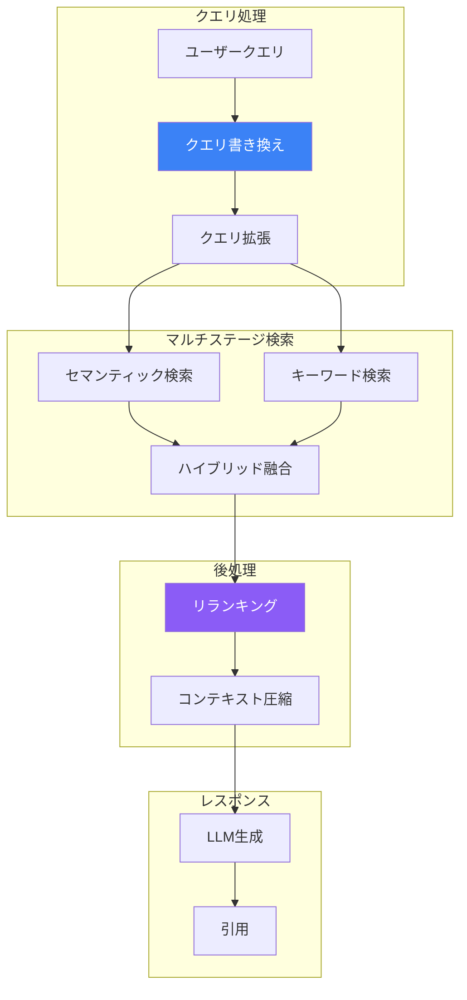

高度なRAG（検索拡張生成）パターンは、単純なベクトル検索を超えて、検索品質、関連性、レスポンスの正確性を向上させます。この記事では、Amazon Bedrockで本番グレードのRAGシステムを構築するための技術を解説します。

## 高度なRAGアーキテクチャ



## クエリ書き換え

### HyDE（仮想ドキュメント埋め込み）

```python
import boto3
import json

runtime = boto3.client('bedrock-runtime')
bedrock_agent = boto3.client('bedrock-agent-runtime')

def generate_hypothetical_document(query: str) -> str:
    """検索に使用する仮想的な回答を生成。"""
    response = runtime.converse(
        modelId='anthropic.claude-3-haiku-20240307-v1:0',
        messages=[{
            'role': 'user',
            'content': [{
                'text': f"""この質問に対する完璧な回答となる詳細な段落を書いてください: {query}

技術ドキュメントからの抜粋のように書いてください。前置きは不要です。"""
            }]
        }],
        inferenceConfig={'maxTokens': 300}
    )
    return response['output']['message']['content'][0]['text']

def hyde_retrieval(query: str, knowledge_base_id: str) -> list:
    # 仮想ドキュメントを生成
    hypothetical_doc = generate_hypothetical_document(query)

    # 仮想ドキュメントで検索
    response = bedrock_agent.retrieve(
        knowledgeBaseId=knowledge_base_id,
        retrievalQuery={'text': hypothetical_doc},
        retrievalConfiguration={
            'vectorSearchConfiguration': {
                'numberOfResults': 5
            }
        }
    )

    return response['retrievalResults']
```

### クエリ拡張

```python
def expand_query(query: str) -> list:
    """複数のクエリバリエーションを生成。"""
    response = runtime.converse(
        modelId='anthropic.claude-3-haiku-20240307-v1:0',
        messages=[{
            'role': 'user',
            'content': [{
                'text': f"""この検索クエリの3つの代替表現を生成してください。クエリのみを1行ずつ返してください。

元のクエリ: {query}"""
            }]
        }],
        inferenceConfig={'maxTokens': 200}
    )

    variations = response['output']['message']['content'][0]['text'].strip().split('\n')
    return [query] + [v.strip() for v in variations if v.strip()]

def multi_query_retrieval(query: str, knowledge_base_id: str) -> list:
    queries = expand_query(query)
    all_results = []
    seen_ids = set()

    for q in queries:
        response = bedrock_agent.retrieve(
            knowledgeBaseId=knowledge_base_id,
            retrievalQuery={'text': q},
            retrievalConfiguration={
                'vectorSearchConfiguration': {'numberOfResults': 3}
            }
        )

        for result in response['retrievalResults']:
            result_id = result['location']['s3Location']['uri']
            if result_id not in seen_ids:
                seen_ids.add(result_id)
                all_results.append(result)

    return all_results
```

## ハイブリッド検索

### セマンティックとキーワード検索の組み合わせ

```python
from opensearchpy import OpenSearch

class HybridSearchRetriever:
    def __init__(self, opensearch_host: str, index_name: str, knowledge_base_id: str):
        self.os_client = OpenSearch(
            hosts=[opensearch_host],
            use_ssl=True
        )
        self.index_name = index_name
        self.knowledge_base_id = knowledge_base_id
        self.bedrock_agent = boto3.client('bedrock-agent-runtime')

    def keyword_search(self, query: str, k: int = 5) -> list:
        """BM25キーワード検索。"""
        response = self.os_client.search(
            index=self.index_name,
            body={
                'query': {
                    'multi_match': {
                        'query': query,
                        'fields': ['content', 'title^2'],
                        'type': 'best_fields'
                    }
                },
                'size': k
            }
        )
        return [hit['_source'] for hit in response['hits']['hits']]

    def semantic_search(self, query: str, k: int = 5) -> list:
        """Knowledge Basesによるベクトルセマンティック検索。"""
        response = self.bedrock_agent.retrieve(
            knowledgeBaseId=self.knowledge_base_id,
            retrievalQuery={'text': query},
            retrievalConfiguration={
                'vectorSearchConfiguration': {'numberOfResults': k}
            }
        )
        return response['retrievalResults']

    def hybrid_search(self, query: str, k: int = 5,
                     semantic_weight: float = 0.7) -> list:
        """RRFでキーワードとセマンティック検索を組み合わせ。"""
        keyword_results = self.keyword_search(query, k * 2)
        semantic_results = self.semantic_search(query, k * 2)

        # Reciprocal Rank Fusion
        rrf_scores = {}
        rrf_k = 60  # RRF定数

        for rank, result in enumerate(keyword_results):
            doc_id = result.get('id', str(result))
            rrf_scores[doc_id] = rrf_scores.get(doc_id, 0) + (1 - semantic_weight) / (rrf_k + rank + 1)

        for rank, result in enumerate(semantic_results):
            doc_id = result['location']['s3Location']['uri']
            rrf_scores[doc_id] = rrf_scores.get(doc_id, 0) + semantic_weight / (rrf_k + rank + 1)

        # RRFスコアでソートしてtop kを返す
        sorted_docs = sorted(rrf_scores.items(), key=lambda x: x[1], reverse=True)
        return sorted_docs[:k]
```

## リランキング

### LLMベースのリランキング

```python
def rerank_with_llm(query: str, documents: list, top_k: int = 3) -> list:
    """LLMスコアリングでドキュメントをリランク。"""

    # スコアリング用にドキュメントをフォーマット
    doc_list = "\n".join([
        f"[{i+1}] {doc['content']['text'][:500]}"
        for i, doc in enumerate(documents)
    ])

    response = runtime.converse(
        modelId='anthropic.claude-3-haiku-20240307-v1:0',
        messages=[{
            'role': 'user',
            'content': [{
                'text': f"""以下のクエリとドキュメントに基づいて、クエリに対する関連性でドキュメントをランク付けしてください。
関連性の高い順にドキュメント番号のみをカンマ区切りで返してください。

クエリ: {query}

ドキュメント:
{doc_list}

最も関連性が高い順（番号のみ）:"""
            }]
        }],
        inferenceConfig={'maxTokens': 50}
    )

    # ランキングをパース
    ranking_text = response['output']['message']['content'][0]['text']
    rankings = [int(x.strip()) - 1 for x in ranking_text.split(',') if x.strip().isdigit()]

    # ドキュメントを並べ替え
    reranked = [documents[i] for i in rankings if i < len(documents)]
    return reranked[:top_k]
```

### クロスエンコーダーリランキング

```python
def cross_encoder_rerank(query: str, documents: list, top_k: int = 3) -> list:
    """各クエリ-ドキュメントペアを独立してスコアリング。"""
    scored_docs = []

    for doc in documents:
        response = runtime.converse(
            modelId='anthropic.claude-3-haiku-20240307-v1:0',
            messages=[{
                'role': 'user',
                'content': [{
                    'text': f"""このドキュメントのクエリに対する関連性を0-10のスケールで評価してください。
数字のみを返してください。

クエリ: {query}
ドキュメント: {doc['content']['text'][:1000]}

関連性スコア:"""
                }]
            }],
            inferenceConfig={'maxTokens': 10}
        )

        try:
            score = float(response['output']['message']['content'][0]['text'].strip())
        except ValueError:
            score = 0

        scored_docs.append((doc, score))

    # スコアでソート
    scored_docs.sort(key=lambda x: x[1], reverse=True)
    return [doc for doc, _ in scored_docs[:top_k]]
```

## コンテキスト圧縮

### 抽出的圧縮

```python
def compress_context(query: str, documents: list, max_tokens: int = 2000) -> str:
    """ドキュメントから関連部分のみを抽出。"""

    combined_text = "\n\n---\n\n".join([
        doc['content']['text'] for doc in documents
    ])

    response = runtime.converse(
        modelId='anthropic.claude-3-sonnet-20240229-v1:0',
        messages=[{
            'role': 'user',
            'content': [{
                'text': f"""以下のドキュメントから、この質問に答えるために直接関連する文と段落のみを抽出してください: {query}

正確な表現を保持してください。要約や言い換えはしないでください。ソースマーカーを含めてください。

ドキュメント:
{combined_text}

関連する抜粋:"""
            }]
        }],
        inferenceConfig={'maxTokens': max_tokens}
    )

    return response['output']['message']['content'][0]['text']
```

## マルチステップ検索

### 反復的検索

```python
def iterative_retrieval(query: str, knowledge_base_id: str, max_iterations: int = 3) -> dict:
    """ギャップに基づいて反復的に検索・改善。"""

    all_context = []
    current_query = query

    for iteration in range(max_iterations):
        # 検索
        response = bedrock_agent.retrieve(
            knowledgeBaseId=knowledge_base_id,
            retrievalQuery={'text': current_query},
            retrievalConfiguration={
                'vectorSearchConfiguration': {'numberOfResults': 3}
            }
        )

        new_context = [r['content']['text'] for r in response['retrievalResults']]
        all_context.extend(new_context)

        # 十分な情報があるか確認
        check_response = runtime.converse(
            modelId='anthropic.claude-3-haiku-20240307-v1:0',
            messages=[{
                'role': 'user',
                'content': [{
                    'text': f"""このコンテキストで、質問に完全に答えることができますか: {query}

コンテキスト: {' '.join(all_context)}

はいの場合は「SUFFICIENT」と回答してください。いいえの場合は、どのような追加情報が必要かを回答してください。"""
                }]
            }],
            inferenceConfig={'maxTokens': 100}
        )

        check_text = check_response['output']['message']['content'][0]['text']

        if 'SUFFICIENT' in check_text.upper():
            break

        # 次の反復のためにクエリを改善
        current_query = f"{query} 追加で必要なコンテキスト: {check_text}"

    return {
        'context': all_context,
        'iterations': iteration + 1
    }
```

## 完全な高度RAGパイプライン

```python
class AdvancedRAGPipeline:
    def __init__(self, knowledge_base_id: str):
        self.knowledge_base_id = knowledge_base_id
        self.runtime = boto3.client('bedrock-runtime')
        self.bedrock_agent = boto3.client('bedrock-agent-runtime')

    def process_query(self, query: str) -> str:
        # ステップ1: クエリ拡張
        expanded_queries = self._expand_query(query)

        # ステップ2: マルチクエリ検索
        all_results = []
        for q in expanded_queries:
            results = self._retrieve(q)
            all_results.extend(results)

        # ステップ3: 重複排除
        unique_results = self._deduplicate(all_results)

        # ステップ4: リランク
        reranked = self._rerank(query, unique_results)

        # ステップ5: コンテキスト圧縮
        compressed = self._compress(query, reranked)

        # ステップ6: レスポンス生成
        response = self._generate(query, compressed)

        return response

    def _expand_query(self, query: str) -> list:
        response = self.runtime.converse(
            modelId='anthropic.claude-3-haiku-20240307-v1:0',
            messages=[{
                'role': 'user',
                'content': [{'text': f"次のクエリの2つの代替検索クエリを生成: {query}\nクエリのみ、1行ずつ返してください。"}]
            }],
            inferenceConfig={'maxTokens': 100}
        )
        variations = response['output']['message']['content'][0]['text'].strip().split('\n')
        return [query] + [v.strip() for v in variations[:2]]

    def _retrieve(self, query: str) -> list:
        response = self.bedrock_agent.retrieve(
            knowledgeBaseId=self.knowledge_base_id,
            retrievalQuery={'text': query},
            retrievalConfiguration={'vectorSearchConfiguration': {'numberOfResults': 5}}
        )
        return response['retrievalResults']

    def _deduplicate(self, results: list) -> list:
        seen = set()
        unique = []
        for r in results:
            uri = r['location']['s3Location']['uri']
            if uri not in seen:
                seen.add(uri)
                unique.append(r)
        return unique

    def _rerank(self, query: str, results: list) -> list:
        if len(results) <= 3:
            return results

        doc_list = "\n".join([f"[{i+1}] {r['content']['text'][:300]}" for i, r in enumerate(results[:10])])

        response = self.runtime.converse(
            modelId='anthropic.claude-3-haiku-20240307-v1:0',
            messages=[{'role': 'user', 'content': [{'text': f"'{query}'への関連性でランク付け:\n{doc_list}\n番号のみ、カンマ区切りで返してください:"}]}],
            inferenceConfig={'maxTokens': 30}
        )

        rankings = [int(x.strip())-1 for x in response['output']['message']['content'][0]['text'].split(',') if x.strip().isdigit()]
        return [results[i] for i in rankings[:5] if i < len(results)]

    def _compress(self, query: str, results: list) -> str:
        context = "\n\n".join([r['content']['text'] for r in results])
        if len(context) < 3000:
            return context

        response = self.runtime.converse(
            modelId='anthropic.claude-3-haiku-20240307-v1:0',
            messages=[{'role': 'user', 'content': [{'text': f"'{query}'に関連する部分を抽出:\n{context}"}]}],
            inferenceConfig={'maxTokens': 1500}
        )
        return response['output']['message']['content'][0]['text']

    def _generate(self, query: str, context: str) -> str:
        response = self.runtime.converse(
            modelId='anthropic.claude-3-sonnet-20240229-v1:0',
            messages=[{'role': 'user', 'content': [{'text': f"コンテキスト:\n{context}\n\n質問: {query}\n\nコンテキストに基づいて回答:"}]}],
            inferenceConfig={'maxTokens': 1024}
        )
        return response['output']['message']['content'][0]['text']

# 使用例
pipeline = AdvancedRAGPipeline('your-knowledge-base-id')
answer = pipeline.process_query("エラー処理のベストプラクティスは何ですか？")
```

## ベストプラクティス

| 技術 | 使用するタイミング |
|-----|------------------|
| クエリ拡張 | 曖昧または短いクエリ |
| HyDE | 技術的/ドメイン固有のクエリ |
| ハイブリッド検索 | キーワード/セマンティックの混合ニーズ |
| リランキング | 大きな結果セット |
| コンテキスト圧縮 | トークン制限の制約 |

## 重要なポイント

1. **クエリ前処理** - より良い検索のためにクエリを拡張・書き換え
2. **ハイブリッド検索** - セマンティックとキーワード検索を組み合わせ
3. **リランキング** - LLMを使用して結果の順序を改善
4. **コンテキスト最適化** - トークン制限に収まるよう圧縮
5. **反復的検索** - 情報ギャップに基づいて改善

## 参考文献

- [Knowledge Bases](https://docs.aws.amazon.com/bedrock/latest/userguide/knowledge-base.html)
- [高度なRAGパターン](https://docs.aws.amazon.com/bedrock/latest/userguide/kb-chunking-parsing.html)
