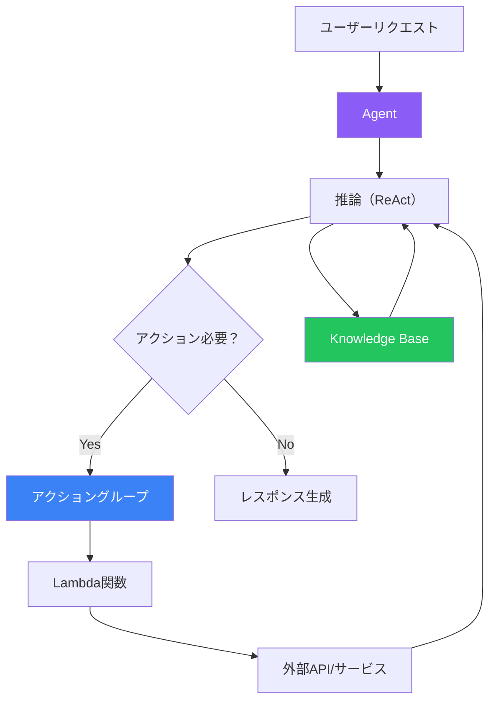
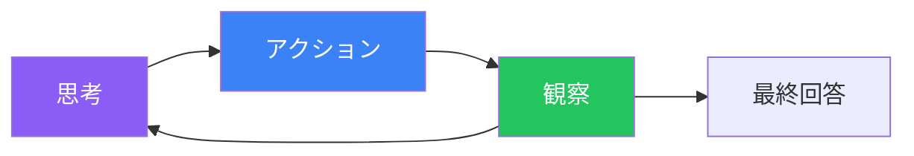

Amazon Bedrock Agentsを使用すると、推論、計画、アクションを実行できるAIアプリケーションを構築できます。エージェントは基盤モデル、Knowledge Base、外部APIをオーケストレーションして複雑なタスクを完了します。

## エージェントの仕組み



## エージェントのコンポーネント

| コンポーネント | 説明 |
|--------------|------|
| 基盤モデル | エージェントの頭脳（Claude、Titan） |
| 指示 | 動作を定義するシステムプロンプト |
| アクショングループ | エージェントが使用できるツール |
| Knowledge Bases | RAG用データソース |

## エージェントの作成

### コンソールでの設定

1. Amazon Bedrock → Agents → エージェントを作成
2. エージェントの詳細を設定：
   - 名前と説明
   - 基盤モデル
   - 指示

### SDKの使用

```python
import boto3

client = boto3.client('bedrock-agent')

# エージェントを作成
response = client.create_agent(
    agentName='customer-service-agent',
    foundationModel='anthropic.claude-3-sonnet-20240229-v1:0',
    instruction="""あなたは親切なカスタマーサービスエージェントです。
以下のことができます：
- 注文状況の確認
- 返品処理
- 製品に関する質問への回答

常に丁寧で親切に対応してください。対応できない場合は、人間のエージェントにエスカレーションしてください。""",
    idleSessionTTLInSeconds=1800
)

agent_id = response['agent']['agentId']
```

## アクショングループ

アクショングループは、エージェントが外部システムと対話するために使用できるツールを定義します。

### アクショングループの作成

```python
# LambdaでアクショングLoop を作成
response = client.create_agent_action_group(
    agentId=agent_id,
    agentVersion='DRAFT',
    actionGroupName='order-management',
    actionGroupExecutor={
        'lambda': 'arn:aws:lambda:us-east-1:123456789012:function:order-handler'
    },
    apiSchema={
        'payload': '''
openapi: 3.0.0
info:
  title: Order Management API
  version: 1.0.0
paths:
  /orders/{orderId}:
    get:
      operationId: getOrderStatus
      summary: 注文状況を取得
      parameters:
        - name: orderId
          in: path
          required: true
          schema:
            type: string
      responses:
        200:
          description: 注文詳細
  /returns:
    post:
      operationId: createReturn
      summary: 返品リクエストを作成
      requestBody:
        required: true
        content:
          application/json:
            schema:
              type: object
              properties:
                orderId:
                  type: string
                reason:
                  type: string
      responses:
        200:
          description: 返品作成完了
'''
    }
)
```

### アクショングループ用Lambda関数

```python
import json

def lambda_handler(event, context):
    agent = event['agent']
    action_group = event['actionGroup']
    api_path = event['apiPath']
    http_method = event['httpMethod']
    parameters = event.get('parameters', [])
    request_body = event.get('requestBody', {})

    # 適切なハンドラーにルーティング
    if api_path == '/orders/{orderId}' and http_method == 'GET':
        order_id = next(p['value'] for p in parameters if p['name'] == 'orderId')
        result = get_order_status(order_id)
    elif api_path == '/returns' and http_method == 'POST':
        body = request_body.get('content', {}).get('application/json', {})
        result = create_return(body.get('properties', {}))
    else:
        result = {'error': '不明なアクション'}

    return {
        'messageVersion': '1.0',
        'response': {
            'actionGroup': action_group,
            'apiPath': api_path,
            'httpMethod': http_method,
            'httpStatusCode': 200,
            'responseBody': {
                'application/json': {
                    'body': json.dumps(result)
                }
            }
        }
    }

def get_order_status(order_id):
    # 注文検索を実装
    return {
        'orderId': order_id,
        'status': '発送済み',
        'estimatedDelivery': '2025-01-20'
    }

def create_return(properties):
    # 返品作成を実装
    return {
        'returnId': 'RET-123',
        'status': '保留中'
    }
```

## Knowledge Baseの接続

```python
# Knowledge Baseをエージェントに関連付け
response = client.associate_agent_knowledge_base(
    agentId=agent_id,
    agentVersion='DRAFT',
    knowledgeBaseId='KB_ID',
    description='製品ドキュメントとFAQ'
)
```

## エージェントの準備と呼び出し

### エージェントを準備

```python
# 使用のためにエージェントを準備
client.prepare_agent(agentId=agent_id)

# 本番用エイリアスを作成
response = client.create_agent_alias(
    agentId=agent_id,
    agentAliasName='production'
)
alias_id = response['agentAlias']['agentAliasId']
```

### エージェントを呼び出し

```python
runtime_client = boto3.client('bedrock-agent-runtime')

def invoke_agent(session_id: str, prompt: str):
    response = runtime_client.invoke_agent(
        agentId=agent_id,
        agentAliasId=alias_id,
        sessionId=session_id,
        inputText=prompt
    )

    # ストリーミングレスポンスを処理
    result = ""
    for event in response['completion']:
        if 'chunk' in event:
            result += event['chunk']['bytes'].decode()

    return result

# エージェントを使用
session_id = "user-123-session"
response = invoke_agent(session_id, "注文ORD-456の状況は？")
print(response)
```

## ReActフレームワーク

エージェントはReAct（Reasoning + Acting）を使用して問題を解決します：



### ReActトレースの例

```
ユーザー：ORD-789の注文状況は？

思考：ORD-789の注文状況を調べる必要があります。
アクション：getOrderStatus(orderId="ORD-789")
観察：{"orderId": "ORD-789", "status": "shipped", "estimatedDelivery": "2025-01-20"}

思考：注文情報を取得しました。注文は発送済みです。
最終回答：ご注文ORD-789は発送済みで、2025年1月20日に届く予定です。
```

## 高度な設定

### セッション属性

```python
response = runtime_client.invoke_agent(
    agentId=agent_id,
    agentAliasId=alias_id,
    sessionId=session_id,
    inputText=prompt,
    sessionState={
        'sessionAttributes': {
            'customerId': 'CUST-123',
            'membershipLevel': 'gold'
        },
        'promptSessionAttributes': {
            'currentDate': '2025-01-18'
        }
    }
)
```

### Return Control

人間確認が必要なシナリオ：

```python
response = runtime_client.invoke_agent(
    agentId=agent_id,
    agentAliasId=alias_id,
    sessionId=session_id,
    inputText="注文ORD-123の返金処理をお願いします",
    enableTrace=True
)

# エージェントが確認を求めているかチェック
for event in response['completion']:
    if 'returnControl' in event:
        invocation = event['returnControl']['invocationInputs'][0]
        print(f"エージェントの操作: {invocation['apiInvocationInput']['actionGroup']}")
        print(f"確認しますか？ (y/n)")
        # 確認処理...
```

## 完全なエージェントの例

```python
import boto3
import uuid
from typing import Optional

class CustomerServiceAgent:
    def __init__(self, agent_id: str, alias_id: str):
        self.runtime = boto3.client('bedrock-agent-runtime')
        self.agent_id = agent_id
        self.alias_id = alias_id
        self.sessions = {}

    def get_session(self, user_id: str) -> str:
        if user_id not in self.sessions:
            self.sessions[user_id] = str(uuid.uuid4())
        return self.sessions[user_id]

    def chat(self, user_id: str, message: str, customer_id: Optional[str] = None) -> str:
        session_id = self.get_session(user_id)

        kwargs = {
            'agentId': self.agent_id,
            'agentAliasId': self.alias_id,
            'sessionId': session_id,
            'inputText': message
        }

        if customer_id:
            kwargs['sessionState'] = {
                'sessionAttributes': {'customerId': customer_id}
            }

        response = self.runtime.invoke_agent(**kwargs)

        result = ""
        for event in response['completion']:
            if 'chunk' in event:
                result += event['chunk']['bytes'].decode()

        return result

    def end_session(self, user_id: str):
        if user_id in self.sessions:
            del self.sessions[user_id]

# 使用例
agent = CustomerServiceAgent(
    agent_id='YOUR_AGENT_ID',
    alias_id='YOUR_ALIAS_ID'
)

# 会話
print(agent.chat("user1", "注文について助けてほしいのですが", customer_id="CUST-456"))
print(agent.chat("user1", "注文ORD-789の状況は？"))
print(agent.chat("user1", "返品できますか？"))
```

## ベストプラクティス

| プラクティス | 推奨事項 |
|-------------|---------|
| 明確な指示 | エージェントの能力を具体的に |
| エラーハンドリング | Lambda失敗を適切に処理 |
| セッション管理 | 意味のあるセッションIDを使用 |
| テスト | 各アクショングループを個別にテスト |
| モニタリング | デバッグ用にトレースを有効化 |

## 重要なポイント

1. **エージェントは推論して行動** - ReActフレームワークを使用
2. **アクショングループはツール** - Lambda経由で外部システムに接続
3. **Knowledge Baseがコンテキストを提供** - ドメイン知識用RAG
4. **セッションが状態を維持** - マルチターン会話
5. **デプロイ前に準備** - 設定を検証

## 参考文献

- [Amazon Bedrock Agents](https://docs.aws.amazon.com/bedrock/latest/userguide/agents.html)
- [アクショングループ](https://docs.aws.amazon.com/bedrock/latest/userguide/agents-action-group.html)
- [Agent APIs](https://docs.aws.amazon.com/bedrock/latest/APIReference/API_agent-runtime_InvokeAgent.html)
