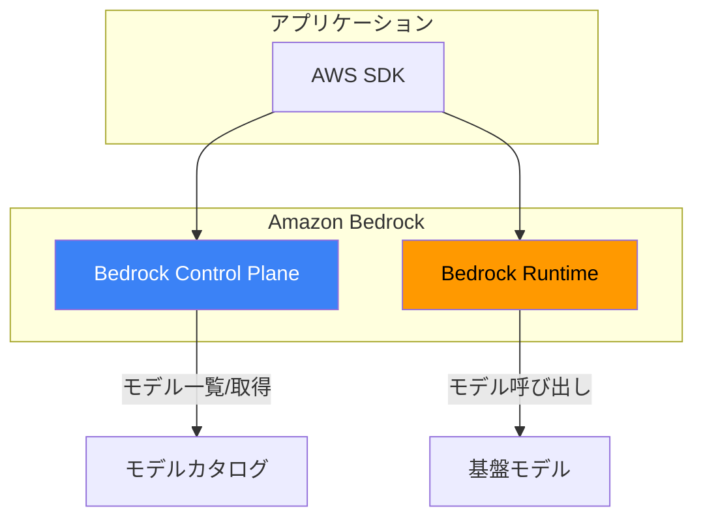
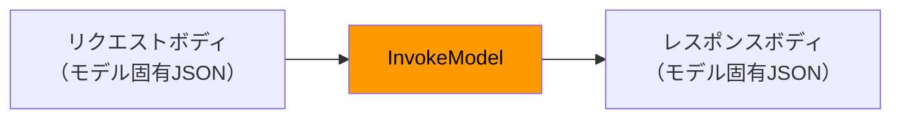
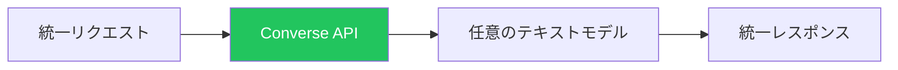

Amazon Bedrockは、基盤モデルと対話するための複数のAPIを提供します。このガイドでは、必須API、SDK設定、本番アプリケーション構築のベストプラクティスを解説します。

## Bedrockサービスアーキテクチャ



## 2つのBedrockクライアント

| クライアント | サービス | 用途 |
|-------------|---------|------|
| `bedrock` | Control Plane | モデル一覧、カスタムモデル管理、ガードレール |
| `bedrock-runtime` | Runtime | モデル呼び出し、レスポンス生成 |

## SDKセットアップ

### Python（boto3）

```python
import boto3

# Control Planeクライアント
bedrock = boto3.client('bedrock', region_name='us-east-1')

# Runtimeクライアント（モデル呼び出し用）
bedrock_runtime = boto3.client('bedrock-runtime', region_name='us-east-1')
```

### JavaScript/TypeScript

```typescript
import {
  BedrockClient,
  ListFoundationModelsCommand
} from '@aws-sdk/client-bedrock';
import {
  BedrockRuntimeClient,
  InvokeModelCommand,
  ConverseCommand
} from '@aws-sdk/client-bedrock-runtime';

const bedrockClient = new BedrockClient({ region: 'us-east-1' });
const runtimeClient = new BedrockRuntimeClient({ region: 'us-east-1' });
```

## Control Plane API

### 利用可能なモデルを一覧表示

```python
import boto3

bedrock = boto3.client('bedrock', region_name='us-east-1')

# 全基盤モデルを一覧表示
response = bedrock.list_foundation_models()

for model in response['modelSummaries']:
    print(f"{model['modelId']}: {model['modelName']}")
    print(f"  プロバイダー: {model['providerName']}")
    print(f"  入力: {model['inputModalities']}")
    print(f"  出力: {model['outputModalities']}")
```

### モデル詳細を取得

```python
response = bedrock.get_foundation_model(
    modelIdentifier='anthropic.claude-3-sonnet-20240229-v1:0'
)

model = response['modelDetails']
print(f"モデル: {model['modelName']}")
print(f"ストリーミング対応: {model.get('responseStreamingSupported')}")
```

## Runtime API

### InvokeModel API

モデル呼び出しの基本API。リクエスト/レスポンス形式はモデルによって異なります。



#### Claudeの例

```python
import boto3
import json

client = boto3.client('bedrock-runtime', region_name='us-east-1')

response = client.invoke_model(
    modelId='anthropic.claude-3-sonnet-20240229-v1:0',
    contentType='application/json',
    accept='application/json',
    body=json.dumps({
        "anthropic_version": "bedrock-2023-05-31",
        "max_tokens": 1024,
        "temperature": 0.7,
        "messages": [
            {
                "role": "user",
                "content": "量子コンピューティングを簡単に説明してください。"
            }
        ]
    })
)

result = json.loads(response['body'].read())
print(result['content'][0]['text'])
```

#### Titanの例

```python
response = client.invoke_model(
    modelId='amazon.titan-text-express-v1',
    body=json.dumps({
        "inputText": "量子コンピューティングを簡単に説明してください。",
        "textGenerationConfig": {
            "maxTokenCount": 1024,
            "temperature": 0.7,
            "topP": 0.9
        }
    })
)

result = json.loads(response['body'].read())
print(result['results'][0]['outputText'])
```

#### Llamaの例

```python
response = client.invoke_model(
    modelId='meta.llama3-1-70b-instruct-v1:0',
    body=json.dumps({
        "prompt": "<|begin_of_text|><|start_header_id|>user<|end_header_id|>\n\n量子コンピューティングを説明してください。<|eot_id|><|start_header_id|>assistant<|end_header_id|>\n\n",
        "max_gen_len": 1024,
        "temperature": 0.7
    })
)

result = json.loads(response['body'].read())
print(result['generation'])
```

### Converse API（推奨）

全テキストモデルで一貫したリクエスト/レスポンス形式で動作する統一API。



#### 基本的な使い方

```python
response = client.converse(
    modelId='anthropic.claude-3-sonnet-20240229-v1:0',
    messages=[
        {
            "role": "user",
            "content": [{"text": "量子コンピューティングを簡単に説明してください。"}]
        }
    ],
    inferenceConfig={
        "maxTokens": 1024,
        "temperature": 0.7,
        "topP": 0.9
    }
)

print(response['output']['message']['content'][0]['text'])
print(f"入力トークン: {response['usage']['inputTokens']}")
print(f"出力トークン: {response['usage']['outputTokens']}")
```

#### マルチターン会話

```python
messages = []

def chat(user_message):
    messages.append({
        "role": "user",
        "content": [{"text": user_message}]
    })

    response = client.converse(
        modelId='anthropic.claude-3-sonnet-20240229-v1:0',
        messages=messages,
        inferenceConfig={"maxTokens": 1024}
    )

    assistant_message = response['output']['message']
    messages.append(assistant_message)

    return assistant_message['content'][0]['text']

# 会話
print(chat("Pythonとは何ですか？"))
print(chat("主な用途は？"))
print(chat("簡単な例を見せてください。"))
```

#### システムプロンプト

```python
response = client.converse(
    modelId='anthropic.claude-3-sonnet-20240229-v1:0',
    system=[
        {"text": "あなたは親切なコーディングアシスタントです。簡潔な回答とコード例を提供してください。"}
    ],
    messages=[
        {
            "role": "user",
            "content": [{"text": "PythonでJSONファイルを読み込む方法は？"}]
        }
    ],
    inferenceConfig={"maxTokens": 1024}
)
```

### ストリーミングレスポンス

リアルタイム出力表示用。

#### InvokeModelWithResponseStream

```python
response = client.invoke_model_with_response_stream(
    modelId='anthropic.claude-3-sonnet-20240229-v1:0',
    body=json.dumps({
        "anthropic_version": "bedrock-2023-05-31",
        "max_tokens": 1024,
        "messages": [
            {"role": "user", "content": "AIについての短い物語を書いてください。"}
        ]
    })
)

for event in response['body']:
    chunk = json.loads(event['chunk']['bytes'])
    if chunk['type'] == 'content_block_delta':
        print(chunk['delta']['text'], end='', flush=True)
```

#### ConverseStream

```python
response = client.converse_stream(
    modelId='anthropic.claude-3-sonnet-20240229-v1:0',
    messages=[
        {
            "role": "user",
            "content": [{"text": "AIについての短い物語を書いてください。"}]
        }
    ],
    inferenceConfig={"maxTokens": 1024}
)

for event in response['stream']:
    if 'contentBlockDelta' in event:
        text = event['contentBlockDelta']['delta'].get('text', '')
        print(text, end='', flush=True)
    elif 'metadata' in event:
        usage = event['metadata']['usage']
        print(f"\n\nトークン: 入力{usage['inputTokens']}、出力{usage['outputTokens']}")
```

## 推論パラメータ

| パラメータ | 説明 | 一般的な範囲 |
|-----------|------|-------------|
| maxTokens | 最大出力長 | 1-4096+ |
| temperature | ランダム性（0=決定的） | 0.0-1.0 |
| topP | Nucleusサンプリング | 0.0-1.0 |
| stopSequences | 生成停止トリガー | ["\\n\\n"] |

```python
inferenceConfig = {
    "maxTokens": 2048,
    "temperature": 0.5,      # より集中
    "topP": 0.9,
    "stopSequences": ["\n\nHuman:"]
}
```

## エラーハンドリング

```python
from botocore.exceptions import ClientError

def invoke_with_retry(prompt, max_retries=3):
    for attempt in range(max_retries):
        try:
            response = client.converse(
                modelId='anthropic.claude-3-sonnet-20240229-v1:0',
                messages=[{"role": "user", "content": [{"text": prompt}]}],
                inferenceConfig={"maxTokens": 1024}
            )
            return response['output']['message']['content'][0]['text']

        except ClientError as e:
            error_code = e.response['Error']['Code']

            if error_code == 'ThrottlingException':
                wait_time = 2 ** attempt
                print(f"スロットリング。{wait_time}秒待機...")
                time.sleep(wait_time)
            elif error_code == 'ModelTimeoutException':
                print("モデルタイムアウト。リトライ...")
            elif error_code == 'ValidationException':
                print(f"バリデーションエラー: {e}")
                raise
            else:
                raise

    raise Exception("最大リトライ回数超過")
```

### 一般的なエラー

| エラー | 原因 | 解決策 |
|-------|------|--------|
| AccessDeniedException | モデルが有効化されていない | Bedrockコンソールで有効化 |
| ThrottlingException | レート制限超過 | 指数バックオフを実装 |
| ValidationException | 無効なリクエスト | リクエスト形式を確認 |
| ModelTimeoutException | モデルの処理に時間がかかりすぎ | リトライまたは入力を削減 |

## ベストプラクティス

### 1. Converse APIを使用

```python
# 推奨 - 任意のモデルで動作
response = client.converse(
    modelId=model_id,
    messages=messages,
    inferenceConfig=config
)

# 避ける - モデル固有の形式が必要
response = client.invoke_model(
    modelId=model_id,
    body=json.dumps(model_specific_body)
)
```

### 2. タイムアウトを実装

```python
from botocore.config import Config

config = Config(
    read_timeout=120,
    connect_timeout=10,
    retries={'max_attempts': 3}
)

client = boto3.client('bedrock-runtime', config=config)
```

### 3. トークン使用量を追跡

```python
def track_usage(response):
    usage = response.get('usage', {})
    return {
        'input_tokens': usage.get('inputTokens', 0),
        'output_tokens': usage.get('outputTokens', 0),
        'total_tokens': usage.get('inputTokens', 0) + usage.get('outputTokens', 0)
    }
```

### 4. リージョンは環境変数で

```python
import os

region = os.environ.get('AWS_REGION', 'us-east-1')
client = boto3.client('bedrock-runtime', region_name=region)
```

## 完全な例：チャットアプリケーション

```python
import boto3
from typing import List, Dict

class BedrockChat:
    def __init__(self, model_id: str = 'anthropic.claude-3-sonnet-20240229-v1:0'):
        self.client = boto3.client('bedrock-runtime')
        self.model_id = model_id
        self.messages: List[Dict] = []
        self.system_prompt = None

    def set_system_prompt(self, prompt: str):
        self.system_prompt = [{"text": prompt}]

    def chat(self, user_input: str) -> str:
        self.messages.append({
            "role": "user",
            "content": [{"text": user_input}]
        })

        kwargs = {
            "modelId": self.model_id,
            "messages": self.messages,
            "inferenceConfig": {"maxTokens": 2048, "temperature": 0.7}
        }

        if self.system_prompt:
            kwargs["system"] = self.system_prompt

        response = self.client.converse(**kwargs)

        assistant_message = response['output']['message']
        self.messages.append(assistant_message)

        return assistant_message['content'][0]['text']

    def clear_history(self):
        self.messages = []

# 使用例
chat = BedrockChat()
chat.set_system_prompt("あなたは親切なアシスタントです。")
print(chat.chat("こんにちは！"))
print(chat.chat("ジョークを教えて。"))
```

## 重要なポイント

1. **2つのクライアント** - 管理用`bedrock`、推論用`bedrock-runtime`
2. **Converse APIを優先** - モデル間で統一されたインターフェース
3. **エラーを適切に処理** - バックオフ付きリトライを実装
4. **UXにはストリーミング** - 長いレスポンスで良いユーザー体験
5. **使用量を追跡** - コスト管理のためにトークンを監視

## 参考文献

- [Amazon Bedrock APIリファレンス](https://docs.aws.amazon.com/bedrock/latest/APIReference/)
- [Converse APIドキュメント](https://docs.aws.amazon.com/bedrock/latest/userguide/conversation-inference.html)
- [AWS SDK for Python（Boto3）](https://boto3.amazonaws.com/v1/documentation/api/latest/reference/services/bedrock-runtime.html)
