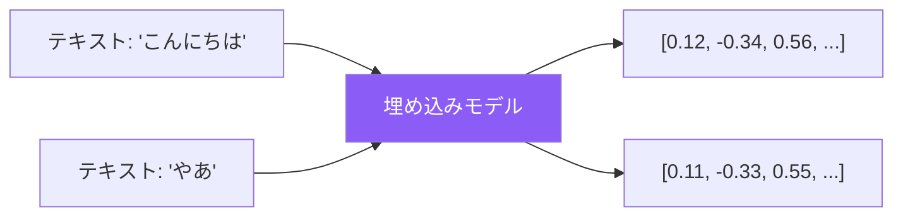

埋め込み（Embeddings）は、テキストを意味を捉えた数値ベクトルに変換します。ベクトルストアと組み合わせることで、強力なセマンティック検索が可能になり、RAGアプリケーションの基盤を形成します。

## 埋め込みとは？

埋め込みは、テキストを密なベクトルに変換し、類似した意味がベクトル空間で近くなります。



### 主な特性

| 特性 | 説明 |
|-----|------|
| 次元数 | ベクトルサイズ（例：1024、1536） |
| 意味的類似性 | 類似テキスト → 類似ベクトル |
| 距離指標 | コサイン類似度、ユークリッド距離 |

## Titan Embeddings

Amazon Titanは、検索とRAGに最適化された埋め込みモデルを提供します。

### 利用可能なモデル

| モデル | 次元数 | 最大トークン | ユースケース |
|-------|--------|------------|-------------|
| Titan Embeddings G1 - Text | 1536 | 8192 | 汎用テキスト |
| Titan Multimodal Embeddings G1 | 1024/384/256 | 128 | テキスト + 画像 |

### テキスト埋め込みの生成

```python
import boto3
import json

client = boto3.client('bedrock-runtime', region_name='us-east-1')

def get_embedding(text: str) -> list:
    response = client.invoke_model(
        modelId='amazon.titan-embed-text-v1',
        body=json.dumps({
            "inputText": text
        })
    )
    result = json.loads(response['body'].read())
    return result['embedding']

# 埋め込みを生成
embedding = get_embedding("クラウドコンピューティングとは何ですか？")
print(f"次元数: {len(embedding)}")  # 1536
```

### バッチ埋め込み

```python
def get_embeddings_batch(texts: list) -> list:
    embeddings = []
    for text in texts:
        embedding = get_embedding(text)
        embeddings.append(embedding)
    return embeddings

documents = [
    "クラウドコンピューティングはインターネット経由でITリソースを提供します。",
    "機械学習はコンピュータがデータから学習することを可能にします。",
    "Kubernetesはコンテナ化されたアプリケーションをオーケストレーションします。"
]

embeddings = get_embeddings_batch(documents)
```

### マルチモーダル埋め込み

```python
import base64

def get_multimodal_embedding(text: str = None, image_path: str = None):
    body = {}

    if text:
        body["inputText"] = text

    if image_path:
        with open(image_path, "rb") as f:
            body["inputImage"] = base64.b64encode(f.read()).decode()

    response = client.invoke_model(
        modelId='amazon.titan-embed-image-v1',
        body=json.dumps(body)
    )

    result = json.loads(response['body'].read())
    return result['embedding']

# テキスト埋め込み
text_emb = get_multimodal_embedding(text="ソファに座っている猫")

# 画像埋め込み
image_emb = get_multimodal_embedding(image_path="cat.jpg")

# 複合埋め込み
combined_emb = get_multimodal_embedding(
    text="ソファに座っている猫",
    image_path="cat.jpg"
)
```

## ベクトル類似度

### コサイン類似度

```python
import numpy as np

def cosine_similarity(a: list, b: list) -> float:
    a = np.array(a)
    b = np.array(b)
    return np.dot(a, b) / (np.linalg.norm(a) * np.linalg.norm(b))

# 埋め込みを比較
emb1 = get_embedding("機械学習とは何ですか？")
emb2 = get_embedding("MLアルゴリズムを説明してください")
emb3 = get_embedding("パスタの作り方")

print(f"ML質問同士: {cosine_similarity(emb1, emb2):.4f}")  # ~0.85
print(f"ML vs 料理: {cosine_similarity(emb1, emb3):.4f}")  # ~0.30
```

## AWSのベクトルストア

### Amazon OpenSearch Serverless

フルマネージドのベクトル検索サービス。

```python
from opensearchpy import OpenSearch, RequestsHttpConnection
from requests_aws4auth import AWS4Auth
import boto3

# クライアント設定
credentials = boto3.Session().get_credentials()
awsauth = AWS4Auth(
    credentials.access_key,
    credentials.secret_key,
    'us-east-1',
    'aoss',
    session_token=credentials.token
)

client = OpenSearch(
    hosts=[{'host': 'your-collection.us-east-1.aoss.amazonaws.com', 'port': 443}],
    http_auth=awsauth,
    use_ssl=True,
    connection_class=RequestsHttpConnection
)

# ベクトルフィールド付きインデックスを作成
index_body = {
    "settings": {
        "index": {
            "knn": True
        }
    },
    "mappings": {
        "properties": {
            "embedding": {
                "type": "knn_vector",
                "dimension": 1536,
                "method": {
                    "name": "hnsw",
                    "space_type": "cosinesimil",
                    "engine": "nmslib"
                }
            },
            "text": {"type": "text"},
            "metadata": {"type": "object"}
        }
    }
}

client.indices.create(index="documents", body=index_body)
```

### ドキュメントのインデックス

```python
def index_document(doc_id: str, text: str, metadata: dict = None):
    embedding = get_embedding(text)

    document = {
        "embedding": embedding,
        "text": text,
        "metadata": metadata or {}
    }

    client.index(
        index="documents",
        id=doc_id,
        body=document
    )

# ドキュメントをインデックス
index_document("doc1", "クラウドコンピューティング概要", {"category": "cloud"})
index_document("doc2", "機械学習の基礎", {"category": "ml"})
```

### ベクトル検索

```python
def search_similar(query: str, k: int = 5) -> list:
    query_embedding = get_embedding(query)

    search_body = {
        "size": k,
        "query": {
            "knn": {
                "embedding": {
                    "vector": query_embedding,
                    "k": k
                }
            }
        }
    }

    response = client.search(
        index="documents",
        body=search_body
    )

    return [
        {
            "text": hit["_source"]["text"],
            "score": hit["_score"],
            "metadata": hit["_source"].get("metadata", {})
        }
        for hit in response["hits"]["hits"]
    ]

# 検索
results = search_similar("AWSとは何ですか？")
for result in results:
    print(f"{result['score']:.4f}: {result['text']}")
```

### Amazon Aurora PostgreSQL（pgvector）

```python
import psycopg2

conn = psycopg2.connect(
    host="your-aurora-cluster.region.rds.amazonaws.com",
    database="vectordb",
    user="admin",
    password="password"
)

cur = conn.cursor()

# pgvector拡張を有効化
cur.execute("CREATE EXTENSION IF NOT EXISTS vector")

# ベクトル列付きテーブルを作成
cur.execute("""
    CREATE TABLE IF NOT EXISTS documents (
        id SERIAL PRIMARY KEY,
        content TEXT,
        embedding vector(1536),
        metadata JSONB
    )
""")

# 高速類似検索用インデックスを作成
cur.execute("""
    CREATE INDEX ON documents
    USING ivfflat (embedding vector_cosine_ops)
    WITH (lists = 100)
""")

conn.commit()
```

### pgvectorでの挿入と検索

```python
def insert_document(content: str, metadata: dict = None):
    embedding = get_embedding(content)

    cur.execute(
        """INSERT INTO documents (content, embedding, metadata)
           VALUES (%s, %s, %s)""",
        (content, embedding, json.dumps(metadata or {}))
    )
    conn.commit()

def search_documents(query: str, limit: int = 5):
    query_embedding = get_embedding(query)

    cur.execute(
        """SELECT content, metadata,
                  1 - (embedding <=> %s::vector) as similarity
           FROM documents
           ORDER BY embedding <=> %s::vector
           LIMIT %s""",
        (query_embedding, query_embedding, limit)
    )

    return cur.fetchall()
```

## ベクトルストア比較

| 機能 | OpenSearch Serverless | Aurora pgvector | Neptune Analytics |
|-----|----------------------|-----------------|-------------------|
| マネージド | フル | 部分的 | フル |
| スケール | 自動 | 手動 | 自動 |
| ハイブリッド検索 | あり | 限定的 | グラフ + ベクトル |
| 最適な用途 | 汎用検索 | 既存PostgreSQL | グラフ関係 |

## 完全な検索アプリケーション

```python
import boto3
import json
from typing import List, Dict

class SemanticSearch:
    def __init__(self, opensearch_client, index_name: str):
        self.bedrock = boto3.client('bedrock-runtime')
        self.opensearch = opensearch_client
        self.index_name = index_name

    def get_embedding(self, text: str) -> List[float]:
        response = self.bedrock.invoke_model(
            modelId='amazon.titan-embed-text-v1',
            body=json.dumps({"inputText": text})
        )
        return json.loads(response['body'].read())['embedding']

    def index(self, doc_id: str, text: str, metadata: Dict = None):
        self.opensearch.index(
            index=self.index_name,
            id=doc_id,
            body={
                "embedding": self.get_embedding(text),
                "text": text,
                "metadata": metadata or {}
            }
        )

    def search(self, query: str, k: int = 5) -> List[Dict]:
        response = self.opensearch.search(
            index=self.index_name,
            body={
                "size": k,
                "query": {
                    "knn": {
                        "embedding": {
                            "vector": self.get_embedding(query),
                            "k": k
                        }
                    }
                }
            }
        )

        return [
            {
                "text": hit["_source"]["text"],
                "score": hit["_score"],
                "metadata": hit["_source"].get("metadata", {})
            }
            for hit in response["hits"]["hits"]
        ]

# 使用例
search = SemanticSearch(opensearch_client, "documents")
search.index("1", "AWSはクラウドコンピューティングサービスを提供します")
results = search.search("Amazonはどんなクラウドサービスを提供していますか？")
```

## ベストプラクティス

| プラクティス | 推奨事項 |
|-------------|---------|
| ドキュメントをチャンク | 大きなドキュメントを小さな断片に分割 |
| 埋め込みを正規化 | 一貫した類似度スコアを確保 |
| メタデータフィルターを使用 | ベクトル検索とフィルターを組み合わせ |
| レイテンシを監視 | 埋め込み生成時間を追跡 |
| 埋め込みをキャッシュ | 計算済み埋め込みを保存 |

## 重要なポイント

1. **埋め込みは意味を捉える** - 類似テキストは類似ベクトル
2. **Titanはテキストとマルチモーダルを提供** - ユースケースに応じて選択
3. **複数のベクトルストアオプション** - OpenSearch、Aurora、Neptune
4. **コサイン類似度が標準** - 埋め込みの比較に
5. **RAGの基盤** - 埋め込みは検索システムを支える

## 参考文献

- [Amazon Titan Embeddings](https://docs.aws.amazon.com/bedrock/latest/userguide/titan-embedding-models.html)
- [OpenSearchベクトル検索](https://docs.aws.amazon.com/opensearch-service/latest/developerguide/knn.html)
- [pgvectorドキュメント](https://github.com/pgvector/pgvector)
