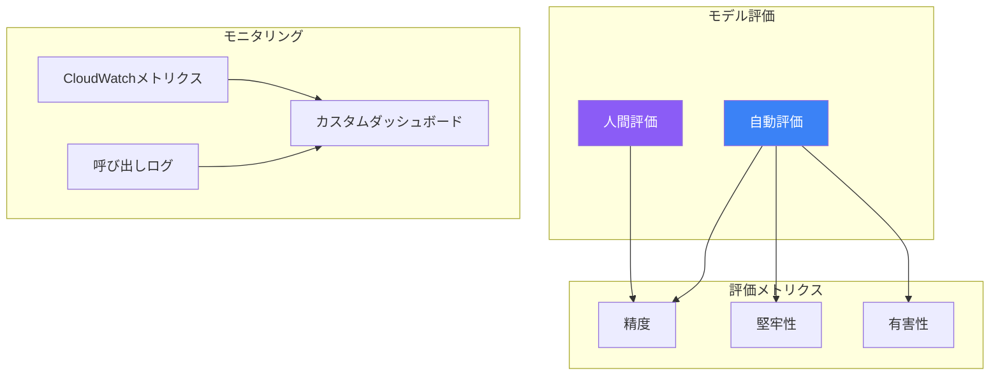

生成AIモデルの評価と監視は、品質の確保、パフォーマンスの維持、本番環境での問題特定に不可欠です。Amazon Bedrockは組み込みの評価機能を提供し、AWSモニタリングサービスと統合されています。

## 評価の概要



## モデル評価ジョブ

### 評価ジョブの作成

```python
import boto3
import json

bedrock = boto3.client('bedrock')

response = bedrock.create_evaluation_job(
    jobName='claude-evaluation-001',
    jobDescription='カスタマーサポート用にClaude Sonnetを評価',
    roleArn='arn:aws:iam::123456789012:role/BedrockEvaluationRole',
    evaluationConfig={
        'automated': {
            'datasetMetricConfigs': [
                {
                    'taskType': 'QuestionAndAnswer',
                    'dataset': {
                        'name': 'qa-dataset',
                        'datasetLocation': {
                            's3Uri': 's3://my-bucket/evaluation/qa-dataset.jsonl'
                        }
                    },
                    'metricNames': ['Accuracy', 'Robustness']
                }
            ]
        }
    },
    inferenceConfig={
        'models': [
            {
                'bedrockModel': {
                    'modelIdentifier': 'anthropic.claude-3-sonnet-20240229-v1:0',
                    'inferenceParams': json.dumps({
                        'temperature': 0.7,
                        'max_tokens': 1024
                    })
                }
            }
        ]
    },
    outputDataConfig={
        's3Uri': 's3://my-bucket/evaluation/output/'
    }
)

job_arn = response['jobArn']
```

### データセット形式（JSONL）

```json
{"prompt": "返品ポリシーは何ですか？", "referenceResponse": "当社の返品ポリシーでは、購入後30日以内の返品が可能です。"}
{"prompt": "注文を追跡するにはどうすればいいですか？", "referenceResponse": "確認メールに記載されている追跡リンクで注文を追跡できます。"}
{"prompt": "どのような支払い方法がありますか？", "referenceResponse": "クレジットカード、PayPal、銀行振込を受け付けています。"}
```

### 評価メトリクス

| メトリクス | 説明 | タスクタイプ |
|----------|------|------------|
| Accuracy | 回答の正確性 | QA、要約 |
| Robustness | バリエーション間の一貫性 | すべて |
| Toxicity | 有害コンテンツの検出 | すべて |
| Relevance | トピックへの適合性 | QA、分類 |
| Fluency | 言語品質 | すべて |

## 人間評価

### 人間評価ジョブの作成

```python
response = bedrock.create_evaluation_job(
    jobName='human-evaluation-001',
    jobDescription='レスポンス品質の人間評価',
    roleArn='arn:aws:iam::123456789012:role/BedrockEvaluationRole',
    evaluationConfig={
        'human': {
            'humanWorkflowConfig': {
                'flowDefinitionArn': 'arn:aws:sagemaker:us-east-1:123456789012:flow-definition/bedrock-eval',
                'instructions': 'AIのレスポンス品質を1-5で評価してください'
            },
            'customMetrics': [
                {
                    'name': 'Helpfulness',
                    'description': 'レスポンスはどれくらい役立つか？',
                    'ratingMethod': 'ThumbsUpDown'
                },
                {
                    'name': 'Accuracy',
                    'description': '情報は正確か？',
                    'ratingMethod': 'IndividualLikertScale'
                }
            ],
            'datasetMetricConfigs': [
                {
                    'taskType': 'QuestionAndAnswer',
                    'dataset': {
                        'name': 'human-eval-dataset',
                        'datasetLocation': {
                            's3Uri': 's3://my-bucket/evaluation/human-dataset.jsonl'
                        }
                    }
                }
            ]
        }
    },
    inferenceConfig={
        'models': [
            {
                'bedrockModel': {
                    'modelIdentifier': 'anthropic.claude-3-sonnet-20240229-v1:0'
                }
            }
        ]
    },
    outputDataConfig={
        's3Uri': 's3://my-bucket/evaluation/human-output/'
    }
)
```

## モデル比較

### 複数モデルの比較

```python
response = bedrock.create_evaluation_job(
    jobName='model-comparison-001',
    jobDescription='Claude SonnetとHaikuの比較',
    roleArn='arn:aws:iam::123456789012:role/BedrockEvaluationRole',
    evaluationConfig={
        'automated': {
            'datasetMetricConfigs': [
                {
                    'taskType': 'QuestionAndAnswer',
                    'dataset': {
                        'name': 'comparison-dataset',
                        'datasetLocation': {
                            's3Uri': 's3://my-bucket/evaluation/comparison.jsonl'
                        }
                    },
                    'metricNames': ['Accuracy', 'Robustness', 'Toxicity']
                }
            ]
        }
    },
    inferenceConfig={
        'models': [
            {
                'bedrockModel': {
                    'modelIdentifier': 'anthropic.claude-3-sonnet-20240229-v1:0',
                    'inferenceParams': json.dumps({'temperature': 0.5})
                }
            },
            {
                'bedrockModel': {
                    'modelIdentifier': 'anthropic.claude-3-haiku-20240307-v1:0',
                    'inferenceParams': json.dumps({'temperature': 0.5})
                }
            }
        ]
    },
    outputDataConfig={
        's3Uri': 's3://my-bucket/evaluation/comparison-output/'
    }
)
```

## CloudWatchモニタリング

### 主要メトリクス

| メトリクス | 説明 |
|----------|------|
| InvocationCount | モデル呼び出し数 |
| InvocationLatency | レスポンス時間 |
| InvocationClientErrors | 4xxエラー |
| InvocationServerErrors | 5xxエラー |
| InputTokenCount | リクエスト内のトークン数 |
| OutputTokenCount | レスポンス内のトークン数 |

### CloudWatchダッシュボードの作成

```python
cloudwatch = boto3.client('cloudwatch')

dashboard_body = {
    'widgets': [
        {
            'type': 'metric',
            'x': 0, 'y': 0,
            'width': 12, 'height': 6,
            'properties': {
                'metrics': [
                    ['AWS/Bedrock', 'InvocationCount', 'ModelId', 'anthropic.claude-3-sonnet-20240229-v1:0'],
                    ['.', 'InvocationLatency', '.', '.', {'stat': 'Average'}]
                ],
                'title': 'モデル呼び出し',
                'region': 'us-east-1',
                'period': 300
            }
        },
        {
            'type': 'metric',
            'x': 12, 'y': 0,
            'width': 12, 'height': 6,
            'properties': {
                'metrics': [
                    ['AWS/Bedrock', 'InvocationClientErrors', 'ModelId', 'anthropic.claude-3-sonnet-20240229-v1:0'],
                    ['.', 'InvocationServerErrors', '.', '.']
                ],
                'title': 'エラー率',
                'region': 'us-east-1',
                'period': 300
            }
        },
        {
            'type': 'metric',
            'x': 0, 'y': 6,
            'width': 24, 'height': 6,
            'properties': {
                'metrics': [
                    ['AWS/Bedrock', 'InputTokenCount', 'ModelId', 'anthropic.claude-3-sonnet-20240229-v1:0', {'stat': 'Sum'}],
                    ['.', 'OutputTokenCount', '.', '.', {'stat': 'Sum'}]
                ],
                'title': 'トークン使用量',
                'region': 'us-east-1',
                'period': 3600
            }
        }
    ]
}

cloudwatch.put_dashboard(
    DashboardName='BedrockMonitoring',
    DashboardBody=json.dumps(dashboard_body)
)
```

### CloudWatchアラーム

```python
# 高レイテンシーのアラーム
cloudwatch.put_metric_alarm(
    AlarmName='BedrockHighLatency',
    AlarmDescription='Bedrockモデルのレイテンシーが高い',
    MetricName='InvocationLatency',
    Namespace='AWS/Bedrock',
    Dimensions=[
        {'Name': 'ModelId', 'Value': 'anthropic.claude-3-sonnet-20240229-v1:0'}
    ],
    Statistic='Average',
    Period=300,
    EvaluationPeriods=2,
    Threshold=5000,  # 5秒
    ComparisonOperator='GreaterThanThreshold',
    AlarmActions=['arn:aws:sns:us-east-1:123456789012:alerts']
)

# 高エラー率のアラーム
cloudwatch.put_metric_alarm(
    AlarmName='BedrockHighErrorRate',
    AlarmDescription='Bedrockのエラー率が高い',
    MetricName='InvocationServerErrors',
    Namespace='AWS/Bedrock',
    Dimensions=[
        {'Name': 'ModelId', 'Value': 'anthropic.claude-3-sonnet-20240229-v1:0'}
    ],
    Statistic='Sum',
    Period=300,
    EvaluationPeriods=1,
    Threshold=10,
    ComparisonOperator='GreaterThanThreshold',
    AlarmActions=['arn:aws:sns:us-east-1:123456789012:alerts']
)
```

## カスタム評価

### カスタムメトリクスの実装

```python
import boto3
from datetime import datetime

class BedrockEvaluator:
    def __init__(self, model_id: str):
        self.runtime = boto3.client('bedrock-runtime')
        self.cloudwatch = boto3.client('cloudwatch')
        self.model_id = model_id

    def evaluate_response(self, prompt: str, response: str,
                         expected: str = None) -> dict:
        metrics = {}

        # レスポンス長
        metrics['response_length'] = len(response)

        # 関連性スコア（単純なキーワードマッチング）
        if expected:
            expected_words = set(expected.lower().split())
            response_words = set(response.lower().split())
            overlap = len(expected_words & response_words)
            metrics['relevance_score'] = overlap / len(expected_words) if expected_words else 0

        return metrics

    def publish_custom_metrics(self, metrics: dict):
        metric_data = []
        timestamp = datetime.utcnow()

        for name, value in metrics.items():
            metric_data.append({
                'MetricName': name,
                'Dimensions': [
                    {'Name': 'ModelId', 'Value': self.model_id},
                    {'Name': 'Application', 'Value': 'CustomerSupport'}
                ],
                'Timestamp': timestamp,
                'Value': value,
                'Unit': 'None'
            })

        self.cloudwatch.put_metric_data(
            Namespace='Custom/Bedrock',
            MetricData=metric_data
        )

    def run_evaluation_batch(self, test_cases: list) -> dict:
        results = []

        for case in test_cases:
            response = self.runtime.converse(
                modelId=self.model_id,
                messages=[{'role': 'user', 'content': [{'text': case['prompt']}]}]
            )

            answer = response['output']['message']['content'][0]['text']
            metrics = self.evaluate_response(
                case['prompt'],
                answer,
                case.get('expected')
            )

            results.append({
                'prompt': case['prompt'],
                'response': answer,
                'metrics': metrics
            })

            self.publish_custom_metrics(metrics)

        # 結果を集計
        avg_relevance = sum(r['metrics'].get('relevance_score', 0) for r in results) / len(results)

        return {
            'total_cases': len(results),
            'average_relevance': avg_relevance,
            'results': results
        }

# 使用例
evaluator = BedrockEvaluator('anthropic.claude-3-sonnet-20240229-v1:0')
test_cases = [
    {'prompt': '返品ポリシーは何ですか？', 'expected': '返品は30日以内に受け付けています'},
    {'prompt': 'サポートへの連絡方法は？', 'expected': 'support@example.comにメールまたは1-800-XXXに電話'}
]
results = evaluator.run_evaluation_batch(test_cases)
```

## 呼び出しログ分析

### CloudWatch Insightsでログをクエリ

```python
logs = boto3.client('logs')

# 遅い呼び出しのクエリ
query = """
fields @timestamp, @message
| filter modelId = 'anthropic.claude-3-sonnet-20240229-v1:0'
| filter latencyMs > 3000
| sort @timestamp desc
| limit 100
"""

response = logs.start_query(
    logGroupName='/aws/bedrock/model-invocations',
    startTime=int((datetime.now() - timedelta(hours=24)).timestamp()),
    endTime=int(datetime.now().timestamp()),
    queryString=query
)

query_id = response['queryId']

# 結果を待機
import time
while True:
    result = logs.get_query_results(queryId=query_id)
    if result['status'] == 'Complete':
        break
    time.sleep(1)

for record in result['results']:
    print(record)
```

## ベストプラクティス

| プラクティス | 推奨事項 |
|-------------|---------
| 定期的な評価 | 週次で評価ジョブを実行 |
| A/Bテスト | モデルバージョンを比較 |
| アラート閾値 | ベースラインメトリクスに基づいて設定 |
| コストモニタリング | トークン使用量を追跡 |
| ログ保持 | 分析用にログを保持 |

## 重要なポイント

1. **組み込み評価** - 自動評価と人間評価ジョブを使用
2. **CloudWatch統合** - 呼び出し、レイテンシー、エラーを監視
3. **カスタムメトリクス** - アプリケーション固有のメトリクスを公開
4. **プロアクティブなアラート** - 異常に対するアラームを設定
5. **継続的改善** - 評価結果に基づいてイテレーション

## 参考文献

- [モデル評価](https://docs.aws.amazon.com/bedrock/latest/userguide/model-evaluation.html)
- [CloudWatchメトリクス](https://docs.aws.amazon.com/bedrock/latest/userguide/monitoring-cw.html)
- [呼び出しログ](https://docs.aws.amazon.com/bedrock/latest/userguide/model-invocation-logging.html)
