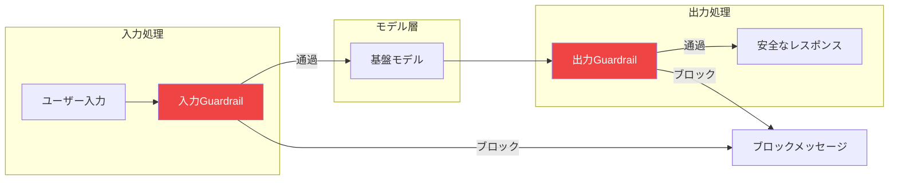

Amazon Bedrock Guardrailsは、モデルの入出力を制御する設定可能なセーフガードを提供し、アプリケーションが安全性とコンプライアンス要件を満たすことを保証することで、責任あるAIの実装を支援します。

## Guardrailsの概要



## Guardrailコンポーネント

| コンポーネント | 目的 | 例 |
|--------------|------|-----|
| コンテンツフィルター | 有害コンテンツをブロック | 暴力、ヘイトスピーチ |
| 拒否トピック | 特定の話題を制限 | 競合他社、政治 |
| ワードフィルター | 特定の用語をブロック | 不適切な表現 |
| PII検出 | 個人データを保護 | SSN、クレジットカード |
| コンテキストグラウンディング | ハルシネーションを防止 | 事実の正確性 |

## Guardrailの作成

### 基本的なGuardrail

```python
import boto3

client = boto3.client('bedrock')

response = client.create_guardrail(
    name='content-safety-guardrail',
    description='コンテンツの安全性とコンプライアンスのためのGuardrail',
    blockedInputMessaging='リクエストには許可されていないコンテンツが含まれています。',
    blockedOutputsMessaging='安全性の懸念によりレスポンスがブロックされました。',
    contentPolicyConfig={
        'filtersConfig': [
            {
                'type': 'SEXUAL',
                'inputStrength': 'HIGH',
                'outputStrength': 'HIGH'
            },
            {
                'type': 'VIOLENCE',
                'inputStrength': 'HIGH',
                'outputStrength': 'HIGH'
            },
            {
                'type': 'HATE',
                'inputStrength': 'HIGH',
                'outputStrength': 'HIGH'
            },
            {
                'type': 'INSULTS',
                'inputStrength': 'MEDIUM',
                'outputStrength': 'MEDIUM'
            },
            {
                'type': 'MISCONDUCT',
                'inputStrength': 'HIGH',
                'outputStrength': 'HIGH'
            },
            {
                'type': 'PROMPT_ATTACK',
                'inputStrength': 'HIGH',
                'outputStrength': 'NONE'
            }
        ]
    }
)

guardrail_id = response['guardrailId']
guardrail_version = response['version']
```

### コンテンツフィルターの強度

| 強度 | 動作 |
|-----|------|
| NONE | フィルタリングなし |
| LOW | 重大な違反のみブロック |
| MEDIUM | 中程度の違反をブロック |
| HIGH | 軽微な違反もブロック |

## トピック拒否

### 拒否トピックの設定

```python
response = client.create_guardrail(
    name='business-guardrail',
    description='ビジネスコンプライアンスのためのGuardrail',
    blockedInputMessaging='このトピックはサポートされていません。',
    blockedOutputsMessaging='このトピックに関する情報は提供できません。',
    topicPolicyConfig={
        'topicsConfig': [
            {
                'name': '競合他社情報',
                'definition': '競合他社の製品、価格、戦略に関する質問',
                'examples': [
                    '競合X社の製品の特徴は？',
                    '競合Y社の価格はどう比較される？',
                    '競合Z社の戦略について教えて'
                ],
                'type': 'DENY'
            },
            {
                'name': '投資アドバイス',
                'definition': '金融または投資の推奨',
                'examples': [
                    '株を買うべき？',
                    'どの暗号通貨に投資すべき？',
                    '今は投資に良い時期？'
                ],
                'type': 'DENY'
            },
            {
                'name': '政治的トピック',
                'definition': '政治的意見、候補者、選挙',
                'examples': [
                    '誰に投票すべき？',
                    'この政策についてどう思う？'
                ],
                'type': 'DENY'
            }
        ]
    },
    contentPolicyConfig={
        'filtersConfig': [
            {'type': 'HATE', 'inputStrength': 'HIGH', 'outputStrength': 'HIGH'},
            {'type': 'VIOLENCE', 'inputStrength': 'HIGH', 'outputStrength': 'HIGH'}
        ]
    }
)
```

## ワードフィルター

### カスタムワードブロッキング

```python
response = client.create_guardrail(
    name='word-filter-guardrail',
    description='特定の単語やフレーズをブロック',
    blockedInputMessaging='メッセージにブロックされたコンテンツが含まれています。',
    blockedOutputsMessaging='コンテンツポリシーによりレスポンスがブロックされました。',
    wordPolicyConfig={
        'wordsConfig': [
            {'text': '不適切な単語1'},
            {'text': '不適切な単語2'},
            {'text': '差別用語1'}
        ],
        'managedWordListsConfig': [
            {'type': 'PROFANITY'}  # AWSマネージド不適切表現リスト
        ]
    }
)
```

## PII検出と処理

### PIIフィルタリングの設定

```python
response = client.create_guardrail(
    name='pii-guardrail',
    description='個人を特定できる情報を保護',
    blockedInputMessaging='個人情報を共有しないでください。',
    blockedOutputsMessaging='レスポンスにPIIが含まれているためブロックされました。',
    sensitiveInformationPolicyConfig={
        'piiEntitiesConfig': [
            {'type': 'EMAIL', 'action': 'ANONYMIZE'},
            {'type': 'PHONE', 'action': 'ANONYMIZE'},
            {'type': 'NAME', 'action': 'ANONYMIZE'},
            {'type': 'US_SOCIAL_SECURITY_NUMBER', 'action': 'BLOCK'},
            {'type': 'CREDIT_DEBIT_CARD_NUMBER', 'action': 'BLOCK'},
            {'type': 'US_BANK_ACCOUNT_NUMBER', 'action': 'BLOCK'},
            {'type': 'ADDRESS', 'action': 'ANONYMIZE'}
        ],
        'regexesConfig': [
            {
                'name': 'CustomAccountNumber',
                'description': '内部アカウント番号形式',
                'pattern': 'ACC-[0-9]{8}',
                'action': 'ANONYMIZE'
            }
        ]
    }
)
```

### PIIアクション

| アクション | 動作 |
|----------|------|
| BLOCK | リクエスト/レスポンス全体をブロック |
| ANONYMIZE | PIIをプレースホルダーに置換 |

## コンテキストグラウンディング

### ハルシネーションの防止

```python
response = client.create_guardrail(
    name='grounding-guardrail',
    description='事実の正確性を確保',
    blockedInputMessaging='入力の検証に失敗しました。',
    blockedOutputsMessaging='レスポンスが事実に基づいていない可能性があります。',
    contextualGroundingPolicyConfig={
        'filtersConfig': [
            {
                'type': 'GROUNDING',
                'threshold': 0.7  # 0.0から1.0
            },
            {
                'type': 'RELEVANCE',
                'threshold': 0.7
            }
        ]
    }
)
```

## モデルでのGuardrails使用

### Converse APIにGuardrailを適用

```python
runtime = boto3.client('bedrock-runtime')

response = runtime.converse(
    modelId='anthropic.claude-3-sonnet-20240229-v1:0',
    messages=[
        {
            'role': 'user',
            'content': [{'text': '競合他社の製品について教えて'}]
        }
    ],
    guardrailConfig={
        'guardrailIdentifier': guardrail_id,
        'guardrailVersion': guardrail_version,
        'trace': 'enabled'  # デバッグ用にトレースを有効化
    }
)

# Guardrailが介入したか確認
if response.get('stopReason') == 'guardrail_intervened':
    print('リクエストがGuardrailによりブロックされました')
    # トレース情報にアクセス
    trace = response.get('trace', {})
    print(f"Guardrailトレース: {trace}")
else:
    print(response['output']['message']['content'][0]['text'])
```

### InvokeModelにGuardrailを適用

```python
import json

response = runtime.invoke_model(
    modelId='anthropic.claude-3-sonnet-20240229-v1:0',
    body=json.dumps({
        'anthropic_version': 'bedrock-2023-05-31',
        'max_tokens': 1024,
        'messages': [{'role': 'user', 'content': 'ユーザークエリ'}]
    }),
    guardrailIdentifier=guardrail_id,
    guardrailVersion=guardrail_version
)
```

### Guardrailsでストリーミング

```python
response = runtime.converse_stream(
    modelId='anthropic.claude-3-sonnet-20240229-v1:0',
    messages=[{'role': 'user', 'content': [{'text': 'クエリ'}]}],
    guardrailConfig={
        'guardrailIdentifier': guardrail_id,
        'guardrailVersion': guardrail_version,
        'streamProcessingMode': 'sync'  # または'async'
    }
)

for event in response['stream']:
    if 'contentBlockDelta' in event:
        print(event['contentBlockDelta']['delta'].get('text', ''), end='')
    elif 'guardrailResult' in event:
        print(f"\nGuardrail結果: {event['guardrailResult']}")
```

## ApplyGuardrail API

### 直接Guardrailを適用

```python
response = runtime.apply_guardrail(
    guardrailIdentifier=guardrail_id,
    guardrailVersion=guardrail_version,
    source='INPUT',  # または'OUTPUT'
    content=[
        {
            'text': {
                'text': 'Guardrailでチェックするテキスト'
            }
        }
    ]
)

if response['action'] == 'GUARDRAIL_INTERVENED':
    print('コンテンツがブロックされました')
    for output in response['outputs']:
        print(f"ブロックメッセージ: {output['text']}")
else:
    print('コンテンツはGuardrailチェックを通過しました')
```

## Guardrail管理

### Guardrailの一覧表示

```python
response = client.list_guardrails()
for guardrail in response['guardrails']:
    print(f"{guardrail['name']}: {guardrail['id']} (v{guardrail['version']})")
```

### Guardrailの更新

```python
response = client.update_guardrail(
    guardrailIdentifier=guardrail_id,
    name='updated-guardrail',
    description='更新された説明',
    blockedInputMessaging='更新されたブロック入力メッセージ',
    blockedOutputsMessaging='更新されたブロック出力メッセージ',
    contentPolicyConfig={
        'filtersConfig': [
            {'type': 'HATE', 'inputStrength': 'HIGH', 'outputStrength': 'HIGH'},
            {'type': 'VIOLENCE', 'inputStrength': 'MEDIUM', 'outputStrength': 'MEDIUM'}
        ]
    }
)
```

### Guardrailバージョンの作成

```python
response = client.create_guardrail_version(
    guardrailIdentifier=guardrail_id,
    description='本番バージョン1.0'
)
print(f"作成されたバージョン: {response['version']}")
```

## 完全なGuardrailの例

```python
import boto3
import json

class SafeAIAssistant:
    def __init__(self, guardrail_id: str, guardrail_version: str):
        self.runtime = boto3.client('bedrock-runtime')
        self.guardrail_id = guardrail_id
        self.guardrail_version = guardrail_version

    def chat(self, message: str, system_prompt: str = None) -> dict:
        messages = [{'role': 'user', 'content': [{'text': message}]}]

        try:
            response = self.runtime.converse(
                modelId='anthropic.claude-3-sonnet-20240229-v1:0',
                messages=messages,
                system=[{'text': system_prompt}] if system_prompt else None,
                guardrailConfig={
                    'guardrailIdentifier': self.guardrail_id,
                    'guardrailVersion': self.guardrail_version,
                    'trace': 'enabled'
                }
            )

            if response.get('stopReason') == 'guardrail_intervened':
                return {
                    'blocked': True,
                    'message': 'リクエストが安全性制御によりブロックされました。',
                    'trace': response.get('trace', {})
                }

            return {
                'blocked': False,
                'message': response['output']['message']['content'][0]['text'],
                'usage': response.get('usage', {})
            }

        except Exception as e:
            return {
                'blocked': True,
                'message': f'エラー: {str(e)}',
                'trace': {}
            }

# 使用例
assistant = SafeAIAssistant(guardrail_id, guardrail_version)
result = assistant.chat("製品について教えてください")
if result['blocked']:
    print(f"ブロック: {result['message']}")
else:
    print(f"レスポンス: {result['message']}")
```

## ベストプラクティス

| プラクティス | 推奨事項 |
|-------------|---------
| 厳格に開始 | 高いフィルター強度から始め、必要に応じて緩和 |
| 徹底的にテスト | 敵対的な入力でテスト |
| バージョン管理 | 本番にはGuardrailバージョンを使用 |
| モニタリング | Guardrailの介入を追跡 |
| メッセージのカスタマイズ | 有用なブロックメッセージを提供 |

## 重要なポイント

1. **複数の安全レイヤー** - コンテンツフィルター、トピック拒否、ワードフィルター、PII
2. **設定可能な閾値** - ユースケースごとに厳格さを調整
3. **PII保護** - 機密データをブロックまたは匿名化
4. **コンテキストグラウンディング** - ハルシネーションを削減
5. **簡単な統合** - ConverseとInvokeModel APIで動作

## 参考文献

- [Bedrock Guardrails](https://docs.aws.amazon.com/bedrock/latest/userguide/guardrails.html)
- [責任あるAI](https://aws.amazon.com/machine-learning/responsible-ai/)
- [コンテンツフィルタリング](https://docs.aws.amazon.com/bedrock/latest/userguide/guardrails-content-filters.html)
