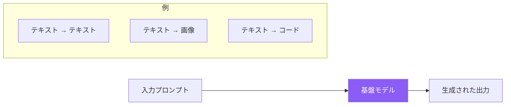
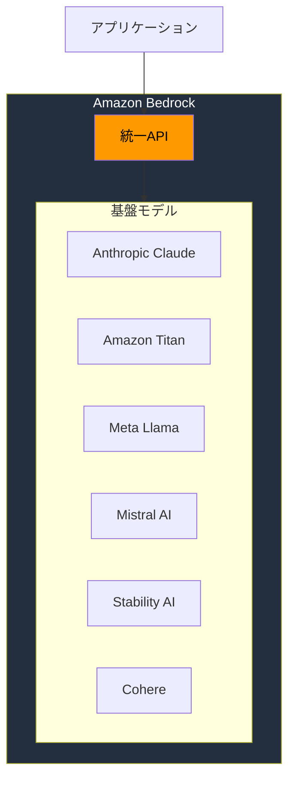
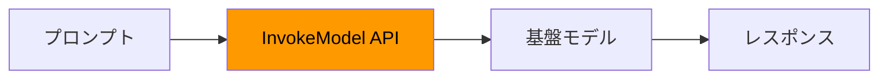
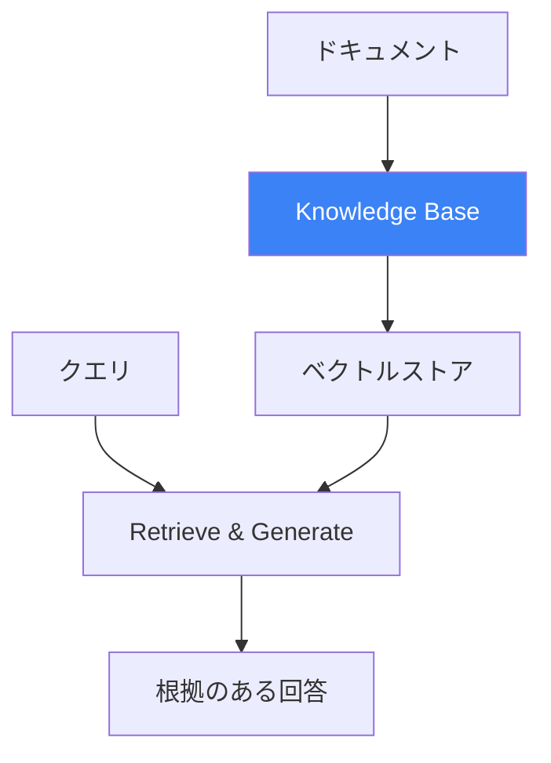
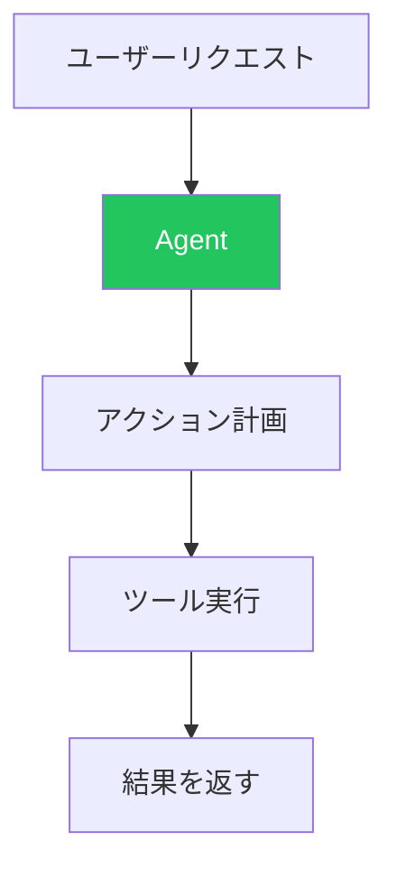
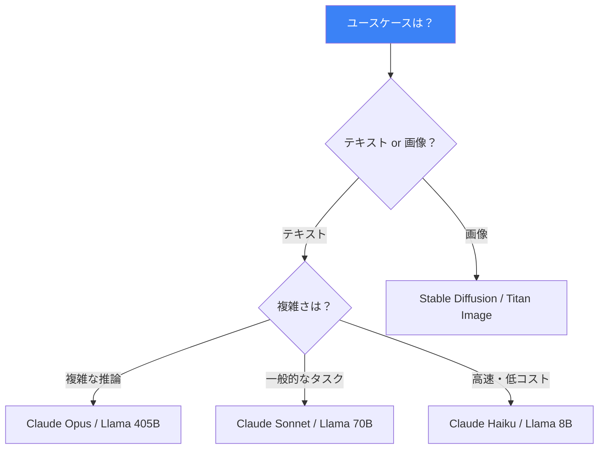

Amazon Bedrockは、主要なAI企業の高性能な基盤モデル（FM）に統一APIでアクセスできるフルマネージドサービスです。この記事では、生成AIの基礎とBedrockでAIアプリケーションを構築する方法を解説します。

## 生成AIとは？

生成AIは、学習データから学んだパターンに基づいて、テキスト、画像、コード、音声、動画などの新しいコンテンツを作成できるAIシステムです。



### 主な特徴

| 特徴 | 説明 |
|-----|------|
| 創造的 | 検索ではなく新しいコンテンツを生成 |
| 文脈理解 | 自然言語を理解して応答 |
| 汎用的 | タスク固有の学習なしで複数タスクに対応 |
| 確率的 | 同じ入力でも出力が異なる場合がある |

## Amazon Bedrockとは？

Amazon Bedrockは、複数の基盤モデルに単一APIでアクセスでき、インフラを管理せずに生成AIアプリケーションを構築できます。



### 主なメリット

| メリット | 説明 |
|---------|------|
| フルマネージド | インフラのプロビジョニング・管理不要 |
| モデル選択 | 1つのAPIで複数のFMにアクセス |
| セキュリティ | データはAWSアカウント内に保持 |
| カスタマイズ | 自社データでモデルをファインチューニング |
| 統合 | AWSサービスとのネイティブ連携 |

## Bedrockの基盤モデル

### Amazon Titan

Amazonの基盤モデルファミリー。

| モデル | 機能 | ユースケース |
|-------|-----|-------------|
| Titan Text | テキスト生成 | 要約、Q&A、チャット |
| Titan Embeddings | ベクトル埋め込み | セマンティック検索、RAG |
| Titan Image Generator | 画像生成 | クリエイティブコンテンツ |
| Titan Multimodal Embeddings | テキスト+画像埋め込み | マルチモーダル検索 |

### Anthropic Claude

安全性と有用性で知られるモデル。

| モデル | コンテキストウィンドウ | 最適な用途 |
|-------|---------------------|-----------|
| Claude 3.5 Sonnet | 200Kトークン | バランスの取れた性能 |
| Claude 3 Opus | 200Kトークン | 複雑な推論 |
| Claude 3 Haiku | 200Kトークン | 高速、コスト効率 |

### Meta Llama

強力な性能を持つオープンウェイトモデル。

| モデル | パラメータ数 | 特徴 |
|-------|------------|------|
| Llama 3.1 8B | 80億 | 高速推論 |
| Llama 3.1 70B | 700億 | 高品質 |
| Llama 3.1 405B | 4050億 | 最先端 |

### Mistral AI

効率的なヨーロッパのモデル。

| モデル | ユースケース |
|-------|-------------|
| Mistral 7B | 汎用 |
| Mixtral 8x7B | エキスパート混合 |
| Mistral Large | 複雑なタスク |

### Stability AI

画像生成の専門家。

| モデル | 機能 |
|-------|------|
| Stable Diffusion XL | 高品質画像生成 |
| Stable Image Core | 高速画像生成 |
| Stable Image Ultra | フォトリアリスティック画像 |

## Bedrockのコア機能

### 1. モデル推論



### 2. Knowledge Bases（RAG）

FMをプライベートデータソースに接続。



### 3. Agents

アクションを実行できる自律型AIエージェントを構築。



### 4. Guardrails

責任あるAIのセーフガードを実装。

| ガードレール | 機能 |
|-------------|------|
| コンテンツフィルター | 有害コンテンツをブロック |
| 禁止トピック | 特定の話題を制限 |
| PIIフィルター | 機密情報を編集 |
| ワードフィルター | 特定の単語をブロック |

### 5. モデルカスタマイズ

自社データでモデルをファインチューニング。

| 方法 | 説明 |
|-----|------|
| 継続事前学習 | ドメイン固有の言語に適応 |
| ファインチューニング | タスク固有の例で学習 |

## 料金モデル

Bedrockは柔軟な料金オプションを提供。

| オプション | 説明 | 最適な用途 |
|-----------|------|-----------|
| オンデマンド | トークン単位で課金 | 変動するワークロード |
| バッチ | 割引されたバッチ処理 | 大規模オフラインジョブ |
| Provisioned Throughput | 予約容量 | 一定のワークロード |

## はじめる

### 1. モデルアクセスを有効化

```
AWSコンソール → Amazon Bedrock → モデルアクセス → モデルを有効化
```

### 2. 最初のAPI呼び出し（Python）

```python
import boto3
import json

# Bedrock Runtimeクライアントを作成
client = boto3.client('bedrock-runtime', region_name='us-east-1')

# Claudeモデルを呼び出し
response = client.invoke_model(
    modelId='anthropic.claude-3-sonnet-20240229-v1:0',
    body=json.dumps({
        "anthropic_version": "bedrock-2023-05-31",
        "max_tokens": 1024,
        "messages": [
            {"role": "user", "content": "こんにちは、Claude！"}
        ]
    })
)

# レスポンスをパース
result = json.loads(response['body'].read())
print(result['content'][0]['text'])
```

### 3. Converse APIの使用（統一インターフェース）

```python
response = client.converse(
    modelId='anthropic.claude-3-sonnet-20240229-v1:0',
    messages=[
        {"role": "user", "content": [{"text": "こんにちは！"}]}
    ],
    inferenceConfig={
        "maxTokens": 1024,
        "temperature": 0.7
    }
)

print(response['output']['message']['content'][0]['text'])
```

## モデル選択ガイド



## ベストプラクティス

| プラクティス | 推奨事項 |
|-------------|---------|
| シンプルに始める | オンデマンド料金から開始 |
| モデルをテスト | タスクに対して複数モデルを評価 |
| Converse APIを使用 | モデル間で統一されたインターフェース |
| ログを有効化 | 使用状況を追跡し問題をデバッグ |
| ガードレールを実装 | 最初から安全対策を追加 |

## 重要なポイント

1. **Bedrockは統一アクセスを提供** - 単一APIで複数の基盤モデルにアクセス
2. **インフラ管理不要** - フルマネージドサービス
3. **複数の機能** - 推論、RAG、エージェント、ガードレール
4. **データはプライベート** - モデルはあなたのデータで学習しない
5. **適切なモデルを選択** - 品質、速度、コストのバランス

## 次のステップ

- AWSアカウントでモデルアクセスを設定
- Bedrockプレイグラウンドでインタラクティブにテスト
- モデル固有のプロンプト技術を学ぶ
- RAGアプリケーション用のKnowledge Basesを探索

## 参考文献

- [Amazon Bedrockドキュメント](https://docs.aws.amazon.com/bedrock/)
- [Amazon Bedrockユーザーガイド](https://docs.aws.amazon.com/bedrock/latest/userguide/)
- [Bedrockの基盤モデル](https://docs.aws.amazon.com/bedrock/latest/userguide/models-supported.html)
