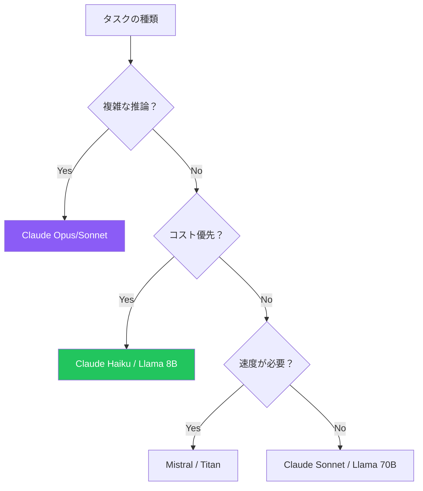

Amazon Bedrockの各基盤モデルには、独自のプロンプト形式とベストプラクティスがあります。このガイドでは、Claude、Titan、Llama、Mistralから最適な結果を得るためのモデル固有の技術を解説します。

## モデル固有のプロンプトが重要な理由

各モデルは異なる方法で学習されており、特定の形式に最もよく反応します。適切な形式を使用することで、出力品質が大幅に向上します。

## Anthropic Claude

Claudeは、XMLタグと明確な指示を使用した構造化プロンプトに優れています。

### システムプロンプトの使用

```python
response = client.converse(
    modelId='anthropic.claude-3-sonnet-20240229-v1:0',
    system=[{
        "text": "あなたは熟練のPython開発者です。型ヒント付きのクリーンなコードを書いてください。"
    }],
    messages=[
        {"role": "user", "content": [{"text": "JSONパーサー関数を書いてください。"}]}
    ]
)
```

### XMLタグによる構造化

```text
このフィードバックを分析してください：

<feedback>
商品の到着は遅れましたが、品質は素晴らしかったです。
</feedback>

この形式で回答してください：
<analysis>
<sentiment>ポジティブ/ネガティブ/混合</sentiment>
<summary>簡潔な要約</summary>
</analysis>
```

### アシスタント応答の事前入力

```python
messages = [
    {"role": "user", "content": [{"text": "3つの利点を挙げてください："}]},
    {"role": "assistant", "content": [{"text": "1."}]}  # 形式をガイド
]
```

### Claudeパラメータ

| パラメータ | 範囲 | 推奨値 |
|-----------|------|--------|
| temperature | 0-1 | 0.3-0.7 |
| top_p | 0-1 | 0.9 |
| max_tokens | 1-4096+ | タスク依存 |

## Amazon Titan

Titanは、直接的な指示ベースのプロンプトを使用します。

### 基本形式

```python
response = client.invoke_model(
    modelId='amazon.titan-text-express-v1',
    body=json.dumps({
        "inputText": "機械学習を簡単に説明してください。",
        "textGenerationConfig": {
            "maxTokenCount": 1024,
            "temperature": 0.7
        }
    })
)
```

### 構造化された指示

```text
タスク：以下のテキストを3つの箇条書きで要約してください。

テキスト：[コンテンツ]

要約：
```

### Titanパラメータ

| パラメータ | 範囲 | 備考 |
|-----------|------|------|
| temperature | 0-1 | 低いほど決定的 |
| topP | 0-1 | Nucleusサンプリング |
| maxTokenCount | 1-8192 | 出力制限 |

## Meta Llama

Llama 3は、命令フォーマットに特殊トークンを使用します。

### Llama 3形式

```python
prompt = """<|begin_of_text|><|start_header_id|>system<|end_header_id|>

あなたは親切なコーディングアシスタントです。<|eot_id|><|start_header_id|>user<|end_header_id|>

Pythonでhello worldプログラムを書いてください。<|eot_id|><|start_header_id|>assistant<|end_header_id|>

"""

response = client.invoke_model(
    modelId='meta.llama3-1-70b-instruct-v1:0',
    body=json.dumps({
        "prompt": prompt,
        "max_gen_len": 1024,
        "temperature": 0.7
    })
)
```

### Llama特殊トークン

| トークン | 目的 |
|---------|------|
| `<\|begin_of_text\|>` | プロンプト開始 |
| `<\|start_header_id\|>` | ロールヘッダー開始 |
| `<\|end_header_id\|>` | ロールヘッダー終了 |
| `<\|eot_id\|>` | ターン終了 |

### Llamaパラメータ

| パラメータ | 範囲 | 備考 |
|-----------|------|------|
| temperature | 0-1 | 創造性制御 |
| top_p | 0-1 | Nucleusサンプリング |
| max_gen_len | 1-2048 | 出力長 |

## Mistral AI

Mistralは、構造化プロンプトに命令タグを使用します。

### Mistral形式

```python
prompt = """<s>[INST] あなたは親切なアシスタントです。 [/INST]</s>
[INST] クラウドコンピューティングを説明してください。 [/INST]"""

response = client.invoke_model(
    modelId='mistral.mistral-large-2402-v1:0',
    body=json.dumps({
        "prompt": prompt,
        "max_tokens": 1024,
        "temperature": 0.7
    })
)
```

### Mistralトークン

| トークン | 目的 |
|---------|------|
| `<s>` | シーケンス開始 |
| `[INST]` | 命令開始 |
| `[/INST]` | 命令終了 |
| `</s>` | シーケンス終了 |

## Converse API（統一）の使用

Converse APIはモデル固有の形式を抽象化します：

```python
# 任意のテキストモデルで動作
response = client.converse(
    modelId='anthropic.claude-3-sonnet-20240229-v1:0',  # またはtitan、llama、mistral
    system=[{"text": "あなたは親切なアシスタントです。"}],
    messages=[
        {"role": "user", "content": [{"text": "こんにちは！"}]}
    ],
    inferenceConfig={"maxTokens": 1024, "temperature": 0.7}
)
```

## モデル比較

| 機能 | Claude | Titan | Llama | Mistral |
|-----|--------|-------|-------|---------|
| システムプロンプト | あり | 限定的 | あり | あり |
| XMLタグ | 優秀 | 基本 | 基本 | 基本 |
| マルチターン | ネイティブ | ネイティブ | トークンベース | トークンベース |
| 最適な用途 | 複雑なタスク | 汎用 | コード、推論 | 効率性 |

## ベストプラクティスまとめ

| モデル | 重要なプラクティス |
|-------|------------------|
| Claude | 構造化にXMLタグを使用 |
| Titan | 指示を明確でシンプルに |
| Llama | 正しい特殊トークンを使用 |
| Mistral | [INST]タグを適切に使用 |

## 適切なモデルの選択



## 重要なポイント

1. **各モデルに最適な形式がある** - モデル固有のプロンプトを使用
2. **ClaudeはXMLタグが得意** - 構造化で出力品質が向上
3. **Llama/Mistralは特殊トークンが必要** - 最良の結果のために正しくフォーマット
4. **Converse APIで簡素化** - モデル非依存のプロンプトが許容される場合に使用
5. **モデル間でテスト** - 同じプロンプトでも性能が異なる可能性

## 参考文献

- [Claudeプロンプトガイド](https://docs.anthropic.com/claude/docs/introduction-to-prompting)
- [Amazon Titanドキュメント](https://docs.aws.amazon.com/bedrock/latest/userguide/titan-text-models.html)
- [Llama 3プロンプト形式](https://llama.meta.com/docs/model-cards-and-prompt-formats/meta-llama-3/)
- [Mistralドキュメント](https://docs.mistral.ai/)
