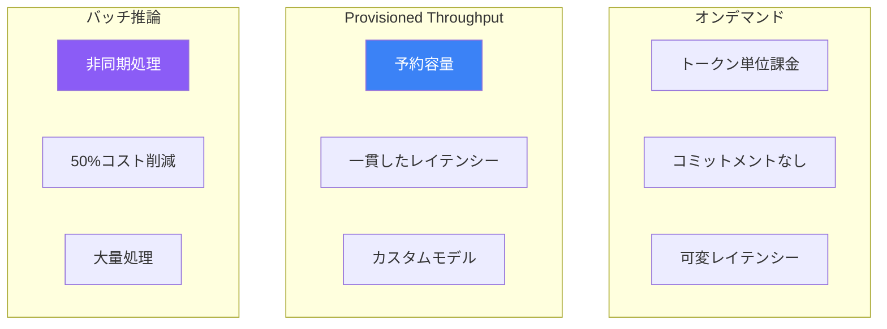

推論パフォーマンスの最適化は、本番生成AIアプリケーションにとって重要です。Amazon Bedrockは、ワークロード要件に基づいてコスト、レイテンシー、スループットのバランスを取るためのさまざまなオプションを提供しています。

## 推論オプション



## オプションの比較

| 機能 | オンデマンド | Provisioned | バッチ |
|-----|-----------|-------------|-------|
| 価格 | トークン単位 | モデルユニット/時間 | トークン単位（50%オフ） |
| レイテンシー | 可変 | 一貫 | N/A（非同期） |
| スループット | 共有制限 | 専用 | 大量処理 |
| ユースケース | 開発、可変負荷 | 本番、一貫性 | 一括処理 |

## Provisioned Throughput

### Provisioned Throughputの作成

```python
import boto3

bedrock = boto3.client('bedrock')

# 基盤モデル用のProvisioned Throughputを作成
response = bedrock.create_provisioned_model_throughput(
    modelUnits=1,
    provisionedModelName='claude-sonnet-production',
    modelId='anthropic.claude-3-sonnet-20240229-v1:0',
    commitmentDuration='OneMonth',  # または'SixMonths'
    tags=[
        {'key': 'Environment', 'value': 'Production'},
        {'key': 'Team', 'value': 'AI-Platform'}
    ]
)

provisioned_model_arn = response['provisionedModelArn']
print(f"Provisioned model ARN: {provisioned_model_arn}")
```

### モデルユニット

| モデル | モデルユニットあたりのトークン |
|-------|----------------------|
| Claude 3 Sonnet | 約180,000入力 + 36,000出力/分 |
| Claude 3 Haiku | 約400,000入力 + 80,000出力/分 |
| Titan Text | 約300,000トークン/分 |

### Provisioned Throughputの使用

```python
runtime = boto3.client('bedrock-runtime')

response = runtime.converse(
    modelId=provisioned_model_arn,  # Provisioned ARNを使用
    messages=[
        {'role': 'user', 'content': [{'text': 'こんにちは、調子はどうですか？'}]}
    ],
    inferenceConfig={'maxTokens': 1024}
)

print(response['output']['message']['content'][0]['text'])
```

### Provisioned Throughputの管理

```python
# Provisioned Throughputの一覧表示
response = bedrock.list_provisioned_model_throughputs()
for pt in response['provisionedModelSummaries']:
    print(f"{pt['provisionedModelName']}: {pt['status']}")

# 詳細を取得
response = bedrock.get_provisioned_model_throughput(
    provisionedModelId=provisioned_model_arn
)
print(f"モデルユニット: {response['modelUnits']}")
print(f"ステータス: {response['status']}")

# 更新（容量を増加）
bedrock.update_provisioned_model_throughput(
    provisionedModelId=provisioned_model_arn,
    desiredModelUnits=2
)

# 削除（コミットメント終了後）
bedrock.delete_provisioned_model_throughput(
    provisionedModelId=provisioned_model_arn
)
```

## バッチ推論

### バッチジョブの作成

```python
import json

# JSONL形式で入力データを準備
input_data = [
    {"recordId": "1", "modelInput": {"messages": [{"role": "user", "content": "クラウドコンピューティングを要約"}]}},
    {"recordId": "2", "modelInput": {"messages": [{"role": "user", "content": "機械学習を説明"}]}},
    {"recordId": "3", "modelInput": {"messages": [{"role": "user", "content": "サーバーレスとは？"}]}}
]

# S3にアップロード
s3 = boto3.client('s3')
input_content = '\n'.join([json.dumps(item, ensure_ascii=False) for item in input_data])
s3.put_object(
    Bucket='my-batch-bucket',
    Key='batch-input/input.jsonl',
    Body=input_content.encode('utf-8')
)

# バッチ推論ジョブを作成
response = bedrock.create_model_invocation_job(
    jobName='batch-summarization-001',
    modelId='anthropic.claude-3-haiku-20240307-v1:0',
    roleArn='arn:aws:iam::123456789012:role/BedrockBatchRole',
    inputDataConfig={
        's3InputDataConfig': {
            's3Uri': 's3://my-batch-bucket/batch-input/',
            's3InputFormat': 'JSONL'
        }
    },
    outputDataConfig={
        's3OutputDataConfig': {
            's3Uri': 's3://my-batch-bucket/batch-output/'
        }
    }
)

job_arn = response['jobArn']
```

### バッチジョブの監視

```python
import time

while True:
    response = bedrock.get_model_invocation_job(jobIdentifier=job_arn)
    status = response['status']
    print(f"ステータス: {status}")

    if status in ['Completed', 'Failed', 'Stopped']:
        break

    time.sleep(30)

# 結果を取得
if status == 'Completed':
    output_uri = response['outputDataConfig']['s3OutputDataConfig']['s3Uri']
    print(f"結果はここで利用可能: {output_uri}")
```

## レイテンシー最適化

### ストリーミングレスポンス

```python
def stream_response(prompt: str) -> str:
    """最初のトークンまでの時間を短縮するためにレスポンスをストリーム。"""
    response = runtime.converse_stream(
        modelId='anthropic.claude-3-sonnet-20240229-v1:0',
        messages=[{'role': 'user', 'content': [{'text': prompt}]}],
        inferenceConfig={'maxTokens': 1024}
    )

    full_response = []
    for event in response['stream']:
        if 'contentBlockDelta' in event:
            text = event['contentBlockDelta']['delta'].get('text', '')
            print(text, end='', flush=True)
            full_response.append(text)

    return ''.join(full_response)
```

### レイテンシーのためのモデル選択

| モデル | 平均レイテンシー | ユースケース |
|-------|-----------------|----------|
| Claude 3 Haiku | 約0.5秒TTFT | リアルタイムチャット |
| Claude 3 Sonnet | 約1秒TTFT | バランスの取れたタスク |
| Claude 3 Opus | 約2秒TTFT | 複雑な推論 |

### プロンプト最適化

```python
def optimize_prompt(prompt: str) -> str:
    """より高速な推論のためにプロンプトを最適化。"""
    # 不要な空白を削除
    prompt = ' '.join(prompt.split())

    # 指示を簡潔に
    # 代わりに: "詳細なレスポンスを提供してください..."
    # 使用: "簡潔に回答してください..."

    return prompt

def limit_context(context: str, max_chars: int = 4000) -> str:
    """入力トークンを減らすためにコンテキストを制限。"""
    if len(context) <= max_chars:
        return context

    # インテリジェントに切り詰め
    return context[:max_chars] + "...[省略]"
```

### 接続の最適化

```python
from botocore.config import Config

# 低レイテンシー用に設定
config = Config(
    connect_timeout=5,
    read_timeout=60,
    retries={'max_attempts': 2, 'mode': 'adaptive'},
    tcp_keepalive=True
)

runtime = boto3.client('bedrock-runtime', config=config)
```

## コスト最適化

### トークン使用量のモニタリング

```python
def track_usage(response: dict) -> dict:
    """トークン使用量を抽出して追跡。"""
    usage = response.get('usage', {})
    return {
        'input_tokens': usage.get('inputTokens', 0),
        'output_tokens': usage.get('outputTokens', 0),
        'total_tokens': usage.get('inputTokens', 0) + usage.get('outputTokens', 0)
    }

# コストを計算（例のレート）
def estimate_cost(usage: dict, model: str = 'claude-3-sonnet') -> float:
    rates = {
        'claude-3-sonnet': {'input': 0.003, 'output': 0.015},  # 1Kトークンあたり
        'claude-3-haiku': {'input': 0.00025, 'output': 0.00125}
    }
    rate = rates.get(model, rates['claude-3-sonnet'])
    return (usage['input_tokens'] * rate['input'] + usage['output_tokens'] * rate['output']) / 1000
```

### キャッシング戦略

```python
import hashlib
import json
from functools import lru_cache

class BedrockCache:
    def __init__(self, dynamodb_table: str):
        self.dynamodb = boto3.resource('dynamodb')
        self.table = self.dynamodb.Table(dynamodb_table)
        self.runtime = boto3.client('bedrock-runtime')

    def _cache_key(self, model_id: str, messages: list) -> str:
        content = json.dumps({'model': model_id, 'messages': messages}, sort_keys=True)
        return hashlib.sha256(content.encode()).hexdigest()

    def get_response(self, model_id: str, messages: list,
                    use_cache: bool = True) -> str:
        cache_key = self._cache_key(model_id, messages)

        # キャッシュを確認
        if use_cache:
            try:
                item = self.table.get_item(Key={'cache_key': cache_key})
                if 'Item' in item:
                    return item['Item']['response']
            except Exception:
                pass

        # Bedrockを呼び出し
        response = self.runtime.converse(
            modelId=model_id,
            messages=messages
        )
        result = response['output']['message']['content'][0]['text']

        # 結果をキャッシュ
        if use_cache:
            self.table.put_item(Item={
                'cache_key': cache_key,
                'response': result,
                'ttl': int(time.time()) + 3600  # 1時間のTTL
            })

        return result
```

### タスクによるモデル選択

```python
class ModelSelector:
    MODELS = {
        'simple': 'anthropic.claude-3-haiku-20240307-v1:0',
        'moderate': 'anthropic.claude-3-sonnet-20240229-v1:0',
        'complex': 'anthropic.claude-3-opus-20240229-v1:0'
    }

    def __init__(self):
        self.runtime = boto3.client('bedrock-runtime')

    def classify_complexity(self, prompt: str) -> str:
        """適切なモデルを選択するためにタスクの複雑さを分類。"""
        # 簡単なヒューリスティック
        word_count = len(prompt.split())

        if word_count < 50 and not any(kw in prompt.lower() for kw in ['分析', '比較', '詳しく説明']):
            return 'simple'
        elif word_count < 200:
            return 'moderate'
        else:
            return 'complex'

    def invoke(self, prompt: str, force_model: str = None) -> str:
        complexity = force_model or self.classify_complexity(prompt)
        model_id = self.MODELS[complexity]

        response = self.runtime.converse(
            modelId=model_id,
            messages=[{'role': 'user', 'content': [{'text': prompt}]}]
        )

        return response['output']['message']['content'][0]['text']
```

## パフォーマンスモニタリング

```python
import time
from dataclasses import dataclass

@dataclass
class InferenceMetrics:
    latency_ms: float
    input_tokens: int
    output_tokens: int
    model_id: str

class PerformanceMonitor:
    def __init__(self):
        self.runtime = boto3.client('bedrock-runtime')
        self.cloudwatch = boto3.client('cloudwatch')

    def invoke_with_metrics(self, model_id: str, messages: list) -> tuple:
        start = time.time()

        response = self.runtime.converse(
            modelId=model_id,
            messages=messages
        )

        latency = (time.time() - start) * 1000  # ミリ秒

        metrics = InferenceMetrics(
            latency_ms=latency,
            input_tokens=response['usage']['inputTokens'],
            output_tokens=response['usage']['outputTokens'],
            model_id=model_id
        )

        self._publish_metrics(metrics)

        return response['output']['message']['content'][0]['text'], metrics

    def _publish_metrics(self, metrics: InferenceMetrics):
        self.cloudwatch.put_metric_data(
            Namespace='Custom/Bedrock',
            MetricData=[
                {
                    'MetricName': 'InferenceLatency',
                    'Value': metrics.latency_ms,
                    'Unit': 'Milliseconds',
                    'Dimensions': [{'Name': 'ModelId', 'Value': metrics.model_id}]
                },
                {
                    'MetricName': 'TokensProcessed',
                    'Value': metrics.input_tokens + metrics.output_tokens,
                    'Unit': 'Count',
                    'Dimensions': [{'Name': 'ModelId', 'Value': metrics.model_id}]
                }
            ]
        )
```

## ベストプラクティス

| 最適化 | 実装 |
|-------|------|
| 簡単なタスクにHaikuを使用 | リクエストを分類してルーティング |
| レスポンスをストリーム | 体感レイテンシーを削減 |
| 頻繁なクエリをキャッシュ | DynamoDBまたはElastiCache |
| 緊急でないタスクをバッチ処理 | 50%コスト削減 |
| 本番にはProvisioned | 一貫したレイテンシー |

## 重要なポイント

1. **Provisioned Throughput** - 一貫したレイテンシーのための専用容量
2. **バッチ推論** - 一括処理で50%コスト削減
3. **モデル選択** - タスクの複雑さに合わせてモデルを選択
4. **ストリーミング** - 最初のトークンを早くしてUXを改善
5. **キャッシング** - 繰り返しのクエリでコストとレイテンシーを削減

## 参考文献

- [Provisioned Throughput](https://docs.aws.amazon.com/bedrock/latest/userguide/prov-throughput.html)
- [バッチ推論](https://docs.aws.amazon.com/bedrock/latest/userguide/batch-inference.html)
- [料金](https://aws.amazon.com/bedrock/pricing/)
