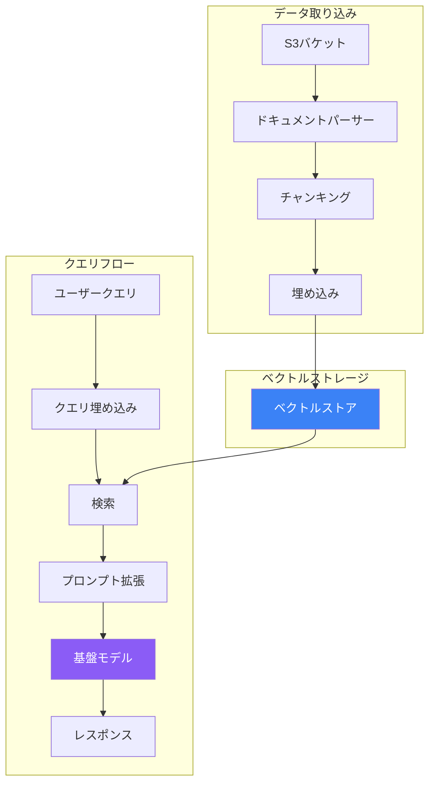

Amazon Bedrock Knowledge Basesは、フルマネージドのRAGソリューションを提供します。ドキュメントの取り込み、埋め込み生成、ベクトルストレージ、検索を処理し、アプリケーションに集中できます。

## Knowledge Basesアーキテクチャ



## Knowledge Baseの作成

### コンソールでの設定

1. Amazon Bedrock → Knowledge Basesに移動
2. 「Knowledge Baseを作成」をクリック
3. 設定：
   - 名前と説明
   - IAMロール（自動作成または既存）
   - データソース（S3）
   - 埋め込みモデル
   - ベクトルストア

### AWS CLIの使用

```bash
# Knowledge Baseを作成
aws bedrock-agent create-knowledge-base \
    --name "product-docs-kb" \
    --role-arn "arn:aws:iam::123456789012:role/BedrockKBRole" \
    --knowledge-base-configuration '{
        "type": "VECTOR",
        "vectorKnowledgeBaseConfiguration": {
            "embeddingModelArn": "arn:aws:bedrock:us-east-1::foundation-model/amazon.titan-embed-text-v1"
        }
    }' \
    --storage-configuration '{
        "type": "OPENSEARCH_SERVERLESS",
        "opensearchServerlessConfiguration": {
            "collectionArn": "arn:aws:aoss:us-east-1:123456789012:collection/abc123",
            "vectorIndexName": "bedrock-kb-index",
            "fieldMapping": {
                "vectorField": "embedding",
                "textField": "text",
                "metadataField": "metadata"
            }
        }
    }'
```

## データソース

### S3データソース

```python
import boto3

client = boto3.client('bedrock-agent')

# データソースを作成
response = client.create_data_source(
    knowledgeBaseId='KB_ID',
    name='product-docs',
    dataSourceConfiguration={
        'type': 'S3',
        's3Configuration': {
            'bucketArn': 'arn:aws:s3:::my-docs-bucket',
            'inclusionPrefixes': ['docs/']
        }
    },
    vectorIngestionConfiguration={
        'chunkingConfiguration': {
            'chunkingStrategy': 'FIXED_SIZE',
            'fixedSizeChunkingConfiguration': {
                'maxTokens': 512,
                'overlapPercentage': 20
            }
        }
    }
)
```

### サポートされるファイル形式

| 形式 | 拡張子 |
|-----|--------|
| テキスト | .txt |
| PDF | .pdf |
| HTML | .html |
| Markdown | .md |
| Word | .doc, .docx |
| CSV | .csv |
| Excel | .xls, .xlsx |

## チャンキング戦略

### 固定サイズチャンキング

```python
'chunkingConfiguration': {
    'chunkingStrategy': 'FIXED_SIZE',
    'fixedSizeChunkingConfiguration': {
        'maxTokens': 512,
        'overlapPercentage': 20
    }
}
```

### セマンティックチャンキング

```python
'chunkingConfiguration': {
    'chunkingStrategy': 'SEMANTIC',
    'semanticChunkingConfiguration': {
        'maxTokens': 512,
        'bufferSize': 0,
        'breakpointPercentileThreshold': 95
    }
}
```

### 階層的チャンキング

```python
'chunkingConfiguration': {
    'chunkingStrategy': 'HIERARCHICAL',
    'hierarchicalChunkingConfiguration': {
        'levelConfigurations': [
            {'maxTokens': 1500},  # 親チャンク
            {'maxTokens': 300}    # 子チャンク
        ],
        'overlapTokens': 60
    }
}
```

### チャンキング戦略の比較

| 戦略 | 最適な用途 | 特徴 |
|-----|----------|------|
| 固定サイズ | 汎用 | 予測可能、シンプル |
| セマンティック | 自然な境界 | 文脈保持が優れる |
| 階層的 | 長いドキュメント | マルチレベル検索 |

## データの同期

```python
# 取り込みジョブを開始
response = client.start_ingestion_job(
    knowledgeBaseId='KB_ID',
    dataSourceId='DS_ID'
)

job_id = response['ingestionJob']['ingestionJobId']

# ステータスを確認
status_response = client.get_ingestion_job(
    knowledgeBaseId='KB_ID',
    dataSourceId='DS_ID',
    ingestionJobId=job_id
)

print(f"ステータス: {status_response['ingestionJob']['status']}")
```

## Knowledge Baseのクエリ

### Retrieve API

生成なしで関連ドキュメントを取得：

```python
client = boto3.client('bedrock-agent-runtime')

response = client.retrieve(
    knowledgeBaseId='KB_ID',
    retrievalQuery={
        'text': '返品ポリシーは何ですか？'
    },
    retrievalConfiguration={
        'vectorSearchConfiguration': {
            'numberOfResults': 5
        }
    }
)

for result in response['retrievalResults']:
    print(f"スコア: {result['score']}")
    print(f"コンテンツ: {result['content']['text']}")
    print(f"ソース: {result['location']['s3Location']['uri']}")
    print("---")
```

### RetrieveAndGenerate API

検索とレスポンス生成を1回の呼び出しで：

```python
response = client.retrieve_and_generate(
    input={
        'text': '返品ポリシーは何ですか？'
    },
    retrieveAndGenerateConfiguration={
        'type': 'KNOWLEDGE_BASE',
        'knowledgeBaseConfiguration': {
            'knowledgeBaseId': 'KB_ID',
            'modelArn': 'arn:aws:bedrock:us-east-1::foundation-model/anthropic.claude-3-sonnet-20240229-v1:0',
            'retrievalConfiguration': {
                'vectorSearchConfiguration': {
                    'numberOfResults': 5
                }
            }
        }
    }
)

print(response['output']['text'])

# 引用を表示
for citation in response.get('citations', []):
    for ref in citation.get('retrievedReferences', []):
        print(f"ソース: {ref['location']['s3Location']['uri']}")
```

### セッション管理

会話コンテキストを維持：

```python
# 最初のクエリ
response = client.retrieve_and_generate(
    input={'text': 'どんな製品がありますか？'},
    retrieveAndGenerateConfiguration={
        'type': 'KNOWLEDGE_BASE',
        'knowledgeBaseConfiguration': {
            'knowledgeBaseId': 'KB_ID',
            'modelArn': 'model-arn'
        }
    }
)

session_id = response['sessionId']

# セッション付きフォローアップクエリ
response = client.retrieve_and_generate(
    sessionId=session_id,
    input={'text': 'それらの価格は？'},
    retrieveAndGenerateConfiguration={
        'type': 'KNOWLEDGE_BASE',
        'knowledgeBaseConfiguration': {
            'knowledgeBaseId': 'KB_ID',
            'modelArn': 'model-arn'
        }
    }
)
```

## 高度な設定

### メタデータフィルタリング

```python
response = client.retrieve(
    knowledgeBaseId='KB_ID',
    retrievalQuery={'text': '価格情報'},
    retrievalConfiguration={
        'vectorSearchConfiguration': {
            'numberOfResults': 5,
            'filter': {
                'equals': {
                    'key': 'category',
                    'value': 'pricing'
                }
            }
        }
    }
)
```

### ハイブリッド検索

```python
'vectorSearchConfiguration': {
    'numberOfResults': 5,
    'overrideSearchType': 'HYBRID'  # ベクトル + キーワードを組み合わせ
}
```

## ベクトルストアオプション

| ストア | セットアップ | 最適な用途 |
|-------|------------|-----------|
| OpenSearch Serverless | 自動管理 | ほとんどのユースケース |
| Aurora PostgreSQL | 自己管理 | 既存PostgreSQL |
| Pinecone | 外部 | 既存Pinecone |
| Redis Enterprise | 外部 | 低レイテンシ |
| MongoDB Atlas | 外部 | 既存MongoDB |

## 完全なRAGアプリケーション

```python
import boto3
from typing import Optional

class KnowledgeBaseRAG:
    def __init__(self, kb_id: str, model_arn: str):
        self.client = boto3.client('bedrock-agent-runtime')
        self.kb_id = kb_id
        self.model_arn = model_arn
        self.session_id: Optional[str] = None

    def query(self, question: str, new_session: bool = False) -> dict:
        if new_session:
            self.session_id = None

        kwargs = {
            'input': {'text': question},
            'retrieveAndGenerateConfiguration': {
                'type': 'KNOWLEDGE_BASE',
                'knowledgeBaseConfiguration': {
                    'knowledgeBaseId': self.kb_id,
                    'modelArn': self.model_arn,
                    'retrievalConfiguration': {
                        'vectorSearchConfiguration': {
                            'numberOfResults': 5
                        }
                    }
                }
            }
        }

        if self.session_id:
            kwargs['sessionId'] = self.session_id

        response = self.client.retrieve_and_generate(**kwargs)
        self.session_id = response.get('sessionId')

        return {
            'answer': response['output']['text'],
            'citations': [
                ref['location']['s3Location']['uri']
                for citation in response.get('citations', [])
                for ref in citation.get('retrievedReferences', [])
            ],
            'session_id': self.session_id
        }

# 使用例
rag = KnowledgeBaseRAG(
    kb_id='YOUR_KB_ID',
    model_arn='arn:aws:bedrock:us-east-1::foundation-model/anthropic.claude-3-sonnet-20240229-v1:0'
)

result = rag.query("返品ポリシーは何ですか？")
print(f"回答: {result['answer']}")
print(f"ソース: {result['citations']}")
```

## ベストプラクティス

| プラクティス | 推奨事項 |
|-------------|---------|
| チャンクサイズ | ほとんどの場合256-512トークン |
| オーバーラップ | コンテキスト保持のため10-20% |
| 更新頻度 | ソースデータ変更時に同期 |
| モデル選択 | クエリの複雑さに合わせる |
| メタデータ | より良い関連性のためにフィルターを追加 |

## 重要なポイント

1. **フルマネージドRAG** - 管理するインフラなし
2. **複数のチャンキング戦略** - ドキュメントタイプに応じて選択
3. **組み込みの引用** - ソースドキュメントを追跡
4. **セッションサポート** - マルチターン会話
5. **柔軟なストレージ** - 複数のベクトルストアオプション

## 参考文献

- [Amazon Bedrock Knowledge Bases](https://docs.aws.amazon.com/bedrock/latest/userguide/knowledge-base.html)
- [Knowledge Base APIs](https://docs.aws.amazon.com/bedrock/latest/APIReference/API_agent-runtime_RetrieveAndGenerate.html)
