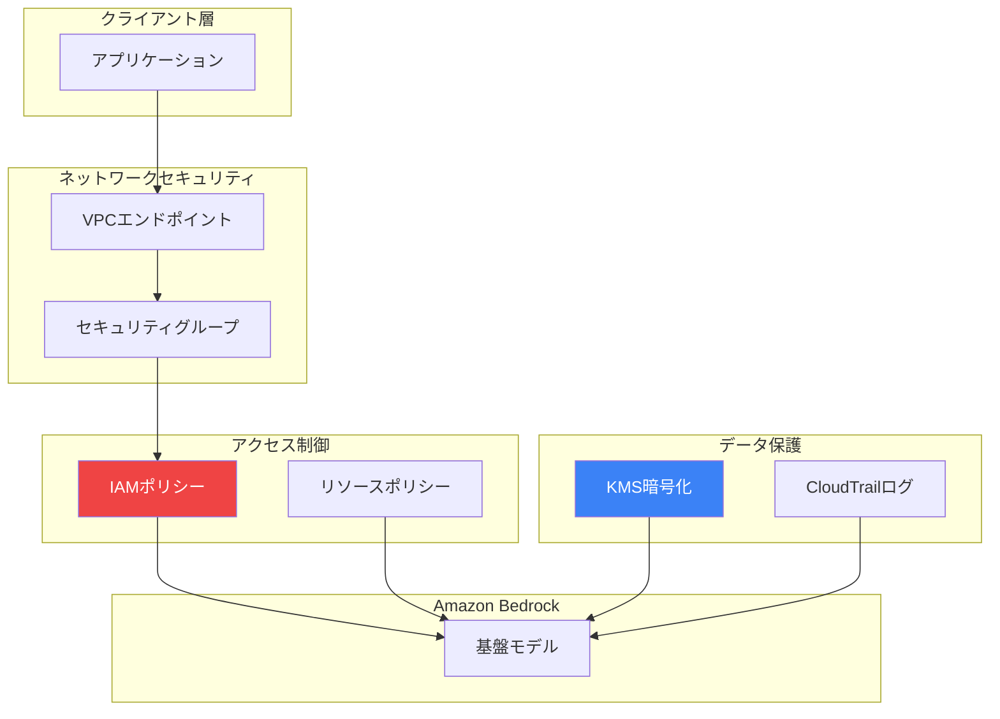

生成AIアプリケーションを構築する際、セキュリティは共有責任です。Amazon Bedrockは、データを保護し規制要件へのコンプライアンスを確保するための複数のセキュリティ制御を提供します。

## セキュリティアーキテクチャ



## IAMポリシー

### 基本的なBedrockアクセス

```json
{
    "Version": "2012-10-17",
    "Statement": [
        {
            "Sid": "BedrockInvoke",
            "Effect": "Allow",
            "Action": [
                "bedrock:InvokeModel",
                "bedrock:InvokeModelWithResponseStream"
            ],
            "Resource": "arn:aws:bedrock:*::foundation-model/*"
        }
    ]
}
```

### 特定モデルへの制限

```json
{
    "Version": "2012-10-17",
    "Statement": [
        {
            "Sid": "AllowClaudeOnly",
            "Effect": "Allow",
            "Action": [
                "bedrock:InvokeModel",
                "bedrock:InvokeModelWithResponseStream"
            ],
            "Resource": [
                "arn:aws:bedrock:us-east-1::foundation-model/anthropic.claude-3-sonnet-20240229-v1:0",
                "arn:aws:bedrock:us-east-1::foundation-model/anthropic.claude-3-haiku-20240307-v1:0"
            ]
        }
    ]
}
```

### Knowledge Basesアクセス

```json
{
    "Version": "2012-10-17",
    "Statement": [
        {
            "Sid": "KnowledgeBaseAccess",
            "Effect": "Allow",
            "Action": [
                "bedrock:Retrieve",
                "bedrock:RetrieveAndGenerate"
            ],
            "Resource": "arn:aws:bedrock:us-east-1:123456789012:knowledge-base/*"
        },
        {
            "Sid": "S3Access",
            "Effect": "Allow",
            "Action": [
                "s3:GetObject",
                "s3:ListBucket"
            ],
            "Resource": [
                "arn:aws:s3:::my-knowledge-bucket",
                "arn:aws:s3:::my-knowledge-bucket/*"
            ]
        }
    ]
}
```

### Agentsアクセス

```json
{
    "Version": "2012-10-17",
    "Statement": [
        {
            "Sid": "AgentInvoke",
            "Effect": "Allow",
            "Action": [
                "bedrock:InvokeAgent"
            ],
            "Resource": "arn:aws:bedrock:us-east-1:123456789012:agent-alias/*/*"
        }
    ]
}
```

### Guardrails管理

```json
{
    "Version": "2012-10-17",
    "Statement": [
        {
            "Sid": "GuardrailsReadOnly",
            "Effect": "Allow",
            "Action": [
                "bedrock:GetGuardrail",
                "bedrock:ListGuardrails",
                "bedrock:ApplyGuardrail"
            ],
            "Resource": "*"
        },
        {
            "Sid": "GuardrailsAdmin",
            "Effect": "Allow",
            "Action": [
                "bedrock:CreateGuardrail",
                "bedrock:UpdateGuardrail",
                "bedrock:DeleteGuardrail",
                "bedrock:CreateGuardrailVersion"
            ],
            "Resource": "*",
            "Condition": {
                "StringEquals": {
                    "aws:PrincipalTag/Role": "SecurityAdmin"
                }
            }
        }
    ]
}
```

## VPCエンドポイント

### VPCエンドポイントの作成

```python
import boto3

ec2 = boto3.client('ec2')

response = ec2.create_vpc_endpoint(
    VpcId='vpc-12345678',
    ServiceName='com.amazonaws.us-east-1.bedrock-runtime',
    VpcEndpointType='Interface',
    SubnetIds=['subnet-12345678', 'subnet-87654321'],
    SecurityGroupIds=['sg-12345678'],
    PrivateDnsEnabled=True
)

endpoint_id = response['VpcEndpoint']['VpcEndpointId']
```

### VPCエンドポイントポリシー

```json
{
    "Version": "2012-10-17",
    "Statement": [
        {
            "Sid": "AllowBedrockAccess",
            "Effect": "Allow",
            "Principal": {
                "AWS": "arn:aws:iam::123456789012:role/BedrockRole"
            },
            "Action": [
                "bedrock:InvokeModel",
                "bedrock:InvokeModelWithResponseStream"
            ],
            "Resource": "arn:aws:bedrock:us-east-1::foundation-model/*"
        }
    ]
}
```

### エンドポイント用セキュリティグループ

```python
response = ec2.create_security_group(
    GroupName='bedrock-endpoint-sg',
    Description='Bedrock VPCエンドポイント用セキュリティグループ',
    VpcId='vpc-12345678'
)

sg_id = response['GroupId']

ec2.authorize_security_group_ingress(
    GroupId=sg_id,
    IpPermissions=[
        {
            'IpProtocol': 'tcp',
            'FromPort': 443,
            'ToPort': 443,
            'IpRanges': [{'CidrIp': '10.0.0.0/16'}]
        }
    ]
)
```

## 暗号化

### データ暗号化

| データ状態 | 暗号化 |
|----------|-------|
| 転送中 | TLS 1.2以上 |
| 保存時 | AWSマネージドまたはカスタマーKMS |
| モデル入出力 | デフォルトでは保存されない |

### カスタムモデル用KMSキー

```python
import boto3

kms = boto3.client('kms')

# KMSキーの作成
response = kms.create_key(
    Description='Bedrockカスタムモデル暗号化キー',
    KeyUsage='ENCRYPT_DECRYPT',
    KeySpec='SYMMETRIC_DEFAULT',
    Tags=[
        {'TagKey': 'Purpose', 'TagValue': 'Bedrock'}
    ]
)

key_id = response['KeyMetadata']['KeyId']

# キーポリシー
key_policy = {
    "Version": "2012-10-17",
    "Statement": [
        {
            "Sid": "Enable IAM policies",
            "Effect": "Allow",
            "Principal": {"AWS": f"arn:aws:iam::123456789012:root"},
            "Action": "kms:*",
            "Resource": "*"
        },
        {
            "Sid": "Allow Bedrock",
            "Effect": "Allow",
            "Principal": {"Service": "bedrock.amazonaws.com"},
            "Action": [
                "kms:Encrypt",
                "kms:Decrypt",
                "kms:GenerateDataKey*"
            ],
            "Resource": "*"
        }
    ]
}

kms.put_key_policy(
    KeyId=key_id,
    PolicyName='default',
    Policy=json.dumps(key_policy)
)
```

### Knowledge Bases用S3暗号化

```python
s3 = boto3.client('s3')

# サーバーサイド暗号化を有効化
s3.put_bucket_encryption(
    Bucket='my-knowledge-bucket',
    ServerSideEncryptionConfiguration={
        'Rules': [
            {
                'ApplyServerSideEncryptionByDefault': {
                    'SSEAlgorithm': 'aws:kms',
                    'KMSMasterKeyID': key_id
                },
                'BucketKeyEnabled': True
            }
        ]
    }
)
```

## CloudTrailログ

### Bedrockログの有効化

```python
cloudtrail = boto3.client('cloudtrail')

response = cloudtrail.put_event_selectors(
    TrailName='my-trail',
    EventSelectors=[
        {
            'ReadWriteType': 'All',
            'IncludeManagementEvents': True,
            'DataResources': [
                {
                    'Type': 'AWS::Bedrock::Guardrail',
                    'Values': ['arn:aws:bedrock:*:*:guardrail/*']
                }
            ]
        }
    ]
)
```

### CloudWatchロググループ

```python
logs = boto3.client('logs')

# Bedrock呼び出し用ロググループを作成
logs.create_log_group(
    logGroupName='/aws/bedrock/model-invocations',
    kmsKeyId=key_id,
    tags={
        'Purpose': 'Bedrock監査ログ'
    }
)

# 保持期間を設定
logs.put_retention_policy(
    logGroupName='/aws/bedrock/model-invocations',
    retentionInDays=365
)
```

### モデル呼び出しログ

```python
bedrock = boto3.client('bedrock')

response = bedrock.put_model_invocation_logging_configuration(
    loggingConfig={
        'cloudWatchConfig': {
            'logGroupName': '/aws/bedrock/model-invocations',
            'roleArn': 'arn:aws:iam::123456789012:role/BedrockLoggingRole',
            'largeDataDeliveryS3Config': {
                's3BucketName': 'bedrock-logs-bucket',
                's3KeyPrefix': 'large-data/'
            }
        },
        's3Config': {
            'bucketName': 'bedrock-logs-bucket',
            'keyPrefix': 'invocation-logs/'
        },
        'textDataDeliveryEnabled': True,
        'imageDataDeliveryEnabled': False,
        'embeddingDataDeliveryEnabled': False
    }
)
```

## サービスコントロールポリシー

### リージョンの制限

```json
{
    "Version": "2012-10-17",
    "Statement": [
        {
            "Sid": "DenyBedrockOutsideAllowedRegions",
            "Effect": "Deny",
            "Action": "bedrock:*",
            "Resource": "*",
            "Condition": {
                "StringNotEquals": {
                    "aws:RequestedRegion": ["us-east-1", "us-west-2"]
                }
            }
        }
    ]
}
```

### Guardrailsの強制

```json
{
    "Version": "2012-10-17",
    "Statement": [
        {
            "Sid": "RequireGuardrail",
            "Effect": "Deny",
            "Action": [
                "bedrock:InvokeModel",
                "bedrock:InvokeModelWithResponseStream"
            ],
            "Resource": "*",
            "Condition": {
                "Null": {
                    "bedrock:GuardrailArn": "true"
                }
            }
        }
    ]
}
```

## コンプライアンス

### サポートされるコンプライアンスプログラム

| プログラム | ステータス |
|----------|----------|
| SOC 1, 2, 3 | サポート |
| ISO 27001 | サポート |
| HIPAA | 対象 |
| PCI DSS | 対象 |
| FedRAMP | 進行中 |
| GDPR | 準拠 |

### データ所在地

```python
# データ処理用リージョンを指定
bedrock_us = boto3.client('bedrock-runtime', region_name='us-east-1')
bedrock_eu = boto3.client('bedrock-runtime', region_name='eu-west-1')

# モデルの利用可能性はリージョンによって異なる
# リージョン固有のモデル利用可能性についてはドキュメントを確認
```

## セキュリティベストプラクティス

```python
import boto3
from botocore.config import Config

class SecureBedrockClient:
    def __init__(self, region: str, role_arn: str = None):
        config = Config(
            retries={'max_attempts': 3, 'mode': 'adaptive'},
            connect_timeout=5,
            read_timeout=60
        )

        if role_arn:
            sts = boto3.client('sts')
            credentials = sts.assume_role(
                RoleArn=role_arn,
                RoleSessionName='BedrockSession'
            )['Credentials']

            self.client = boto3.client(
                'bedrock-runtime',
                region_name=region,
                config=config,
                aws_access_key_id=credentials['AccessKeyId'],
                aws_secret_access_key=credentials['SecretAccessKey'],
                aws_session_token=credentials['SessionToken']
            )
        else:
            self.client = boto3.client(
                'bedrock-runtime',
                region_name=region,
                config=config
            )

    def invoke_model_safely(self, model_id: str, messages: list,
                           guardrail_id: str = None) -> dict:
        params = {
            'modelId': model_id,
            'messages': messages,
            'inferenceConfig': {'maxTokens': 1024}
        }

        if guardrail_id:
            params['guardrailConfig'] = {
                'guardrailIdentifier': guardrail_id,
                'guardrailVersion': 'DRAFT'
            }

        response = self.client.converse(**params)
        return response

# 使用例
client = SecureBedrockClient(
    region='us-east-1',
    role_arn='arn:aws:iam::123456789012:role/BedrockRole'
)
```

## セキュリティチェックリスト

| カテゴリ | 確認項目 |
|--------|---------|
| IAM | 最小権限ポリシー |
| ネットワーク | VPCエンドポイント有効 |
| 暗号化 | KMSキー設定済み |
| ログ | CloudTrailと呼び出しログ |
| Guardrails | コンテンツフィルタリング有効 |
| モニタリング | CloudWatchアラーム設定 |

## 重要なポイント

1. **最小権限** - IAMを特定のモデルとアクションに制限
2. **VPCエンドポイント** - トラフィックをAWSネットワーク内に維持
3. **暗号化** - 機密データにKMSを使用
4. **ログ** - CloudTrailとモデル呼び出しログを有効化
5. **Guardrails** - 安全性のためにコンテンツフィルタリングを適用

## 参考文献

- [Bedrockセキュリティ](https://docs.aws.amazon.com/bedrock/latest/userguide/security.html)
- [Bedrock用IAM](https://docs.aws.amazon.com/bedrock/latest/userguide/security-iam.html)
- [コンプライアンス](https://aws.amazon.com/compliance/)
