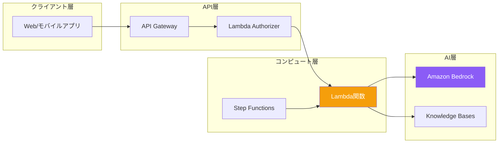

サーバーレス生成AIアプリケーションを構築することで、自動スケーリング、従量課金、インフラ管理ではなくビジネスロジックへの集中が可能になります。

## 生成AI向けサーバーレスアーキテクチャ



## LambdaとBedrockの統合

### 基本的なLambda関数

```python
import json
import boto3

bedrock = boto3.client('bedrock-runtime')

def lambda_handler(event, context):
    body = json.loads(event.get('body', '{}'))
    prompt = body.get('prompt', '')

    if not prompt:
        return {
            'statusCode': 400,
            'body': json.dumps({'error': 'プロンプトが必要です'})
        }

    response = bedrock.converse(
        modelId='anthropic.claude-3-sonnet-20240229-v1:0',
        messages=[{'role': 'user', 'content': [{'text': prompt}]}],
        inferenceConfig={'maxTokens': 1024, 'temperature': 0.7}
    )

    result = response['output']['message']['content'][0]['text']

    return {
        'statusCode': 200,
        'headers': {'Content-Type': 'application/json'},
        'body': json.dumps({'response': result})
    }
```

### Lambda設定

| 設定 | 推奨値 | 理由 |
|-----|-------|------|
| メモリ | 512-1024 MB | API呼び出しに十分 |
| タイムアウト | 30-60秒 | モデル推論時間を考慮 |
| ランタイム | Python 3.12 | 最新boto3サポート |

### Lambda用IAMポリシー

```json
{
    "Version": "2012-10-17",
    "Statement": [
        {
            "Effect": "Allow",
            "Action": [
                "bedrock:InvokeModel",
                "bedrock:InvokeModelWithResponseStream"
            ],
            "Resource": "arn:aws:bedrock:*::foundation-model/*"
        },
        {
            "Effect": "Allow",
            "Action": [
                "bedrock:Retrieve",
                "bedrock:RetrieveAndGenerate"
            ],
            "Resource": "arn:aws:bedrock:*:*:knowledge-base/*"
        }
    ]
}
```

## API Gateway統合

### REST APIセットアップ

```yaml
# SAMテンプレート
AWSTemplateFormatVersion: '2010-09-09'
Transform: AWS::Serverless-2016-10-31

Resources:
  GenAIApi:
    Type: AWS::Serverless::Api
    Properties:
      StageName: prod
      Auth:
        ApiKeyRequired: true

  ChatFunction:
    Type: AWS::Serverless::Function
    Properties:
      Handler: app.lambda_handler
      Runtime: python3.12
      MemorySize: 1024
      Timeout: 60
      Policies:
        - Statement:
            - Effect: Allow
              Action:
                - bedrock:InvokeModel
              Resource: '*'
      Events:
        ChatApi:
          Type: Api
          Properties:
            RestApiId: !Ref GenAIApi
            Path: /chat
            Method: post
```

### Lambda Function URLでストリーミング

```python
import json
import boto3

bedrock = boto3.client('bedrock-runtime')

def lambda_handler(event, context):
    body = json.loads(event.get('body', '{}'))
    prompt = body.get('prompt', '')

    response = bedrock.converse_stream(
        modelId='anthropic.claude-3-sonnet-20240229-v1:0',
        messages=[{'role': 'user', 'content': [{'text': prompt}]}],
        inferenceConfig={'maxTokens': 1024}
    )

    def generate():
        for event in response['stream']:
            if 'contentBlockDelta' in event:
                text = event['contentBlockDelta']['delta'].get('text', '')
                yield f"data: {json.dumps({'text': text})}\n\n"
        yield "data: [DONE]\n\n"

    return {
        'statusCode': 200,
        'headers': {
            'Content-Type': 'text/event-stream',
            'Cache-Control': 'no-cache'
        },
        'body': ''.join(generate()),
        'isBase64Encoded': False
    }
```

## Step Functionsで複雑なワークフロー

### ドキュメント処理パイプライン

```json
{
  "Comment": "生成AIによるドキュメント処理",
  "StartAt": "ExtractText",
  "States": {
    "ExtractText": {
      "Type": "Task",
      "Resource": "arn:aws:lambda:REGION:ACCOUNT:function:ExtractText",
      "Next": "AnalyzeContent"
    },
    "AnalyzeContent": {
      "Type": "Task",
      "Resource": "arn:aws:states:::bedrock:invokeModel",
      "Parameters": {
        "ModelId": "anthropic.claude-3-sonnet-20240229-v1:0",
        "Body": {
          "anthropic_version": "bedrock-2023-05-31",
          "max_tokens": 2048,
          "messages": [
            {
              "role": "user",
              "content.$": "States.Format('このドキュメントを分析してください: {}', $.extractedText)"
            }
          ]
        }
      },
      "ResultPath": "$.analysis",
      "Next": "GenerateSummary"
    },
    "GenerateSummary": {
      "Type": "Task",
      "Resource": "arn:aws:states:::bedrock:invokeModel",
      "Parameters": {
        "ModelId": "anthropic.claude-3-haiku-20240307-v1:0",
        "Body": {
          "anthropic_version": "bedrock-2023-05-31",
          "max_tokens": 512,
          "messages": [
            {
              "role": "user",
              "content.$": "States.Format('要約してください: {}', $.analysis.Body.content[0].text)"
            }
          ]
        }
      },
      "End": true
    }
  }
}
```

### 並列処理

```json
{
  "StartAt": "ParallelAnalysis",
  "States": {
    "ParallelAnalysis": {
      "Type": "Parallel",
      "Branches": [
        {
          "StartAt": "SentimentAnalysis",
          "States": {
            "SentimentAnalysis": {
              "Type": "Task",
              "Resource": "arn:aws:states:::bedrock:invokeModel",
              "Parameters": {
                "ModelId": "anthropic.claude-3-haiku-20240307-v1:0",
                "Body": {
                  "anthropic_version": "bedrock-2023-05-31",
                  "max_tokens": 100,
                  "messages": [{"role": "user", "content.$": "States.Format('感情分析: {}', $.text)"}]
                }
              },
              "End": true
            }
          }
        },
        {
          "StartAt": "KeywordExtraction",
          "States": {
            "KeywordExtraction": {
              "Type": "Task",
              "Resource": "arn:aws:states:::bedrock:invokeModel",
              "Parameters": {
                "ModelId": "anthropic.claude-3-haiku-20240307-v1:0",
                "Body": {
                  "anthropic_version": "bedrock-2023-05-31",
                  "max_tokens": 200,
                  "messages": [{"role": "user", "content.$": "States.Format('キーワード抽出: {}', $.text)"}]
                }
              },
              "End": true
            }
          }
        }
      ],
      "Next": "CombineResults"
    },
    "CombineResults": {
      "Type": "Task",
      "Resource": "arn:aws:lambda:REGION:ACCOUNT:function:CombineResults",
      "End": true
    }
  }
}
```

## DynamoDBで会話履歴

```python
import boto3
import uuid
from datetime import datetime

dynamodb = boto3.resource('dynamodb')
table = dynamodb.Table('ConversationHistory')
bedrock = boto3.client('bedrock-runtime')

def lambda_handler(event, context):
    body = json.loads(event.get('body', '{}'))
    conversation_id = body.get('conversation_id', str(uuid.uuid4()))
    user_message = body.get('message', '')

    # 会話履歴を取得
    response = table.query(
        KeyConditionExpression='conversation_id = :cid',
        ExpressionAttributeValues={':cid': conversation_id},
        ScanIndexForward=True
    )

    # 履歴からメッセージを構築
    messages = []
    for item in response.get('Items', []):
        messages.append({'role': item['role'], 'content': [{'text': item['content']}]})

    # 現在のメッセージを追加
    messages.append({'role': 'user', 'content': [{'text': user_message}]})

    # Bedrockを呼び出し
    ai_response = bedrock.converse(
        modelId='anthropic.claude-3-sonnet-20240229-v1:0',
        messages=messages,
        inferenceConfig={'maxTokens': 1024}
    )

    assistant_message = ai_response['output']['message']['content'][0]['text']

    # DynamoDBにメッセージを保存
    timestamp = datetime.utcnow().isoformat()
    table.put_item(Item={
        'conversation_id': conversation_id,
        'timestamp': f"{timestamp}_user",
        'role': 'user',
        'content': user_message
    })
    table.put_item(Item={
        'conversation_id': conversation_id,
        'timestamp': f"{timestamp}_assistant",
        'role': 'assistant',
        'content': assistant_message
    })

    return {
        'statusCode': 200,
        'body': json.dumps({
            'conversation_id': conversation_id,
            'response': assistant_message
        })
    }
```

## SQSで非同期処理

```python
import boto3
import json

sqs = boto3.client('sqs')
bedrock = boto3.client('bedrock-runtime')

def submit_handler(event, context):
    """タスクをキューに送信"""
    body = json.loads(event.get('body', '{}'))
    task_id = str(uuid.uuid4())

    sqs.send_message(
        QueueUrl='https://sqs.REGION.amazonaws.com/ACCOUNT/genai-tasks',
        MessageBody=json.dumps({
            'task_id': task_id,
            'prompt': body.get('prompt'),
            'callback_url': body.get('callback_url')
        })
    )

    return {
        'statusCode': 202,
        'body': json.dumps({'task_id': task_id, 'status': 'queued'})
    }

def process_handler(event, context):
    """キューからタスクを処理"""
    for record in event['Records']:
        task = json.loads(record['body'])

        response = bedrock.converse(
            modelId='anthropic.claude-3-sonnet-20240229-v1:0',
            messages=[{'role': 'user', 'content': [{'text': task['prompt']}]}]
        )

        result = response['output']['message']['content'][0]['text']

        # 結果を保存またはコールバック送信
        if task.get('callback_url'):
            requests.post(task['callback_url'], json={
                'task_id': task['task_id'],
                'result': result
            })
```

## 完全なサーバーレスアーキテクチャ

```yaml
# serverless.yml
service: genai-app

provider:
  name: aws
  runtime: python3.12
  region: us-east-1
  iam:
    role:
      statements:
        - Effect: Allow
          Action:
            - bedrock:InvokeModel
            - bedrock:InvokeModelWithResponseStream
          Resource: '*'
        - Effect: Allow
          Action:
            - dynamodb:PutItem
            - dynamodb:Query
          Resource: !GetAtt ConversationTable.Arn

functions:
  chat:
    handler: handlers/chat.handler
    memorySize: 1024
    timeout: 60
    events:
      - http:
          path: /chat
          method: post
          cors: true

  stream:
    handler: handlers/stream.handler
    memorySize: 1024
    timeout: 60
    url:
      invokeMode: RESPONSE_STREAM

resources:
  Resources:
    ConversationTable:
      Type: AWS::DynamoDB::Table
      Properties:
        TableName: ${self:service}-conversations
        BillingMode: PAY_PER_REQUEST
        AttributeDefinitions:
          - AttributeName: conversation_id
            AttributeType: S
          - AttributeName: timestamp
            AttributeType: S
        KeySchema:
          - AttributeName: conversation_id
            KeyType: HASH
          - AttributeName: timestamp
            KeyType: RANGE
```

## コスト最適化

| 戦略 | 実装方法 |
|-----|---------|
| モデル選択 | 簡単なタスクはHaiku、複雑なものはSonnet |
| キャッシング | 頻繁なレスポンスをElastiCacheにキャッシュ |
| バッチ処理 | 複数リクエストをまとめて処理 |
| タイムアウト | 適切なLambdaタイムアウトを設定 |
| 予約同時実行 | 並列実行数を制限 |

## ベストプラクティス

| プラクティス | 推奨事項 |
|-------------|---------
| エラー処理 | 指数バックオフ付きリトライを実装 |
| ログ | デバッグ用に構造化ログを使用 |
| モニタリング | CloudWatchアラームを設定 |
| セキュリティ | Bedrock用VPCエンドポイントを使用 |
| テスト | テストではBedrockレスポンスをモック |

## 重要なポイント

1. **Lambda + Bedrock** - Converse APIで簡単な統合
2. **API Gateway** - クライアントアクセス用のREST/HTTP API
3. **Step Functions** - 複雑な生成AIワークフローをオーケストレーション
4. **DynamoDB** - 会話履歴を効率的に保存
5. **非同期処理** - 長時間実行タスクにはSQSを使用

## 参考文献

- [LambdaとBedrock](https://docs.aws.amazon.com/bedrock/latest/userguide/lambda.html)
- [Step Functions Bedrock統合](https://docs.aws.amazon.com/step-functions/latest/dg/connect-bedrock.html)
- [Serverless Framework](https://www.serverless.com/framework/docs)
