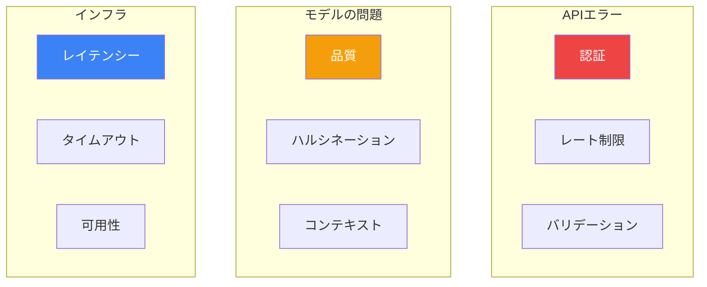

本番生成AIアプリケーションを構築するには、一般的な問題とその解決策を理解する必要があります。このガイドでは、Amazon Bedrockのトラブルシューティング技術を解説します。

## 一般的なエラーカテゴリ



## APIエラー処理

### 一般的なエラーコード

| エラーコード | 原因 | 解決策 |
|------------|------|--------|
| AccessDeniedException | IAM権限の不足 | IAMポリシーを更新 |
| ValidationException | 無効なリクエストパラメータ | リクエスト形式を確認 |
| ThrottlingException | レート制限超過 | バックオフを実装 |
| ModelTimeoutException | リクエストに時間がかかりすぎた | 入出力サイズを削減 |
| ServiceUnavailableException | サービスの問題 | バックオフでリトライ |

### エラー処理の実装

```python
import boto3
from botocore.exceptions import ClientError
import time

class BedrockClient:
    def __init__(self):
        self.runtime = boto3.client('bedrock-runtime')
        self.max_retries = 3
        self.base_delay = 1

    def invoke_with_retry(self, model_id: str, messages: list) -> dict:
        last_exception = None

        for attempt in range(self.max_retries):
            try:
                response = self.runtime.converse(
                    modelId=model_id,
                    messages=messages,
                    inferenceConfig={'maxTokens': 1024}
                )
                return response

            except ClientError as e:
                error_code = e.response['Error']['Code']
                last_exception = e

                if error_code == 'ThrottlingException':
                    # 指数バックオフ
                    delay = self.base_delay * (2 ** attempt)
                    print(f"レート制限。{delay}秒後にリトライ...")
                    time.sleep(delay)
                    continue

                elif error_code == 'ModelTimeoutException':
                    # リクエストサイズを削減またはモデルを切り替え
                    raise Exception("モデルタイムアウト。入力サイズの削減を検討してください。")

                elif error_code == 'ValidationException':
                    # バリデーションエラーはリトライしない
                    raise Exception(f"バリデーションエラー: {e.response['Error']['Message']}")

                elif error_code == 'AccessDeniedException':
                    raise Exception("アクセス拒否。IAM権限を確認してください。")

                elif error_code in ['ServiceUnavailableException', 'InternalServerException']:
                    delay = self.base_delay * (2 ** attempt)
                    print(f"サービスエラー。{delay}秒後にリトライ...")
                    time.sleep(delay)
                    continue

                else:
                    raise

        raise last_exception
```

### レート制限管理

```python
import threading
from collections import deque

class RateLimiter:
    def __init__(self, requests_per_minute: int):
        self.requests_per_minute = requests_per_minute
        self.request_times = deque()
        self.lock = threading.Lock()

    def wait_if_needed(self):
        with self.lock:
            now = time.time()

            # 1分以上前のリクエストを削除
            while self.request_times and now - self.request_times[0] > 60:
                self.request_times.popleft()

            if len(self.request_times) >= self.requests_per_minute:
                sleep_time = 60 - (now - self.request_times[0])
                if sleep_time > 0:
                    time.sleep(sleep_time)

            self.request_times.append(time.time())

# 使用例
rate_limiter = RateLimiter(requests_per_minute=60)

def call_bedrock(prompt):
    rate_limiter.wait_if_needed()
    # API呼び出し
```

## モデル品質の問題

### 低品質レスポンスの診断

```python
def diagnose_response_quality(prompt: str, response: str) -> dict:
    """レスポンス品質の問題を分析。"""
    issues = []

    # 空または非常に短いレスポンスを確認
    if len(response.strip()) < 10:
        issues.append("レスポンスが短すぎる - より具体的なプロンプトが必要かも")

    # 繰り返しを確認
    words = response.lower().split()
    unique_ratio = len(set(words)) / len(words) if words else 0
    if unique_ratio < 0.5:
        issues.append("高い繰り返しを検出 - temperatureを下げるかプロンプトを修正")

    # 拒否パターンを確認
    refusal_patterns = ["できません", "することができません", "持っていません", "AIとして"]
    if any(pattern in response for pattern in refusal_patterns):
        issues.append("モデルが拒否している可能性 - 制限されたコンテンツを確認")

    # プロンプト長とレスポンスを比較
    if len(prompt) > 4000 and len(response) < 100:
        issues.append("長いプロンプトに対して短いレスポンス - モデルが切り詰めている可能性")

    return {
        'issues': issues,
        'word_count': len(words),
        'unique_ratio': unique_ratio,
        'has_issues': len(issues) > 0
    }
```

### レスポンス品質の改善

```python
def improve_prompt(original_prompt: str, issue_type: str) -> str:
    """問題タイプに基づいて改善されたプロンプトを生成。"""
    improvements = {
        'too_short': f"""詳細で包括的なレスポンスを提供してください。

{original_prompt}

説明を徹底し、関連する例を含めてください。""",

        'repetitive': f"""繰り返しのない多様なレスポンスを提供してください。

{original_prompt}""",

        'off_topic': f"""この質問に具体的に答えることに集中してください。トピックに留まってください。

{original_prompt}

質問に直接関連する情報のみを議論してください。""",

        'hallucination': f"""事実に基づいた情報のみに基づいて回答してください。不確かな場合はそう言ってください。

{original_prompt}

重要: 情報を作り上げないでください。正確だと分かっていることのみを述べてください。"""
    }

    return improvements.get(issue_type, original_prompt)
```

### ハルシネーションの処理

```python
def detect_potential_hallucination(response: str, context: str = None) -> dict:
    """レスポンス内の潜在的なハルシネーションを検出。"""
    indicators = []

    # コンテキストサポートのない具体的な主張を確認
    specific_patterns = [
        r'\d{4}',  # 年
        r'\d+%',   # パーセンテージ
        r'\$\d+',  # ドル金額
        r'によると',
        r'研究によると',
        r'調査では'
    ]

    import re
    for pattern in specific_patterns:
        if re.search(pattern, response) and context:
            if not re.search(pattern, context):
                indicators.append(f"具体的な主張({pattern})がコンテキストに見つからない")

    # 高確信フレーズを確認
    high_confidence_phrases = [
        '必ず', '確実に', '常に', '決して', 'すべて', '一切'
    ]
    for phrase in high_confidence_phrases:
        if phrase in response:
            indicators.append(f"高確信フレーズ: '{phrase}'")

    return {
        'potential_hallucination': len(indicators) > 0,
        'indicators': indicators,
        'recommendation': '信頼できるソースで主張を検証してください'
    }
```

## Knowledge Basesトラブルシューティング

### 一般的な問題

| 問題 | 原因 | 解決策 |
|-----|------|-------|
| 結果なし | チャンキングまたはクエリが悪い | チャンクサイズを調整、クエリを言い換え |
| 無関係な結果 | 埋め込みの不一致 | ドキュメント品質を改善 |
| ドキュメントがない | 同期失敗 | 同期ステータス、S3権限を確認 |
| 検索が遅い | 大きなインデックス | ベクトルストアを最適化 |

### 検索のデバッグ

```python
def debug_knowledge_base_retrieval(knowledge_base_id: str, query: str) -> dict:
    """Knowledge Base検索の問題をデバッグ。"""
    bedrock_agent = boto3.client('bedrock-agent-runtime')
    bedrock = boto3.client('bedrock-agent')

    # Knowledge Baseステータスを確認
    try:
        kb_response = bedrock.get_knowledge_base(knowledgeBaseId=knowledge_base_id)
        kb_status = kb_response['knowledgeBase']['status']
        print(f"Knowledge Baseステータス: {kb_status}")

        if kb_status != 'ACTIVE':
            return {'error': f'Knowledge Baseがアクティブではない: {kb_status}'}
    except Exception as e:
        return {'error': f'Knowledge Base取得に失敗: {str(e)}'}

    # 検索をテスト
    try:
        response = bedrock_agent.retrieve(
            knowledgeBaseId=knowledge_base_id,
            retrievalQuery={'text': query},
            retrievalConfiguration={
                'vectorSearchConfiguration': {
                    'numberOfResults': 10
                }
            }
        )

        results = response['retrievalResults']
        print(f"{len(results)}件の結果を取得")

        # 結果を分析
        analysis = {
            'total_results': len(results),
            'results': []
        }

        for i, result in enumerate(results):
            score = result.get('score', 0)
            content_preview = result['content']['text'][:200]

            analysis['results'].append({
                'rank': i + 1,
                'score': score,
                'preview': content_preview,
                'location': result['location']['s3Location']['uri']
            })

            print(f"結果{i+1}: スコア={score:.4f}")
            print(f"  プレビュー: {content_preview[:100]}...")

        return analysis

    except Exception as e:
        return {'error': f'検索に失敗: {str(e)}'}
```

### 同期の問題

```python
def check_data_source_sync(knowledge_base_id: str, data_source_id: str) -> dict:
    """データソースの同期ステータスを確認してデバッグ。"""
    bedrock = boto3.client('bedrock-agent')

    # データソースの詳細を取得
    response = bedrock.get_data_source(
        knowledgeBaseId=knowledge_base_id,
        dataSourceId=data_source_id
    )

    data_source = response['dataSource']
    print(f"データソースステータス: {data_source['status']}")

    # インジェストジョブの一覧
    jobs_response = bedrock.list_ingestion_jobs(
        knowledgeBaseId=knowledge_base_id,
        dataSourceId=data_source_id,
        maxResults=5
    )

    sync_info = {
        'data_source_status': data_source['status'],
        'recent_jobs': []
    }

    for job in jobs_response['ingestionJobSummaries']:
        job_info = {
            'job_id': job['ingestionJobId'],
            'status': job['status'],
            'started': str(job.get('startedAt', 'N/A')),
            'updated': str(job.get('updatedAt', 'N/A'))
        }

        # 利用可能な場合は詳細な統計を取得
        if job['status'] in ['COMPLETE', 'FAILED']:
            detail_response = bedrock.get_ingestion_job(
                knowledgeBaseId=knowledge_base_id,
                dataSourceId=data_source_id,
                ingestionJobId=job['ingestionJobId']
            )
            stats = detail_response['ingestionJob'].get('statistics', {})
            job_info['statistics'] = stats

        sync_info['recent_jobs'].append(job_info)
        print(f"ジョブ{job['ingestionJobId']}: {job['status']}")

    return sync_info
```

## レイテンシーのトラブルシューティング

### レイテンシーの測定

```python
import time
from dataclasses import dataclass
from typing import Optional

@dataclass
class LatencyMetrics:
    total_ms: float
    time_to_first_token_ms: Optional[float]
    input_tokens: int
    output_tokens: int
    tokens_per_second: float

def measure_latency(model_id: str, messages: list, stream: bool = False) -> LatencyMetrics:
    """詳細なレイテンシーメトリクスを測定。"""
    runtime = boto3.client('bedrock-runtime')

    start_time = time.time()
    first_token_time = None
    total_output_tokens = 0

    if stream:
        response = runtime.converse_stream(
            modelId=model_id,
            messages=messages,
            inferenceConfig={'maxTokens': 1024}
        )

        for event in response['stream']:
            if 'contentBlockDelta' in event:
                if first_token_time is None:
                    first_token_time = time.time()
                total_output_tokens += 1  # 概算

        end_time = time.time()
        ttft = (first_token_time - start_time) * 1000 if first_token_time else None

    else:
        response = runtime.converse(
            modelId=model_id,
            messages=messages,
            inferenceConfig={'maxTokens': 1024}
        )
        end_time = time.time()
        ttft = None
        total_output_tokens = response['usage']['outputTokens']

    total_ms = (end_time - start_time) * 1000
    tokens_per_second = total_output_tokens / (end_time - start_time) if total_output_tokens > 0 else 0

    return LatencyMetrics(
        total_ms=total_ms,
        time_to_first_token_ms=ttft,
        input_tokens=response.get('usage', {}).get('inputTokens', 0),
        output_tokens=total_output_tokens,
        tokens_per_second=tokens_per_second
    )
```

### レイテンシー最適化チェックリスト

```python
def latency_optimization_checklist(metrics: LatencyMetrics) -> list:
    """レイテンシー最適化の推奨事項を生成。"""
    recommendations = []

    if metrics.total_ms > 5000:
        recommendations.append({
            'issue': '高い総レイテンシー',
            'suggestions': [
                'より高速なモデルの使用を検討（例：SonnetではなくHaiku）',
                '入力プロンプトサイズを削減',
                '一貫したレイテンシーのためにProvisioned Throughputを使用'
            ]
        })

    if metrics.time_to_first_token_ms and metrics.time_to_first_token_ms > 2000:
        recommendations.append({
            'issue': '最初のトークンまでの時間が遅い',
            'suggestions': [
                'システムプロンプトの長さを削減',
                'より良い体感パフォーマンスのためにストリーミングを検討',
                'Bedrockエンドポイントへのネットワークレイテンシーを確認'
            ]
        })

    if metrics.tokens_per_second < 20:
        recommendations.append({
            'issue': '低スループット',
            'suggestions': [
                'レート制限に達していないか確認',
                'Provisioned Throughputを検討',
                '同時リクエストパターンを見直し'
            ]
        })

    if metrics.input_tokens > 10000:
        recommendations.append({
            'issue': '大きな入力サイズ',
            'suggestions': [
                'コンテキストを要約または圧縮',
                'RAGを使用して関連コンテンツのみを取得',
                '複数のリクエストに分割'
            ]
        })

    return recommendations
```

## デバッグチェックリスト

```python
def comprehensive_debug(model_id: str, prompt: str) -> dict:
    """包括的なデバッグチェックを実行。"""
    results = {
        'checks': [],
        'issues': [],
        'recommendations': []
    }

    runtime = boto3.client('bedrock-runtime')

    # チェック1: モデルの利用可能性
    try:
        bedrock = boto3.client('bedrock')
        model_info = bedrock.get_foundation_model(modelIdentifier=model_id.split(':')[0])
        results['checks'].append({'model_available': True})
    except Exception as e:
        results['issues'].append(f'モデルが利用できません: {str(e)}')
        return results

    # チェック2: 基本的な呼び出し
    try:
        start = time.time()
        response = runtime.converse(
            modelId=model_id,
            messages=[{'role': 'user', 'content': [{'text': 'こんにちは'}]}],
            inferenceConfig={'maxTokens': 10}
        )
        latency = (time.time() - start) * 1000
        results['checks'].append({'basic_invocation': True, 'latency_ms': latency})
    except Exception as e:
        results['issues'].append(f'基本的な呼び出しに失敗: {str(e)}')
        return results

    # チェック3: 完全なプロンプトテスト
    try:
        start = time.time()
        response = runtime.converse(
            modelId=model_id,
            messages=[{'role': 'user', 'content': [{'text': prompt}]}],
            inferenceConfig={'maxTokens': 1024}
        )
        latency = (time.time() - start) * 1000

        results['checks'].append({
            'full_prompt': True,
            'latency_ms': latency,
            'input_tokens': response['usage']['inputTokens'],
            'output_tokens': response['usage']['outputTokens']
        })

        # 品質チェック
        output = response['output']['message']['content'][0]['text']
        quality = diagnose_response_quality(prompt, output)
        if quality['has_issues']:
            results['issues'].extend(quality['issues'])

    except Exception as e:
        results['issues'].append(f'完全なプロンプトテストに失敗: {str(e)}')

    return results
```

## ベストプラクティス

| カテゴリ | プラクティス |
|--------|------------|
| エラー処理 | 常にバックオフ付きリトライを実装 |
| モニタリング | レイテンシー、エラー、トークン使用量を追跡 |
| テスト | エッジケースと長い入力でテスト |
| ログ | デバッグのためにリクエストとレスポンスをログ |
| アラート | 異常のためにCloudWatchアラームを設定 |

## 重要なポイント

1. **堅牢なエラー処理を実装** - 指数バックオフでリトライ
2. **レスポンス品質を監視** - ハルシネーションを検出して対処
3. **Knowledge Basesをデバッグ** - 同期ステータスと検索スコアを確認
4. **レイテンシーを測定** - TTFTと総レスポンス時間を追跡
5. **チェックリストを使用** - 体系的なデバッグアプローチ

## 参考文献

- [Bedrockトラブルシューティング](https://docs.aws.amazon.com/bedrock/latest/userguide/troubleshooting.html)
- [エラー処理](https://docs.aws.amazon.com/bedrock/latest/userguide/error-handling.html)
- [CloudWatchモニタリング](https://docs.aws.amazon.com/bedrock/latest/userguide/monitoring-cw.html)
