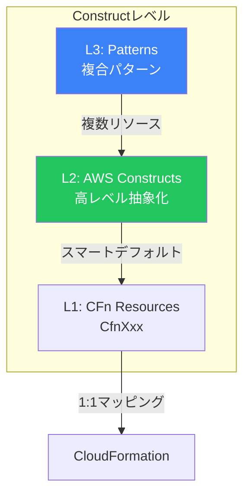
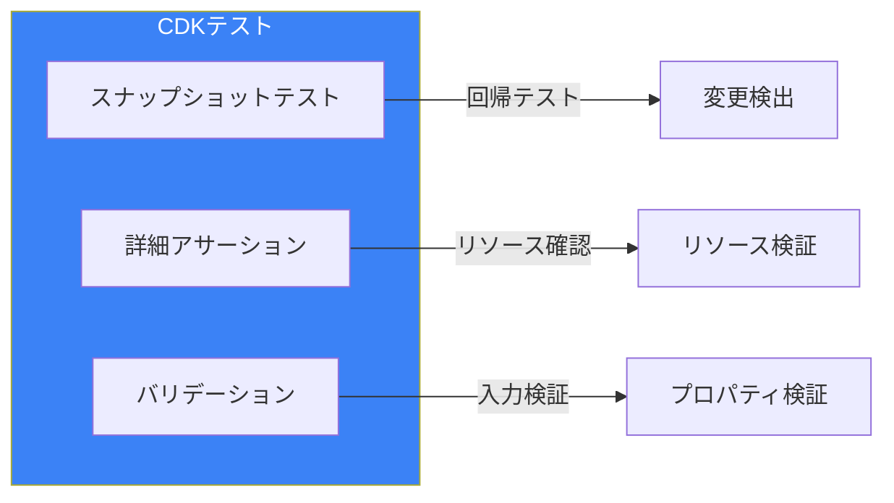
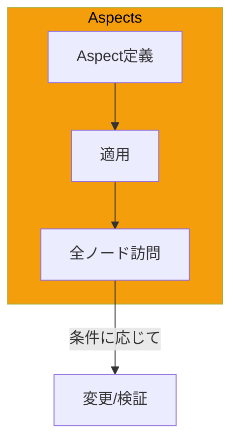
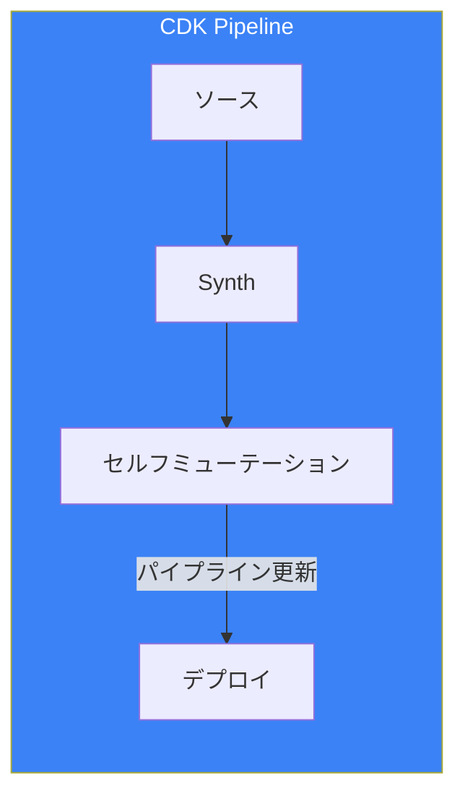
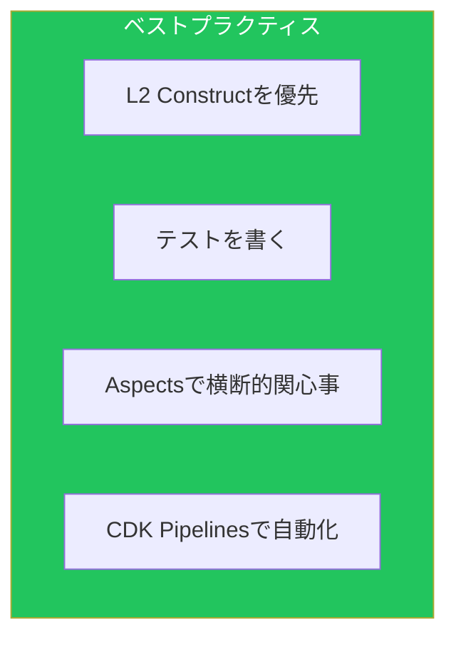

AWS CDKは、プログラミング言語でインフラを定義できるフレームワークです。本記事では、[IaC比較記事](/blog/aws-iac-comparison)で触れなかった実践的な使い方を解説します。

## Constructの深掘り

### Constructレベル



### L1 Construct（Cfn）

```typescript
import * as ec2 from 'aws-cdk-lib/aws-ec2';

// L1: CloudFormationリソースと1:1対応
const cfnVpc = new ec2.CfnVPC(this, 'CfnVpc', {
  cidrBlock: '10.0.0.0/16',
  enableDnsHostnames: true,
  enableDnsSupport: true,
  tags: [{ key: 'Name', value: 'my-vpc' }],
});

// すべてのプロパティを手動で設定
const cfnSubnet = new ec2.CfnSubnet(this, 'CfnSubnet', {
  vpcId: cfnVpc.ref,
  cidrBlock: '10.0.1.0/24',
  availabilityZone: 'ap-northeast-1a',
});
```

### L2 Construct（推奨）

```typescript
import * as ec2 from 'aws-cdk-lib/aws-ec2';

// L2: スマートデフォルト付き
const vpc = new ec2.Vpc(this, 'Vpc', {
  maxAzs: 2,
  natGateways: 1,
  subnetConfiguration: [
    {
      name: 'Public',
      subnetType: ec2.SubnetType.PUBLIC,
      cidrMask: 24,
    },
    {
      name: 'Private',
      subnetType: ec2.SubnetType.PRIVATE_WITH_EGRESS,
      cidrMask: 24,
    },
  ],
});

// 自動的に以下が作成される:
// - VPC
// - パブリック/プライベートサブネット（各AZ）
// - インターネットゲートウェイ
// - NATゲートウェイ
// - ルートテーブル
```

### L3 Construct（パターン）

```typescript
import * as ecsPatterns from 'aws-cdk-lib/aws-ecs-patterns';

// L3: 複数リソースを含むパターン
const service = new ecsPatterns.ApplicationLoadBalancedFargateService(this, 'Service', {
  vpc,
  taskImageOptions: {
    image: ecs.ContainerImage.fromRegistry('nginx'),
    containerPort: 80,
  },
  desiredCount: 2,
  publicLoadBalancer: true,
});

// 自動的に以下が作成される:
// - ECSクラスター
// - Fargateサービス
// - タスク定義
// - ALB
// - ターゲットグループ
// - セキュリティグループ
```

## カスタムConstruct

### 再利用可能なConstruct

```typescript
import { Construct } from 'constructs';
import * as cdk from 'aws-cdk-lib';
import * as ec2 from 'aws-cdk-lib/aws-ec2';
import * as rds from 'aws-cdk-lib/aws-rds';

export interface DatabaseConstructProps {
  vpc: ec2.IVpc;
  instanceType?: ec2.InstanceType;
  multiAz?: boolean;
  backupRetention?: cdk.Duration;
}

export class DatabaseConstruct extends Construct {
  public readonly instance: rds.DatabaseInstance;
  public readonly secret: secretsmanager.ISecret;

  constructor(scope: Construct, id: string, props: DatabaseConstructProps) {
    super(scope, id);

    const securityGroup = new ec2.SecurityGroup(this, 'SecurityGroup', {
      vpc: props.vpc,
      description: 'Database security group',
    });

    this.instance = new rds.DatabaseInstance(this, 'Instance', {
      engine: rds.DatabaseInstanceEngine.postgres({
        version: rds.PostgresEngineVersion.VER_15,
      }),
      vpc: props.vpc,
      vpcSubnets: { subnetType: ec2.SubnetType.PRIVATE_ISOLATED },
      instanceType: props.instanceType ?? ec2.InstanceType.of(
        ec2.InstanceClass.T3,
        ec2.InstanceSize.MEDIUM
      ),
      multiAz: props.multiAz ?? false,
      backupRetention: props.backupRetention ?? cdk.Duration.days(7),
      securityGroups: [securityGroup],
      deletionProtection: true,
      credentials: rds.Credentials.fromGeneratedSecret('dbadmin'),
    });

    this.secret = this.instance.secret!;
  }

  public allowConnectionFrom(peer: ec2.IPeer, port: ec2.Port = ec2.Port.tcp(5432)) {
    this.instance.connections.allowFrom(peer, port);
  }
}
```

### 使用例

```typescript
const database = new DatabaseConstruct(this, 'Database', {
  vpc,
  multiAz: true,
  backupRetention: cdk.Duration.days(14),
});

database.allowConnectionFrom(appSecurityGroup);

// 出力
new cdk.CfnOutput(this, 'DatabaseEndpoint', {
  value: database.instance.dbInstanceEndpointAddress,
});
```

## CDKテスト

### テストの種類



### スナップショットテスト

```typescript
import * as cdk from 'aws-cdk-lib';
import { Template } from 'aws-cdk-lib/assertions';
import { MyStack } from '../lib/my-stack';

describe('MyStack', () => {
  test('matches snapshot', () => {
    const app = new cdk.App();
    const stack = new MyStack(app, 'TestStack');

    const template = Template.fromStack(stack);
    expect(template.toJSON()).toMatchSnapshot();
  });
});
```

### 詳細アサーション

```typescript
import { Template, Match, Capture } from 'aws-cdk-lib/assertions';

describe('MyStack', () => {
  let template: Template;

  beforeEach(() => {
    const app = new cdk.App();
    const stack = new MyStack(app, 'TestStack');
    template = Template.fromStack(stack);
  });

  test('creates VPC with correct CIDR', () => {
    template.hasResourceProperties('AWS::EC2::VPC', {
      CidrBlock: '10.0.0.0/16',
      EnableDnsHostnames: true,
    });
  });

  test('creates exactly 2 private subnets', () => {
    template.resourceCountIs('AWS::EC2::Subnet', 4); // 2 public + 2 private
  });

  test('Lambda function has correct environment', () => {
    template.hasResourceProperties('AWS::Lambda::Function', {
      Environment: {
        Variables: {
          TABLE_NAME: Match.anyValue(),
          LOG_LEVEL: 'INFO',
        },
      },
      Runtime: 'nodejs18.x',
      Timeout: 30,
    });
  });

  test('RDS instance has encryption enabled', () => {
    template.hasResourceProperties('AWS::RDS::DBInstance', {
      StorageEncrypted: true,
      DeletionProtection: true,
    });
  });

  // キャプチャを使用した検証
  test('security group allows correct ingress', () => {
    const portCapture = new Capture();

    template.hasResourceProperties('AWS::EC2::SecurityGroupIngress', {
      IpProtocol: 'tcp',
      FromPort: portCapture,
      ToPort: portCapture,
    });

    expect(portCapture.asNumber()).toBe(443);
  });
});
```

### バリデーションテスト

```typescript
describe('DatabaseConstruct validation', () => {
  test('throws error for invalid retention period', () => {
    const app = new cdk.App();
    const stack = new cdk.Stack(app, 'TestStack');
    const vpc = new ec2.Vpc(stack, 'Vpc');

    expect(() => {
      new DatabaseConstruct(stack, 'Database', {
        vpc,
        backupRetention: cdk.Duration.days(0), // Invalid
      });
    }).toThrow(/Backup retention must be at least 1 day/);
  });
});
```

## Aspects

### Aspectsの仕組み



### タグ付けAspect

```typescript
import { IAspect, Tags } from 'aws-cdk-lib';
import { IConstruct } from 'constructs';

class TaggingAspect implements IAspect {
  constructor(private readonly tags: Record<string, string>) {}

  visit(node: IConstruct): void {
    if (Tags.of(node)) {
      Object.entries(this.tags).forEach(([key, value]) => {
        Tags.of(node).add(key, value);
      });
    }
  }
}

// 使用例
const app = new cdk.App();
const stack = new MyStack(app, 'MyStack');

Aspects.of(stack).add(new TaggingAspect({
  Environment: 'production',
  Project: 'my-app',
  ManagedBy: 'CDK',
}));
```

### セキュリティ検証Aspect

```typescript
import { IAspect, Annotations } from 'aws-cdk-lib';
import * as s3 from 'aws-cdk-lib/aws-s3';
import * as rds from 'aws-cdk-lib/aws-rds';

class SecurityValidationAspect implements IAspect {
  visit(node: IConstruct): void {
    // S3バケットの暗号化チェック
    if (node instanceof s3.CfnBucket) {
      if (!node.bucketEncryption) {
        Annotations.of(node).addError('S3 bucket must have encryption enabled');
      }
    }

    // RDSインスタンスの暗号化チェック
    if (node instanceof rds.CfnDBInstance) {
      if (node.storageEncrypted !== true) {
        Annotations.of(node).addError('RDS instance must have storage encryption enabled');
      }
    }

    // セキュリティグループの0.0.0.0/0チェック
    if (node instanceof ec2.CfnSecurityGroup) {
      const ingress = node.securityGroupIngress as any[];
      if (ingress?.some(rule => rule.cidrIp === '0.0.0.0/0' && rule.ipProtocol !== 'icmp')) {
        Annotations.of(node).addWarning('Security group allows inbound traffic from 0.0.0.0/0');
      }
    }
  }
}

Aspects.of(app).add(new SecurityValidationAspect());
```

### コスト最適化Aspect

```typescript
class CostOptimizationAspect implements IAspect {
  visit(node: IConstruct): void {
    // Lambda関数のメモリ警告
    if (node instanceof lambda.CfnFunction) {
      const memory = node.memorySize ?? 128;
      if (memory > 1024) {
        Annotations.of(node).addInfo(
          `Lambda function has ${memory}MB memory. Consider if this is necessary.`
        );
      }
    }

    // NAT Gatewayの数チェック
    if (node instanceof ec2.CfnNatGateway) {
      Annotations.of(node).addInfo(
        'NAT Gateway incurs hourly charges. Consider NAT Instance for dev environments.'
      );
    }
  }
}
```

## CDK Pipelines

### セルフミューテーションパイプライン



### パイプライン定義

```typescript
import * as cdk from 'aws-cdk-lib';
import { CodePipeline, CodePipelineSource, ShellStep } from 'aws-cdk-lib/pipelines';

export class PipelineStack extends cdk.Stack {
  constructor(scope: Construct, id: string, props?: cdk.StackProps) {
    super(scope, id, props);

    const pipeline = new CodePipeline(this, 'Pipeline', {
      pipelineName: 'MyAppPipeline',
      synth: new ShellStep('Synth', {
        input: CodePipelineSource.gitHub('owner/repo', 'main', {
          authentication: cdk.SecretValue.secretsManager('github-token'),
        }),
        commands: [
          'npm ci',
          'npm run build',
          'npm run test',
          'npx cdk synth',
        ],
        primaryOutputDirectory: 'cdk.out',
      }),
      selfMutation: true,
      dockerEnabledForSynth: true,
    });

    // ステージング環境
    const staging = new MyAppStage(this, 'Staging', {
      env: { account: '111111111111', region: 'ap-northeast-1' },
    });

    pipeline.addStage(staging, {
      pre: [
        new ShellStep('Validate', {
          commands: ['npm run lint', 'npm run test:integration'],
        }),
      ],
      post: [
        new ShellStep('IntegrationTest', {
          commands: ['npm run test:e2e'],
          envFromCfnOutputs: {
            API_URL: staging.apiUrlOutput,
          },
        }),
      ],
    });

    // 本番環境
    const production = new MyAppStage(this, 'Production', {
      env: { account: '222222222222', region: 'ap-northeast-1' },
    });

    pipeline.addStage(production, {
      pre: [
        new pipelines.ManualApprovalStep('PromoteToProd', {
          comment: 'Approve deployment to production',
        }),
      ],
    });
  }
}
```

### ステージ定義

```typescript
import { Stage, StageProps, CfnOutput } from 'aws-cdk-lib';

export class MyAppStage extends Stage {
  public readonly apiUrlOutput: CfnOutput;

  constructor(scope: Construct, id: string, props?: StageProps) {
    super(scope, id, props);

    const apiStack = new ApiStack(this, 'Api');
    const dbStack = new DatabaseStack(this, 'Database');
    const appStack = new AppStack(this, 'App', {
      api: apiStack,
      database: dbStack,
    });

    this.apiUrlOutput = appStack.apiUrl;
  }
}
```

## コンテキストと環境

### コンテキスト

```typescript
// cdk.json
{
  "context": {
    "environments": {
      "dev": {
        "account": "111111111111",
        "region": "ap-northeast-1",
        "instanceType": "t3.small"
      },
      "prod": {
        "account": "222222222222",
        "region": "ap-northeast-1",
        "instanceType": "m5.large"
      }
    }
  }
}

// スタックでの使用
const envConfig = this.node.tryGetContext('environments')[props.stage];
const instanceType = ec2.InstanceType.of(
  ec2.InstanceClass.of(envConfig.instanceType.split('.')[0]),
  ec2.InstanceSize.of(envConfig.instanceType.split('.')[1])
);
```

### 環境ごとの設定

```typescript
interface EnvironmentConfig {
  env: cdk.Environment;
  instanceType: ec2.InstanceType;
  minCapacity: number;
  maxCapacity: number;
}

const environments: Record<string, EnvironmentConfig> = {
  dev: {
    env: { account: '111111111111', region: 'ap-northeast-1' },
    instanceType: ec2.InstanceType.of(ec2.InstanceClass.T3, ec2.InstanceSize.SMALL),
    minCapacity: 1,
    maxCapacity: 2,
  },
  prod: {
    env: { account: '222222222222', region: 'ap-northeast-1' },
    instanceType: ec2.InstanceType.of(ec2.InstanceClass.M5, ec2.InstanceSize.LARGE),
    minCapacity: 2,
    maxCapacity: 10,
  },
};

const app = new cdk.App();
const stage = app.node.tryGetContext('stage') || 'dev';
const config = environments[stage];

new MyStack(app, `MyStack-${stage}`, config);
```

## ベストプラクティス



| カテゴリ | 項目 |
|---------|------|
| 設計 | L2 Constructを優先使用 |
| テスト | スナップショット+詳細アサーション |
| セキュリティ | Aspectsで検証 |
| 運用 | CDK Pipelinesでセルフミューテーション |

## まとめ

| 機能 | 用途 |
|------|------|
| カスタムConstruct | 再利用可能なコンポーネント |
| テスト | 品質保証 |
| Aspects | 横断的な設定・検証 |
| CDK Pipelines | CI/CD自動化 |

CDKの高度な機能を活用することで、保守性の高いインフラコードを実現できます。

## 参考資料

- [AWS CDK Developer Guide](https://docs.aws.amazon.com/cdk/v2/guide/)
- [CDK API Reference](https://docs.aws.amazon.com/cdk/api/v2/)
- [CDK Patterns](https://cdkpatterns.com/)
