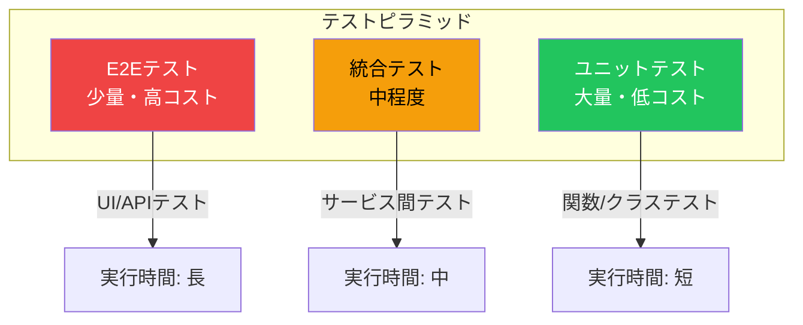
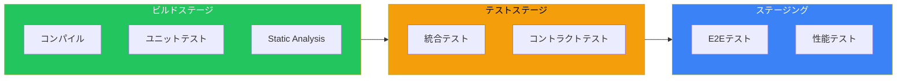
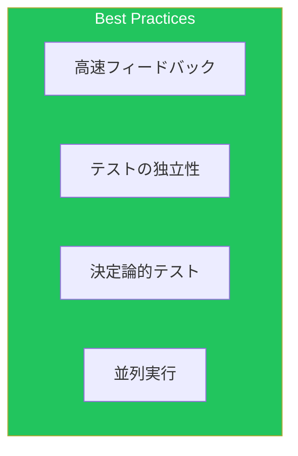

継続的インテグレーションにおいて、適切なテスト戦略は品質を担保する鍵です。本記事では、AWSのCI/CDパイプラインにおけるテストの実装と品質ゲートの設定を解説します。

## テストピラミッド

### 概念



### テストタイプ別の特徴

| テストタイプ | 実行速度 | カバレッジ | フィードバック | コスト |
|-------------|---------|-----------|--------------|--------|
| ユニット | 高速 | 狭い | 即時 | 低 |
| 統合 | 中程度 | 中程度 | 数分 | 中 |
| E2E | 低速 | 広い | 数十分 | 高 |

## パイプラインでのテスト配置

### 推奨構成



## ユニットテスト

### CodeBuild設定

```yaml
version: 0.2

phases:
  install:
    runtime-versions:
      nodejs: 18
    commands:
      - npm ci

  build:
    commands:
      - npm run build

  post_build:
    commands:
      - npm run test:unit -- --coverage --ci --reporters=default --reporters=jest-junit

reports:
  unit-tests:
    files:
      - junit.xml
    base-directory: test-results
    file-format: JUNITXML

  coverage:
    files:
      - coverage/clover.xml
    file-format: CLOVERXML

artifacts:
  files:
    - dist/**/*
    - coverage/**/*

cache:
  paths:
    - node_modules/**/*
```

### Jest設定例

```javascript
// jest.config.js
module.exports = {
  testEnvironment: 'node',
  coverageThreshold: {
    global: {
      branches: 80,
      functions: 80,
      lines: 80,
      statements: 80
    }
  },
  reporters: [
    'default',
    ['jest-junit', {
      outputDirectory: 'test-results',
      outputName: 'junit.xml'
    }]
  ],
  collectCoverageFrom: [
    'src/**/*.{js,ts}',
    '!src/**/*.d.ts',
    '!src/**/index.{js,ts}'
  ]
};
```

### Python（pytest）設定

```yaml
# buildspec.yml
phases:
  install:
    commands:
      - pip install -r requirements.txt
      - pip install pytest pytest-cov pytest-html

  build:
    commands:
      - pytest tests/unit \
          --cov=src \
          --cov-report=xml:coverage.xml \
          --junitxml=test-results/junit.xml \
          --html=test-results/report.html

reports:
  pytest-reports:
    files:
      - test-results/junit.xml
    file-format: JUNITXML
```

## 統合テスト

### データベース統合テスト

```yaml
version: 0.2

env:
  secrets-manager:
    DB_PASSWORD: test/db:password

phases:
  install:
    commands:
      - amazon-linux-extras install docker
      - service docker start

  pre_build:
    commands:
      # テスト用DBコンテナ起動
      - |
        docker run -d \
          --name test-db \
          -e POSTGRES_PASSWORD=$DB_PASSWORD \
          -e POSTGRES_DB=testdb \
          -p 5432:5432 \
          postgres:15

      # DB起動待機
      - |
        until docker exec test-db pg_isready; do
          echo "Waiting for database..."
          sleep 2
        done

      # マイグレーション実行
      - npm run db:migrate

  build:
    commands:
      - npm run test:integration

  post_build:
    commands:
      - docker stop test-db
      - docker rm test-db

reports:
  integration-tests:
    files:
      - test-results/integration-junit.xml
    file-format: JUNITXML
```

### API統合テスト（LocalStack）

```yaml
version: 0.2

phases:
  install:
    commands:
      - pip install localstack awscli-local
      - docker pull localstack/localstack

  pre_build:
    commands:
      # LocalStack起動
      - |
        docker run -d \
          --name localstack \
          -p 4566:4566 \
          -e SERVICES=s3,dynamodb,sqs,lambda \
          localstack/localstack

      - sleep 10

      # テストリソース作成
      - awslocal s3 mb s3://test-bucket
      - awslocal dynamodb create-table --cli-input-json file://test/fixtures/table.json

  build:
    commands:
      - AWS_ENDPOINT=http://localhost:4566 npm run test:integration

  post_build:
    commands:
      - docker stop localstack
```

## E2Eテスト

### Playwright設定

```yaml
version: 0.2

phases:
  install:
    runtime-versions:
      nodejs: 18
    commands:
      - npm ci
      - npx playwright install --with-deps chromium

  pre_build:
    commands:
      # テストアプリケーション起動
      - npm run build
      - npm run start &
      - npx wait-on http://localhost:3000

  build:
    commands:
      - npx playwright test --reporter=junit

reports:
  e2e-tests:
    files:
      - test-results/junit.xml
    file-format: JUNITXML

artifacts:
  files:
    - playwright-report/**/*
    - test-results/**/*
```

### Device Farmでのテスト

```yaml
# CodePipelineアクション
- Name: DeviceFarmTest
  ActionTypeId:
    Category: Test
    Owner: AWS
    Provider: DeviceFarm
    Version: "1"
  Configuration:
    AppType: Web
    ProjectId: !Ref DeviceFarmProject
    DevicePoolArn: !Ref DevicePool
    TestType: APPIUM_WEB_PYTHON
    Test:
      Type: APPIUM_WEB_PYTHON
      TestPackageArn: !Ref TestPackage
  InputArtifacts:
    - Name: BuildOutput
```

## 品質ゲート

### CodeBuildでの品質ゲート

```yaml
version: 0.2

env:
  variables:
    MIN_COVERAGE: "80"
    MAX_COMPLEXITY: "10"

phases:
  build:
    commands:
      - npm run test:coverage
      - npm run lint

  post_build:
    commands:
      # カバレッジチェック
      - |
        COVERAGE=$(cat coverage/coverage-summary.json | jq '.total.lines.pct')
        if (( $(echo "$COVERAGE < $MIN_COVERAGE" | bc -l) )); then
          echo "Coverage $COVERAGE% is below threshold $MIN_COVERAGE%"
          exit 1
        fi

      # 複雑度チェック
      - |
        npx plato -r -d report src/
        MAX_FOUND=$(cat report/report.json | jq '[.reports[].complexity.methodAverage] | max')
        if (( $(echo "$MAX_FOUND > $MAX_COMPLEXITY" | bc -l) )); then
          echo "Complexity $MAX_FOUND exceeds threshold $MAX_COMPLEXITY"
          exit 1
        fi

      # セキュリティスキャン
      - npm audit --audit-level=high
```

### CodeGuru Reviewer統合

```yaml
# CloudFormation
CodeGuruAssociation:
  Type: AWS::CodeGuruReviewer::RepositoryAssociation
  Properties:
    Name: my-repository
    Type: CodeCommit
    Tags:
      - Key: Environment
        Value: production

# buildspec.yml
phases:
  post_build:
    commands:
      # CodeGuru Profilerエージェント設定
      - |
        cat <<EOF > codeguru-profiler.yaml
        profilingGroupName: MyProfilingGroup
        heapSummaryEnabled: true
        EOF
```

### カスタム品質ゲートLambda

```python
import json
import boto3

codepipeline = boto3.client('codepipeline')
cloudwatch = boto3.client('cloudwatch')

def lambda_handler(event, context):
    job_id = event['CodePipeline.job']['id']

    try:
        # テストレポートからメトリクス取得
        metrics = get_test_metrics(event)

        # 品質基準チェック
        quality_gates = [
            ('Coverage', metrics['coverage'], 80, '>='),
            ('PassRate', metrics['pass_rate'], 95, '>='),
            ('Complexity', metrics['complexity'], 15, '<='),
            ('Duplications', metrics['duplications'], 5, '<='),
        ]

        failed_gates = []
        for name, value, threshold, operator in quality_gates:
            if not check_threshold(value, threshold, operator):
                failed_gates.append(f"{name}: {value} (threshold: {operator} {threshold})")

        if failed_gates:
            raise Exception(f"Quality gates failed: {', '.join(failed_gates)}")

        # メトリクス送信
        publish_metrics(metrics)

        codepipeline.put_job_success_result(jobId=job_id)

    except Exception as e:
        codepipeline.put_job_failure_result(
            jobId=job_id,
            failureDetails={
                'type': 'JobFailed',
                'message': str(e)
            }
        )

def check_threshold(value, threshold, operator):
    if operator == '>=':
        return value >= threshold
    elif operator == '<=':
        return value <= threshold
    return False

def publish_metrics(metrics):
    cloudwatch.put_metric_data(
        Namespace='CodeQuality',
        MetricData=[
            {
                'MetricName': 'Coverage',
                'Value': metrics['coverage'],
                'Unit': 'Percent'
            },
            {
                'MetricName': 'TestPassRate',
                'Value': metrics['pass_rate'],
                'Unit': 'Percent'
            }
        ]
    )
```

## 負荷テスト

### Distributed Load Testing on AWS

```yaml
# buildspec.yml
phases:
  pre_build:
    commands:
      # 負荷テストシナリオの準備
      - |
        cat <<EOF > load-test.json
        {
          "testName": "API Load Test",
          "testDescription": "Performance test for production API",
          "testScenario": {
            "execution": [{
              "concurrency": 100,
              "hold-for": "5m",
              "ramp-up": "1m"
            }],
            "scenarios": {
              "api-test": {
                "requests": [{
                  "url": "${API_ENDPOINT}/api/users",
                  "method": "GET"
                }]
              }
            }
          }
        }
        EOF

  build:
    commands:
      # 負荷テスト実行
      - |
        aws lambda invoke \
          --function-name LoadTestRunner \
          --payload file://load-test.json \
          response.json

      # 結果の検証
      - |
        RESULT=$(cat response.json)
        P95_LATENCY=$(echo $RESULT | jq '.p95_latency')
        ERROR_RATE=$(echo $RESULT | jq '.error_rate')

        if (( $(echo "$P95_LATENCY > 500" | bc -l) )); then
          echo "P95 latency ${P95_LATENCY}ms exceeds 500ms threshold"
          exit 1
        fi

        if (( $(echo "$ERROR_RATE > 1" | bc -l) )); then
          echo "Error rate ${ERROR_RATE}% exceeds 1% threshold"
          exit 1
        fi
```

### k6による負荷テスト

```javascript
// load-test.js
import http from 'k6/http';
import { check, sleep } from 'k6';
import { Rate } from 'k6/metrics';

const errorRate = new Rate('errors');

export const options = {
  stages: [
    { duration: '1m', target: 50 },
    { duration: '3m', target: 100 },
    { duration: '1m', target: 0 },
  ],
  thresholds: {
    http_req_duration: ['p(95)<500'],
    errors: ['rate<0.01'],
  },
};

export default function () {
  const res = http.get(`${__ENV.API_ENDPOINT}/api/health`);

  const success = check(res, {
    'status is 200': (r) => r.status === 200,
    'response time < 500ms': (r) => r.timings.duration < 500,
  });

  errorRate.add(!success);
  sleep(1);
}
```

## テストレポートの集約

### CodeBuildレポートグループ

```yaml
TestReportGroup:
  Type: AWS::CodeBuild::ReportGroup
  Properties:
    Name: TestResults
    Type: TEST
    ExportConfig:
      ExportConfigType: S3
      S3Destination:
        Bucket: !Ref ReportBucket
        Path: test-reports
        Packaging: NONE

CoverageReportGroup:
  Type: AWS::CodeBuild::ReportGroup
  Properties:
    Name: CoverageResults
    Type: CODE_COVERAGE
    ExportConfig:
      ExportConfigType: S3
      S3Destination:
        Bucket: !Ref ReportBucket
        Path: coverage-reports
```

### ダッシュボード

```yaml
TestDashboard:
  Type: AWS::CloudWatch::Dashboard
  Properties:
    DashboardName: TestMetrics
    DashboardBody: !Sub |
      {
        "widgets": [
          {
            "type": "metric",
            "properties": {
              "title": "Test Pass Rate",
              "metrics": [
                ["CodeQuality", "TestPassRate"]
              ],
              "period": 86400
            }
          },
          {
            "type": "metric",
            "properties": {
              "title": "Code Coverage",
              "metrics": [
                ["CodeQuality", "Coverage"]
              ],
              "period": 86400
            }
          }
        ]
      }
```

## ベストプラクティス

### テスト戦略



| 原則 | 説明 |
|------|------|
| 高速フィードバック | ユニットテストを優先 |
| テストの独立性 | 外部依存の最小化 |
| 決定論的 | 同じ入力で同じ結果 |
| 並列実行 | テスト時間の短縮 |

## まとめ

| テストタイプ | 実行タイミング | ツール例 |
|-------------|--------------|---------|
| ユニット | ビルドステージ | Jest, pytest |
| 統合 | テストステージ | LocalStack, Testcontainers |
| E2E | ステージング | Playwright, Device Farm |
| 負荷 | リリース前 | k6, Distributed Load Testing |

適切なテスト戦略により、品質を担保しながら高速なデリバリーを実現できます。

## 参考資料

- [CodeBuild Test Reports](https://docs.aws.amazon.com/codebuild/latest/userguide/test-reporting.html)
- [AWS Device Farm](https://docs.aws.amazon.com/devicefarm/latest/developerguide/)
- [Distributed Load Testing on AWS](https://aws.amazon.com/solutions/implementations/distributed-load-testing-on-aws/)
