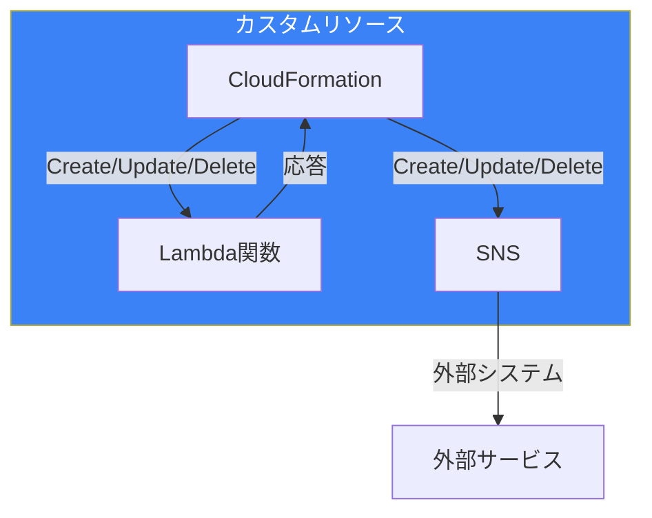
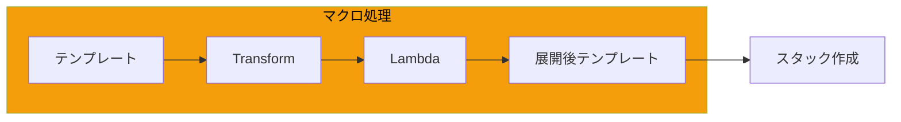
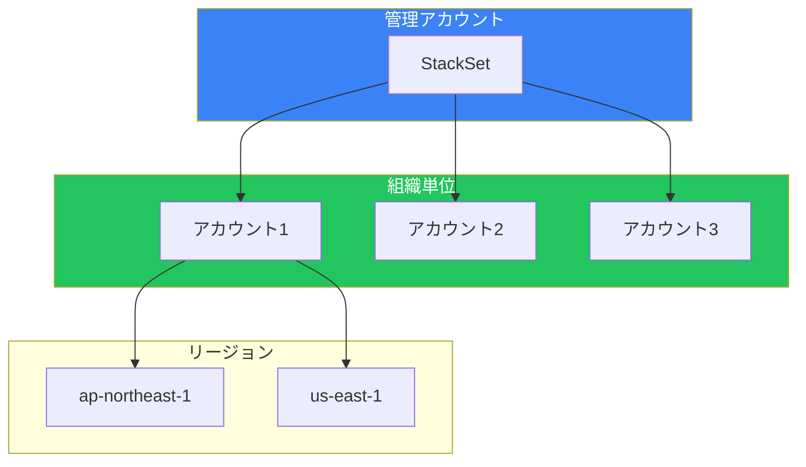
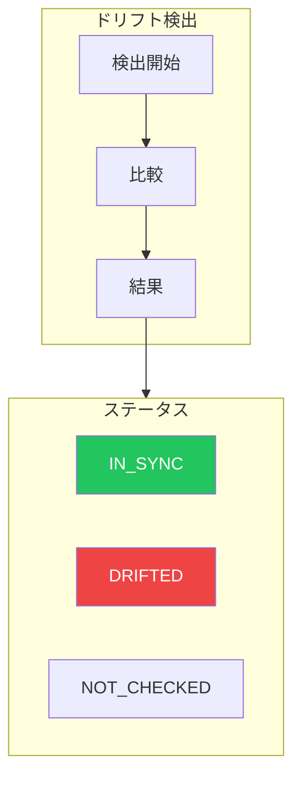
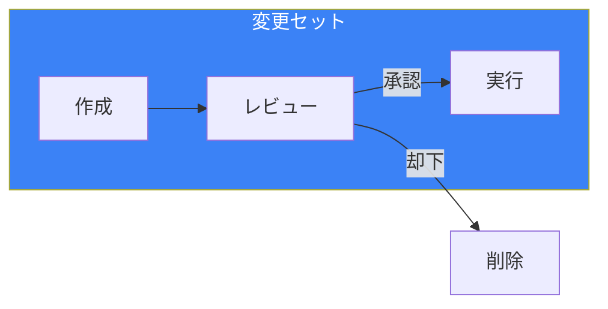
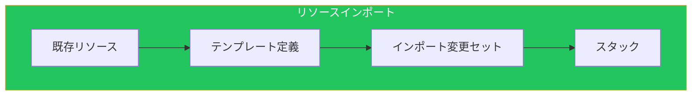
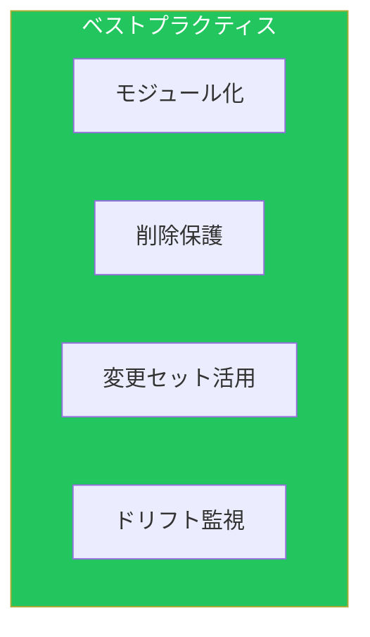

CloudFormationは、AWSインフラをコードで管理するための強力なサービスです。本記事では、IaC比較記事（[IaC比較](/blog/aws-iac-comparison)）で触れなかった高度な機能を詳しく解説します。

## カスタムリソース

### 概要



### Lambda-backed カスタムリソース

```yaml
# CloudFormationテンプレート
Resources:
  CustomResourceFunction:
    Type: AWS::Lambda::Function
    Properties:
      FunctionName: cfn-custom-resource
      Runtime: python3.11
      Handler: index.handler
      Timeout: 300
      Role: !GetAtt CustomResourceRole.Arn
      Code:
        ZipFile: |
          import cfnresponse
          import boto3

          def handler(event, context):
              try:
                  request_type = event['RequestType']
                  properties = event['ResourceProperties']

                  if request_type == 'Create':
                      result = create_resource(properties)
                  elif request_type == 'Update':
                      result = update_resource(properties, event['OldResourceProperties'])
                  elif request_type == 'Delete':
                      result = delete_resource(properties)

                  cfnresponse.send(event, context, cfnresponse.SUCCESS, {
                      'Result': result
                  }, physicalResourceId=result.get('id', 'custom-resource'))

              except Exception as e:
                  cfnresponse.send(event, context, cfnresponse.FAILED, {
                      'Error': str(e)
                  })

          def create_resource(properties):
              # リソース作成ロジック
              return {'id': 'resource-123', 'status': 'created'}

          def update_resource(properties, old_properties):
              # リソース更新ロジック
              return {'id': 'resource-123', 'status': 'updated'}

          def delete_resource(properties):
              # リソース削除ロジック
              return {'status': 'deleted'}

  MyCustomResource:
    Type: Custom::MyResource
    Properties:
      ServiceToken: !GetAtt CustomResourceFunction.Arn
      CustomParam1: !Ref Parameter1
      CustomParam2: !Ref Parameter2
```

### cfn-responseモジュール

```python
import json
import urllib3

SUCCESS = "SUCCESS"
FAILED = "FAILED"

def send(event, context, response_status, response_data,
         physical_resource_id=None, no_echo=False, reason=None):

    response_url = event['ResponseURL']

    response_body = {
        'Status': response_status,
        'Reason': reason or f"See CloudWatch Log Stream: {context.log_stream_name}",
        'PhysicalResourceId': physical_resource_id or context.log_stream_name,
        'StackId': event['StackId'],
        'RequestId': event['RequestId'],
        'LogicalResourceId': event['LogicalResourceId'],
        'NoEcho': no_echo,
        'Data': response_data
    }

    http = urllib3.PoolManager()
    http.request(
        'PUT',
        response_url,
        body=json.dumps(response_body).encode('utf-8'),
        headers={'Content-Type': ''}
    )
```

### ユースケース

| ユースケース | 説明 |
|-------------|------|
| 外部API呼び出し | Slack通知、外部サービス連携 |
| 複雑な初期化 | DB初期データ投入 |
| CloudFormation未サポートリソース | 新サービス対応 |
| クロスアカウント操作 | 別アカウントのリソース管理 |

## CloudFormationマクロ

### マクロの仕組み



### マクロの作成

```yaml
# マクロ定義
MacroFunction:
  Type: AWS::Lambda::Function
  Properties:
    FunctionName: cfn-macro-add-tags
    Runtime: python3.11
    Handler: index.handler
    Role: !GetAtt MacroRole.Arn
    Code:
      ZipFile: |
        def handler(event, context):
            fragment = event['fragment']
            params = event['params']
            template_params = event['templateParameterValues']

            # 全リソースにタグを追加
            default_tags = params.get('DefaultTags', [])

            for resource_name, resource in fragment.get('Resources', {}).items():
                if 'Properties' not in resource:
                    resource['Properties'] = {}

                existing_tags = resource['Properties'].get('Tags', [])
                resource['Properties']['Tags'] = existing_tags + default_tags

            return {
                'requestId': event['requestId'],
                'status': 'success',
                'fragment': fragment
            }

MacroDefinition:
  Type: AWS::CloudFormation::Macro
  Properties:
    Name: AddDefaultTags
    FunctionName: !GetAtt MacroFunction.Arn
```

### マクロの使用

```yaml
AWSTemplateFormatVersion: '2010-09-09'
Transform:
  - Name: AddDefaultTags
    Parameters:
      DefaultTags:
        - Key: Environment
          Value: production
        - Key: ManagedBy
          Value: CloudFormation

Resources:
  MyBucket:
    Type: AWS::S3::Bucket
    Properties:
      BucketName: my-bucket
      # タグは自動追加される

  MyQueue:
    Type: AWS::SQS::Queue
    Properties:
      QueueName: my-queue
      # タグは自動追加される
```

### AWS::Include変換

```yaml
# メインテンプレート
AWSTemplateFormatVersion: '2010-09-09'
Transform: AWS::Include
Resources:
  Fn::Transform:
    Name: AWS::Include
    Parameters:
      Location: s3://my-bucket/templates/common-resources.yaml
```

## StackSets詳細

### アーキテクチャ



### 権限モデル

| モデル | 説明 | 用途 |
|--------|------|------|
| SELF_MANAGED | 手動でIAMロール作成 | 特定アカウントへの展開 |
| SERVICE_MANAGED | Organizations統合 | OU全体への自動展開 |

### SERVICE_MANAGED設定

```yaml
StackSet:
  Type: AWS::CloudFormation::StackSet
  Properties:
    StackSetName: security-baseline
    Description: Security baseline for all accounts
    PermissionModel: SERVICE_MANAGED
    AutoDeployment:
      Enabled: true
      RetainStacksOnAccountRemoval: false
    StackInstancesGroup:
      - DeploymentTargets:
          OrganizationalUnitIds:
            - ou-xxxx-yyyyyyyy
        Regions:
          - ap-northeast-1
          - us-east-1
    OperationPreferences:
      FailureTolerancePercentage: 10
      MaxConcurrentPercentage: 25
      RegionConcurrencyType: PARALLEL
    CallAs: DELEGATED_ADMIN
    TemplateBody: |
      AWSTemplateFormatVersion: '2010-09-09'
      Resources:
        SecurityGroup:
          Type: AWS::EC2::SecurityGroup
          Properties:
            GroupDescription: Default security group
```

### デプロイオプション

```yaml
OperationPreferences:
  # 失敗許容度
  FailureToleranceCount: 2
  # または
  FailureTolerancePercentage: 10

  # 同時実行数
  MaxConcurrentCount: 5
  # または
  MaxConcurrentPercentage: 25

  # リージョン並列実行
  RegionConcurrencyType: PARALLEL  # または SEQUENTIAL

  # リージョン順序
  RegionOrder:
    - ap-northeast-1
    - us-east-1
    - eu-west-1
```

## ドリフト検出

### ドリフト検出フロー



### ドリフト検出の実行

```bash
# スタックのドリフト検出開始
aws cloudformation detect-stack-drift \
    --stack-name my-stack

# ドリフト検出ステータス確認
aws cloudformation describe-stack-drift-detection-status \
    --stack-drift-detection-id xxxxx

# リソース別ドリフト確認
aws cloudformation describe-stack-resource-drifts \
    --stack-name my-stack \
    --stack-resource-drift-status-filters MODIFIED DELETED
```

### 自動ドリフト検出

```yaml
# EventBridgeルール
DriftDetectionRule:
  Type: AWS::Events::Rule
  Properties:
    ScheduleExpression: rate(1 day)
    Targets:
      - Id: DetectDrift
        Arn: !GetAtt DriftDetectionLambda.Arn

DriftDetectionLambda:
  Type: AWS::Lambda::Function
  Properties:
    Code:
      ZipFile: |
        import boto3

        cfn = boto3.client('cloudformation')
        sns = boto3.client('sns')

        def handler(event, context):
            stacks = cfn.list_stacks(
                StackStatusFilter=['CREATE_COMPLETE', 'UPDATE_COMPLETE']
            )

            for stack in stacks['StackSummaries']:
                detection_id = cfn.detect_stack_drift(
                    StackName=stack['StackName']
                )['StackDriftDetectionId']

                # 検出完了を待機して結果を確認
                # ドリフトがあれば通知
```

## 変更セット

### 変更セットのフロー



### 変更セットの操作

```bash
# 変更セット作成
aws cloudformation create-change-set \
    --stack-name my-stack \
    --change-set-name my-changes \
    --template-body file://template.yaml \
    --parameters ParameterKey=Env,ParameterValue=prod \
    --change-set-type UPDATE

# 変更内容の確認
aws cloudformation describe-change-set \
    --stack-name my-stack \
    --change-set-name my-changes

# 変更セット実行
aws cloudformation execute-change-set \
    --stack-name my-stack \
    --change-set-name my-changes

# 変更セット削除
aws cloudformation delete-change-set \
    --stack-name my-stack \
    --change-set-name my-changes
```

### 変更タイプ

| タイプ | 説明 |
|--------|------|
| Add | 新規リソース追加 |
| Modify | 既存リソース変更 |
| Remove | リソース削除 |
| Dynamic | 実行時まで不明 |

## リソースインポート

### インポートフロー



### インポート手順

```yaml
# 1. テンプレートにリソース定義を追加
Resources:
  ImportedBucket:
    Type: AWS::S3::Bucket
    DeletionPolicy: Retain
    Properties:
      BucketName: existing-bucket-name
```

```bash
# 2. インポート用変更セット作成
aws cloudformation create-change-set \
    --stack-name my-stack \
    --change-set-name import-bucket \
    --change-set-type IMPORT \
    --resources-to-import "[{\"ResourceType\":\"AWS::S3::Bucket\",\"LogicalResourceId\":\"ImportedBucket\",\"ResourceIdentifier\":{\"BucketName\":\"existing-bucket-name\"}}]" \
    --template-body file://template.yaml

# 3. 変更セット実行
aws cloudformation execute-change-set \
    --stack-name my-stack \
    --change-set-name import-bucket
```

## スタックポリシー

### ポリシー例

```json
{
  "Statement": [
    {
      "Effect": "Allow",
      "Action": "Update:*",
      "Principal": "*",
      "Resource": "*"
    },
    {
      "Effect": "Deny",
      "Action": [
        "Update:Replace",
        "Update:Delete"
      ],
      "Principal": "*",
      "Resource": "LogicalResourceId/ProductionDatabase",
      "Condition": {
        "StringEquals": {
          "ResourceType": ["AWS::RDS::DBInstance"]
        }
      }
    }
  ]
}
```

### ポリシーの適用

```bash
# スタックポリシー設定
aws cloudformation set-stack-policy \
    --stack-name my-stack \
    --stack-policy-body file://stack-policy.json

# 一時的にポリシーを上書き
aws cloudformation update-stack \
    --stack-name my-stack \
    --template-body file://template.yaml \
    --stack-policy-during-update-body file://override-policy.json
```

## 高度なテンプレート技法

### 条件付きリソース

```yaml
Conditions:
  IsProduction: !Equals [!Ref Environment, production]
  HasBackup: !And
    - !Condition IsProduction
    - !Equals [!Ref EnableBackup, "true"]

Resources:
  ProductionOnlyResource:
    Type: AWS::RDS::DBInstance
    Condition: IsProduction
    Properties:
      # ...

  BackupResource:
    Type: AWS::Backup::BackupPlan
    Condition: HasBackup
    Properties:
      # ...
```

### 動的参照

```yaml
Resources:
  MyInstance:
    Type: AWS::EC2::Instance
    Properties:
      ImageId: '{{resolve:ssm:/aws/service/ami-amazon-linux-latest/amzn2-ami-hvm-x86_64-gp2}}'
      KeyName: '{{resolve:ssm:/myapp/ec2/keypair}}'
      Tags:
        - Key: Password
          Value: '{{resolve:secretsmanager:MySecret:SecretString:password}}'
```

### ネストスタック

```yaml
Resources:
  VPCStack:
    Type: AWS::CloudFormation::Stack
    Properties:
      TemplateURL: https://s3.amazonaws.com/my-bucket/vpc.yaml
      Parameters:
        Environment: !Ref Environment
      TimeoutInMinutes: 20

  AppStack:
    Type: AWS::CloudFormation::Stack
    DependsOn: VPCStack
    Properties:
      TemplateURL: https://s3.amazonaws.com/my-bucket/app.yaml
      Parameters:
        VPCId: !GetAtt VPCStack.Outputs.VPCId
        SubnetIds: !GetAtt VPCStack.Outputs.PrivateSubnetIds
```

## ベストプラクティス



| カテゴリ | 項目 |
|---------|------|
| 設計 | ネストスタックで再利用 |
| 安全性 | DeletionPolicy設定 |
| 運用 | 変更セットで事前確認 |
| 監視 | 定期的なドリフト検出 |

## まとめ

| 機能 | 用途 |
|------|------|
| カスタムリソース | CloudFormation未対応処理 |
| マクロ | テンプレート変換 |
| StackSets | マルチアカウント展開 |
| ドリフト検出 | 設定変更の検知 |
| 変更セット | 安全な更新 |

CloudFormationの高度な機能を活用することで、複雑なインフラ要件にも対応できます。

## 参考資料

- [CloudFormation User Guide](https://docs.aws.amazon.com/AWSCloudFormation/latest/UserGuide/)
- [Custom Resources](https://docs.aws.amazon.com/AWSCloudFormation/latest/UserGuide/template-custom-resources.html)
- [StackSets](https://docs.aws.amazon.com/AWSCloudFormation/latest/UserGuide/what-is-cfnstacksets.html)
