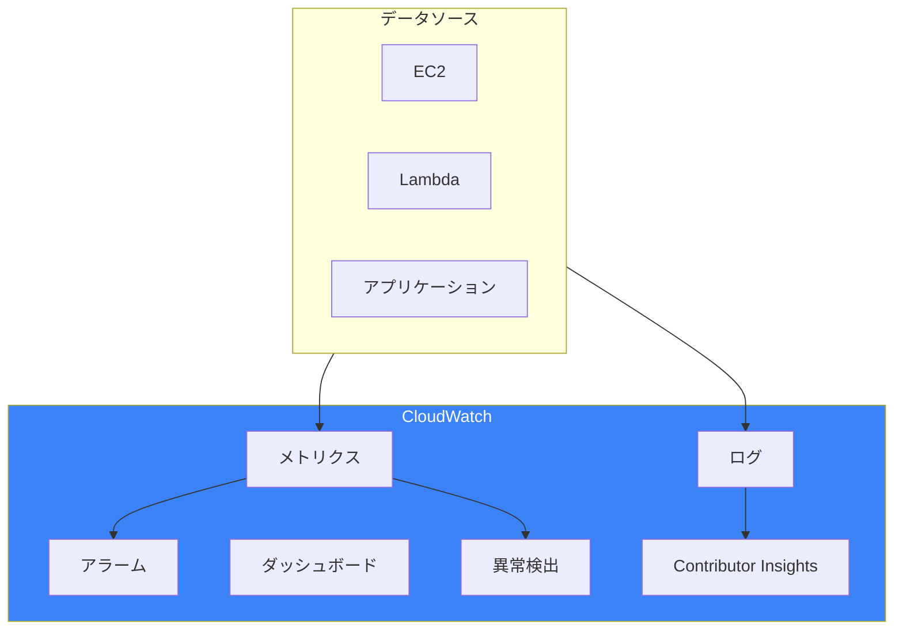
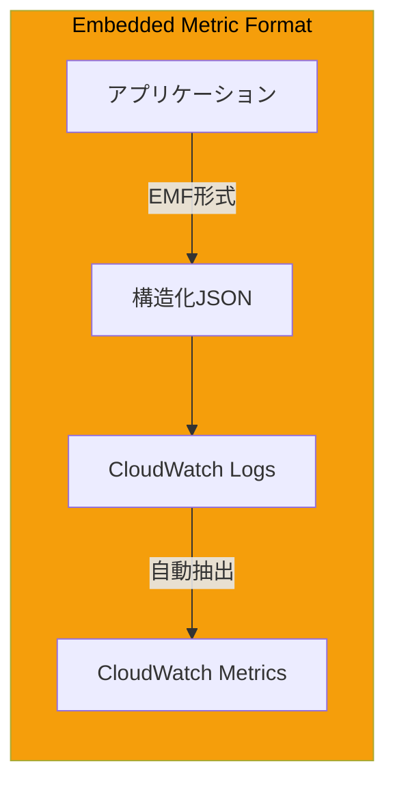
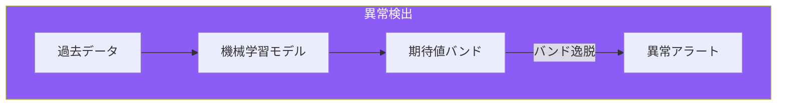
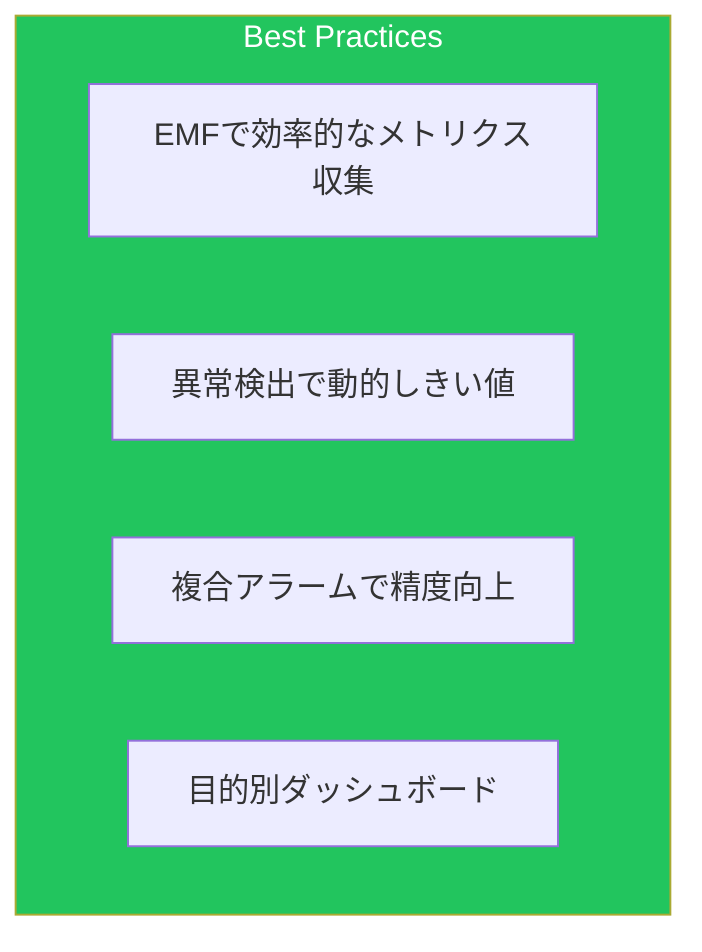

CloudWatchは、AWSリソースとアプリケーションの監視基盤です。本記事では、[運用記事](/blog/aws-operational-excellence)で触れなかった高度な機能を解説します。

## CloudWatchアーキテクチャ



## Embedded Metric Format (EMF)

### 概要



### EMF実装

```python
import json
from datetime import datetime

def create_emf_log(namespace, metrics, dimensions):
    """EMF形式のログを生成"""
    emf_log = {
        "_aws": {
            "Timestamp": int(datetime.now().timestamp() * 1000),
            "CloudWatchMetrics": [
                {
                    "Namespace": namespace,
                    "Dimensions": [list(dimensions.keys())],
                    "Metrics": [
                        {"Name": name, "Unit": unit}
                        for name, (value, unit) in metrics.items()
                    ]
                }
            ]
        },
        **dimensions,
        **{name: value for name, (value, unit) in metrics.items()}
    }

    # CloudWatch Logsに出力（自動的にメトリクス化）
    print(json.dumps(emf_log))

# 使用例
create_emf_log(
    namespace="MyApp/Performance",
    metrics={
        "RequestLatency": (125.5, "Milliseconds"),
        "RequestCount": (1, "Count"),
        "ErrorCount": (0, "Count")
    },
    dimensions={
        "Service": "OrderAPI",
        "Environment": "Production"
    }
)
```

### Lambda Powertools EMF

```python
from aws_lambda_powertools import Metrics
from aws_lambda_powertools.metrics import MetricUnit

metrics = Metrics(namespace="MyApp", service="OrderService")

@metrics.log_metrics(capture_cold_start_metric=True)
def lambda_handler(event, context):
    # ディメンション追加
    metrics.add_dimension(name="Environment", value="Production")

    # メトリクス記録
    metrics.add_metric(name="OrderProcessed", unit=MetricUnit.Count, value=1)
    metrics.add_metric(name="OrderValue", unit=MetricUnit.Count, value=event.get("amount", 0))

    # 高解像度メトリクス
    metrics.add_metric(
        name="ProcessingTime",
        unit=MetricUnit.Milliseconds,
        value=150,
        resolution=1  # 1秒解像度
    )

    return {"statusCode": 200}
```

## カスタムメトリクス

### CloudFormation定義

```yaml
# カスタムメトリクス用CloudWatchエージェント設定
CloudWatchAgentConfig:
  Type: AWS::SSM::Parameter
  Properties:
    Name: /cloudwatch-agent/config
    Type: String
    Value: |
      {
        "metrics": {
          "namespace": "MyApp/EC2",
          "metrics_collected": {
            "cpu": {
              "measurement": ["cpu_usage_idle", "cpu_usage_user", "cpu_usage_system"],
              "totalcpu": true,
              "metrics_collection_interval": 60
            },
            "mem": {
              "measurement": ["mem_used_percent", "mem_available"],
              "metrics_collection_interval": 60
            },
            "disk": {
              "measurement": ["disk_used_percent"],
              "resources": ["/", "/data"],
              "metrics_collection_interval": 60
            },
            "statsd": {
              "service_address": ":8125",
              "metrics_collection_interval": 10,
              "metrics_aggregation_interval": 60
            }
          },
          "append_dimensions": {
            "AutoScalingGroupName": "${aws:AutoScalingGroupName}",
            "InstanceId": "${aws:InstanceId}",
            "InstanceType": "${aws:InstanceType}"
          }
        },
        "logs": {
          "logs_collected": {
            "files": {
              "collect_list": [
                {
                  "file_path": "/var/log/application/*.log",
                  "log_group_name": "/app/logs",
                  "log_stream_name": "{instance_id}",
                  "timestamp_format": "%Y-%m-%d %H:%M:%S"
                }
              ]
            }
          }
        }
      }
```

### メトリクスフィルター

```yaml
# ログからメトリクスを抽出
ErrorMetricFilter:
  Type: AWS::Logs::MetricFilter
  Properties:
    LogGroupName: /app/logs
    FilterPattern: "[timestamp, level=ERROR, ...]"
    MetricTransformations:
      - MetricName: ErrorCount
        MetricNamespace: MyApp/Logs
        MetricValue: "1"
        DefaultValue: 0
        Dimensions:
          - Key: LogGroup
            Value: $logGroup

LatencyMetricFilter:
  Type: AWS::Logs::MetricFilter
  Properties:
    LogGroupName: /app/logs
    FilterPattern: "[timestamp, level, message, latency]"
    MetricTransformations:
      - MetricName: RequestLatency
        MetricNamespace: MyApp/Logs
        MetricValue: "$latency"
        Unit: Milliseconds
```

## CloudWatch Logs Insights

### 基本クエリ

```sql
-- エラーログの検索
fields @timestamp, @message, @logStream
| filter @message like /ERROR/
| sort @timestamp desc
| limit 100

-- レスポンスタイム分析
fields @timestamp, @message
| parse @message /latency=(?<latency>\d+)ms/
| stats avg(latency) as avg_latency,
        max(latency) as max_latency,
        min(latency) as min_latency,
        pct(latency, 95) as p95_latency,
        pct(latency, 99) as p99_latency
  by bin(5m)

-- エラー率計算
fields @timestamp, @message
| stats count(*) as total,
        sum(strcontains(@message, "ERROR")) as errors
  by bin(1h)
| display total, errors, (errors/total)*100 as error_rate
```

### 高度なクエリ

```sql
-- Lambda関数の分析
fields @timestamp, @requestId, @duration, @billedDuration, @memorySize, @maxMemoryUsed
| filter @type = "REPORT"
| stats avg(@duration) as avg_duration,
        max(@duration) as max_duration,
        avg(@maxMemoryUsed/@memorySize*100) as avg_memory_pct
  by bin(1h)

-- API Gatewayアクセス分析
fields @timestamp, httpMethod, path, status, responseLatency
| filter ispresent(status)
| stats count(*) as requests,
        avg(responseLatency) as avg_latency,
        sum(status >= 500) as server_errors,
        sum(status >= 400 and status < 500) as client_errors
  by httpMethod, path

-- VPCフローログ分析
fields @timestamp, srcAddr, dstAddr, srcPort, dstPort, protocol, action
| filter action = "REJECT"
| stats count(*) as rejected_count by srcAddr, dstPort
| sort rejected_count desc
| limit 20

-- コンテナログの相関分析
fields @timestamp, kubernetes.pod_name as pod, @message
| filter kubernetes.namespace_name = "production"
| parse @message /request_id=(?<request_id>\S+)/
| stats count(*) as log_count by request_id, pod
| filter log_count > 1
```

### クエリ結果の可視化

```yaml
# Logs Insightsクエリウィジェット
DashboardWidget:
  Type: AWS::CloudWatch::Dashboard
  Properties:
    DashboardBody: !Sub |
      {
        "widgets": [
          {
            "type": "log",
            "x": 0,
            "y": 0,
            "width": 24,
            "height": 6,
            "properties": {
              "query": "SOURCE '/aws/lambda/my-function' | fields @timestamp, @duration | stats avg(@duration) by bin(5m)",
              "region": "${AWS::Region}",
              "title": "Lambda Duration Trend",
              "view": "timeSeries"
            }
          }
        ]
      }
```

## 異常検出

### 概要



### 異常検出アラーム

```yaml
AnomalyDetectionAlarm:
  Type: AWS::CloudWatch::Alarm
  Properties:
    AlarmName: api-latency-anomaly
    AlarmDescription: API latency anomaly detected
    Metrics:
      - Id: m1
        MetricStat:
          Metric:
            Namespace: AWS/ApiGateway
            MetricName: Latency
            Dimensions:
              - Name: ApiName
                Value: my-api
          Period: 300
          Stat: Average
        ReturnData: false
      - Id: ad1
        Expression: ANOMALY_DETECTION_BAND(m1, 2)
        Label: LatencyAnomaly
        ReturnData: true
    ThresholdMetricId: ad1
    ComparisonOperator: LessThanLowerOrGreaterThanUpperThreshold
    EvaluationPeriods: 3
    DatapointsToAlarm: 2
    TreatMissingData: missing
    ActionsEnabled: true
    AlarmActions:
      - !Ref AlertTopic

# 異常検出器の設定
AnomalyDetector:
  Type: AWS::CloudWatch::AnomalyDetector
  Properties:
    MetricName: RequestCount
    Namespace: MyApp
    Stat: Sum
    Dimensions:
      - Name: Environment
        Value: Production
    Configuration:
      ExcludedTimeRanges:
        - StartTime: "2024-12-24T00:00:00"
          EndTime: "2024-12-26T00:00:00"
      MetricTimezone: Asia/Tokyo
```

### 複合アラーム

```yaml
# 複合アラーム（複数条件の組み合わせ）
CompositeAlarm:
  Type: AWS::CloudWatch::CompositeAlarm
  Properties:
    AlarmName: service-health-composite
    AlarmDescription: Service health composite alarm
    AlarmRule: |
      ALARM(HighLatencyAlarm) AND
      (ALARM(HighErrorRateAlarm) OR ALARM(High5xxErrorAlarm))
    ActionsEnabled: true
    AlarmActions:
      - !Ref PagerDutyTopic
    OKActions:
      - !Ref RecoveryTopic
    InsufficientDataActions:
      - !Ref AlertTopic

HighLatencyAlarm:
  Type: AWS::CloudWatch::Alarm
  Properties:
    AlarmName: high-latency
    MetricName: Latency
    Namespace: AWS/ApiGateway
    Statistic: Average
    Period: 60
    EvaluationPeriods: 3
    Threshold: 1000
    ComparisonOperator: GreaterThanThreshold

HighErrorRateAlarm:
  Type: AWS::CloudWatch::Alarm
  Properties:
    AlarmName: high-error-rate
    Metrics:
      - Id: errors
        MetricStat:
          Metric:
            Namespace: MyApp
            MetricName: ErrorCount
          Period: 60
          Stat: Sum
      - Id: total
        MetricStat:
          Metric:
            Namespace: MyApp
            MetricName: RequestCount
          Period: 60
          Stat: Sum
      - Id: error_rate
        Expression: (errors/total)*100
        Label: ErrorRate
    Threshold: 5
    ComparisonOperator: GreaterThanThreshold
    EvaluationPeriods: 3
```

## Contributor Insights

### ルール定義

```yaml
ContributorInsightsRule:
  Type: AWS::CloudWatch::InsightRule
  Properties:
    RuleName: top-api-consumers
    RuleState: ENABLED
    RuleBody: !Sub |
      {
        "Schema": {
          "Name": "CloudWatchLogRule",
          "Version": 1
        },
        "LogGroupNames": [
          "/aws/apigateway/my-api"
        ],
        "LogFormat": "JSON",
        "Contribution": {
          "Keys": ["$.sourceIp"],
          "ValueOf": "$.requestId",
          "Filters": [
            {
              "Match": "$.status",
              "GreaterThan": 499
            }
          ]
        },
        "AggregateOn": "Count"
      }

# DynamoDBスロットリング分析
DynamoDBThrottleRule:
  Type: AWS::CloudWatch::InsightRule
  Properties:
    RuleName: dynamodb-throttled-keys
    RuleState: ENABLED
    RuleBody: |
      {
        "Schema": {
          "Name": "CloudWatchLogRule",
          "Version": 1
        },
        "AWSAccountId": "*",
        "LogGroupNames": [
          "DynamoDBThrottledRequests"
        ],
        "Contribution": {
          "Keys": ["$.tableName", "$.partitionKey"],
          "Filters": []
        },
        "AggregateOn": "Count"
      }
```

## ダッシュボード設計

### 本番環境ダッシュボード

```yaml
OperationalDashboard:
  Type: AWS::CloudWatch::Dashboard
  Properties:
    DashboardName: production-overview
    DashboardBody: !Sub |
      {
        "widgets": [
          {
            "type": "metric",
            "x": 0, "y": 0,
            "width": 8, "height": 6,
            "properties": {
              "title": "API Latency",
              "metrics": [
                ["AWS/ApiGateway", "Latency", "ApiName", "my-api", {"stat": "p50", "label": "p50"}],
                ["...", {"stat": "p90", "label": "p90"}],
                ["...", {"stat": "p99", "label": "p99"}]
              ],
              "period": 60,
              "region": "${AWS::Region}",
              "view": "timeSeries",
              "annotations": {
                "horizontal": [
                  {"value": 500, "label": "SLO", "color": "#ff7f0e"}
                ]
              }
            }
          },
          {
            "type": "metric",
            "x": 8, "y": 0,
            "width": 8, "height": 6,
            "properties": {
              "title": "Error Rate",
              "metrics": [
                [{"expression": "m2/m1*100", "label": "Error Rate %", "id": "e1"}],
                ["MyApp", "ErrorCount", {"id": "m2", "visible": false}],
                ["MyApp", "RequestCount", {"id": "m1", "visible": false}]
              ],
              "period": 60,
              "yAxis": {"left": {"min": 0, "max": 10}}
            }
          },
          {
            "type": "metric",
            "x": 16, "y": 0,
            "width": 8, "height": 6,
            "properties": {
              "title": "Request Count with Anomaly Band",
              "metrics": [
                ["MyApp", "RequestCount", {"id": "m1"}],
                [{"expression": "ANOMALY_DETECTION_BAND(m1)", "label": "Expected", "id": "ad1"}]
              ],
              "period": 300
            }
          },
          {
            "type": "alarm",
            "x": 0, "y": 6,
            "width": 24, "height": 3,
            "properties": {
              "title": "Alarm Status",
              "alarms": [
                "arn:aws:cloudwatch:${AWS::Region}:${AWS::AccountId}:alarm:high-latency",
                "arn:aws:cloudwatch:${AWS::Region}:${AWS::AccountId}:alarm:high-error-rate",
                "arn:aws:cloudwatch:${AWS::Region}:${AWS::AccountId}:alarm:api-latency-anomaly"
              ]
            }
          }
        ]
      }
```

## メトリクスストリーム

### Kinesis Data Firehose連携

```yaml
MetricStream:
  Type: AWS::CloudWatch::MetricStream
  Properties:
    Name: metrics-to-s3
    FirehoseArn: !GetAtt DeliveryStream.Arn
    RoleArn: !GetAtt MetricStreamRole.Arn
    OutputFormat: opentelemetry0.7
    IncludeFilters:
      - Namespace: AWS/EC2
      - Namespace: AWS/Lambda
      - Namespace: MyApp
    StatisticsConfigurations:
      - IncludeMetrics:
          - Namespace: AWS/ApiGateway
            MetricName: Latency
        AdditionalStatistics:
          - p90
          - p95
          - p99

DeliveryStream:
  Type: AWS::KinesisFirehose::DeliveryStream
  Properties:
    DeliveryStreamType: DirectPut
    S3DestinationConfiguration:
      BucketARN: !GetAtt MetricsBucket.Arn
      RoleARN: !GetAtt FirehoseRole.Arn
      Prefix: metrics/
      BufferingHints:
        IntervalInSeconds: 60
        SizeInMBs: 5
```

## ベストプラクティス



| カテゴリ | 項目 |
|---------|------|
| メトリクス | EMFでログとメトリクスを統合 |
| アラーム | 異常検出で季節変動に対応 |
| 分析 | Logs Insightsで深掘り分析 |
| 可視化 | 役割別ダッシュボード設計 |

## まとめ

| 機能 | 用途 |
|------|------|
| EMF | 構造化ログからメトリクス自動生成 |
| 異常検出 | ML基づく動的しきい値 |
| Contributor Insights | トップN分析 |
| Logs Insights | インタラクティブなログ分析 |

CloudWatchの高度な機能を活用することで、効果的な監視とトラブルシューティングを実現できます。

## 参考資料

- [CloudWatch User Guide](https://docs.aws.amazon.com/AmazonCloudWatch/latest/monitoring/)
- [Embedded Metric Format](https://docs.aws.amazon.com/AmazonCloudWatch/latest/monitoring/CloudWatch_Embedded_Metric_Format.html)
- [CloudWatch Logs Insights Query Syntax](https://docs.aws.amazon.com/AmazonCloudWatch/latest/logs/CWL_QuerySyntax.html)
