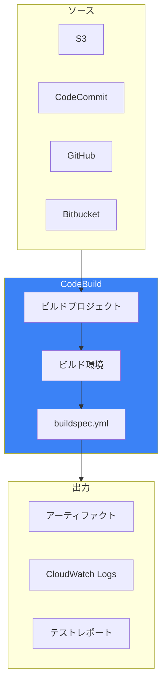
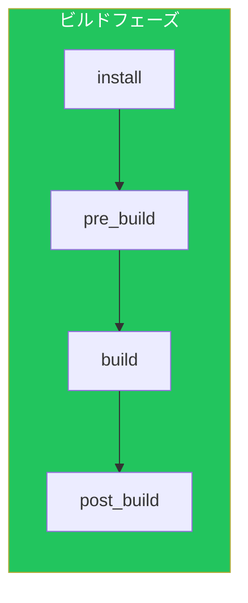
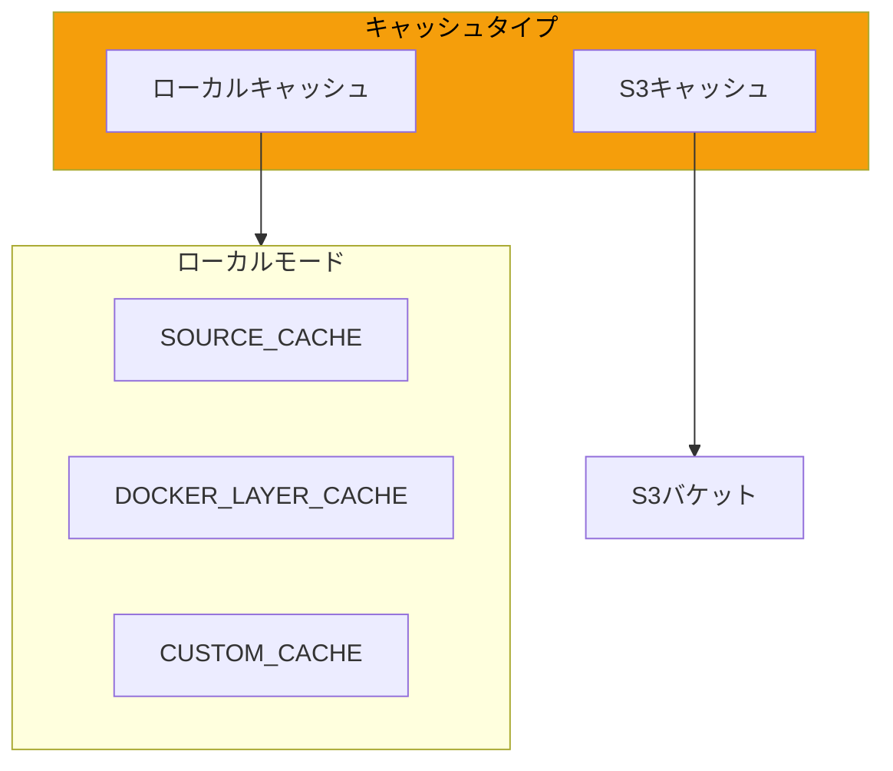
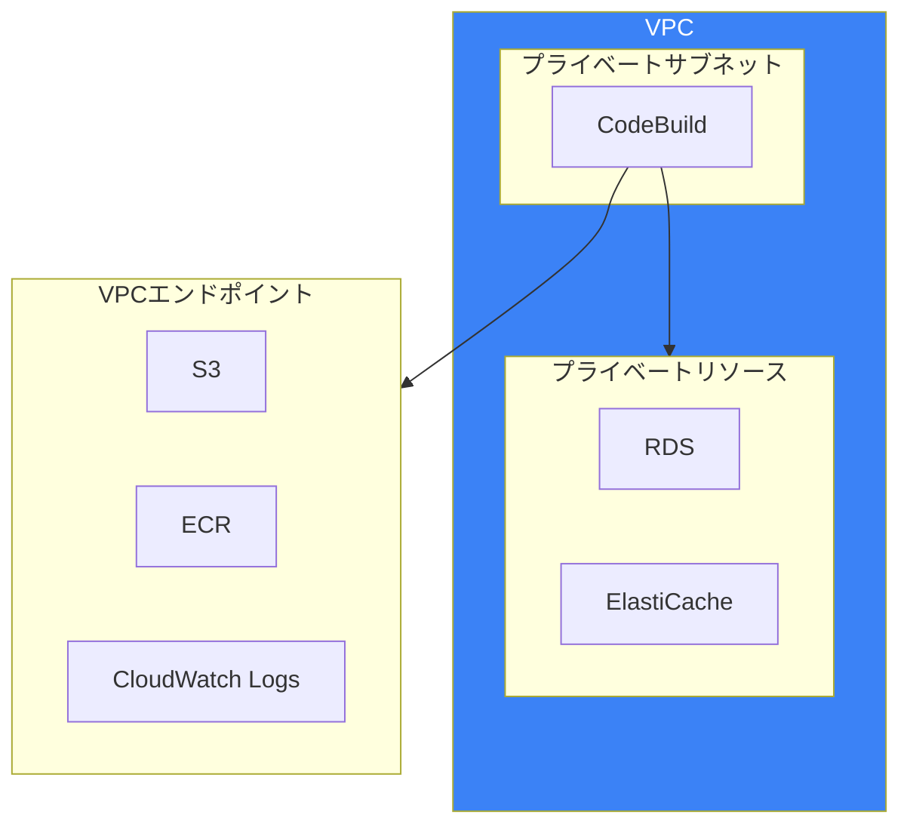
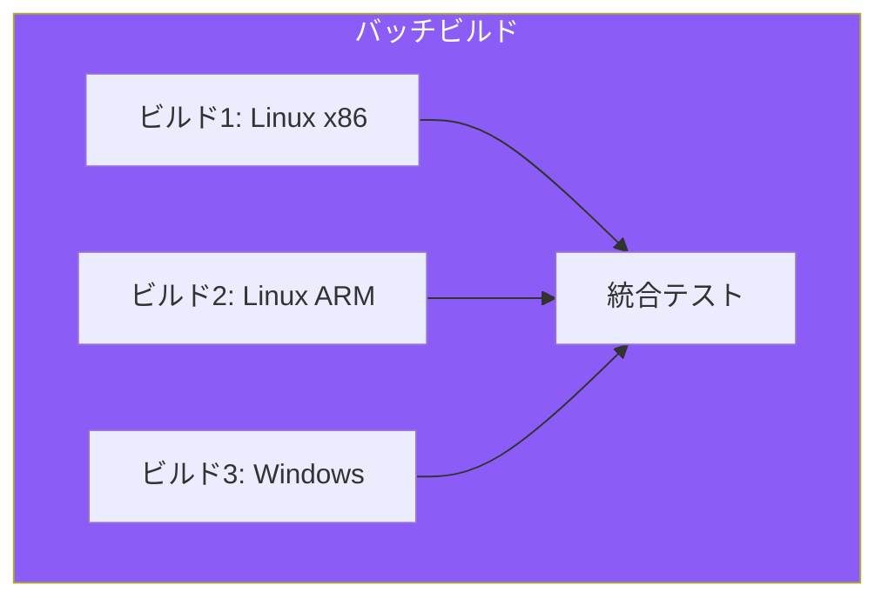
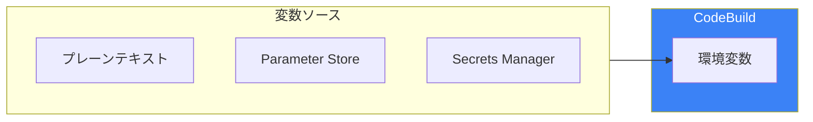
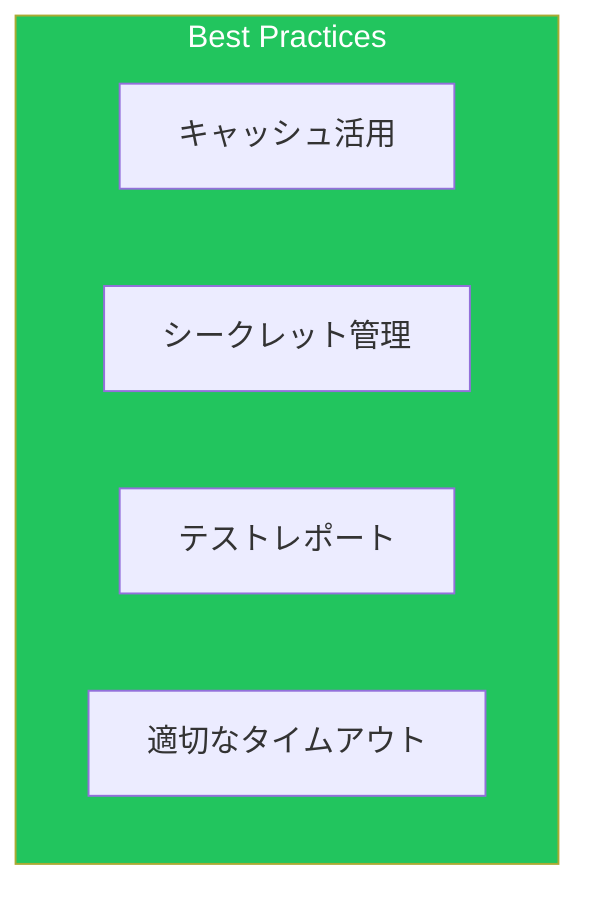
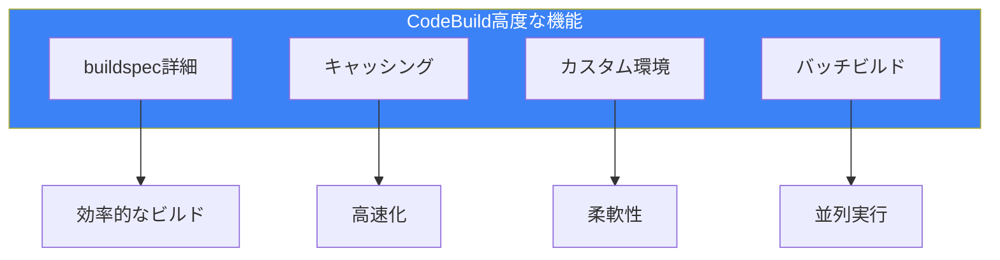

CodeBuildは、AWSのフルマネージドビルドサービスです。本記事では、効率的なビルドパイプラインを構築するための高度な設定とベストプラクティスを解説します。

## CodeBuildアーキテクチャ

### 基本構成



### ビルド環境タイプ

| 環境 | 用途 | vCPU | メモリ |
|------|------|------|--------|
| arm1.small | ARM軽量ビルド | 2 | 3GB |
| arm1.large | ARM大規模ビルド | 8 | 16GB |
| general1.small | 標準ビルド | 2 | 3GB |
| general1.medium | 中規模ビルド | 4 | 7GB |
| general1.large | 大規模ビルド | 8 | 15GB |
| general1.2xlarge | 高負荷ビルド | 72 | 145GB |

## buildspec.yml詳細

### 完全な構造

```yaml
version: 0.2

run-as: root  # ビルドを実行するユーザー

env:
  shell: bash  # シェルの指定
  variables:
    JAVA_HOME: "/usr/lib/jvm/java-17-amazon-corretto"
    MAVEN_OPTS: "-Xmx1024m"
  parameter-store:
    DB_PASSWORD: "/myapp/db/password"
  secrets-manager:
    API_KEY: "prod/api-key:api_key"
  exported-variables:
    - IMAGE_TAG
    - BUILD_ID

proxy:
  upload-artifacts: yes
  logs: yes

batch:
  fast-fail: false
  build-graph:
    - identifier: build_linux
      env:
        image: aws/codebuild/amazonlinux2-x86_64-standard:5.0
    - identifier: build_windows
      env:
        image: aws/codebuild/windows-base:2019-3.0
      depend-on:
        - build_linux

phases:
  install:
    runtime-versions:
      java: corretto17
      nodejs: 18
    commands:
      - echo "Installing dependencies..."
      - npm ci
    finally:
      - echo "Install phase complete"

  pre_build:
    commands:
      - echo "Running pre-build..."
      - aws ecr get-login-password --region $AWS_REGION | docker login --username AWS --password-stdin $ECR_REGISTRY
      - COMMIT_HASH=$(echo $CODEBUILD_RESOLVED_SOURCE_VERSION | cut -c 1-7)
      - IMAGE_TAG=${COMMIT_HASH:=latest}
    on-failure: ABORT

  build:
    commands:
      - echo "Building application..."
      - mvn clean package -DskipTests
      - docker build -t $ECR_REGISTRY/$ECR_REPO:$IMAGE_TAG .
    on-failure: CONTINUE

  post_build:
    commands:
      - echo "Running post-build..."
      - docker push $ECR_REGISTRY/$ECR_REPO:$IMAGE_TAG
      - |
        cat <<EOF > imagedefinitions.json
        [
          {
            "name": "app",
            "imageUri": "$ECR_REGISTRY/$ECR_REPO:$IMAGE_TAG"
          }
        ]
        EOF
    finally:
      - echo "Build complete"

reports:
  junit-reports:
    files:
      - "target/surefire-reports/*.xml"
    file-format: JUNITXML
    base-directory: .

  coverage-reports:
    files:
      - "target/site/jacoco/jacoco.xml"
    file-format: JACOCOXML

artifacts:
  files:
    - imagedefinitions.json
    - target/*.jar
  name: build-output-$(date +%Y-%m-%d)
  discard-paths: yes
  secondary-artifacts:
    docker-image:
      files:
        - imagedefinitions.json
      name: docker-artifacts
    test-reports:
      files:
        - "**/*.xml"
      base-directory: target/surefire-reports

cache:
  paths:
    - '/root/.m2/**/*'
    - '/root/.npm/**/*'
    - 'node_modules/**/*'
```

### フェーズの詳細



| フェーズ | 用途 | 例 |
|---------|------|-----|
| install | ランタイム・依存関係インストール | npm ci, pip install |
| pre_build | ビルド前の準備 | 認証、環境変数設定 |
| build | メインビルド処理 | コンパイル、Dockerビルド |
| post_build | ビルド後の処理 | プッシュ、通知 |

## キャッシング戦略

### キャッシュタイプ



### ローカルキャッシュ設定

```yaml
# CloudFormation
CodeBuildProject:
  Type: AWS::CodeBuild::Project
  Properties:
    Cache:
      Type: LOCAL
      Modes:
        - LOCAL_SOURCE_CACHE      # ソースキャッシュ
        - LOCAL_DOCKER_LAYER_CACHE # Dockerレイヤーキャッシュ
        - LOCAL_CUSTOM_CACHE      # カスタムキャッシュ（buildspec定義）
```

### S3キャッシュ設定

```yaml
CodeBuildProject:
  Type: AWS::CodeBuild::Project
  Properties:
    Cache:
      Type: S3
      Location: !Sub "${CacheBucket}/cache"
```

### 効果的なキャッシュ戦略

```yaml
# buildspec.yml
cache:
  paths:
    # Maven
    - '/root/.m2/**/*'
    # Gradle
    - '/root/.gradle/caches/**/*'
    - '/root/.gradle/wrapper/**/*'
    # npm
    - 'node_modules/**/*'
    # pip
    - '/root/.cache/pip/**/*'
    # Go
    - '/go/pkg/mod/**/*'
```

## カスタムビルド環境

### カスタムDockerイメージ

```dockerfile
FROM public.ecr.aws/amazonlinux/amazonlinux:2023

# 必要なツールのインストール
RUN dnf install -y \
    java-17-amazon-corretto \
    docker \
    git \
    unzip \
    && dnf clean all

# AWS CLI v2
RUN curl "https://awscli.amazonaws.com/awscli-exe-linux-x86_64.zip" -o "awscliv2.zip" \
    && unzip awscliv2.zip \
    && ./aws/install \
    && rm -rf aws awscliv2.zip

# Maven
ARG MAVEN_VERSION=3.9.6
RUN curl -fsSL https://archive.apache.org/dist/maven/maven-3/${MAVEN_VERSION}/binaries/apache-maven-${MAVEN_VERSION}-bin.tar.gz | tar xzf - -C /opt \
    && ln -s /opt/apache-maven-${MAVEN_VERSION} /opt/maven

ENV JAVA_HOME=/usr/lib/jvm/java-17-amazon-corretto
ENV MAVEN_HOME=/opt/maven
ENV PATH=$MAVEN_HOME/bin:$PATH

# カスタムツール
COPY scripts/ /opt/scripts/
RUN chmod +x /opt/scripts/*

WORKDIR /codebuild/output/src
```

### ECRへのプッシュとCodeBuild設定

```bash
# カスタムイメージのビルドとプッシュ
aws ecr get-login-password --region ap-northeast-1 | \
  docker login --username AWS --password-stdin 123456789012.dkr.ecr.ap-northeast-1.amazonaws.com

docker build -t custom-build-env .
docker tag custom-build-env:latest 123456789012.dkr.ecr.ap-northeast-1.amazonaws.com/codebuild-custom:latest
docker push 123456789012.dkr.ecr.ap-northeast-1.amazonaws.com/codebuild-custom:latest
```

```yaml
# CloudFormation
CodeBuildProject:
  Type: AWS::CodeBuild::Project
  Properties:
    Environment:
      Type: LINUX_CONTAINER
      ComputeType: BUILD_GENERAL1_MEDIUM
      Image: !Sub "${AWS::AccountId}.dkr.ecr.${AWS::Region}.amazonaws.com/codebuild-custom:latest"
      ImagePullCredentialsType: SERVICE_ROLE
      PrivilegedMode: true  # Docker in Docker用
```

## VPC統合

### VPC内ビルド



### VPC設定

```yaml
CodeBuildProject:
  Type: AWS::CodeBuild::Project
  Properties:
    VpcConfig:
      VpcId: !Ref VPC
      Subnets:
        - !Ref PrivateSubnet1
        - !Ref PrivateSubnet2
      SecurityGroupIds:
        - !Ref CodeBuildSecurityGroup

CodeBuildSecurityGroup:
  Type: AWS::EC2::SecurityGroup
  Properties:
    GroupDescription: Security group for CodeBuild
    VpcId: !Ref VPC
    SecurityGroupEgress:
      - IpProtocol: tcp
        FromPort: 443
        ToPort: 443
        CidrIp: 0.0.0.0/0
      - IpProtocol: tcp
        FromPort: 5432
        ToPort: 5432
        DestinationSecurityGroupId: !Ref RDSSecurityGroup
```

## バッチビルド

### ビルドグラフ



### buildspec.yml（バッチ）

```yaml
version: 0.2

batch:
  fast-fail: false
  build-graph:
    - identifier: build_linux_x86
      env:
        type: LINUX_CONTAINER
        image: aws/codebuild/amazonlinux2-x86_64-standard:5.0
        compute-type: BUILD_GENERAL1_MEDIUM

    - identifier: build_linux_arm
      env:
        type: ARM_CONTAINER
        image: aws/codebuild/amazonlinux2-aarch64-standard:3.0
        compute-type: BUILD_GENERAL1_LARGE

    - identifier: build_windows
      env:
        type: WINDOWS_SERVER_2019_CONTAINER
        image: aws/codebuild/windows-base:2019-3.0
        compute-type: BUILD_GENERAL1_MEDIUM

    - identifier: integration_test
      depend-on:
        - build_linux_x86
        - build_linux_arm
        - build_windows
      env:
        type: LINUX_CONTAINER
        image: aws/codebuild/amazonlinux2-x86_64-standard:5.0

phases:
  build:
    commands:
      - echo "Building for $CODEBUILD_BATCH_BUILD_IDENTIFIER"
      - ./build.sh
```

### バッチビルドマトリックス

```yaml
batch:
  fast-fail: false
  build-matrix:
    static:
      ignore-failure: false
    dynamic:
      env:
        image:
          - aws/codebuild/amazonlinux2-x86_64-standard:5.0
          - aws/codebuild/amazonlinux2-aarch64-standard:3.0
        variables:
          NODE_VERSION:
            - "16"
            - "18"
            - "20"
```

## テストレポート

### レポート設定

```yaml
reports:
  # JUnitレポート
  UnitTests:
    files:
      - "**/*.xml"
    base-directory: test-results/junit
    file-format: JUNITXML

  # Cucumberレポート
  BDDTests:
    files:
      - "**/*.json"
    base-directory: test-results/cucumber
    file-format: CUCUMBERJSON

  # コードカバレッジ
  Coverage:
    files:
      - "jacoco.xml"
    base-directory: target/site/jacoco
    file-format: JACOCOXML

  # Clover形式
  CloverCoverage:
    files:
      - "clover.xml"
    file-format: CLOVERXML
```

### レポートグループ

```yaml
ReportGroup:
  Type: AWS::CodeBuild::ReportGroup
  Properties:
    Name: TestReports
    Type: TEST
    ExportConfig:
      ExportConfigType: S3
      S3Destination:
        Bucket: !Ref ReportBucket
        Path: reports
        Packaging: ZIP
        EncryptionKey: !GetAtt KMSKey.Arn
```

## 環境変数とシークレット

### 環境変数のソース



### buildspec.ymlでの指定

```yaml
env:
  variables:
    # プレーンテキスト
    APP_ENV: production
    LOG_LEVEL: info

  parameter-store:
    # SSM Parameter Store
    DB_HOST: /myapp/prod/db-host
    DB_NAME: /myapp/prod/db-name

  secrets-manager:
    # Secrets Manager
    DB_PASSWORD: prod/myapp/db:password
    API_KEY: prod/myapp/api:key::AWSCURRENT

  exported-variables:
    # 後続ステージへエクスポート
    - IMAGE_TAG
    - BUILD_NUMBER
```

### プロジェクト設定での指定

```yaml
CodeBuildProject:
  Type: AWS::CodeBuild::Project
  Properties:
    Environment:
      EnvironmentVariables:
        - Name: PLAIN_VAR
          Type: PLAINTEXT
          Value: some-value

        - Name: SSM_VAR
          Type: PARAMETER_STORE
          Value: /path/to/parameter

        - Name: SECRET_VAR
          Type: SECRETS_MANAGER
          Value: secret-name:json-key:version-stage:version-id
```

## トラブルシューティング

### よくある問題

| 問題 | 原因 | 解決策 |
|------|------|--------|
| ビルドタイムアウト | 時間超過 | タイムアウト値の増加 |
| メモリ不足 | コンピュートタイプ不足 | より大きなインスタンス |
| Docker失敗 | privileged mode | PrivilegedMode: true |
| VPCアクセス失敗 | エンドポイント不足 | VPCエンドポイント追加 |

### デバッグ

```yaml
phases:
  build:
    commands:
      # 環境情報の出力
      - echo "Build ID: $CODEBUILD_BUILD_ID"
      - echo "Source Version: $CODEBUILD_RESOLVED_SOURCE_VERSION"
      - printenv | sort

      # ディスク使用量
      - df -h

      # メモリ使用量
      - free -m
```

## ベストプラクティス

### チェックリスト



| カテゴリ | 項目 |
|---------|------|
| パフォーマンス | 適切なキャッシュ設定 |
| パフォーマンス | 並列ビルドの活用 |
| セキュリティ | シークレットの外部化 |
| セキュリティ | 最小権限のIAMロール |
| 運用 | テストレポートの活用 |
| 運用 | ビルドログの保持設定 |

## まとめ



| 機能 | 効果 |
|------|------|
| 詳細なbuildspec | 柔軟なビルド制御 |
| キャッシング | ビルド時間短縮 |
| カスタム環境 | 特殊要件対応 |
| バッチビルド | マルチプラットフォーム |

CodeBuildの高度な機能を活用することで、効率的で柔軟なビルドパイプラインを構築できます。

## 参考資料

- [AWS CodeBuild User Guide](https://docs.aws.amazon.com/codebuild/latest/userguide/)
- [Build Specification Reference](https://docs.aws.amazon.com/codebuild/latest/userguide/build-spec-ref.html)
- [CodeBuild Docker Images](https://github.com/aws/aws-codebuild-docker-images)
