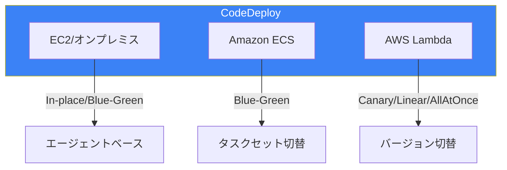
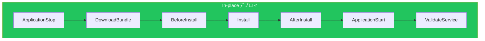
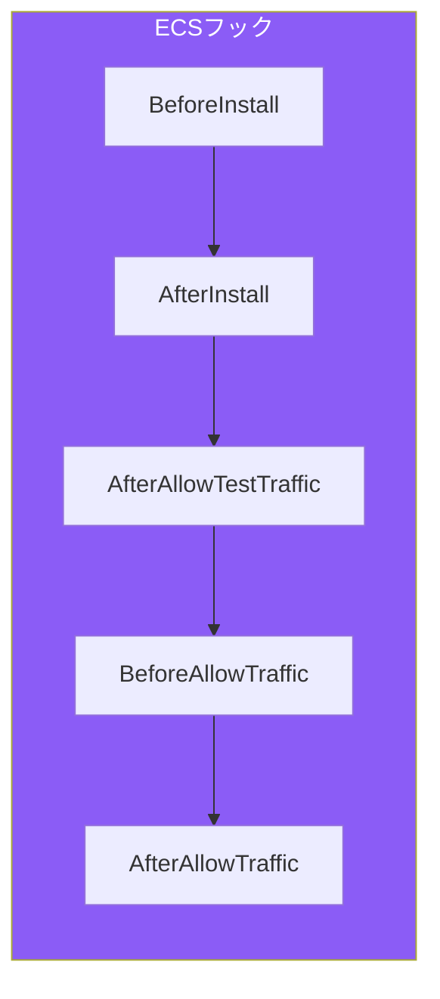
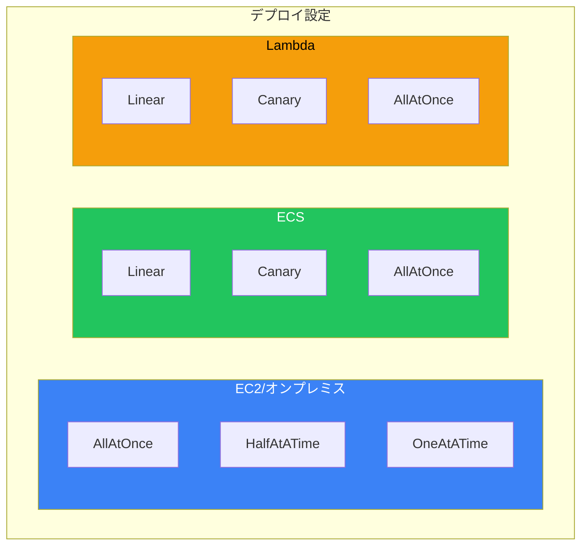
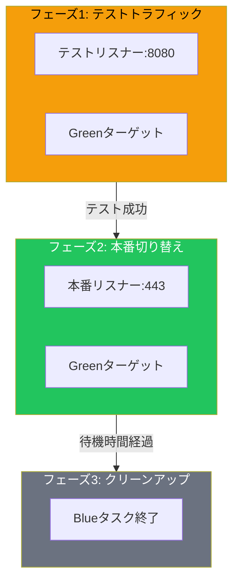
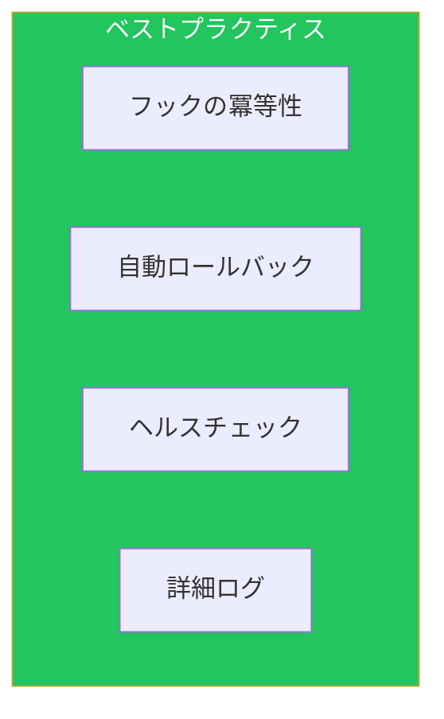

CodeDeployは、EC2、ECS、Lambdaへの自動デプロイを実現するサービスです。本記事では、appspec.ymlの詳細設定やライフサイクルフックなど、実践的な高度機能を解説します。デプロイ戦略の概要については[AWSデプロイ戦略](/blog/aws-deployment-strategies)を参照してください。

## デプロイタイプ別アーキテクチャ

### コンピュートプラットフォーム



| プラットフォーム | デプロイタイプ | 特徴 |
|----------------|--------------|------|
| EC2/オンプレミス | In-place, Blue-Green | エージェント必須 |
| ECS | Blue-Green | タスクセットベース |
| Lambda | Canary, Linear, AllAtOnce | バージョン/エイリアス |

## appspec.yml詳細

### EC2/オンプレミス用

```yaml
version: 0.0
os: linux

files:
  - source: /
    destination: /var/www/html
    overwrite: true
  - source: /config/
    destination: /etc/myapp/
    overwrite: true

permissions:
  - object: /var/www/html
    pattern: "**"
    owner: www-data
    group: www-data
    mode: 755
    type:
      - file
      - directory

file_exists_behavior: OVERWRITE  # DISALLOW, OVERWRITE, RETAIN

hooks:
  ApplicationStop:
    - location: scripts/stop_server.sh
      timeout: 300
      runas: root

  BeforeInstall:
    - location: scripts/before_install.sh
      timeout: 300
      runas: root

  AfterInstall:
    - location: scripts/after_install.sh
      timeout: 300
      runas: root
    - location: scripts/set_permissions.sh
      timeout: 60
      runas: root

  ApplicationStart:
    - location: scripts/start_server.sh
      timeout: 300
      runas: root

  ValidateService:
    - location: scripts/validate_service.sh
      timeout: 300
      runas: root
```

### ECS用

```yaml
version: 0.0

Resources:
  - TargetService:
      Type: AWS::ECS::Service
      Properties:
        TaskDefinition: "arn:aws:ecs:ap-northeast-1:123456789012:task-definition/my-task:1"
        LoadBalancerInfo:
          ContainerName: "app"
          ContainerPort: 8080
        PlatformVersion: "LATEST"
        NetworkConfiguration:
          AwsvpcConfiguration:
            Subnets:
              - "subnet-1234abcd"
              - "subnet-5678efgh"
            SecurityGroups:
              - "sg-12345678"
            AssignPublicIp: "DISABLED"
        CapacityProviderStrategy:
          - Base: 1
            CapacityProvider: "FARGATE"
            Weight: 1

Hooks:
  - BeforeInstall: "LambdaFunctionToValidateBeforeInstall"
  - AfterInstall: "LambdaFunctionToValidateAfterInstall"
  - AfterAllowTestTraffic: "LambdaFunctionToRunIntegrationTests"
  - BeforeAllowTraffic: "LambdaFunctionToValidateBeforeTraffic"
  - AfterAllowTraffic: "LambdaFunctionToRunSmokeTests"
```

### Lambda用

```yaml
version: 0.0

Resources:
  - MyFunction:
      Type: AWS::Lambda::Function
      Properties:
        Name: "my-function"
        Alias: "live"
        CurrentVersion: "1"
        TargetVersion: "2"

Hooks:
  - BeforeAllowTraffic: "CodeDeployHook_PreTrafficHook"
  - AfterAllowTraffic: "CodeDeployHook_PostTrafficHook"
```

## ライフサイクルフック

### EC2ライフサイクル



### Blue-Greenライフサイクル（EC2）

```mermaid
flowchart TB
    subgraph BlueGreen["Blue-Greenデプロイ"]
        BeforeBlockTraffic["BeforeBlockTraffic"]
        BlockTraffic["BlockTraffic"]
        AfterBlockTraffic["AfterBlockTraffic"]

        AppStop["ApplicationStop"]
        DlBundle["DownloadBundle"]
        BeforeInstall["BeforeInstall"]
        Install["Install"]
        AfterInstall["AfterInstall"]
        AppStart["ApplicationStart"]
        Validate["ValidateService"]

        BeforeAllowTraffic["BeforeAllowTraffic"]
        AllowTraffic["AllowTraffic"]
        AfterAllowTraffic["AfterAllowTraffic"]
    end

    BeforeBlockTraffic --> BlockTraffic
    BlockTraffic --> AfterBlockTraffic
    AfterBlockTraffic --> AppStop
    AppStop --> DlBundle
    DlBundle --> BeforeInstall
    BeforeInstall --> Install
    Install --> AfterInstall
    AfterInstall --> AppStart
    AppStart --> Validate
    Validate --> BeforeAllowTraffic
    BeforeAllowTraffic --> AllowTraffic
    AllowTraffic --> AfterAllowTraffic

    style BlueGreen fill:#3b82f6,color:#fff
```



### ECSライフサイクル



## フックスクリプト例

### ApplicationStop

```bash
#!/bin/bash
set -e

# サービスの停止
systemctl stop myapp || true

# プロセスの確認
if pgrep -f "myapp" > /dev/null; then
    pkill -f "myapp" || true
    sleep 5
fi

# ポートの解放確認
while netstat -tlnp | grep ":8080" > /dev/null; do
    echo "Waiting for port 8080 to be released..."
    sleep 2
done

echo "Application stopped successfully"
exit 0
```

### BeforeInstall

```bash
#!/bin/bash
set -e

# 古いファイルのバックアップ
if [ -d /var/www/html ]; then
    BACKUP_DIR="/var/www/backup/$(date +%Y%m%d_%H%M%S)"
    mkdir -p $BACKUP_DIR
    cp -r /var/www/html/* $BACKUP_DIR/ || true
fi

# ディレクトリの準備
mkdir -p /var/www/html
mkdir -p /var/log/myapp

# 依存関係のインストール
yum install -y httpd php php-mysql

echo "Pre-installation setup complete"
exit 0
```

### AfterInstall

```bash
#!/bin/bash
set -e

cd /var/www/html

# 設定ファイルの配置
if [ -f /etc/myapp/config.env ]; then
    cp /etc/myapp/config.env .env
fi

# 依存関係のインストール
if [ -f composer.json ]; then
    composer install --no-dev --optimize-autoloader
fi

# キャッシュのクリア
php artisan cache:clear || true
php artisan config:cache || true

# 権限設定
chown -R www-data:www-data /var/www/html
chmod -R 755 /var/www/html

echo "Post-installation setup complete"
exit 0
```

### ValidateService

```bash
#!/bin/bash
set -e

MAX_RETRIES=30
RETRY_INTERVAL=2
HEALTH_URL="http://localhost:8080/health"

for i in $(seq 1 $MAX_RETRIES); do
    HTTP_CODE=$(curl -s -o /dev/null -w "%{http_code}" $HEALTH_URL || echo "000")

    if [ "$HTTP_CODE" = "200" ]; then
        echo "Health check passed"
        exit 0
    fi

    echo "Health check attempt $i failed (HTTP $HTTP_CODE), retrying..."
    sleep $RETRY_INTERVAL
done

echo "Health check failed after $MAX_RETRIES attempts"
exit 1
```

## ECSフック（Lambda）

### AfterAllowTestTraffic

```python
import json
import boto3
import urllib3

codedeploy = boto3.client('codedeploy')

def lambda_handler(event, context):
    deployment_id = event['DeploymentId']
    lifecycle_event_hook_execution_id = event['LifecycleEventHookExecutionId']

    try:
        # テストトラフィックへの統合テスト
        http = urllib3.PoolManager()
        test_endpoint = "http://test-alb.example.com/api/health"

        response = http.request('GET', test_endpoint, timeout=10)

        if response.status == 200:
            # 追加のテスト実行
            run_integration_tests(test_endpoint)

            codedeploy.put_lifecycle_event_hook_execution_status(
                deploymentId=deployment_id,
                lifecycleEventHookExecutionId=lifecycle_event_hook_execution_id,
                status='Succeeded'
            )
        else:
            raise Exception(f"Health check failed: {response.status}")

    except Exception as e:
        print(f"Test failed: {str(e)}")
        codedeploy.put_lifecycle_event_hook_execution_status(
            deploymentId=deployment_id,
            lifecycleEventHookExecutionId=lifecycle_event_hook_execution_id,
            status='Failed'
        )

def run_integration_tests(endpoint):
    # 統合テストのロジック
    http = urllib3.PoolManager()

    tests = [
        {'path': '/api/users', 'method': 'GET', 'expected': 200},
        {'path': '/api/products', 'method': 'GET', 'expected': 200},
    ]

    for test in tests:
        response = http.request(test['method'], f"{endpoint}{test['path']}")
        if response.status != test['expected']:
            raise Exception(f"Test failed for {test['path']}")
```

## デプロイグループ設定

### EC2デプロイグループ

```yaml
DeploymentGroup:
  Type: AWS::CodeDeploy::DeploymentGroup
  Properties:
    ApplicationName: !Ref Application
    DeploymentGroupName: production
    ServiceRoleArn: !GetAtt CodeDeployRole.Arn

    # デプロイ設定
    DeploymentConfigName: CodeDeployDefault.OneAtATime

    # ターゲット指定
    Ec2TagFilters:
      - Key: Environment
        Value: production
        Type: KEY_AND_VALUE
      - Key: Application
        Value: myapp
        Type: KEY_AND_VALUE

    # Auto Scaling統合
    AutoScalingGroups:
      - !Ref AutoScalingGroup

    # ロードバランサー
    LoadBalancerInfo:
      TargetGroupInfoList:
        - Name: !GetAtt TargetGroup.TargetGroupName

    # デプロイスタイル
    DeploymentStyle:
      DeploymentOption: WITH_TRAFFIC_CONTROL
      DeploymentType: BLUE_GREEN

    # Blue-Green設定
    BlueGreenDeploymentConfiguration:
      DeploymentReadyOption:
        ActionOnTimeout: CONTINUE_DEPLOYMENT
        WaitTimeInMinutes: 5
      GreenFleetProvisioningOption:
        Action: COPY_AUTO_SCALING_GROUP
      TerminateBlueInstancesOnDeploymentSuccess:
        Action: TERMINATE
        TerminationWaitTimeInMinutes: 60

    # 自動ロールバック
    AutoRollbackConfiguration:
      Enabled: true
      Events:
        - DEPLOYMENT_FAILURE
        - DEPLOYMENT_STOP_ON_ALARM
        - DEPLOYMENT_STOP_ON_REQUEST

    # アラームベースのロールバック
    AlarmConfiguration:
      Enabled: true
      Alarms:
        - Name: !Ref HighErrorRateAlarm
        - Name: !Ref HighLatencyAlarm
```

### ECSデプロイグループ

```yaml
ECSDeploymentGroup:
  Type: AWS::CodeDeploy::DeploymentGroup
  Properties:
    ApplicationName: !Ref ECSApplication
    DeploymentGroupName: ecs-production
    ServiceRoleArn: !GetAtt CodeDeployRole.Arn
    DeploymentConfigName: CodeDeployDefault.ECSLinear10PercentEvery1Minutes

    ECSServices:
      - ClusterName: !Ref ECSCluster
        ServiceName: !GetAtt ECSService.Name

    LoadBalancerInfo:
      TargetGroupPairInfoList:
        - ProdTrafficRoute:
            ListenerArns:
              - !Ref ProductionListener
          TestTrafficRoute:
            ListenerArns:
              - !Ref TestListener
          TargetGroups:
            - Name: !GetAtt BlueTargetGroup.TargetGroupName
            - Name: !GetAtt GreenTargetGroup.TargetGroupName

    BlueGreenDeploymentConfiguration:
      DeploymentReadyOption:
        ActionOnTimeout: CONTINUE_DEPLOYMENT
        WaitTimeInMinutes: 0
      TerminateBlueTasksOnDeploymentSuccess:
        Action: TERMINATE
        TerminationWaitTimeInMinutes: 5

    DeploymentStyle:
      DeploymentOption: WITH_TRAFFIC_CONTROL
      DeploymentType: BLUE_GREEN

    AutoRollbackConfiguration:
      Enabled: true
      Events:
        - DEPLOYMENT_FAILURE
        - DEPLOYMENT_STOP_ON_ALARM
```

## カスタムデプロイ設定

### デプロイ設定タイプ



### カスタム設定の作成

```yaml
# EC2用カスタム設定
EC2DeploymentConfig:
  Type: AWS::CodeDeploy::DeploymentConfig
  Properties:
    DeploymentConfigName: Custom-25Percent
    ComputePlatform: Server
    MinimumHealthyHosts:
      Type: FLEET_PERCENT
      Value: 75

# ECS用カスタム設定
ECSDeploymentConfig:
  Type: AWS::CodeDeploy::DeploymentConfig
  Properties:
    DeploymentConfigName: ECS-Canary-25-5
    ComputePlatform: ECS
    TrafficRoutingConfig:
      Type: TimeBasedCanary
      TimeBasedCanary:
        CanaryInterval: 5
        CanaryPercentage: 25

# Lambda用カスタム設定
LambdaDeploymentConfig:
  Type: AWS::CodeDeploy::DeploymentConfig
  Properties:
    DeploymentConfigName: Lambda-Linear-5-1
    ComputePlatform: Lambda
    TrafficRoutingConfig:
      Type: TimeBasedLinear
      TimeBasedLinear:
        LinearInterval: 1
        LinearPercentage: 5
```

## トラフィック制御

### ECSトラフィック切り替え



### ALB設定

```yaml
ProductionListener:
  Type: AWS::ElasticLoadBalancingV2::Listener
  Properties:
    LoadBalancerArn: !Ref ALB
    Port: 443
    Protocol: HTTPS
    Certificates:
      - CertificateArn: !Ref Certificate
    DefaultActions:
      - Type: forward
        TargetGroupArn: !Ref BlueTargetGroup

TestListener:
  Type: AWS::ElasticLoadBalancingV2::Listener
  Properties:
    LoadBalancerArn: !Ref ALB
    Port: 8080
    Protocol: HTTP
    DefaultActions:
      - Type: forward
        TargetGroupArn: !Ref GreenTargetGroup
```

## ロールバック

### 自動ロールバック条件

```yaml
AutoRollbackConfiguration:
  Enabled: true
  Events:
    - DEPLOYMENT_FAILURE           # デプロイ失敗
    - DEPLOYMENT_STOP_ON_ALARM     # アラーム発報
    - DEPLOYMENT_STOP_ON_REQUEST   # 手動停止

AlarmConfiguration:
  Enabled: true
  IgnorePollAlarmFailure: false
  Alarms:
    - Name: HighErrorRate
    - Name: HighLatency
    - Name: LowHealthyHosts
```

### 手動ロールバック

```bash
# デプロイの停止とロールバック
aws deploy stop-deployment \
    --deployment-id d-XXXXXXXXX \
    --auto-rollback-enabled

# 以前のリビジョンへの再デプロイ
aws deploy create-deployment \
    --application-name MyApp \
    --deployment-group-name Production \
    --revision revisionType=S3,s3Location={bucket=my-bucket,key=previous-revision.zip,bundleType=zip}
```

## トラブルシューティング

### よくある問題

| 問題 | 原因 | 解決策 |
|------|------|--------|
| エージェント接続失敗 | エージェント未起動 | エージェントの再起動 |
| スクリプトタイムアウト | 処理時間超過 | タイムアウト値の増加 |
| 権限エラー | IAMロール不足 | 必要な権限の追加 |
| ヘルスチェック失敗 | アプリ起動失敗 | ログの確認 |

### デバッグコマンド

```bash
# エージェントログの確認
sudo tail -f /var/log/aws/codedeploy-agent/codedeploy-agent.log

# デプロイログの確認
sudo cat /opt/codedeploy-agent/deployment-root/deployment-logs/codedeploy-agent-deployments.log

# エージェントステータス
sudo service codedeploy-agent status

# デプロイ詳細の取得
aws deploy get-deployment --deployment-id d-XXXXXXXXX

# デプロイターゲット情報
aws deploy list-deployment-targets --deployment-id d-XXXXXXXXX
```

## ベストプラクティス



| カテゴリ | 項目 |
|---------|------|
| 信頼性 | フックスクリプトの冪等性確保 |
| 信頼性 | 自動ロールバックの有効化 |
| 監視 | CloudWatchアラームの連携 |
| 監視 | 詳細なヘルスチェック |
| セキュリティ | 最小権限のIAMロール |

## まとめ

| 機能 | 用途 |
|------|------|
| appspec.yml | デプロイ定義 |
| ライフサイクルフック | カスタム処理 |
| トラフィック制御 | 段階的切り替え |
| 自動ロールバック | 障害時の復旧 |

CodeDeployの高度な機能を活用することで、安全で制御可能なデプロイを実現できます。

## 参考資料

- [AWS CodeDeploy User Guide](https://docs.aws.amazon.com/codedeploy/latest/userguide/)
- [AppSpec File Reference](https://docs.aws.amazon.com/codedeploy/latest/userguide/reference-appspec-file.html)
- [CodeDeploy Agent](https://docs.aws.amazon.com/codedeploy/latest/userguide/codedeploy-agent.html)
