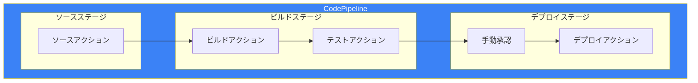
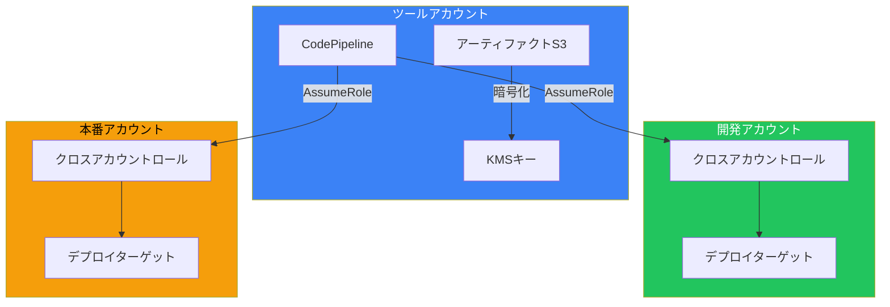
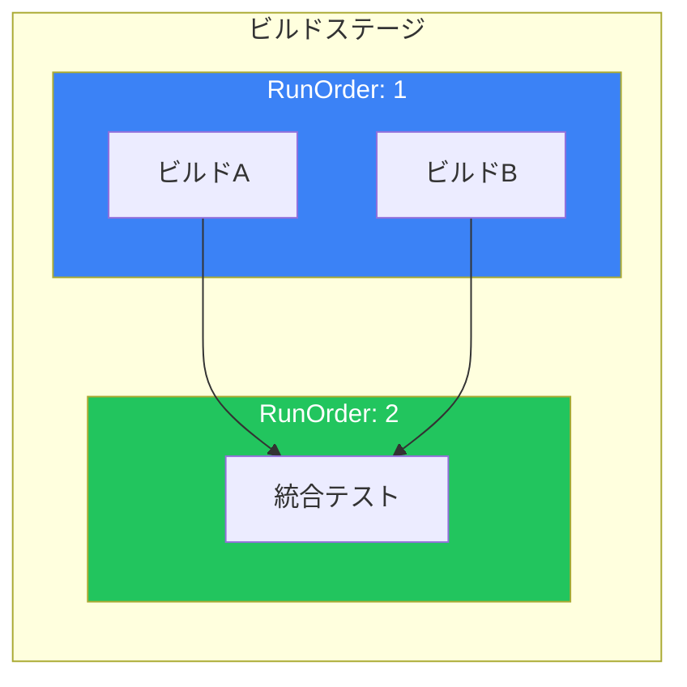
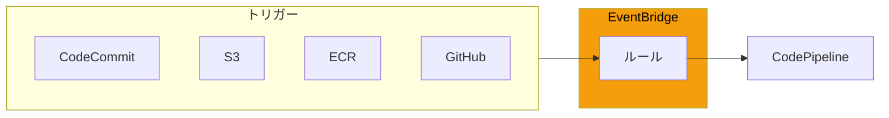
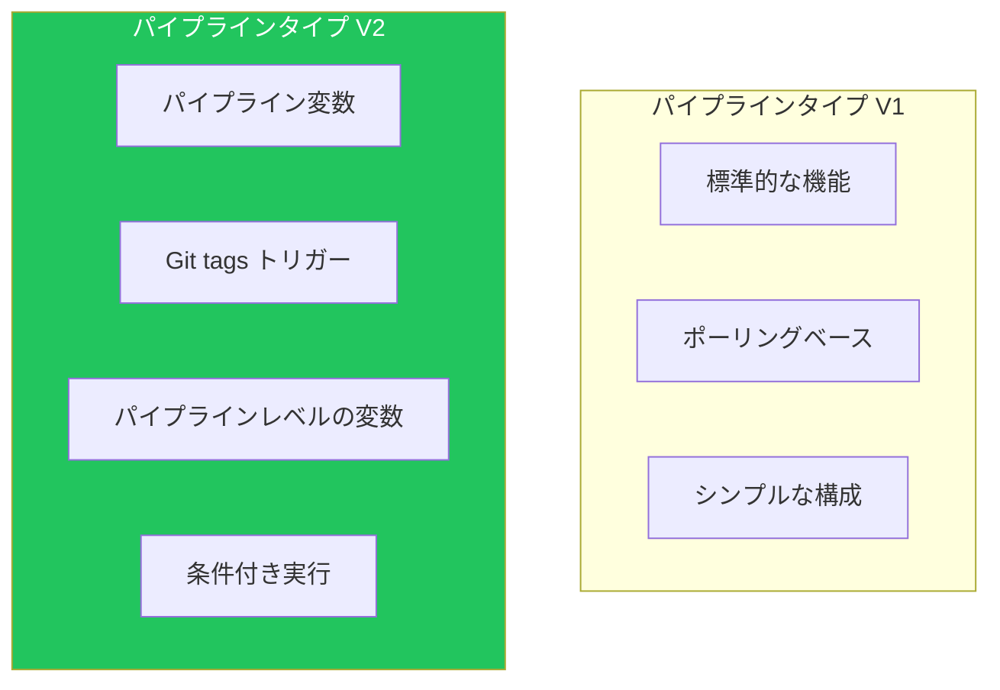
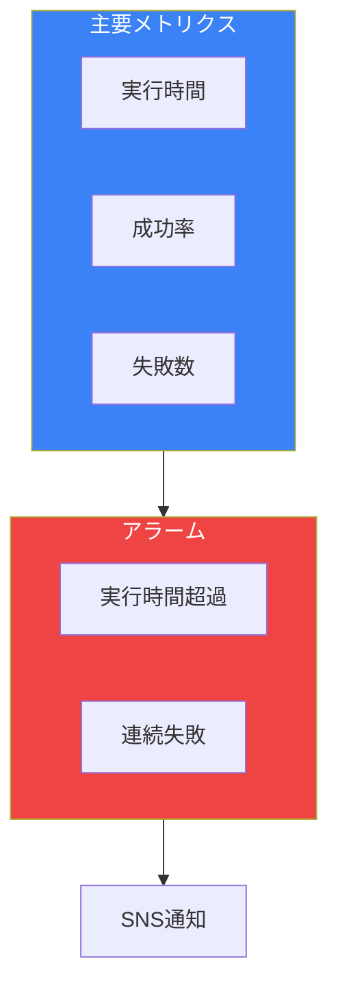
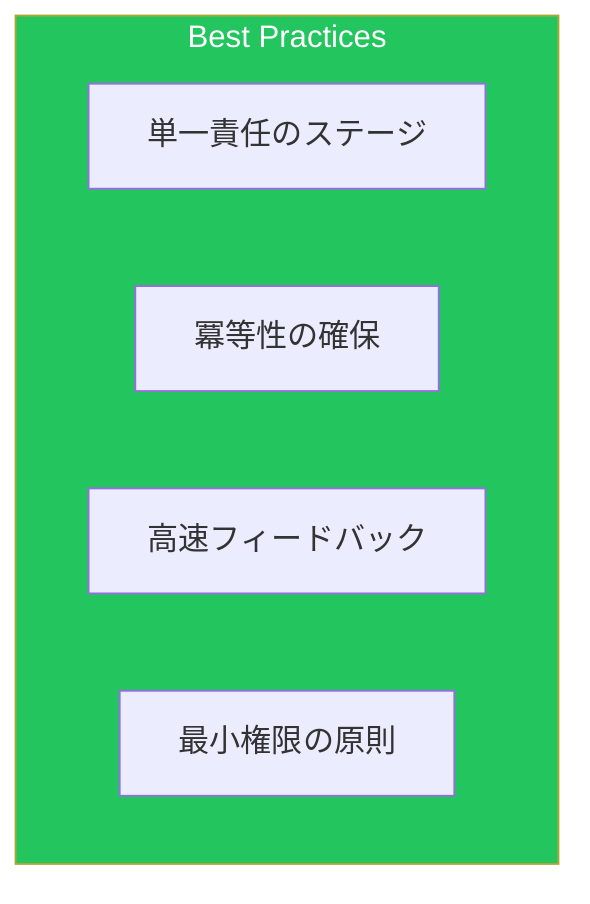
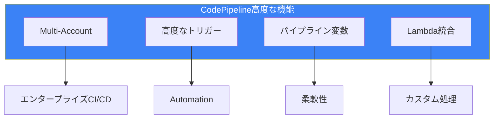

CodePipelineは、AWSのフルマネージドCI/CDサービスです。本記事では、実運用で必要となる高度な設定とベストプラクティスを解説します。

## パイプラインアーキテクチャ

### 基本構造



### アクションタイプ

| カテゴリ | アクション例 | 用途 |
|---------|------------|------|
| Source | CodeCommit, S3, GitHub, ECR | ソース取得 |
| Build | CodeBuild, Jenkins | ビルド・テスト |
| Test | CodeBuild, Device Farm | テスト実行 |
| Deploy | CodeDeploy, ECS, S3, CloudFormation | デプロイ |
| Approval | Manual approval | 手動承認 |
| Invoke | Lambda, Step Functions | カスタム処理 |

## マルチアカウントパイプライン

### アーキテクチャ



### クロスアカウントロール設定

```json
{
  "Version": "2012-10-17",
  "Statement": [
    {
      "Effect": "Allow",
      "Principal": {
        "AWS": "arn:aws:iam::TOOLS_ACCOUNT_ID:root"
      },
      "Action": "sts:AssumeRole",
      "Condition": {
        "StringEquals": {
          "sts:ExternalId": "pipeline-external-id"
        }
      }
    }
  ]
}
```

### KMSキーポリシー

```json
{
  "Version": "2012-10-17",
  "Statement": [
    {
      "Sid": "AllowCrossAccountAccess",
      "Effect": "Allow",
      "Principal": {
        "AWS": [
          "arn:aws:iam::DEV_ACCOUNT_ID:role/CrossAccountRole",
          "arn:aws:iam::PROD_ACCOUNT_ID:role/CrossAccountRole"
        ]
      },
      "Action": [
        "kms:Decrypt",
        "kms:DescribeKey"
      ],
      "Resource": "*"
    }
  ]
}
```

### S3バケットポリシー

```json
{
  "Version": "2012-10-17",
  "Statement": [
    {
      "Effect": "Allow",
      "Principal": {
        "AWS": [
          "arn:aws:iam::DEV_ACCOUNT_ID:role/CrossAccountRole",
          "arn:aws:iam::PROD_ACCOUNT_ID:role/CrossAccountRole"
        ]
      },
      "Action": [
        "s3:GetObject",
        "s3:PutObject"
      ],
      "Resource": "arn:aws:s3:::artifact-bucket/*"
    }
  ]
}
```

## 高度なパイプライン設定

### 並列実行とRunOrder



```yaml
# CloudFormation定義
Stages:
  - Name: Build
    Actions:
      - Name: BuildServiceA
        RunOrder: 1
        ActionTypeId:
          Category: Build
          Provider: CodeBuild
        Configuration:
          ProjectName: !Ref BuildProjectA
        OutputArtifacts:
          - Name: BuildOutputA

      - Name: BuildServiceB
        RunOrder: 1  # 並列実行
        ActionTypeId:
          Category: Build
          Provider: CodeBuild
        Configuration:
          ProjectName: !Ref BuildProjectB
        OutputArtifacts:
          - Name: BuildOutputB

      - Name: IntegrationTest
        RunOrder: 2  # 前のアクション完了後に実行
        ActionTypeId:
          Category: Test
          Provider: CodeBuild
        Configuration:
          ProjectName: !Ref TestProject
        InputArtifacts:
          - Name: BuildOutputA
          - Name: BuildOutputB
```

### 手動承認

```yaml
- Name: Approval
  Actions:
    - Name: ManualApproval
      ActionTypeId:
        Category: Approval
        Owner: AWS
        Provider: Manual
        Version: "1"
      Configuration:
        NotificationArn: !Ref ApprovalSNSTopic
        CustomData: |
          デプロイ内容を確認してください。
          変更内容: #{SourceVariables.CommitMessage}
        ExternalEntityLink: !Sub |
          https://console.aws.amazon.com/codesuite/codepipeline/pipelines/${Pipeline}/view
      RunOrder: 1
```

### 変数とパラメータオーバーライド

```yaml
# パイプライン変数の活用
- Name: Deploy
  Actions:
    - Name: DeployToECS
      ActionTypeId:
        Category: Deploy
        Provider: ECS
      Configuration:
        ClusterName: !Ref ECSCluster
        ServiceName: !Ref ECSService
        # ビルドステージからの変数を使用
        FileName: imagedefinitions.json
      InputArtifacts:
        - Name: BuildOutput
      Namespace: DeployVariables  # 変数の名前空間を設定
```

## トリガー設定

### EventBridge連携



### CodeCommitトリガー

```json
{
  "source": ["aws.codecommit"],
  "detail-type": ["CodeCommit Repository State Change"],
  "resources": ["arn:aws:codecommit:ap-northeast-1:123456789012:my-repo"],
  "detail": {
    "event": ["referenceCreated", "referenceUpdated"],
    "referenceType": ["branch"],
    "referenceName": ["main", "develop"]
  }
}
```

### ECRイメージプッシュトリガー

```json
{
  "source": ["aws.ecr"],
  "detail-type": ["ECR Image Action"],
  "detail": {
    "action-type": ["PUSH"],
    "result": ["SUCCESS"],
    "repository-name": ["my-app"],
    "image-tag": ["latest", "production"]
  }
}
```

### S3トリガー

```json
{
  "source": ["aws.s3"],
  "detail-type": ["Object Created"],
  "detail": {
    "bucket": {
      "name": ["my-source-bucket"]
    },
    "object": {
      "key": [{
        "prefix": "releases/"
      }]
    }
  }
}
```

## パイプラインタイプ

### V1 vs V2



| 機能 | V1 | V2 |
|------|----|----|
| パイプライン変数 | ❌ | ✅ |
| Gitタグトリガー | ❌ | ✅ |
| 条件付きステージ | ❌ | ✅ |
| 並列実行の改善 | 基本 | 強化 |
| 料金 | 無料枠あり | 実行ごと課金 |

### V2の条件付き実行

```yaml
# 特定の条件でステージをスキップ
Stages:
  - Name: ConditionalDeploy
    Conditions:
      - Result: SKIP
        Rules:
          - Name: SkipOnFeatureBranch
            RuleTypeId:
              Category: Rule
              Provider: VariableCheck
            Configuration:
              Variable: "#{SourceVariables.BranchName}"
              Operator: NOT_EQUALS
              Value: "main"
```

## Lambda呼び出し

### カスタムアクション

```python
import json
import boto3

codepipeline = boto3.client('codepipeline')

def lambda_handler(event, context):
    job_id = event['CodePipeline.job']['id']

    try:
        # ユーザーパラメータの取得
        user_params = json.loads(
            event['CodePipeline.job']['data']['actionConfiguration']['configuration']['UserParameters']
        )

        # カスタム処理
        result = perform_custom_action(user_params)

        # 成功を報告
        codepipeline.put_job_success_result(
            jobId=job_id,
            outputVariables={
                'CustomOutput': result
            }
        )

    except Exception as e:
        # 失敗を報告
        codepipeline.put_job_failure_result(
            jobId=job_id,
            failureDetails={
                'type': 'JobFailed',
                'message': str(e)
            }
        )

def perform_custom_action(params):
    # カスタムロジック
    return 'success'
```

### パイプライン定義

```yaml
- Name: CustomAction
  Actions:
    - Name: InvokeLambda
      ActionTypeId:
        Category: Invoke
        Owner: AWS
        Provider: Lambda
        Version: "1"
      Configuration:
        FunctionName: !Ref CustomLambdaFunction
        UserParameters: |
          {
            "environment": "production",
            "action": "notify"
          }
      OutputArtifacts: []
      InputArtifacts:
        - Name: BuildOutput
```

## 通知とモニタリング

### 通知ルール

```yaml
PipelineNotificationRule:
  Type: AWS::CodeStarNotifications::NotificationRule
  Properties:
    Name: PipelineNotifications
    Resource: !Sub "arn:aws:codepipeline:${AWS::Region}:${AWS::AccountId}:${Pipeline}"
    DetailType: FULL
    EventTypeIds:
      - codepipeline-pipeline-pipeline-execution-failed
      - codepipeline-pipeline-pipeline-execution-succeeded
      - codepipeline-pipeline-manual-approval-needed
      - codepipeline-pipeline-manual-approval-succeeded
    Targets:
      - TargetType: SNS
        TargetAddress: !Ref NotificationTopic
      - TargetType: AWSChatbotSlack
        TargetAddress: !Ref SlackChannelArn
```

### CloudWatchメトリクス



```yaml
PipelineFailedAlarm:
  Type: AWS::CloudWatch::Alarm
  Properties:
    AlarmName: PipelineExecutionFailed
    MetricName: FailedStageExecution
    Namespace: AWS/CodePipeline
    Dimensions:
      - Name: PipelineName
        Value: !Ref Pipeline
    Statistic: Sum
    Period: 300
    EvaluationPeriods: 1
    Threshold: 1
    ComparisonOperator: GreaterThanOrEqualToThreshold
    AlarmActions:
      - !Ref AlertTopic
```

## トラブルシューティング

### よくある問題と解決策

| 問題 | 原因 | 解決策 |
|------|------|--------|
| アーティファクト取得失敗 | S3/KMS権限不足 | IAMロールにS3・KMS権限追加 |
| クロスアカウント失敗 | AssumeRole失敗 | 信頼ポリシーの確認 |
| タイムアウト | アクション時間超過 | タイムアウト値の調整 |
| 承認タイムアウト | 7日間の制限 | 承認フローの見直し |

### デバッグ手順

```bash
# パイプライン実行履歴の確認
aws codepipeline list-pipeline-executions \
    --pipeline-name my-pipeline \
    --max-items 5

# 特定実行の詳細確認
aws codepipeline get-pipeline-execution \
    --pipeline-name my-pipeline \
    --pipeline-execution-id xxxxx

# アクション実行の詳細
aws codepipeline list-action-executions \
    --pipeline-name my-pipeline \
    --filter pipelineExecutionId=xxxxx
```

## ベストプラクティス

### 設計原則



### チェックリスト

| カテゴリ | 項目 |
|---------|------|
| セキュリティ | KMSによるアーティファクト暗号化 |
| セキュリティ | 最小権限のIAMロール |
| 信頼性 | リトライ設定 |
| 信頼性 | 失敗通知の設定 |
| 運用 | CloudWatch Logsの有効化 |
| 運用 | タグ付け |

## まとめ



| 機能 | 用途 |
|------|------|
| マルチアカウント | 環境分離、セキュリティ |
| V2パイプライン | 高度な制御、変数 |
| Lambda統合 | カスタム処理 |
| EventBridge連携 | 柔軟なトリガー |

CodePipelineを効果的に活用することで、セキュアで柔軟なCI/CDパイプラインを構築できます。

## 参考資料

- [AWS CodePipeline User Guide](https://docs.aws.amazon.com/codepipeline/latest/userguide/)
- [CodePipeline Pipeline Structure Reference](https://docs.aws.amazon.com/codepipeline/latest/userguide/reference-pipeline-structure.html)
- [Cross-Account CI/CD Pipeline](https://docs.aws.amazon.com/prescriptive-guidance/latest/patterns/create-a-cross-account-ci-cd-pipeline.html)
