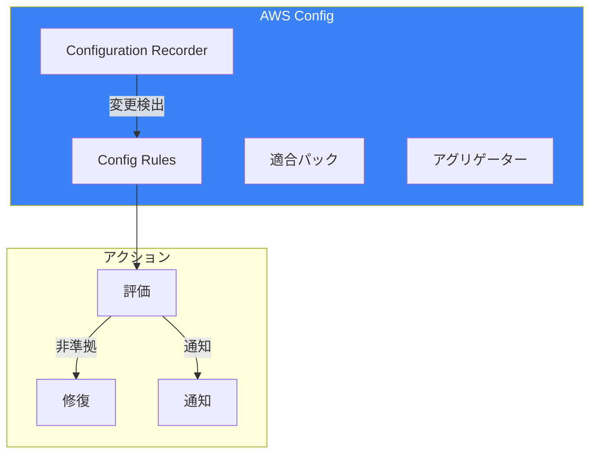
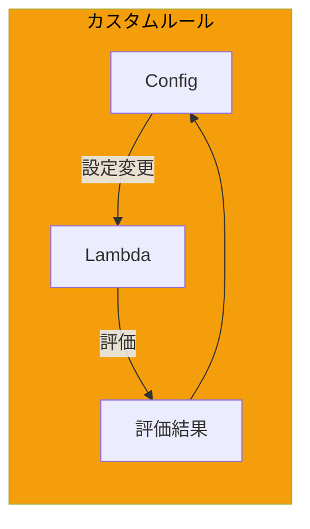
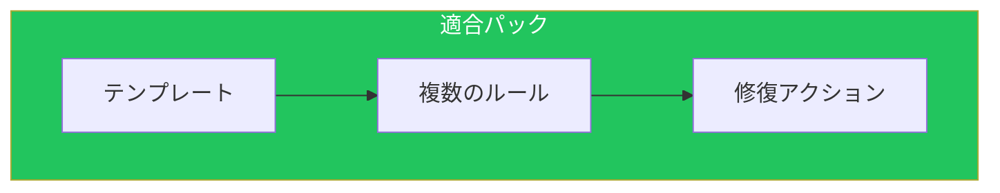
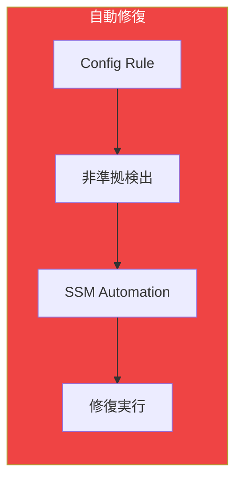
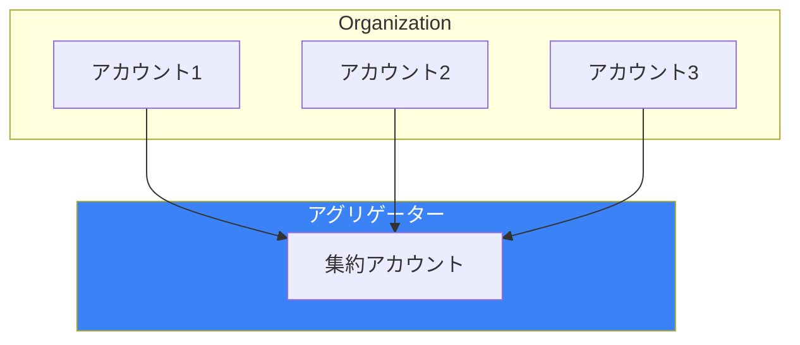
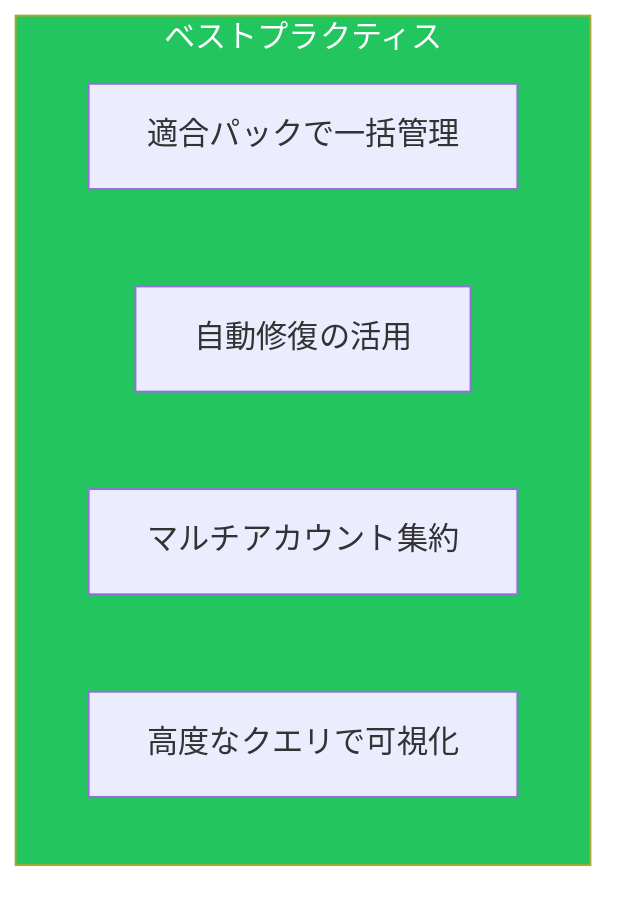

AWS Configは、AWSリソースの設定変更を追跡し、コンプライアンスを評価するサービスです。本記事では、[セキュリティ記事](/blog/aws-security-logging-monitoring)で触れなかった高度な機能を解説します。

## AWS Config概要

### アーキテクチャ



## カスタムルール

### Lambda関数によるカスタムルール



### カスタムルールの実装

```python
import json
import boto3

config = boto3.client('config')

def lambda_handler(event, context):
    invoking_event = json.loads(event['invokingEvent'])
    rule_parameters = json.loads(event.get('ruleParameters', '{}'))

    configuration_item = invoking_event.get('configurationItem')

    if not configuration_item:
        return

    compliance_status = evaluate_compliance(configuration_item, rule_parameters)

    config.put_evaluations(
        Evaluations=[
            {
                'ComplianceResourceType': configuration_item['resourceType'],
                'ComplianceResourceId': configuration_item['resourceId'],
                'ComplianceType': compliance_status,
                'OrderingTimestamp': configuration_item['configurationItemCaptureTime']
            }
        ],
        ResultToken=event['resultToken']
    )

def evaluate_compliance(configuration_item, rule_parameters):
    """EC2インスタンスに必須タグがあるか確認"""
    if configuration_item['resourceType'] != 'AWS::EC2::Instance':
        return 'NOT_APPLICABLE'

    required_tags = rule_parameters.get('requiredTags', 'Environment,Owner').split(',')
    instance_tags = configuration_item.get('tags', {})

    for tag in required_tags:
        if tag.strip() not in instance_tags:
            return 'NON_COMPLIANT'

    return 'COMPLIANT'
```

### CloudFormation定義

```yaml
CustomConfigRule:
  Type: AWS::Config::ConfigRule
  Properties:
    ConfigRuleName: ec2-required-tags
    Description: Checks if EC2 instances have required tags
    Source:
      Owner: CUSTOM_LAMBDA
      SourceIdentifier: !GetAtt ConfigRuleLambda.Arn
      SourceDetails:
        - EventSource: aws.config
          MessageType: ConfigurationItemChangeNotification
        - EventSource: aws.config
          MessageType: OversizedConfigurationItemChangeNotification
    InputParameters:
      requiredTags: Environment,Owner,CostCenter
    Scope:
      ComplianceResourceTypes:
        - AWS::EC2::Instance
    MaximumExecutionFrequency: TwentyFour_Hours

ConfigRuleLambda:
  Type: AWS::Lambda::Function
  Properties:
    FunctionName: config-rule-required-tags
    Runtime: python3.11
    Handler: index.lambda_handler
    Role: !GetAtt ConfigRuleLambdaRole.Arn
    Code:
      ZipFile: |
        # Lambda code here
```

### Guard DSLによるカスタムルール

```ruby
# s3-bucket-security.guard
let s3_buckets = Resources.*[ Type == 'AWS::S3::Bucket' ]

rule s3_bucket_public_access_blocked when %s3_buckets !empty {
    %s3_buckets.Properties.PublicAccessBlockConfiguration exists
    %s3_buckets.Properties.PublicAccessBlockConfiguration.BlockPublicAcls == true
    %s3_buckets.Properties.PublicAccessBlockConfiguration.BlockPublicPolicy == true
    %s3_buckets.Properties.PublicAccessBlockConfiguration.IgnorePublicAcls == true
    %s3_buckets.Properties.PublicAccessBlockConfiguration.RestrictPublicBuckets == true
}

rule s3_bucket_encryption_enabled when %s3_buckets !empty {
    %s3_buckets.Properties.BucketEncryption exists
    %s3_buckets.Properties.BucketEncryption.ServerSideEncryptionConfiguration[*].ServerSideEncryptionByDefault.SSEAlgorithm in ['AES256', 'aws:kms']
}
```

## 適合パック

### 概要



### 適合パックテンプレート

```yaml
# security-best-practices.yaml
Parameters:
  S3TargetBucketName:
    Type: String
    Description: S3 bucket for Config delivery

Resources:
  # S3パブリックアクセス禁止
  S3BucketPublicReadProhibited:
    Type: AWS::Config::ConfigRule
    Properties:
      ConfigRuleName: s3-bucket-public-read-prohibited
      Source:
        Owner: AWS
        SourceIdentifier: S3_BUCKET_PUBLIC_READ_PROHIBITED

  # S3バージョニング有効
  S3BucketVersioningEnabled:
    Type: AWS::Config::ConfigRule
    Properties:
      ConfigRuleName: s3-bucket-versioning-enabled
      Source:
        Owner: AWS
        SourceIdentifier: S3_BUCKET_VERSIONING_ENABLED

  # EC2インスタンスにIMDSv2を要求
  Ec2ImdsV2Check:
    Type: AWS::Config::ConfigRule
    Properties:
      ConfigRuleName: ec2-imdsv2-check
      Source:
        Owner: AWS
        SourceIdentifier: EC2_IMDSV2_CHECK

  # RDS暗号化
  RdsStorageEncrypted:
    Type: AWS::Config::ConfigRule
    Properties:
      ConfigRuleName: rds-storage-encrypted
      Source:
        Owner: AWS
        SourceIdentifier: RDS_STORAGE_ENCRYPTED

  # 自動修復設定
  S3PublicAccessRemediation:
    Type: AWS::Config::RemediationConfiguration
    Properties:
      ConfigRuleName: !Ref S3BucketPublicReadProhibited
      Automatic: true
      MaximumAutomaticAttempts: 5
      RetryAttemptSeconds: 60
      TargetId: AWS-DisableS3BucketPublicReadWrite
      TargetType: SSM_DOCUMENT
      Parameters:
        S3BucketName:
          ResourceValue:
            Value: RESOURCE_ID
        AutomationAssumeRole:
          StaticValue:
            Values:
              - !GetAtt RemediationRole.Arn
```

### 組織適合パック

```yaml
OrganizationConformancePack:
  Type: AWS::Config::OrganizationConformancePack
  Properties:
    OrganizationConformancePackName: security-baseline
    DeliveryS3Bucket: !Ref ConfigBucket
    TemplateS3Uri: s3://config-templates/security-best-practices.yaml
    ExcludedAccounts:
      - '999999999999'  # 管理アカウント除外
    ConformancePackInputParameters:
      - ParameterName: S3TargetBucketName
        ParameterValue: !Ref ConfigBucket
```

## 自動修復

### 修復設定



### 修復例：S3パブリックアクセスブロック

```yaml
S3PublicAccessRemediation:
  Type: AWS::Config::RemediationConfiguration
  Properties:
    ConfigRuleName: s3-bucket-public-read-prohibited
    Automatic: true
    MaximumAutomaticAttempts: 5
    RetryAttemptSeconds: 60
    TargetId: AWS-DisableS3BucketPublicReadWrite
    TargetType: SSM_DOCUMENT
    Parameters:
      S3BucketName:
        ResourceValue:
          Value: RESOURCE_ID
```

### カスタム修復ドキュメント

```yaml
schemaVersion: '0.3'
description: 'Enable S3 bucket encryption'
assumeRole: '{{AutomationAssumeRole}}'
parameters:
  BucketName:
    type: String
  AutomationAssumeRole:
    type: String

mainSteps:
  - name: EnableEncryption
    action: aws:executeAwsApi
    inputs:
      Service: s3
      Api: PutBucketEncryption
      Bucket: '{{BucketName}}'
      ServerSideEncryptionConfiguration:
        Rules:
          - ApplyServerSideEncryptionByDefault:
              SSEAlgorithm: AES256
    isEnd: true
```

## アグリゲーター

### マルチアカウント集約



### アグリゲーター設定

```yaml
ConfigurationAggregator:
  Type: AWS::Config::ConfigurationAggregator
  Properties:
    ConfigurationAggregatorName: organization-aggregator
    OrganizationAggregationSource:
      RoleArn: !GetAtt AggregatorRole.Arn
      AwsRegions:
        - ap-northeast-1
        - us-east-1
        - eu-west-1
      AllAwsRegions: false
```

## 高度なクエリ

### AWS Config Advanced Queries

```sql
-- 暗号化されていないEBSボリューム
SELECT
  resourceId,
  resourceType,
  accountId,
  awsRegion,
  configuration.encrypted
WHERE
  resourceType = 'AWS::EC2::Volume'
  AND configuration.encrypted = false

-- パブリックIPを持つEC2インスタンス
SELECT
  resourceId,
  resourceName,
  configuration.publicIpAddress,
  tags
WHERE
  resourceType = 'AWS::EC2::Instance'
  AND configuration.publicIpAddress IS NOT NULL

-- 特定タグがないリソース
SELECT
  resourceId,
  resourceType,
  tags
WHERE
  resourceType IN ('AWS::EC2::Instance', 'AWS::S3::Bucket', 'AWS::RDS::DBInstance')
  AND tags.Environment IS NULL

-- 古いAMIを使用するEC2インスタンス
SELECT
  resourceId,
  configuration.imageId,
  configuration.launchTime
WHERE
  resourceType = 'AWS::EC2::Instance'
  AND configuration.launchTime < '2024-01-01'
```

### CLIでのクエリ実行

```bash
aws configservice select-resource-config \
    --expression "SELECT resourceId, resourceType WHERE resourceType = 'AWS::EC2::SecurityGroup' AND relationships.resourceType = 'AWS::EC2::Instance'" \
    --output json
```

## EventBridge統合

### コンプライアンス変更通知

```yaml
ConfigComplianceRule:
  Type: AWS::Events::Rule
  Properties:
    EventPattern:
      source:
        - aws.config
      detail-type:
        - Config Rules Compliance Change
      detail:
        messageType:
          - ComplianceChangeNotification
        newEvaluationResult:
          complianceType:
            - NON_COMPLIANT
    Targets:
      - Id: NotifySNS
        Arn: !Ref AlertTopic
      - Id: TriggerRemediation
        Arn: !Sub arn:aws:ssm:${AWS::Region}:${AWS::AccountId}:automation-definition/AutoRemediate
        RoleArn: !GetAtt EventBridgeRole.Arn
```

## ベストプラクティス



| カテゴリ | 項目 |
|---------|------|
| 設計 | 適合パックでルールをグループ化 |
| 運用 | 自動修復で迅速な対応 |
| ガバナンス | 組織レベルで展開 |
| 可視化 | 高度なクエリで分析 |

## まとめ

| 機能 | 用途 |
|------|------|
| カスタムルール | 独自のコンプライアンス要件 |
| 適合パック | ルールの一括管理 |
| 自動修復 | 非準拠の自動対応 |
| アグリゲーター | マルチアカウント可視化 |

AWS Configの高度な機能を活用することで、大規模環境のガバナンスを実現できます。

## 参考資料

- [AWS Config Developer Guide](https://docs.aws.amazon.com/config/latest/developerguide/)
- [AWS Config Rules Repository](https://github.com/awslabs/aws-config-rules)
- [Conformance Pack Sample Templates](https://docs.aws.amazon.com/config/latest/developerguide/conformancepack-sample-templates.html)
