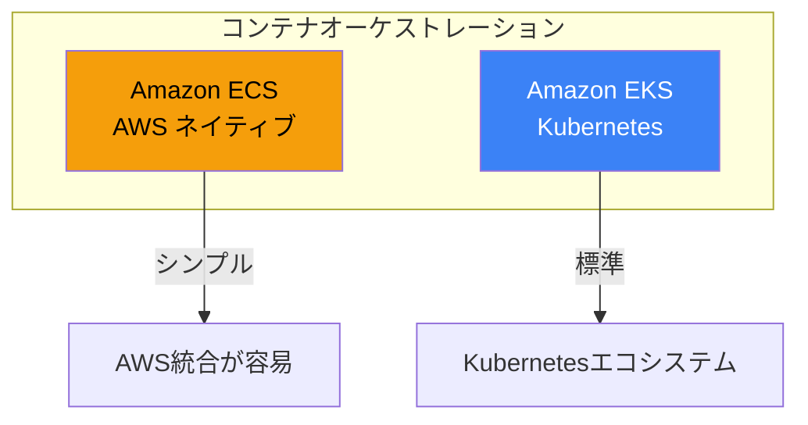
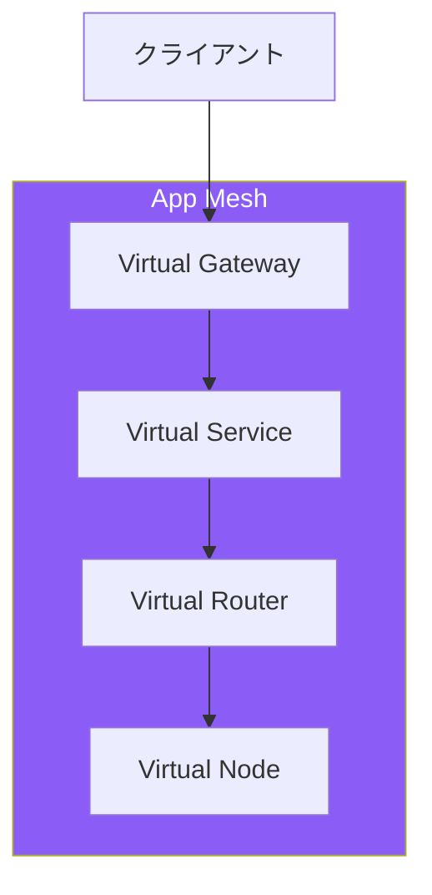
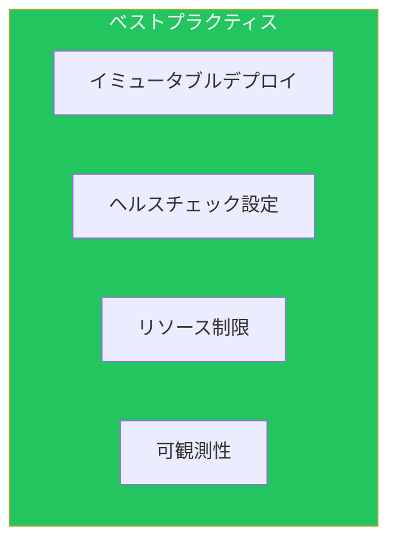

AWSでのコンテナワークロードは、ECSまたはEKSで管理します。本記事では、効率的なデプロイ戦略と運用パターンを解説します。

## ECS vs EKS



| 項目 | ECS | EKS |
|------|-----|-----|
| 学習コスト | 低 | 高 |
| AWS統合 | ネイティブ | 追加設定 |
| ポータビリティ | AWS限定 | マルチクラウド |
| 管理コスト | 低 | 中〜高 |

## ECS詳細

### タスク定義

```json
{
  "family": "my-app",
  "networkMode": "awsvpc",
  "requiresCompatibilities": ["FARGATE"],
  "cpu": "512",
  "memory": "1024",
  "executionRoleArn": "arn:aws:iam::xxx:role/ecsTaskExecutionRole",
  "taskRoleArn": "arn:aws:iam::xxx:role/ecsTaskRole",
  "containerDefinitions": [
    {
      "name": "app",
      "image": "123456789012.dkr.ecr.ap-northeast-1.amazonaws.com/my-app:latest",
      "essential": true,
      "portMappings": [
        {
          "containerPort": 8080,
          "protocol": "tcp"
        }
      ],
      "environment": [
        {"name": "ENV", "value": "production"}
      ],
      "secrets": [
        {
          "name": "DB_PASSWORD",
          "valueFrom": "arn:aws:secretsmanager:ap-northeast-1:xxx:secret:db-password"
        }
      ],
      "logConfiguration": {
        "logDriver": "awslogs",
        "options": {
          "awslogs-group": "/ecs/my-app",
          "awslogs-region": "ap-northeast-1",
          "awslogs-stream-prefix": "ecs"
        }
      },
      "healthCheck": {
        "command": ["CMD-SHELL", "curl -f http://localhost:8080/health || exit 1"],
        "interval": 30,
        "timeout": 5,
        "retries": 3,
        "startPeriod": 60
      }
    }
  ]
}
```

### ECSサービス（Blue/Green）

```yaml
ECSService:
  Type: AWS::ECS::Service
  Properties:
    ServiceName: my-app
    Cluster: !Ref ECSCluster
    TaskDefinition: !Ref TaskDefinition
    DesiredCount: 2
    LaunchType: FARGATE
    NetworkConfiguration:
      AwsvpcConfiguration:
        AssignPublicIp: DISABLED
        SecurityGroups:
          - !Ref ServiceSecurityGroup
        Subnets:
          - !Ref PrivateSubnet1
          - !Ref PrivateSubnet2
    LoadBalancers:
      - ContainerName: app
        ContainerPort: 8080
        TargetGroupArn: !Ref BlueTargetGroup
    DeploymentController:
      Type: CODE_DEPLOY
    HealthCheckGracePeriodSeconds: 60

# CodeDeployアプリケーション
CodeDeployApplication:
  Type: AWS::CodeDeploy::Application
  Properties:
    ApplicationName: my-ecs-app
    ComputePlatform: ECS

CodeDeployDeploymentGroup:
  Type: AWS::CodeDeploy::DeploymentGroup
  Properties:
    ApplicationName: !Ref CodeDeployApplication
    DeploymentGroupName: my-ecs-dg
    ServiceRoleArn: !GetAtt CodeDeployRole.Arn
    DeploymentConfigName: CodeDeployDefault.ECSLinear10PercentEvery1Minutes
    ECSServices:
      - ClusterName: !Ref ECSCluster
        ServiceName: !GetAtt ECSService.Name
    BlueGreenDeploymentConfiguration:
      DeploymentReadyOption:
        ActionOnTimeout: CONTINUE_DEPLOYMENT
        WaitTimeInMinutes: 0
      TerminateBlueTasksOnDeploymentSuccess:
        Action: TERMINATE
        TerminationWaitTimeInMinutes: 5
    LoadBalancerInfo:
      TargetGroupPairInfoList:
        - ProdTrafficRoute:
            ListenerArns:
              - !Ref ALBListener
          TestTrafficRoute:
            ListenerArns:
              - !Ref TestListener
          TargetGroups:
            - Name: !GetAtt BlueTargetGroup.TargetGroupName
            - Name: !GetAtt GreenTargetGroup.TargetGroupName
```

### ECS Exec

```bash
# コンテナへのシェルアクセス
aws ecs execute-command \
    --cluster my-cluster \
    --task arn:aws:ecs:ap-northeast-1:xxx:task/my-cluster/xxx \
    --container app \
    --interactive \
    --command "/bin/sh"
```

## EKS詳細

### マネージドノードグループ

```yaml
EKSCluster:
  Type: AWS::EKS::Cluster
  Properties:
    Name: my-cluster
    Version: "1.28"
    RoleArn: !GetAtt EKSClusterRole.Arn
    ResourcesVpcConfig:
      SubnetIds:
        - !Ref PrivateSubnet1
        - !Ref PrivateSubnet2
      SecurityGroupIds:
        - !Ref ClusterSecurityGroup
      EndpointPrivateAccess: true
      EndpointPublicAccess: true

NodeGroup:
  Type: AWS::EKS::Nodegroup
  Properties:
    ClusterName: !Ref EKSCluster
    NodegroupName: my-nodegroup
    NodeRole: !GetAtt NodeRole.Arn
    Subnets:
      - !Ref PrivateSubnet1
      - !Ref PrivateSubnet2
    ScalingConfig:
      MinSize: 2
      MaxSize: 10
      DesiredSize: 3
    InstanceTypes:
      - m5.large
    AmiType: AL2_x86_64
    UpdateConfig:
      MaxUnavailablePercentage: 33
```

### Kubernetes Deployment

```yaml
apiVersion: apps/v1
kind: Deployment
metadata:
  name: my-app
  namespace: production
spec:
  replicas: 3
  strategy:
    type: RollingUpdate
    rollingUpdate:
      maxSurge: 1
      maxUnavailable: 0
  selector:
    matchLabels:
      app: my-app
  template:
    metadata:
      labels:
        app: my-app
    spec:
      serviceAccountName: my-app-sa
      containers:
        - name: app
          image: 123456789012.dkr.ecr.ap-northeast-1.amazonaws.com/my-app:v1.0.0
          ports:
            - containerPort: 8080
          resources:
            requests:
              memory: "256Mi"
              cpu: "250m"
            limits:
              memory: "512Mi"
              cpu: "500m"
          livenessProbe:
            httpGet:
              path: /health
              port: 8080
            initialDelaySeconds: 30
            periodSeconds: 10
          readinessProbe:
            httpGet:
              path: /ready
              port: 8080
            initialDelaySeconds: 5
            periodSeconds: 5
          env:
            - name: ENV
              value: production
            - name: DB_PASSWORD
              valueFrom:
                secretKeyRef:
                  name: db-credentials
                  key: password
```

### AWS Load Balancer Controller

```yaml
apiVersion: networking.k8s.io/v1
kind: Ingress
metadata:
  name: my-app-ingress
  annotations:
    kubernetes.io/ingress.class: alb
    alb.ingress.kubernetes.io/scheme: internet-facing
    alb.ingress.kubernetes.io/target-type: ip
    alb.ingress.kubernetes.io/healthcheck-path: /health
    alb.ingress.kubernetes.io/ssl-redirect: "443"
spec:
  rules:
    - host: app.example.com
      http:
        paths:
          - path: /
            pathType: Prefix
            backend:
              service:
                name: my-app-service
                port:
                  number: 80
```

## App Mesh

### サービスメッシュ



### App Mesh設定

```yaml
Mesh:
  Type: AWS::AppMesh::Mesh
  Properties:
    MeshName: my-mesh
    Spec:
      EgressFilter:
        Type: DROP_ALL

VirtualNode:
  Type: AWS::AppMesh::VirtualNode
  Properties:
    MeshName: !GetAtt Mesh.MeshName
    VirtualNodeName: my-app-node
    Spec:
      Listeners:
        - PortMapping:
            Port: 8080
            Protocol: http
          HealthCheck:
            HealthyThreshold: 2
            IntervalMillis: 5000
            Path: /health
            Port: 8080
            Protocol: http
            TimeoutMillis: 2000
            UnhealthyThreshold: 3
      ServiceDiscovery:
        AWSCloudMap:
          NamespaceName: my-namespace
          ServiceName: my-app
      Backends:
        - VirtualService:
            VirtualServiceName: backend.my-namespace

VirtualRouter:
  Type: AWS::AppMesh::VirtualRouter
  Properties:
    MeshName: !GetAtt Mesh.MeshName
    VirtualRouterName: my-app-router
    Spec:
      Listeners:
        - PortMapping:
            Port: 8080
            Protocol: http

Route:
  Type: AWS::AppMesh::Route
  Properties:
    MeshName: !GetAtt Mesh.MeshName
    VirtualRouterName: !GetAtt VirtualRouter.VirtualRouterName
    RouteName: my-app-route
    Spec:
      HttpRoute:
        Match:
          Prefix: /
        Action:
          WeightedTargets:
            - VirtualNode: my-app-v1
              Weight: 90
            - VirtualNode: my-app-v2
              Weight: 10
```

## AWS Copilot

### 基本コマンド

```bash
# アプリケーション初期化
copilot app init my-app

# サービス作成
copilot svc init --name api --svc-type "Load Balanced Web Service"

# 環境作成
copilot env init --name production --profile prod

# デプロイ
copilot svc deploy --name api --env production

# パイプライン作成
copilot pipeline init
copilot pipeline deploy
```

### manifest.yml

```yaml
name: api
type: Load Balanced Web Service

image:
  build: ./Dockerfile
  port: 8080

http:
  path: '/'
  healthcheck:
    path: '/health'
    success_codes: '200'
    interval: 10s
    timeout: 5s

cpu: 512
memory: 1024
count:
  range: 1-10
  cpu_percentage: 70

variables:
  LOG_LEVEL: info

secrets:
  DB_PASSWORD: /copilot/${COPILOT_APPLICATION_NAME}/${COPILOT_ENVIRONMENT_NAME}/secrets/db-password

observability:
  tracing: awsxray
```

## ベストプラクティス



| カテゴリ | 項目 |
|---------|------|
| デプロイ | Blue/Greenまたはローリング |
| 信頼性 | 適切なヘルスチェック |
| リソース | CPU/メモリ制限設定 |
| 運用 | ログ・トレース統合 |

## まとめ

| サービス | 用途 |
|---------|------|
| ECS | AWSネイティブなコンテナ運用 |
| EKS | Kubernetesエコシステム活用 |
| App Mesh | サービスメッシュ |
| Copilot | 簡易デプロイツール |

コンテナワークロードの要件に応じて適切なサービスを選択しましょう。

## 参考資料

- [Amazon ECS Developer Guide](https://docs.aws.amazon.com/AmazonECS/latest/developerguide/)
- [Amazon EKS User Guide](https://docs.aws.amazon.com/eks/latest/userguide/)
- [AWS App Mesh User Guide](https://docs.aws.amazon.com/app-mesh/latest/userguide/)
