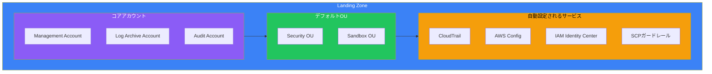
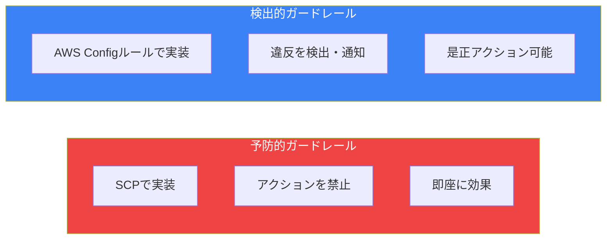
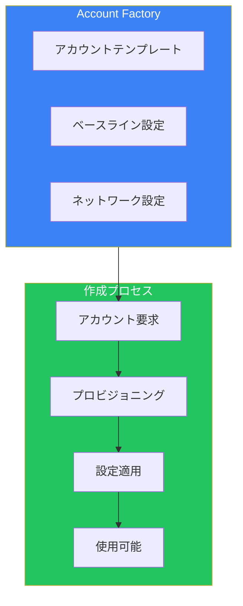
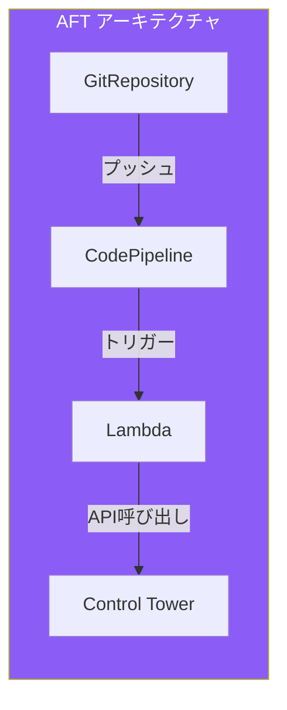
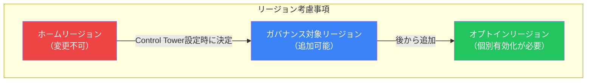
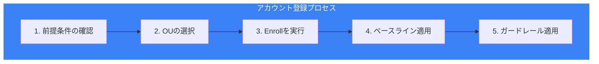
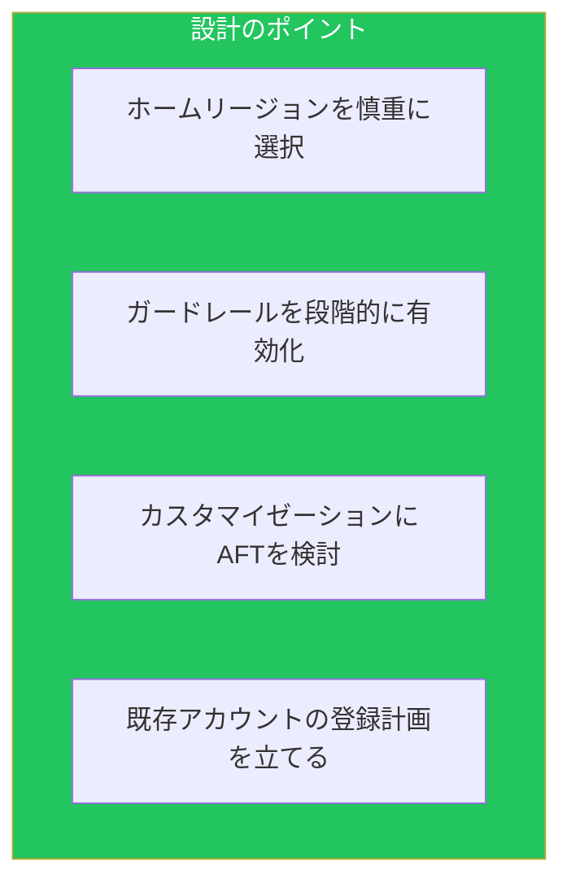
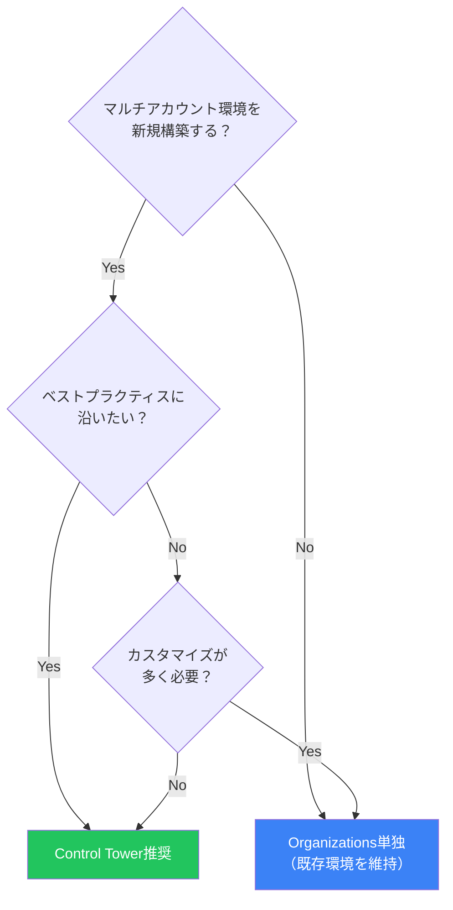
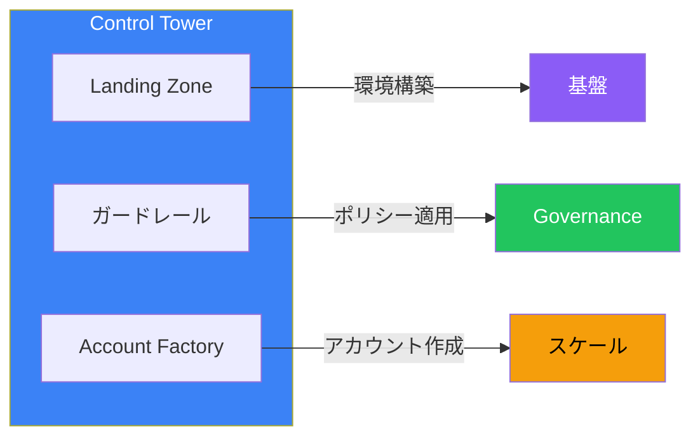

AWS Control Towerは、マルチアカウント環境を自動的にセットアップし、継続的にガバナンスを維持するサービスです。AWS Organizationsの上に構築され、ベストプラクティスに基づいた「ランディングゾーン」を提供します。

## なぜControl Towerが必要か

### Organizations単独の課題

AWS Organizationsは強力ですが、すべてを手動で設定する必要があります：

| 作業 | Organizations単独 | Control Tower |
|------|------------------|---------------|
| OU構造の設計 | 手動設計 | ベストプラクティス提供 |
| SCPの作成 | 一から作成 | ガードレールとして提供 |
| ログ集約設定 | 手動構築 | 自動セットアップ |
| アカウント作成 | API/コンソール | Account Factory |
| コンプライアンス監視 | 個別設定 | ダッシュボード提供 |

## ランディングゾーンとは

### 概念

ランディングゾーンは、セキュアでスケーラブルなマルチアカウント環境の「着地点」です。Control Towerが自動的に構築します。



### 自動作成されるリソース

| リソース | 目的 |
|---------|------|
| **Log Archive Account** | 全アカウントのCloudTrailログを集約 |
| **Audit Account** | セキュリティ監査用のクロスアカウントアクセス |
| **Security OU** | Log ArchiveとAuditアカウントを格納 |
| **Sandbox OU** | 実験用アカウントを格納 |
| **CloudTrail** | 組織全体のAPI監査 |
| **AWS Config** | リソースコンプライアンス監視 |

## ガードレール

### ガードレールとは

ガードレールは、組織全体に適用されるポリシーです。「予防的」と「検出的」の2種類があります。



### ガードレールの分類

| 分類 | 説明 | 例 |
|------|------|-----|
| **必須** | 無効化不可 | CloudTrailの有効化維持 |
| **強く推奨** | AWSが推奨 | S3パブリックアクセスの禁止 |
| **選択的** | ユースケースに応じて選択 | 特定リージョンの禁止 |

### 主要なガードレール例

#### 予防的ガードレール

```
✓ ルートユーザーによるアクションを禁止
✓ CloudTrailログファイルの整合性検証を維持
✓ CloudTrailのS3バケットへのパブリックアクセスを禁止
✓ AWS Config設定の変更を禁止
✓ ログアーカイブの削除を禁止
```

#### 検出的ガードレール

```
✓ MFAなしのIAMユーザーを検出
✓ 暗号化されていないEBSボリュームを検出
✓ パブリックにアクセス可能なRDSを検出
✓ 暗号化されていないS3バケットを検出
✓ VPCフローログが無効なVPCを検出
```

## Account Factory

### 概要

Account Factoryは、標準化されたアカウントを作成するためのセルフサービスポータルです。



### 設定可能な項目

| 項目 | 説明 |
|------|------|
| **アカウント名** | 識別用の名前 |
| **メールアドレス** | 一意のルートメール |
| **OU** | 所属するOU |
| **IAM Identity Center** | SSOユーザー/グループの割り当て |
| **VPC設定** | オプションでVPCを自動作成 |

### Service Catalogからの作成

Account FactoryはService Catalogを通じて提供されます：

1. Service Catalogコンソールにアクセス
2. 「AWS Control Tower Account Factory」を選択
3. パラメータを入力してアカウントを作成
4. 自動的にガードレールとベースラインが適用

## AFT（Account Factory for Terraform）

### 概要

AFTは、Terraformを使用してAccount Factoryを拡張するソリューションです。



### AFTのメリット

| 機能 | Account Factory | AFT |
|------|----------------|-----|
| GitOps対応 | ❌ | ✅ |
| カスタマイゼーション | 限定的 | 高度 |
| 承認ワークフロー | ❌ | ✅ |
| バージョン管理 | ❌ | ✅ |
| ドリフト検出 | ❌ | ✅ |

### AFTのコンポーネント

```hcl
# AFT アカウントリクエスト例
module "account_request" {
  source = "./modules/aft-account-request"

  control_tower_parameters = {
    AccountEmail              = "new-account@example.com"
    AccountName              = "production-app1"
    ManagedOrganizationalUnit = "Production"
    SSOUserEmail             = "admin@example.com"
    SSOUserFirstName         = "Admin"
    SSOUserLastName          = "User"
  }

  account_tags = {
    Environment = "Production"
    CostCenter  = "12345"
  }

  account_customizations_name = "production-baseline"
}
```

### カスタマイゼーション

AFTでは以下のカスタマイゼーションが可能：

```
aft-global-customizations/     # 全アカウントに適用
├── terraform/
│   └── main.tf

aft-account-customizations/    # 特定アカウントに適用
├── production-baseline/
│   └── terraform/
│       └── main.tf
└── development-baseline/
    └── terraform/
        └── main.tf
```

## Control Towerの制限と考慮事項

### リージョン制限



### 主な制限

| 制限 | 詳細 |
|------|------|
| ホームリージョン | 初期設定後は変更不可 |
| ネストされたOU | 最大5レベル |
| 既存アカウント | 登録（Enroll）が必要 |
| カスタムSCP | ガードレールとの整合性が必要 |

## 既存環境への導入

### 既存アカウントの登録（Enrollment）



### 前提条件

- アカウントがOrganizationsのメンバーであること
- AWS Configが有効でないこと（Control Towerが設定するため）
- 登録先のOUがControl Towerに登録済みであること

## ベストプラクティス

### 設計時のポイント



### チェックリスト

| フェーズ | チェック項目 |
|---------|-------------|
| **計画** | ホームリージョンの決定 |
| **計画** | 必要なガードレールの特定 |
| **計画** | 既存アカウントの棚卸し |
| **導入** | Log Archive/Auditアカウントの確認 |
| **導入** | IAM Identity Centerの設定 |
| **運用** | ダッシュボードの定期確認 |
| **運用** | ドリフト検出への対応 |

## Control Tower vs Organizations単独

### 選択基準



### 比較表

| 観点 | Control Tower | Organizations単独 |
|------|--------------|------------------|
| セットアップ時間 | 短い（自動化） | 長い（手動） |
| ベストプラクティス | 組み込み | 自分で実装 |
| 柔軟性 | 中程度 | 高い |
| 学習コスト | 低い | 高い |
| 運用負荷 | 低い | 高い |

## まとめ



| コンポーネント | 機能 | 重要度 |
|--------------|------|--------|
| ランディングゾーン | 環境の自動構築 | ★★★ |
| ガードレール | コンプライアンス維持 | ★★★ |
| Account Factory | 標準化されたアカウント作成 | ★★☆ |
| AFT | Terraform連携 | ★★☆ |

Control Towerは、マルチアカウント環境のベストプラクティスを自動的に実装します。新規環境の構築には最適な選択肢です。

## 参考資料

- [AWS Control Tower User Guide](https://docs.aws.amazon.com/controltower/latest/userguide/)
- [AWS Control Tower Guardrails Reference](https://docs.aws.amazon.com/controltower/latest/userguide/guardrails-reference.html)
- [Account Factory for Terraform](https://docs.aws.amazon.com/controltower/latest/userguide/aft-overview.html)
